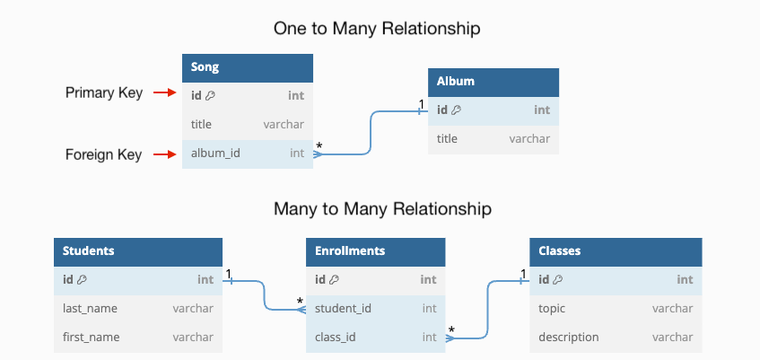

# Cheat Sheet Backend

- [Express](#express)
  - [Express Basics](#express-basics)
  - [Log Routes and Serve Static Middleware](#log-routes-and-serve-static-middleware)
  - [Express API as a Middleman](#express-api-as-a-middleman)
  - [Sending frontend to backend requests (Vite Config)](#sending-frontend-to-backend-requests-vite-config)
  - [Handling POST requests with a JSON body](#handling-post-requests-with-a-json-body)
- [SQL + Postgres](#sql--postgres)
  - [SQL + Postgres Basics](#sql--postgres-basics)
  - [One-To-Many Table](#one-to-many-table)
  - [Many To Many Table](#many-to-many-table)
- [Knex](#knex)
  - [Knex Basics](#knex-basics)
  - [Configuring Knex](#configuring-knex)
  - [Using `Knex.raw` to execute SQL](#using-knexraw-to-execute-sql)
  - [SQL INSERT](#sql-insert)
  - [SQL UPDATE](#sql-update)
  - [SQL DELETE](#sql-delete)
  - [A Model Example Using Knex](#a-model-example-using-knex)
  - [Migrations](#migrations)
  - [Seeds](#seeds)
- [Authentication and Authorization](#authentication-and-authorization)
  - [Authentication and Authorization Basics](#authentication-and-authorization-basics)
  - [Bcrypt](#bcrypt)
  - [Authorization with Cookies](#authorization-with-cookies)


Welcome to the world of backend! In this unit, we'll learn about:

* **Backend** — the part of the application that the user can't access. For our purposes, this means a server application and a database.
  * **Server Applications** — Application to receive requests and send back resources.
    * **Express** — The npm package we'll use to build a server application.
  * **Databases** — A place to put data and have it persist, even if the server turns off.
    * **Postgres** — The type of database we'll use (tables, records, fields/properties).
    * **SQL** — The language used to execute database commands.
    * **Knex** — The npm package we'll use to send SQL queries to our Postgres database from our server application.
  * **Model-Controller Design** — A framework for organizing the layers of software that make up the backend.
  * **Authentication** — Ensuring that only valid users can access protected content.
  * **Authorization** — Ensuring that a given user has permission to modify content.

By the end of this unit you will be able to build an application using the [React + Express + Auth Template](https://github.com/The-Marcy-Lab-School/react-express-auth).


## Express


### Express Basics

* **Server Application** — an application that listens for requests and sends responses.
* **Host** and **Port** - the address of a server application
* **Endpoint** — a specific URL path of a server that clients can "hit" (send requests to) to create/read/update/delete data. For example: `/api/data` or `/api/users/:id`
* **Express `app`** — an object that "listens" for requests and "routes" to the appropriate controller.
* **Controller** — a callback function that parses a request and sends a response for a particular endpoint
* **Query parameters** — a portion of a URL used to filter and sort the requested data. They are appended to the end of a URL using the syntax `?queryParam=value`.

```js
const express = require('express');
const app = express();

const serveHello = (req, res, next) => {
  const name = req.query.name || "stranger";
  res.send(`hello ${name}`);
}
app.get('/api/hello', serveHello);

const port = 8080;
app.listen(port, () => console.log(`listening at http://localhost:${port}`)); 
```

### Log Routes and Serve Static Middleware

- **Middleware** - a function in express that intercepts and processes incoming HTTP requests. It can perform server-side actions such as parsing the request, modifying the response, or executing additional logic before passing control to the next middleware in the chain."
- **`path` module** - a module for creating absolute paths to static assets
- **Environment Variable** - a variable defined outside of the JavaScript execution context.
- **`__dirname`** — an environment variable that returns the path to the parent directory of the current file.
- **Static Assets** - unchanging files delivered to the client exactly as they are stored on a server. These include HTML, CSS, JavaScript files, images, videos, fonts, and documents. For React projects, we need to "build" our project to generate static assets (convert `.jsx` files to `.js` files).

```js
const path = require('path');

// Express Middleware for serving static assets
const serveStatic = express.static(path.join(__dirname, '../../path/to/frontend/dist'));

// Custom Middleware function for logging route requests
const logRoutes = (req, res, next) => {
  const time = new Date().toLocaleString();
  console.log(`${req.method}: ${req.originalUrl} - ${time}`);
  next(); // Passes the request to the next middleware/controller
};

// Register the middleware for all incoming requests
app.use(serveStatic);
app.use(logRoutes);
```

### Express API as a Middleman

* **API Key** - a secret code that verifies your identity as a developer using an API's limited resources. Do not share these!
* **Environment Variable** — a hidden variable stored on the host's machine (your laptop or Render.com) and accessible in Node through the `process.env` object
* **`.env` file** - a file to store hidden variables like API keys. Ignored by GitHub and uploaded to Render for deployment.
* **`dotenv` module** - an npm package for importing `.env` files


If we want to avoid making our API keys public, we need to be careful with how we use them in our code. **Our frontend can't safely make requests using the API key** — anyone using our deployed application can just look at the Network tab to see the API keys in the request URL.

**So, we have to make the requests using the API keys in our backend.** 


### Sending frontend to backend requests (Vite Config)

* **Cross-origin requests** - HTTP requests made from one server to another.
* **Same-origin requests** - HTTP requests made from a server to itself.
* **Request Proxy In Development** — faking the origin of the request in a frontend development server to match the origin of the backend server

When frontend code is served by a backend server, and the frontend wants to send a request to the same backend server, the `fetch` URL should omit the host and port. The frontend will send the request to the same origin.
```js
// React Fetch
const response = await fetch('/api/gifs');
```

However, the frontend development server provided by Vite runs on `localhost:5173` while the backend server you build likely runs on a different port (`localhost:8080` or something). Since these are *different* origins, we need to re-direct same-origin requests from port 5173 to port 8080 by modifying the `vite.config.js` of our frontend project.

```js
import { defineConfig } from 'vite';
import react from '@vitejs/plugin-react';

const SERVER_PORT = 8080;

// https://vitejs.dev/config/
export default defineConfig({
  plugins: [react()],
  server: {
    proxy: {
      '/api': {
        target: `http://localhost:${SERVER_PORT}`,
        changeOrigin: true,
      },
    },
  },
});
```

### Handling POST requests with a JSON body

```js
// Express Middleware for parsing incoming POST/PATCH requests with JSON bodies
const parseJSON = express.json();
app.use(parseJSON);

const createFellow = (req, res) => {
  // We expect the request body to be an object: `{ fellowName: 'name' }`
  const { fellowName } = req.body; 

  // The Fellow model will handle creating the fellow
  const newFellow = Fellow.create(fellowName);
  res.send(newFellow);
};

app.post('/api/fellows', createFellow)
```

## SQL + Postgres

### SQL + Postgres Basics

* **Fullstack** - refers to the combination of frontend (client-side) and backend (server-side) technologies.
* **PERN** - an acronym for a specific set of technologies used to build a fullstack web application: Postgres, Express, React, and Node. This acronym is useful when asked "what stack do you use?"
* **Database** - a structured collection of data that is organized in a manner for easy retrieval.
* **Database Management System (DBMS)** - a piece of software used to create and maintain a database.
* **Postgres** - a popular "relational" database management system that stores data in a table-like manner
* **SQL (Structured Query Language)** - a language used by relational database management systems to create, read, update, or delete data from a database.



### One-To-Many Table

* **Schema Design** - the process of planning the structure and relationships of the tables in a database.
* **Primary Key** - a column in a table that uniquely identifies each row in the table.
* **Foreign Key** - a column in a table that references the primary key of another table.
* **One-to-Many** - a relationship between two tables in which instances in one table can be referenced by many instances in another table.
* `JOIN` - A SQL statement that combines the columns of two tables.

```sql
CREATE TABLE people (
	id SERIAL PRIMARY KEY, -- primary key
	name TEXT NOT NULL
);
CREATE TABLE pets (
	id SERIAL PRIMARY KEY, -- primary key
	name TEXT NOT NULL, 
	type TEXT NOT NULL, 
	owner_id INTEGER REFERENCES people --foreign key
);
```

**`people` Table:**
| id  | name           |
| --- | -------------- |
| 1   | Ann Duong      |
| 2   | Reuben Ogbonna |
| 3   | Carmen Salas   |
| 4   | Ben Spector    |

**`pets` Table:**
| id  | name       | type | owner_id |
| --- | ---------- | ---- | -------- |
| 1   | Khalo      | dog  | 3        |
| 2   | Juan Pablo | dog  | 2        |
| 3   | Bora       | bird | 1        |
| 4   | Frida      | cat  | 3        |
| 5   | Tora       | dog  | 1        |
| 6   | Pon Juablo | cat  | 2        |
| 7   | Kora       | dog  | 1        |

What are the names and ids of all the pets owned by Ann?

```sql
SELECT pets.id, pets.name
FROM pets 
JOIN people ON pets.owner_id = people.id
WHERE people.name = 'Ann Duong';
```

* The order that you select `FROM` and `JOIN` does not matter
* The `ON` clause indicates the relationship between the two tables (the `pets.owner_id` column references the `people.id` column)
* The `WHERE` clause filters down the result.
* When dealing with multiple tables, *always* specify the table that a value comes from.

### Many To Many Table

* **Entity Relationship Diagram** - a diagram that illustrates the relationships between tables.
* **Many-to-Many** - a relationship between two tables in which the instances of each table can be referenced by many instances in the other table.
* **Association/Junction Table** - a table used to create a many-to-many relationship using two foreign keys to reference two tables.


> *created using https://dbdiagram.io/*

Q: Give me the names and ids of the customers that ordered product #2

```sql
SELECT customers.name, customers.id 
FROM customers
JOIN orders ON customers.id=orders.customer_id
JOIN products ON products.id=orders.product_id
WHERE products.id = 2;
```

## Knex


### Knex Basics

* **Knex** - a library that allows a Node project to connect to a databases and execute SQL queries.
* **Deployment Environment** - where an application is deployed. The two main ones are:
  * Development Environment (your own computer) and 
  * Production Environment (a hosting service like Render)
* **`knexfile.js`** - a file that holds configuration data for connecting to a database
* **`knex.js`** - a file that exports a `knex` object which has been configured to execute SQL commands to a database.
* **`knex.raw(query)`** - a method used to execute a given SQL query.

### Configuring Knex

0. Install `knex` and `pg`
1. Run `npx knex init` to create a `knexfile.js` 
2. Enter your database configuration details:

    ```js
    development: {
      client: 'pg',
      connection: {
        user: 'postgres', // unless you want to use a different user
        password: 'postgres', // unless you changed your password
        database: 'playground', 
        // the database name ^
      }
    },
    ```

3. Create a `knex.js` file that exports a `knex` object

    ```js
    const makeKnex = require('knex');
    const knexConfigs = require('./knexfile.js'); // or wherever knexfile is
    const env = process.env.NODE_ENV || 'development';
    const knex = makeKnex(knexConfigs[env]);

    module.exports = knex;
    ```

### Using `Knex.raw` to execute SQL

```js
const knex = require('./knex'); // or wherever knex.js is

const getPetsByOwnerNameAndType = async (ownerName, type) => {
  const query = `
    SELECT pets.name, pets.id
    FROM pets
      JOIN people ON pets.owner_id = people.id
    WHERE people.name=? AND pets.type=?
  `
  const { rows } = await knex.raw(query, [ownerName, type]);
  console.log(rows);
  return rows;
}
```

* `knex.raw` returns a promise so we use `async/await`
* We use string templates to write multi-line SQL statements. NEVER interpolate values into your query string using `${}` as the query can become vulnerable to SQL Injection attacks.
* Use `?` to indicate placeholders for dynamic values
* Invoke `knex.raw` with a `query` and an array of values to replace the `?` in order
* `knex.raw` returns an object with a `rows` array. 9 times out of 10, we are only interested in that `rows` array.

### SQL INSERT

```js
const createPet = async(name, type, ownerId) => {
  const query = `
    INSERT INTO pets (name, type, owner_id)
    VALUES (?, ?, ?)
    RETURNING *
  `
  const { rows } = await knex.raw(query, [name, type, ownerId]);

  return rows[0];
};
```

* `RETURNING *` returns the created record. Without this, `result.rows` will be an empty array.
* `result.rows[0]` will be the one created value.

### SQL UPDATE

```js
const updatePetNameByName = async(oldName, newName) => {
  const query = `
    UPDATE pets
    SET name=?
    WHERE name=?
    RETURNING *
  `
  let { rows } = await knex.raw(query, [newName, oldName]);

  console.log(rows[0]);
}
```

### SQL DELETE

```js
const deletePetByName = async(name) => {
  const query = `
    DELETE FROM pets
    WHERE name=?
    RETURNING *
  `
  let { rows } = await knex.raw(query, [name]);

  console.log(rows[0]);
};
```

### A Model Example Using Knex

This model has methods for CRUD operations for a `fellows` table. 

```js
const knex = require('./knex');
const Post = require('./Post');

class Fellow {

  static async create(name) {
    const query = `
      INSERT INTO fellows (name)
      VALUES (?)
      RETURNING *;
    `;
    const { rows } = await knex.raw(query, [name]);
    return rows[0];
  }

  static async list() { // Get all
    const query = `
      SELECT * 
      FROM fellows;
    `;
    const { rows } = await knex.raw(query);
    return rows;
  }

  static async findById(id) { // Get one
    const query = `
      SELECT * 
      FROM fellows
      WHERE id=?
    `;
    const { rows } = await knex.raw(query, [id]);
    return rows[0];
  }

  static async findByName(name) { // Get one
    const query = `
      SELECT * 
      FROM fellows
      WHERE name=?
    `;
    const { rows } = await knex.raw(query, [name]);
    return rows[0];
  }

  static async editName(id, newName) { // Update
    const query = `
      UPDATE fellows
      SET name=?
      WHERE id=?
      RETURNING *
    `;
    const { rows } = await knex.raw(query, [newName, id]);
    return rows[0];
  }

  static async delete(id) { // Delete
    // First delete all associated posts from that fellow
    // using the Post model
    await Post.deleteAllPostsForFellow(id);

    const query = `
      DELETE FROM fellows
      WHERE id=?
      RETURNING *
    `
    let { rows } = await knex.raw(query, [id]);
    return rows;
  }
}

module.exports = Fellow;
```

### Migrations

**Migrations**:
* `npx knex migrate:make migration_name` - create an update to your schema
* `npx knex migrate:down` - rewind/undo the last migration
* `npx knex migrate:rollback` - rewind/undo all of your migrations
* `npx knex migrate:latest` - run your migrations

```js
// return a `knex.schema` call that creates tables
exports.up = function (knex) {
  return knex.schema
    .createTable('fellows', function (table) {
      table.increments('id').primary();
      table.string('name', 255).notNullable();
    })
    .createTable('posts', function (table) {
      table.increments('id').primary();
      table.string('content').notNullable();
      table.integer('fellow_id').notNullable();
      table.foreign('fellow_id').references('id').inTable('fellows');
    });
};

// this should reverse the changes above
exports.down = function (knex) {
  return knex.schema.dropTable('posts').dropTable('fellows');
};
```

### Seeds

**Commands**:
- `npx knex seed:make seed_name` - create a new seed file
- `npx knex seed:run` - run all seed files

This seed file will reset each of the posts and fellows tables before inserting data into both

```js
exports.seed = async function (knex) {
  // Deletes ALL existing entries
  // Delete posts first since it references fellows
  await knex('posts').del()
  await knex('fellows').del()

  // Reset the auto increment so ids start back at 1
  await knex.raw('ALTER SEQUENCE posts_id_seq RESTART WITH 1')
  await knex.raw('ALTER SEQUENCE fellows_id_seq RESTART WITH 1')

  // Use the knex query builder methods to insert fellow data
  await knex('fellows').insert([
    { name: 'maya' },
    { name: 'reuben' },
    { name: 'ann' }
  ]);

  // insert the array of post data
  // await knex('posts').insert(postData);
  await knex('posts').insert([
    { post_content: `hello world i am maya`, fellow_id: 1 },
    { post_content: `hello world i am reuben`, fellow_id: 2 },
    { post_content: `hello world i am ann`, fellow_id: 3 },
  ])
};
```

## Authentication and Authorization

### Authentication and Authorization Basics

* **Hashing** - a mathematical algorithm that transforms a string of characters into a fixed-length string of characters. 
* **Password Salt** - A salt is a random string of data that is added to the input data before the hash function is applied. This changes the hash value that is produced, even for the same input data.
* **Salt Rounds** - the number of times a password has been salted before being hashed
* **Plaintext password** - the password as it was entered by the user, before it is hashed.
* **Bcrypt** - a Node module that provides functions for hashing strings and verifying hashed strings.
* **Authentication** - confirming that a request is coming from a verified user. For example, only logged in users can see the other users in this app.
* **Authorization** - confirming that a request is coming from a verified user that is allowed to make the given request. For example, users are only authorized to edit their OWN profile (they can't change someone else's profile)
* **Cookie** - a small text file that is sent by a website to your web browser and stored on your computer or mobile device.


### Bcrypt

The `bcrypt` module makes handling hashing, salting, and verification straightforward with two key methods:
* `bcrypt.hash(password, saltRounds)`
* `bcrypt.compare(password, hashedPassword)`

We can create these helper functions to gracefully handle errors that can occur when using these asynchronous operations.
```js
const hashPassword = async (password, saltRounds = 8) => {
  try {
    const hashedPassword = await bcrypt.hash(password, saltRounds);
    return hashedPassword;
  } catch (err) {
    console.error(err.message);
    return null;
  }
};
const isValidPassword = async (password, hash) => {
  try {
    const isValid = await bcrypt.compare(password, hash);
    return isValid;
  } catch (err) {
    return console.error(err.message);
  }
};
```

And when users want to create a new account or login to their existing account, we can use these functions for authentication:

```js
const testSignUpAndLogin = async () => {
  // when a new user signs up, they will create a new hashed password
  const hashedPW = await hashPassword('foobar');
  console.log(hashedPW); // => some random fixed-length string

  // later, when they want to log in, we will need to verify their password
  console.log(await isValidPassword('flubear', hashedPW)); // => false
  console.log(await isValidPassword('foobar', hashedPW)); // => true
}

test();
```

### Authorization with Cookies


* When a client sends an initial request to the server, it doesn't have a cookie
* The server sends a response along with a cookie.
* The client can save that cookie and store it on the user's computer (many client-side applications will ask you if you want to save it or not)
* On all future client requests to the server, the cookie will be sent with the request. Because the cookie is saved locally, even if the user closes the application and re-opens it later, the cookie will be sent along with all requests.

For our user authentication and authorization, our serves can make a cookie that saves the `id` of the user that is logged in. Whenever the user returns to the site, the cookie can immediately tell us who they are. This can be used to authenticate and to authorize the user.