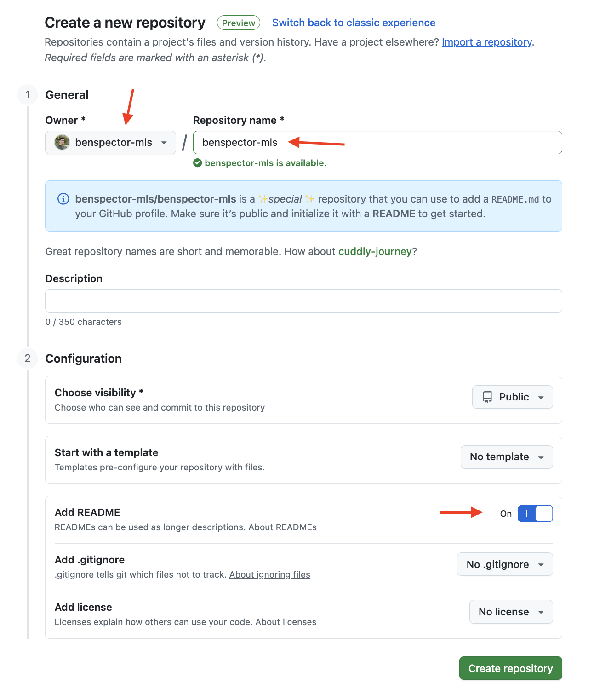
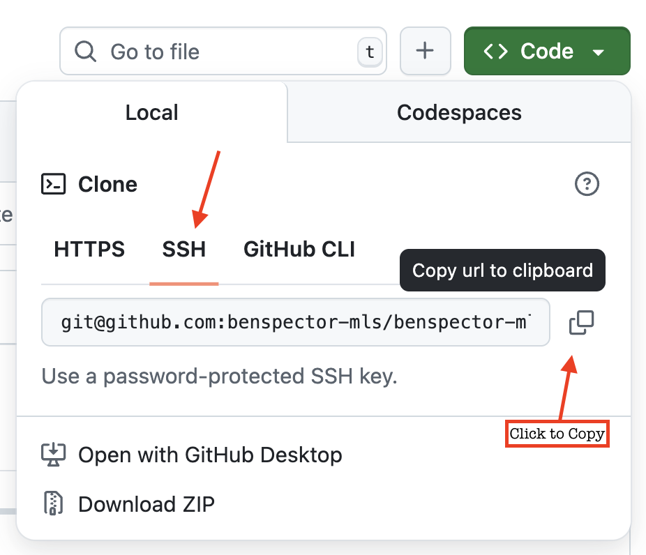

# Configure Your GitHub Account

You will be using GitHub individually to store your portfolio projects and collaboratively to work on group projects. We will set up your development environment to be able to communicate with your GitHub account. You'll be able to clone code from a remote repo to your local computer by using the Secure Shell (SSH) protocol in the Terminal and make changes to it on your computer.

**Table of Contents:**
- [Create a GitHub Account](#create-a-github-account)
- [Configuring Your Terminal to Work With Your GitHub](#configuring-your-terminal-to-work-with-your-github)
- [Create A Repository](#create-a-repository)
- [Create an SSH Key](#create-an-ssh-key)
- [Clone Using SSH](#clone-using-ssh)

## Create a GitHub Account

**GitHub** is like a social network for developers, making it easy to backup, share and collaborate on projects. Your GitHub profile will become the first thing that employers look at to see the projects you've worked on and to get a sense of the kind of developer you are!

Start by [creating a free GitHub Account](https://github.com/join). 

**The username you choose for your profile should include your first and last name.** Keep it professional. 

If you already have an account and it does not include your first and last name, you may update it in the settings or you can create a new account.

Write down your username and password so you don't forget it!

## Configuring Your Terminal to Work With Your GitHub

GitHub is where we store our code online. It does have a drag-and-drop upload tool but it is more common to use the `git` tool in your Terminal to upload your code.

To do so, we need to connect your Terminal to your GitHub account.

1. Open the Terminal application. Start by running the command:
    
    ```bash
    git --version
    ``` 

    which will print the current version of the `git` tool on your computer. This just confirms that you have the `git` tool

2. If you are using a Mac and this is your first time, a popup called **Install Command Line Developer Tools** will appear. Follow the instructions to install them on your computer.

3. Once this is done, in your Terminal, run the following lines. Be sure to replace `[Your Name]` and `[Your GitHub Email Address]` with your actual GitHub login information:

```sh
git config --global user.name "[Your Name]"
git config --global user.email "[Your GitHub Email Address]"
git config --global credential.helper store
```

3. Confirm that the configuration was successful by running 

```sh
git config --global user.name
git config --global user.email
```

The terminal should print out your name and email.

## Create A Repository

A **repository** is a digital place where we store our code. It's essentially a folder. By creating that repository on GitHub, instead of on our own computer, anyone can see the code we're writing and can collaborate on it (with permission).

Navigate to GitHub in the browser and log in. On the left side you should see a **New** button to create a new repository. Click it.


Then, fill out the form to configure the repository:
* Choose your account as the owner of this repository. 
* Name your repository *exactly* the same as your username. You should see a message below saying that the repo is a "✨special✨ repository".
* Toggle the switch for **Add README** to "On". 
* Click **Create repository**.



## Create an SSH Key

If we wanted to add files to this repository or download the contents of it, GitHub has a fairly standard drag-and-drop file system for upload and a button to download.

However, it is more common to use the `git` tool in our Terminal to send and receive code via the Secure Shell (SSH) communication protocol.

> SSH is a communication protocol. Other communication protocols you may have heard of include:
> * SMS (Short Messaging Service): the original, non-encrypted protocol used by cellular networks to send and receive text-only messages.
> * HTTP (Hypertext Transfer Protocol): the foundation of the World Wide Web, used for receiving website code and other data from web servers.

To enable this communication between our Terminal and our GitHub repos, we need to generate and add an **SSH Key** to our account.

1. First, check if you already have an SSH key by running `ls ~/.ssh`. If the terminal lists out any file(s) with a name called `id_ed25519.pub` then you already have a key.

2. If the running previous step printed "No such file or directory", then run `ssh-keygen -t ed25519` to create a key.
    - It will ask you to enter a file to save the key. Just press enter which will use a default location. It will say that it created the directory `/Users/[your_username]/.ssh`
    - It will ask you to enter a passphrase. Just press Enter.
    - If you've done every correctly, you should be something like this printed to your terminal (read it!):

      

3. Run `cat ~/.ssh/id_ed25519.pub` in your terminal and copy the output (starting from `ssh-ed25519` and ending in `.local`). You'll need it for the next step

4. Navigate to the homepage of GitHub in your browser. Go to your account settings:

    

5. Click "SSH and GPG Keys":

    

6. Click the "New SSH key" button:

    

7. Configure the new SSH key on GitHub:
   
   
    * The title should identify the computer that the SSH key came from. For example, "personal laptop" or "Marcy Macbook".
    * Open the **Key type** dropdown and select "Authentication Key". 
    * Paste the key in the text area.
    * The form should look like this:
    

8.  Click **Add SSH key**
   
## Clone Using SSH

Now that your GitHub profile has stored the SSH key generated by your computer, your computer will be authorized to upload and download code from your repositories using the Secure Shell (SSH) protocol.

1. Go back to your repository on GitHub. 
2. Then, click on the green **Code** button. Select the SSH protocol, and copy the `git@github.com...` by clicking on the copy button.

    

3. Open up VS Code and open your terminal. 
4. Navigate in your terminal to your `Development/mod-0` folder. If you set up your directories properly, you should be able to use the command:

    ```sh
    cd ~/Development/mod-0
    ```

5. Clone (download) down the project using the command:
    
    ```sh
    git clone [git_url_here]
    ```

    replacing `[git_ssh_url]` with the URL you copied from your GitHub repository. 
    
    If asked, "Are you sure you want to continue connecting", type `yes`. 

6. Enter the command `ls` to see that a new folder with the name of your repo has been added to the `mod-0` directory!

7. Navigate into that folder with the command `cd [repo_name]` (replace `[repo_name]` with the name of your repository)

8. Once your repo can been cloned down (downloaded), you should see also it in your file system in VS Code. Expand the folder and open the `README.md` file.
9. In The `README.md` file, **Add a short bio about yourself**. Be sure to save the file. Below is a template you can get started with. It is written using Markdown which is a language used for formatting text. Copy the entire text and fill in your information where you see blank spaces:

    ```md
    # Hi, I'm _____ 👋

    ## 👨‍🏫 About Me
    - Student at the [Marcy Lab School](https://www.marcylabschool.org/) studying to become a Software Engineer
    - Born in _____ → Raised in _____ → Currently in _____.
    - Outside of work I like to _____
    - Let's connect via email: _____

    ## Tech Stack:

    ### Languages
    - JavaScript

    ### Frameworks & Libraries
    - Node.js

    ### Tools
    - Git
    - GitHub
    ```

10. Push (upload) the changes to GitHub using the `git` commands below:
    
    ```sh
    git status
    git add README.md
    git commit -m "added bio"
    git push
    ```

11. You've just uploaded your code from your computer to GitHub. Go back to GitHub to view your repository in the browser. Refresh the page and confirm that you see your newly added bio!

    Any time that you would like to add to your bio (for example, to highlight a portfolio project or to share a link to your LinkedIn), just return to this repository in your terminal and repeat steps 9 and 10!

# Final Step

Once you have completed all the steps in these instructions, reach out to a technical instructor to verify you are finished.
