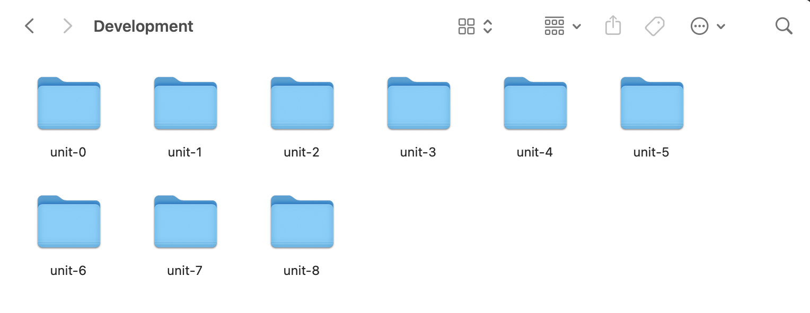
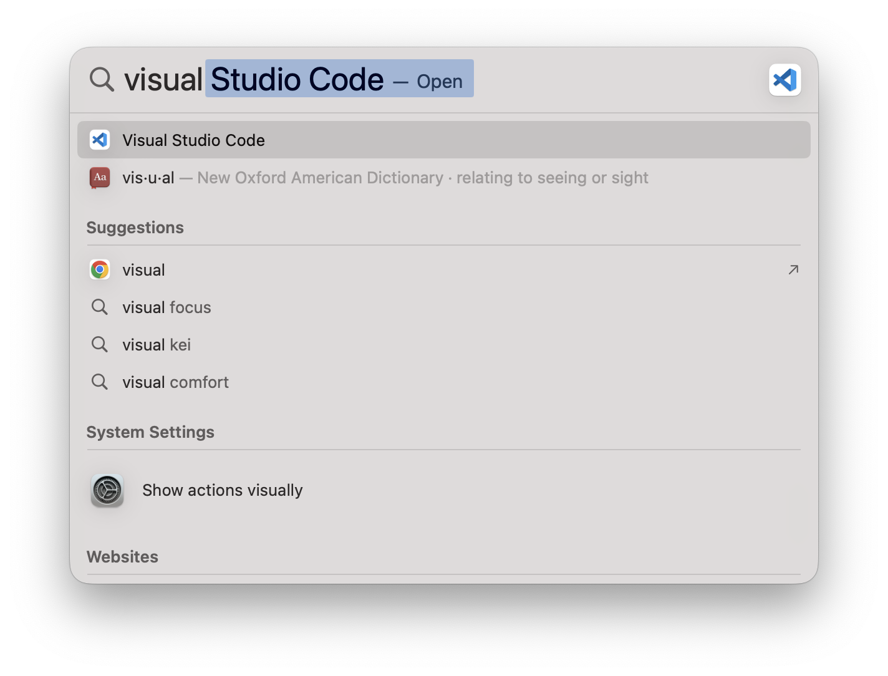
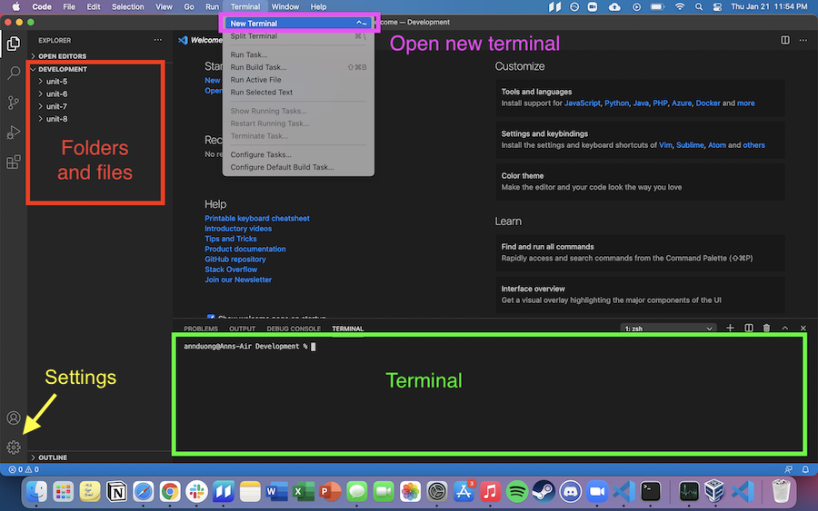
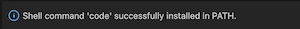
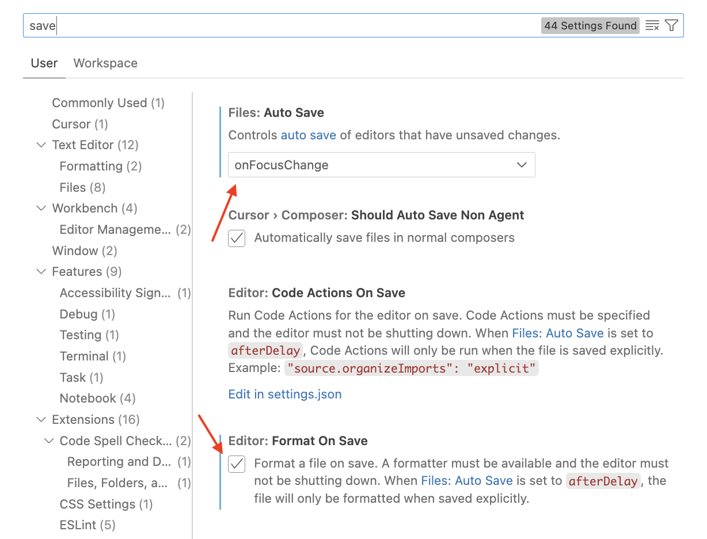
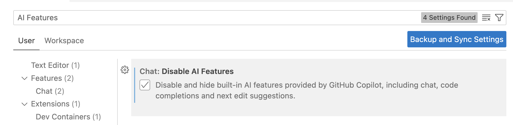

# Local Environment Setup - Mac

Today, we'll be setting up our local development environment for Mac. For the Windows instructions, see [here](local-environment-setup-windows.md).

## Table of Contents

* [Table of Contents](local-environment-setup-mac.md#table-of-contents)
* [Set up local `Development` directory](local-environment-setup-mac.md#set-up-local-development-directory)
* [Download VS Code](local-environment-setup-mac.md#download-vs-code)
  * [Familiarize yourself with VS Code](local-environment-setup-mac.md#familiarize-yourself-with-vs-code)
  * [Configure VS Code](local-environment-setup-mac.md#configure-vs-code)
* [Download Node and NPM](local-environment-setup-mac.md#download-node-and-npm)
* [Write your first JavaScript program](local-environment-setup-mac.md#write-your-first-javascript-program)

## Set up local `Development` directory

First, let's get familiar with the **Terminal**. It's an application that you can use to manage your file system. At first, it may seem slow but you'll quickly learn how to use it and see how powerful it can be!

1.  Open the Terminal application. You can do this via Spotlight Search (<kbd>Command+Spacebar</kbd>) and search for "Terminal". Once it opens, type in the `ls` command and hit <kbd>Enter</kbd>

    
2.  Using your Terminal, create a folder structure where you can put all your Marcy Lab code by entering these commands, one at a time:

    ```sh
    ls                
    mkdir Development 
    cd Development    
    mkdir mod-{0..7}  
    ls                
    ```

    What do these commands do?

    * `ls`: list the contents at the root (\~)
    * `mkdir Development`: make a new "Development" folder
    * `cd Development`: change your "working" directory, moving into the Development folder
    * `mkdir mod-{0..7}`: create folders called mod-0, mod-1, ..., mod-7
    * `ls`: list the contents of the Development folder

    When you're done with this step, your folder structure will look something like this if you open up the Development folder in your Finder application:

    

    Pretty cool right? The Terminal is a very powerful tool in the hands of an expert.

## Download VS Code

While the Terminal can be used to manage files, we'll use VS Code to actually write code.

VS Code is a code editor we can use to edit files and write programs. First, make sure that you don't already have VS Code installed.

* Search for Visual Studio Code on your computer. You can so this via Spotlight Search (Command+Spacebar) and type "Visual Studio Code":



If it shows up, then you can skip to the next section, [Familiarize yourself with VS Code](local-environment-setup-mac.md#familiarize-yourself-with-vs-code).

If it does not show up, follow these steps to install VS Code:

1. [Download VS Code for Mac](https://code.visualstudio.com/download)
2. Open up "Finder", navigate to your Downloads folder, click the `.zip` file, then drag Visual Studio Code to your Application folder.


### Familiarize yourself with VS Code

Now, let's get to know the VS Code layout!

* Your directories and files are in the left panel. You should see your `Development` folder as the root with your sub-directories listed inside.
* VS Code has an integrated Terminal application that you can use by selecting **Terminal > New Terminal** from the top menu bar.
* The VS Code Terminal is _exactly_ the same as your Mac "Terminal". Anything you do in Terminal you can do here as well.



### Configure VS Code

First, we'll add the very helpful `code` command which can quickly open up a VS Code window from the Terminal.

1.  Open VS Code and open the Command Palette by typing Shift+Command+P (⇧⌘P). Then type 'shell command' to find the Shell Command: Install 'code' command in PATH command. Click it to install.

    
2.  If the Shell Command install was successful, you should see this pop-up in the bottom-right of your VS Code:

    
3.  Test out that this worked by opening up your Terminal application

    * Enter `cd ~` to switch to the root folder (\~).
    * Enter `ls` to see the directories at the root.
    * Enter `code Development` to open a new VS Code window rooted in the `~/Development/` folder

    Remember this `code` command in the future. It can be used to open up a VS Code window in whatever folder you choose!
4.  Go to your settings (click on the cog in the bottom-left corner) and search for "save".

    * Set **Files: Auto Save** to **onFocusChange**
    * CHECK the checkbox for **Editor: Format On Save**

    
5.  Stay in your settings and search for "compact folders":

    * UNCHECK the checkbox for **Explorer: Compact Folders**.

    
6.  Finally, in your settings search for "AI Features"

    * CHECK the checkbox for **Chat: Disable AI Features**.

    

## Download Node and NPM

1.  [Download Node from their website](https://nodejs.org/en/download). When you visit the site, it should detect your system settings and recommend the appropriate version. You should be able to use the commands below:

    ```sh
    # Download and install nvm:
    curl -o- https://raw.githubusercontent.com/nvm-sh/nvm/v0.40.3/install.sh | bash

    # in lieu of restarting the shell
    \. "$HOME/.nvm/nvm.sh"

    # Download and install Node.js:
    nvm install 22

    # Verify the Node.js version:
    node -v # Should print "v22.18.0".
    nvm current # Should print "v22.18.0".

    # Verify npm version:
    npm -v # Should print "10.9.3".
    ```

## Write your first JavaScript program

Now, in your VS Code Terminal, enter these commands:

1. Type `ls` to see what is in your `Development` folder
2. `cd mod-0` to change directories into the `mod-0` folder
3. Create a new JavaScript file called "index" by running `touch index.js`.
   * You should be able to expand the `mod-0` folder and see the new JavaScript file.
4. Open the file and add `console.log("Hello World!")`
5. Save the file by pressing `⌘S` or by going to File > Save.
6. Run the command `node index.js` and see the message!
