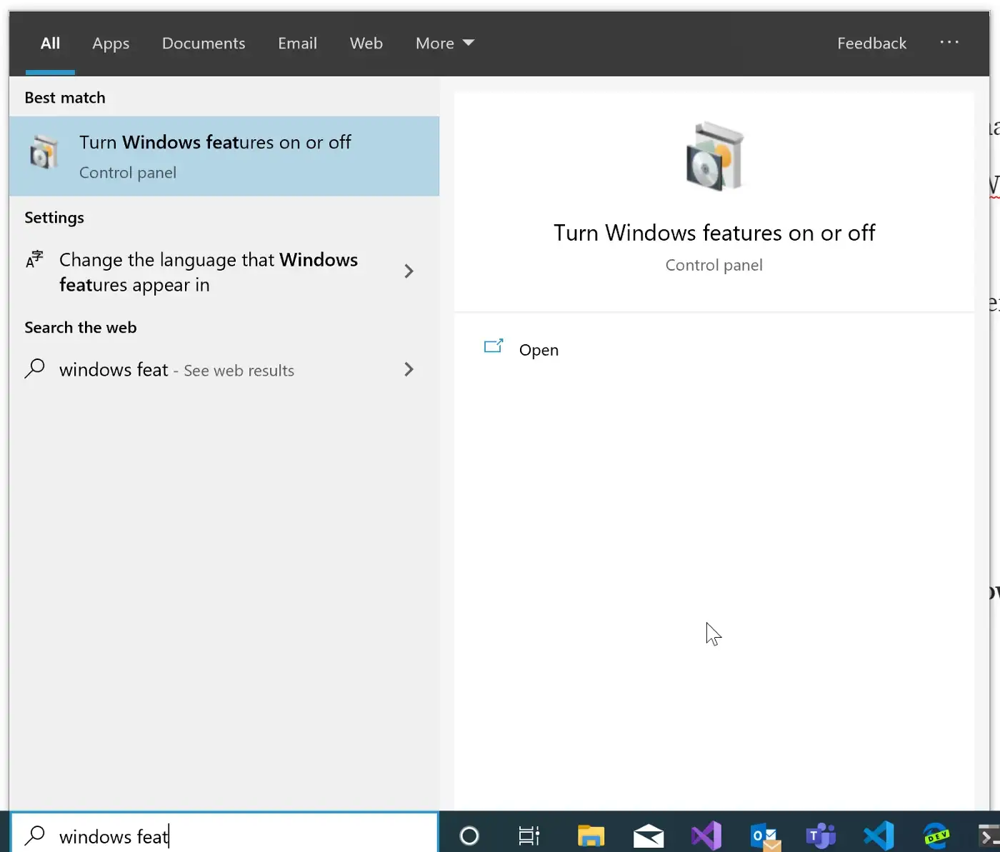
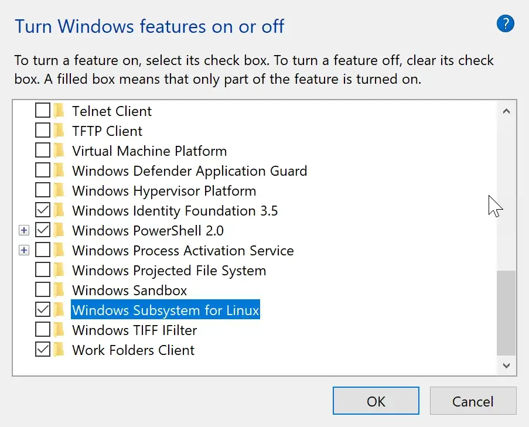
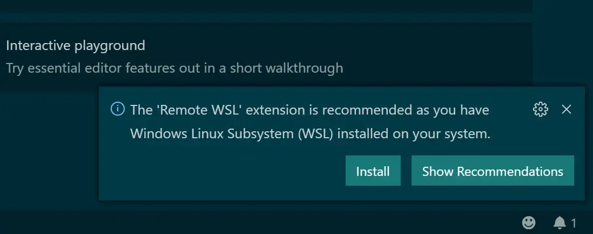
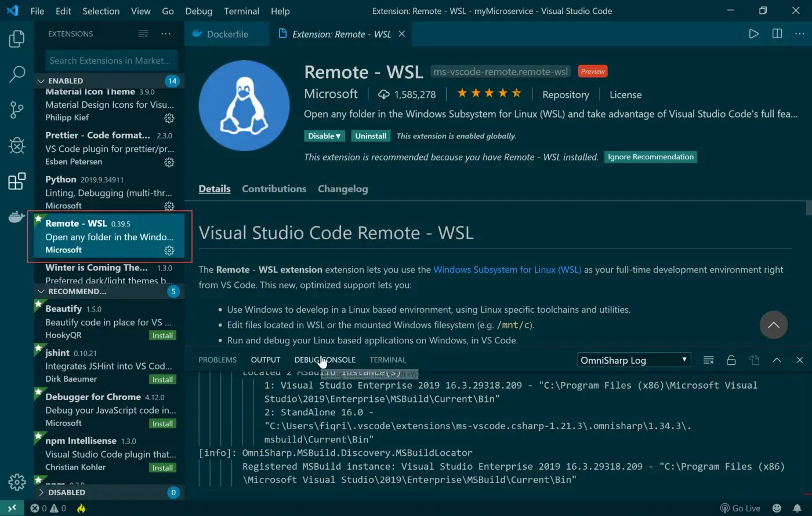
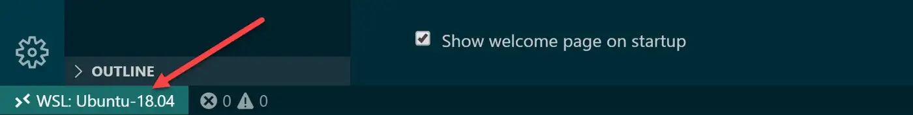
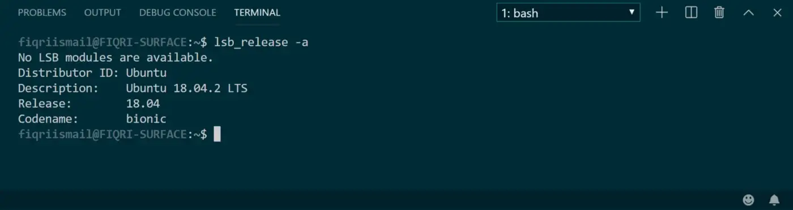
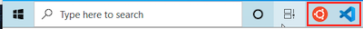
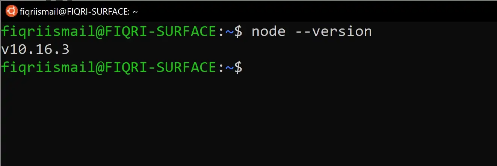
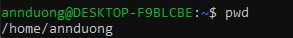
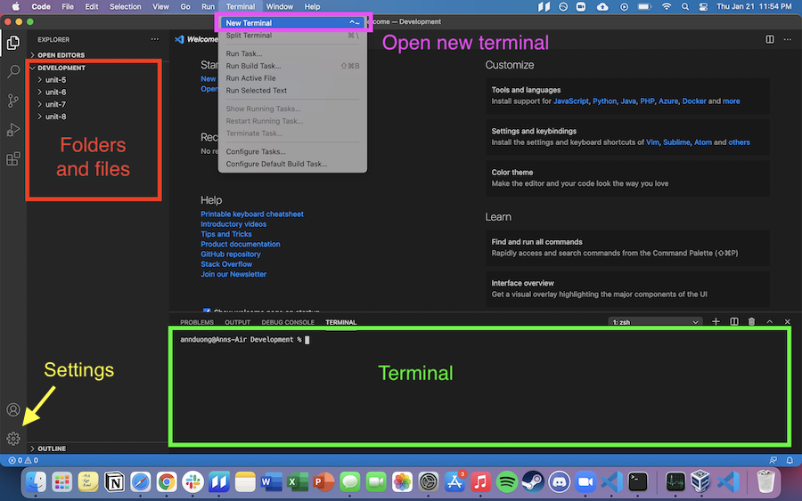

# Local Environment Setup: Windows

Today, we'll be setting up our local development environment for Windows 10. For the Mac instructions, see [here](./local-environment-setup-mac.md).

## Table of Contents

- [Table of Contents](#table-of-contents)
- [WSL](#wsl)
  - [Enable WSL](#enable-wsl)
  - [Download WSL](#download-wsl)
    - [Upgrade from WSL 1 to WSL 2](#upgrade-from-wsl-1-to-wsl-2)
- [Visual Studio Code, Node, and Your Local Development Environment](#visual-studio-code-node-and-your-local-development-environment)
  - [Download VSCode for Windows](#download-vscode-for-windows)
  - [Download Node and NPM](#download-node-and-npm)
  - [Set up local Development directory](#set-up-local-development-directory)

## WSL


Windows Subsystem for Linux (WSL) is a Linux distribution that allows you to run Windows applications in a Linux environment, the environment used by most software developers.

### Enable WSL

Within a few easy steps, you can get this done. Press **Windows Key + S** open up the search bar, and type “Windows Features.”



Click on the “Turn Windows features on or off”



Select **Windows Subsystem for Linux** and click OK. (This will require a restart of Windows to get things installed).

### Download WSL

After your computer starts up again, open the Windows Search, find the **Windows PowerShell** application, and **Run as Administrator**. 

Type the following commands in the **Windows PowerShell** application:

```powershell
wsl --update
wsl --install
```

This will update and install WSL on your computer!

When WSL finishes installing, run this command to check your version (take note of the value under `NAME` and `VERSION`):

```powershell
wsl -l -v
```

If it is version 2, you're good to go! You may close Powershell. 

If it says version 1, follow these steps below.

#### Upgrade from WSL 1 to WSL 2

> Note: These instructions are based on Microsoft's documentation found [here](https://learn.microsoft.com/en-us/windows/wsl/install#upgrade-version-from-wsl-1-to-wsl-2)

If the version is 1, you can change it to version 2 with a command like `wsl --set-version [NAME] [VERSION]`. 
* For example, to switch to `Ubuntu` version 2, you would use the command `wsl --set-version Ubuntu 2`

You should see "Conversion in progress, this may take a few minutes (it can take as long as 30 minutes or more)
  - If you see a warning telling you to install/update the WSL 2 kernel, you may be asked to visit https://aka.ms/wsl2kernel. Do so and install the WSL Linux kernel update package for x64 machines.
  - If you see "Please enable the Virtual Machine Platform Windows feature and ensure virtualization is enabled in the BIOS." do the following:
    - In the Windows search bar, look for "Turn Windows features on or off"
    - Scroll down and select "Virtual Machine Platform" and then click "Ok"
    - Reboot your computer.
    - Re-open Powershell, check the version with `wsl -l -v` and restart these instructions.

## Visual Studio Code, Node, and Your Local Development Environment

Visual Studio Code is the standard IDE used by developers. 

### Download VSCode for Windows

Visit [this web site](https://code.visualstudio.com/) and download VS Code.

* Download the latest build and install it in your PC.

* Now open VS Code and press **Ctrl + Shift + P** to open the **Command Palette** and search "WSL". 

* Then, select **WSL: Connect to WSL in New Window**. This should open a new VS Code window running using WSL!

VS Code should automatically detect your WSL installation and suggest an extension.



If not, you can click on the “Extensions” tab in VS Code. Search for "Remote - WSL" and install (I will have a penguin icon).



Visual Studio Code will open and will indicate its successfully connected to the server at WSL.



When you open the terminal from VS Code you will see the bash terminal at WSL.



You should pin Ubuntu Terminal and VS Code to the taskbar since you'll be using them a lot.



### Download Node and NPM

> Note: These instructions are based on Microsoft's documentation found [here](https://learn.microsoft.com/en-us/windows/dev-environment/javascript/nodejs-on-wsl#install-nvm-nodejs-and-npm). 

1. Go back to the Ubuntu terminal. Inside the terminal, type the following command and press enter:

    ```bash
    curl -o- https://raw.githubusercontent.com/nvm-sh/nvm/master/install.sh | bash
    ```

2. Close the Ubuntu terminal and re-open it
3. Install the "Long Term Support" version of Node by entering the command `nvm install --lts`.
4. Confirm that you have Node installed by running the command `node --version` and you should see something like `v18.18.0` in response.
5. Confirm that you have `npm` installed by running the command `npm --version`, and you should see something like `9.8.1` in response.

You are now set up with Node and npm!



### Set up local Development directory

Every time you open your Terminal, you'll be in the home directory. Run `pwd` to see the current path. You'll see `home/your-user-name`.



Using your Terminal as a command line, create a folder structure where you can put all your Marcy Lab code. You can do using the following commands:

- `cd` to navigate to the home directory.
- `mkdir Development` to create a folder for _all_ your work.
- `cd Development` where you will create more subdirectories.
- `mkdir mod-{0..7}` etc... to make multiple folders at once.
- `ls` to list the contents of `Development/` and ensure the folders were created.

Next, type the command `code .` into your terminal and it will open VS Code for you. You'll use this command a lot so remember it!

Familiarize yourself with VS Code. This will be your new coding environment.

- Your directories and files are in the left panel.
- You can start a new "VS Code Terminal" by selecting View > Terminal from the top menu bar.
- The "VS Code Terminal" works _exactly_ the same as your Ubuntu "Terminal"!

