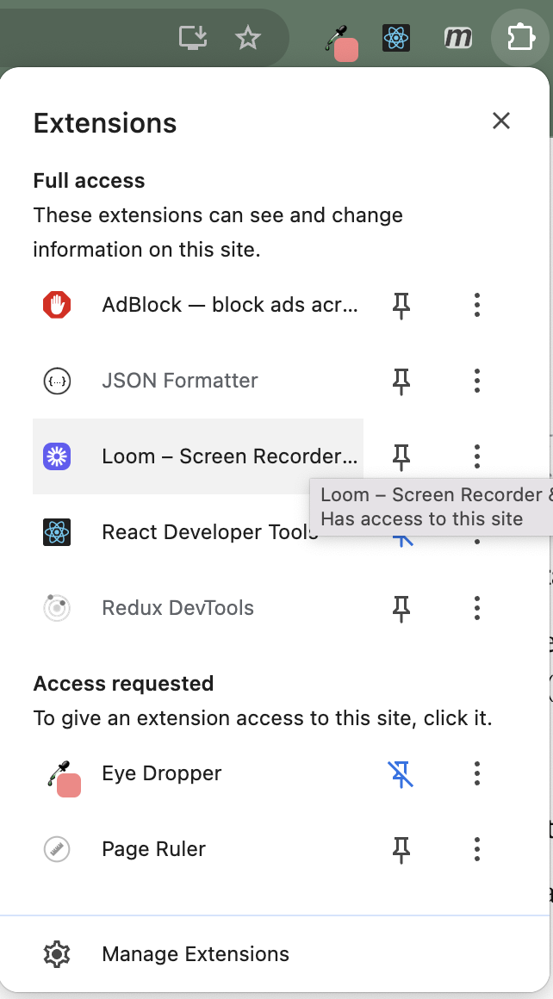
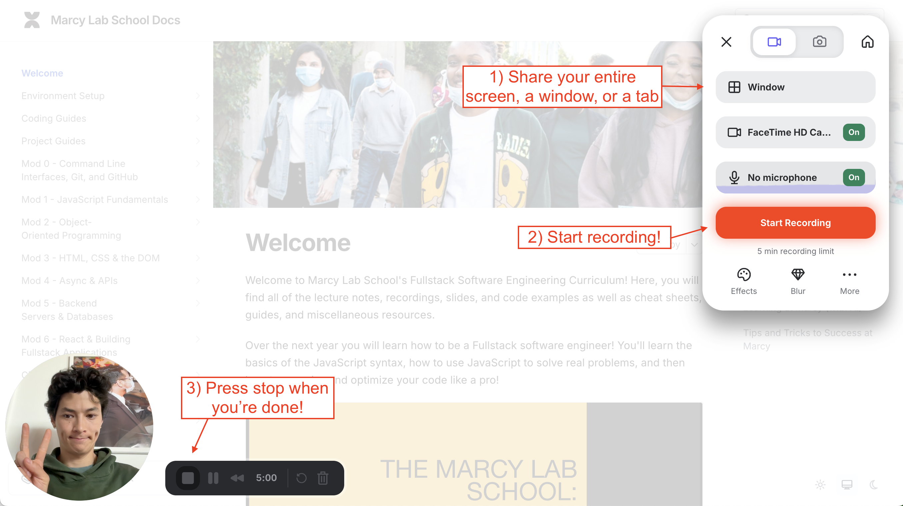
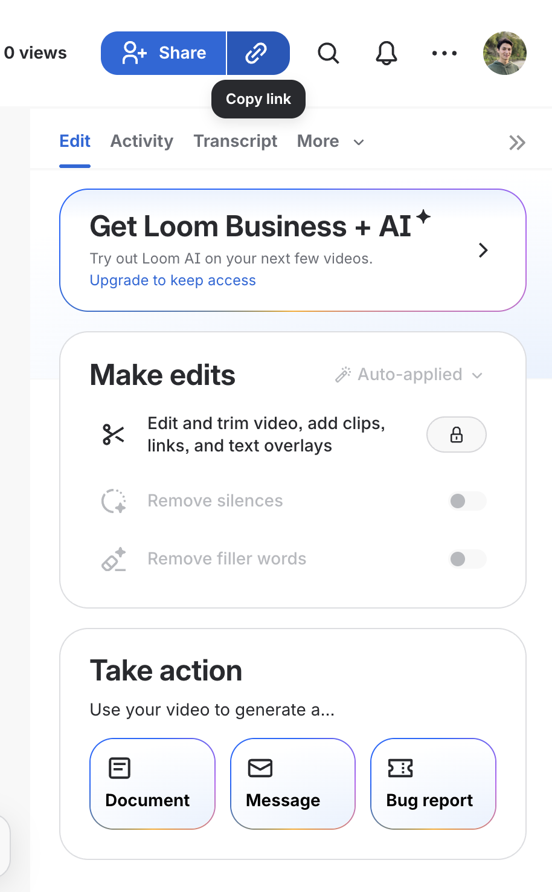

# Loom Screen Recording Setup

[Loom](https://www.loom.com/) is a screen recording and video messaging tool that makes it easy to capture and share videos. It's particularly useful for:

- Recording your screen while coding to demonstrate your work
- Creating video walkthroughs of your projects
- Recording presentations
- Sharing quick video messages with teammates

Some key features of Loom include:
- Browser-based recording through Chrome extension
- Record your screen, camera, or both simultaneously  
- Easy sharing via links
- Basic video editing capabilities
- Free tier available for basic usage

You'll use Loom throughout the program to record project demonstrations and share your work with instructors and peers.

## Installation

1. Go to [www.loom.com](https://www.loom.com/) and create a free account
2. Install the Loom Chrome extension:
   - Visit the [Chrome Web Store](https://chrome.google.com/webstore/detail/loom-for-chrome/liecbddmkiiihnedobmlmillhodjkdmb)
   - Click "Add to Chrome"
   - Follow the prompts to add the extension
3. Click the Loom extension icon in your Chrome toolbar
4. Sign in with your Loom account
5. Follow the prompts to configure your microphone and camera settings

## Recording Your First Video

1. Click the Loom extension icon in your Chrome toolbar
2. Choose what you want to record:
   - Current tab
   - Desktop
   - Camera only
3. Select whether to include your camera bubble
4. Click "Start Recording"
5. When finished, click the stop button in the Loom control bar

6. Your video will automatically upload and generate a shareable link

