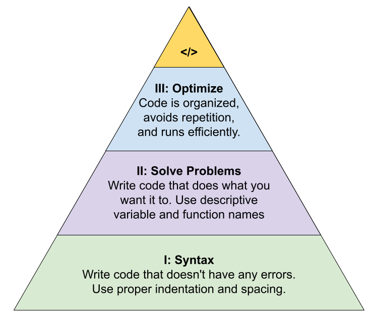

# Marcy Lab School Fullstack Software Engineering Curriculum

Welcome to Marcy Lab School's Fullstack Software Engineering Curriculum! Over the next year you will learn how to be a Fullstack software engineer! You'll learn the basics of the JavaScript syntax, how to use JavaScript to solve real problems, and then how to organize and optimize your code like a pro!

Here, you will find all of the lecture notes, recordings, slides, and code examples as well as cheatsheets, guides, and miscellaneous resources.

Before you begin, check out these tips and tricks for success at Marcy.

## Learning Principles

- **Go slow now to go far later.**
    - Mastery of the fundamentals takes time but it is worth it.
    - If you understand the fundamentals, you can reason about any of the abstractions built on top of them.
- **Your words are your world.**
    - Vocabulary matters. Your mental models can only be as strong as the language you have to describe them.
    - The quality of your solution is determined by your ability to articulate the problem.
- **Learning is a skill...**
    - …and it is the most important skill in the world.
    - ....and like all other skills, it can be developed and improved upon with intentional practice.
    - We learn by repeated exposure. What was once intimidating becomes familiar and approachable through repetition.
    - AI tools like ChatGPT are shortcuts for writing code, but they are not shortcuts for learning. Learn from your community (peers, Google, and StackOverflow, even)!

## Tips & Tricks to Success at Marcy

- [Ben's Teacher User Manual](https://marcylabschool.notion.site/Ben-s-Teaching-User-Manual-afe86d2a9e314c6e91e8fa44ac3b2fa8)
- [Technical Curriculum Overview](https://docs.google.com/presentation/d/1DVShFW2-5n1rNWSiPx8AjL040WUfNxdoTBvO90uUYqE/edit)
- [What is Computational Thinking?](https://youtu.be/qbnTZCj0ugI)
- [How to Boost Your Confidence as a New Programmer](https://marcylabschool.notion.site/marcylabschool/How-to-Boost-Your-Confidence-as-a-New-Programmer-3e08b5dc231444adb5770228696041ac)
- [The Surprising Truth About Note-taking During Lectures](https://www.youtube.com/watch?v=cRQqH18wJgw&ab_channel=BenjaminKeep%2CPhD%2CJD)
- [How to use Notion to create notes for coding](https://www.youtube.com/watch?v=0h-WSrckaq8&ab_channel=InternetMadeCoder)