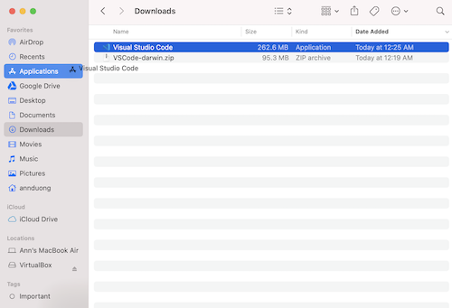
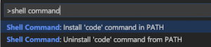
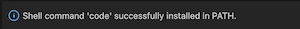
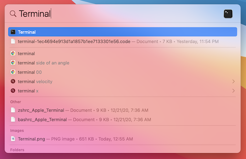
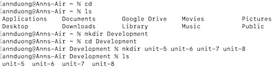

# Local Environment Setup: MacOS

Today, we'll be setting up our local development environment for Mac. For the Windows instructions, see [here](https://github.com/The-Marcy-Lab-School/local-environment-setup-wsl). 

## Table of Contents
1. Download VS Code for Mac and command line tools
2. Set up local Development directory
3. Install Node and NPM
4. Configuring Github with your Terminal
5. Add SSH Key for Github Setup

## Download VS Code
VS Code is a code editor we can use to edit files and write programs. 

1. [Download VS Code for Mac](https://code.visualstudio.com/download)

2. Open up "Finder", navigate to your Downloads folder, click the `.zip` file, then drag Visual Studio Code to your Application folder.



3. Open VS Code and open the Command Palette by typing Shift+Command+P (⇧⌘P). Then type 'shell command' to find the Shell Command: Install 'code' command in PATH command. Click it to install. 



4. If the Shell Command install was successful, you should see this pop-up in the bottom-right of your VS Code:



## Set up local Development directory

1. Open your Terminal. You can so this via Spotlight Search (Command+Spacebar)and type "Terminal":



2. Using your Terminal as a command line, create a folder structure where you can put all your Marcy Lab code. We recommend:
```
Development
 |- unit-0
 |- unit-1
 |- unit-2
...
 |- unit-7
 |- unit-8
```
You can do this using the following commands:
* `cd` to navigate to the home directory.
* `ls` to **MAKE SURE** you are in the home directory. You should see folders like "Desktop" and "Documents".
* `mkdir Development` to create a folder for *all* your work.
* `cd Development` where you will create more subdirectories.
* `mkdir unit-0 unit-1 unit-2 unit-3` and so on to make multiple folders at once.
* `ls` to ensure the folders were created.



3. Lastly, you should type the command `code .` into your terminal and it will open VS Code for you. Remember this terminal command in the future. It will be very helpful!

4. Familiarize yourself with VS Code. This will be your new coding environment. Your directories and files are in the left panel. You can start a new "VS Code Terminal" by selecting Terminal from the top menu bar. The "VS Code Terminal" works *exactly* the same as your Mac "Terminal".


## Download Node and NPM

1. [Download Node from their website](https://nodejs.org/en/). If you are using macOS Ventura, download the latest version of node: 19.6.0 Current. For all other macOS you can click on the LTS version Recommended For Most Users. Go through the installation steps. 

2. When you are finished installing, quit and restart your Terminal. Then, type `node -v` and you should not get an error and should see some version number. Type `npm -v` and you should not get an error and should see some version number.

## Write your first JavaScript program

1. `cd` into the `unit-0` folder
2. Create a new JavaScript file called "index" by running `touch index.js`
3. Open the file and add `console.log("Hello World!")`
4. Run the command `node index.js` and see the message! (make sure your terminal is in the same place as the JavaScript file).

## Configure your Github using the Terminal

1. Follow these instructions to [set up Github in your terminal](https://github.com/The-Marcy-Lab-School/github-setup).  

### If everything has worked as expected, reach out to an instructor for a final validation!!
