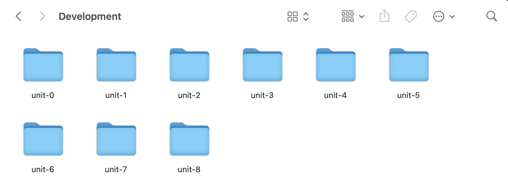
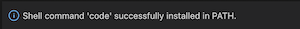

# Local Environment Setup: MacOS

Today, we'll be setting up our local development environment for Mac. For the Windows instructions, see [here](https://github.com/The-Marcy-Lab-School/local-environment-setup-wsl). 

## Table of Contents
- [Table of Contents](#table-of-contents)
- [Set up local `Development` directory](#set-up-local-development-directory)
- [Download VS Code](#download-vs-code)
- [Familiarize yourself with VS Code](#familiarize-yourself-with-vs-code)
- [Download Node and NPM](#download-node-and-npm)
- [Write your first JavaScript program](#write-your-first-javascript-program)
- [Configure your Github using the Terminal](#configure-your-github-using-the-terminal)

## Set up local `Development` directory

First, let's get familiar with the **Terminal**. It's an application that you can use to manage your file system. At first, it may seem slow but you'll quickly learn how to use it and see how powerful it can be!

1. Open your Terminal. You can do this via Spotlight Search (Command+Spacebar)and type "Terminal":

    

2. Using your Terminal as a command line, create a folder structure where you can put all your Marcy Lab code. 

    When you're done with this step your folder structure will look something like this: 

    

    However, instead of creating these folders using Finder, you will create them using your Terminal.

    You can do this by typing and then entering the following commands into your Terminal:
   * `cd` to navigate to the home directory.
   * `ls` to **MAKE SURE** you are in the home directory. You should see folders like "Desktop" and "Documents".
   * `mkdir Development` to create a folder for *all* your work.
   * `cd Development` where you will create more subdirectories.
   * `mkdir unit-0 unit-1 unit-2 unit-3` and so on to make multiple folders at once.
   * `ls` to ensure the folders were created. You should see folders for `unit-0` up to `unit-8`.

## Download VS Code

While the Terminal can be used to manage files, we'll use VS Code to actually write code.

VS Code is a code editor we can use to edit files and write programs. First, make sure that you don't already have VS Code installed. 
- Search for Visual Studio Code on your computer. You can so this via Spotlight Search (Command+Spacebar) and type "Visual Studio Code":

If it shows up, then you can skip to the next section, [Familiarize yourself with VS Code](#familiarize-yourself-with-vs-code).

If it does not show up, follow these steps to install VS Code:

1. [Download VS Code for Mac](https://code.visualstudio.com/download)

2. Open up "Finder", navigate to your Downloads folder, click the `.zip` file, then drag Visual Studio Code to your Application folder.

## Familiarize yourself with VS Code
Now, we're going to explore Visual Studio Code.

First, we'll add the very helpful `code` command which can quickly open up a VS Code window from the Terminal.
1. Open VS Code and open the Command Palette by typing Shift+Command+P (⇧⌘P). Then type 'shell command' to find the Shell Command: Install 'code' command in PATH command. Click it to install. 

    

2. If the Shell Command install was successful, you should see this pop-up in the bottom-right of your VS Code:

    

3. Test out that this worked by opening up your Terminal application, make sure you are in the `Development` folder, and type `code .` to open up VS Code.

   - It should open VS Code for you with the root of your file system in your `Development` folder. 
   - Remember this `code .` command in the future. It can be used to open up VS Code in whatever folder your Terminal application is currently located.

Now, let's get to know the VS Code layout!
   * Your directories and files are in the left panel. You should see your `Development` folder with your `unit-0` through `unit-8` folders inside.
   * You can start a new "VS Code Terminal" by selecting **Terminal** and **New Terminal** from the top menu bar. 
   * The "VS Code Terminal" is *exactly* the same as your Mac "Terminal". Anything you do in Terminal you can do here as well.

## Download Node and NPM

1. [Download Node from their website](https://nodejs.org/en/). If you are using macOS Ventura, download the latest version of node: 19.6.0 Current. For all other macOS you can click on the LTS version Recommended For Most Users. Go through the installation steps. 

2. When you are finished installing, quit and restart your Terminal. Then, type `node -v` and you should not get an error and should see some version number. Type `npm -v` and you should not get an error and should see some version number.

## Write your first JavaScript program

Now, in your VS Code Terminal, enter these commands:
1. Type `ls` to see what is in your `Development` folder
2. `cd unit-0` to change directories into the `unit-0` folder
3. Create a new JavaScript file called "index" by running `touch index.js`. You should be able to expand the `unit-0` folder and see the new JavaScript file.
4. Open the file and add `console.log("Hello World!")`
5. Save the file by pressing `⌘S` or by going to File > Save.
6. Run the command `node index.js` and see the message!
   
## Configure your Github using the Terminal

1. Follow these instructions to [set up Github in your terminal](./github-setup.md).  

**If everything has worked as expected, reach out to an instructor for a final validation!!**