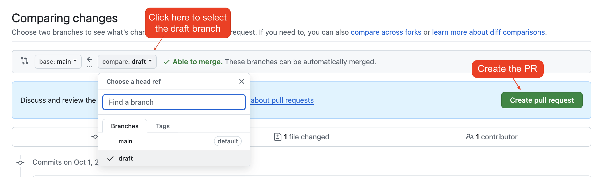

# How to Do Short Response and Coding Assignments

**Table of Contents:**
- [What is a SWE Assignment?](#what-is-a-swe-assignment)
  - [Tips for Working on SWE Coding Assignments](#tips-for-working-on-swe-coding-assignments)
  - [Jest and Testing](#jest-and-testing)
  - [Feedback on Coding Assignments](#feedback-on-coding-assignments)
- [What is a SWE-SR Assignment?](#what-is-a-swe-sr-assignment)
  - [Feedback on Short Response Assignments](#feedback-on-short-response-assignments)
  - [Examples of Short Responses](#examples-of-short-responses)
- [Using AI on Assignments](#using-ai-on-assignments)
- [Submitting On Time](#submitting-on-time)
- [How to Work On Assignments](#how-to-work-on-assignments)
  - [Assignment Setup](#assignment-setup)
  - [Submitting the Assignment](#submitting-the-assignment)
  - [How to Undo a Commit to Main and Move Commits to Draft](#how-to-undo-a-commit-to-main-and-move-commits-to-draft)


## What is a SWE Assignment?

Software Engineering (SWE) code assignments are opportunities for you to practice the skills learned in your Software Engineering fellowship at The Marcy Lab School. In these assignments, you can expect to:
* Create code from scratch
* Modify existing code
* Debug broken code

Code assignments will typically have an `src` directory where you will be writing your code. They will also have a `tests` directory with `.spec.js` test files that will automatically test your code each time you push to your repository.

### Tips for Working on SWE Coding Assignments

As you work on your coding assignment, you may be tempted to jump right in and start coding. However, it is often best to slow down and plan out your approach first. Look at the problem and make sure you understand fully what it is asking you to do. At Marcy, we recommend that you use the PEDAC approach ([read more about PEDAC here](./how-to-pedac.md)).

You may get stuck along the way, which can always be frustrating. Debugging is an essential skill but its hard to know where to start sometimes. That's why we love the "rubber duck" approach ([read more about debugging with the rubber duck approach here](./how-to-debug.md))

### Jest and Testing

Tests are an essential part of professional software development. Without testing our code, we run the risk of deploying code with unexpected bugs. With testing, we are forced to think critically about how we expect our program to behave and then write our code to satisfy those tests. This process of first writing tests and then writing code to satisfy those tests is called **Test-Driven Development (TDD)**.

At Marcy, we use [Jest](https://jestjs.io/) to write automated tests for coding assignments. Automated tests are JavaScript files that:
1. Import functions from source code
2. Run those functions with various inputs
3. Compare the returned values against the expected values. 

A Jest test is written in a file ending in `.spec.js` or `.test.js` and looks like this:


```javascript
// Import the functions to be tested
const {
  getArea,
  getDiameter,
  getCircumference
} = require('./circle-helpers')

// Create a "Test Suite" for these functions
describe('Circle Helper Tests', () => {
  // Test the getArea function with a series of expectations
  test('getArea returns the Area of a circle', () => {
    // Translation: We expect getArea(2) to return Math.PI * 2 * 2
    expect(getArea(2)).toBe(Math.PI * 2 * 2);
    expect(getArea(3)).toBe(Math.PI * 3 * 3);

    // It is useful to think about what should be returned for "bad" inputs. 
    expect(getArea()).toBe(NaN);
    expect(getArea('hello')).toBe(NaN);
  });

  // Test the getDiameter function with a series of expectations
  test('getDiameter returns the Diameter of a circle', () => {
    // ...tests for getDiameter
  });

  // ...more tests
})
```


Each assignment will have automated test files in the `tests` directory. They will show you exactly how we expect your functions to behave. **DO NOT MODIFY THE TESTS**.

To run these automated tests, use the command:

```sh
npm test # run the tests once
# or
npm run test:w # run the tests each time the file changes ("watch mode")
```

After running this command, you will see the following output. Initially, all tests will fail.


The test output provides some really useful information. 
* We can see which tests failed
* For each failing test, we can see which `expect()` statement failed
* We can see what the expected value is (`12.566...`) and what our function actually returned (`undefined`).

Armed with this information, we can more confidently build our functions knowing that we have a specific set of targets to aim for. Automated tests allow us to repeatedly run our code against the same set of tests until all expectations are met.

All assignments will also come with a `src/playground.js` file that you can use to manually test your code as you develop. We recommend the following workflow:
1. Run the automated tests to see what you are aiming for.
2. Copy the function you are currently working on into the `playground.js` file and use the test cases to manually test your code
3. Once you are satisfied, copy your function back into the original file and run the automated tests again. 
4. If anything fails, return to the `playground.js` file to make adjustments.
5. Repeat.

### Feedback on Coding Assignments

In order for a coding assignment to be marked as "Complete", it must pass at least 75% of the automated tests (though you should always strive to pass 100% of the tests!).

For example, an assignment with 10 automated tests requires 8 passing tests to be marked "Complete".

**There is no limit to the number of times you can submit an assignment.** As such, you are encouraged to **always submit your assignments on time to ensure that your instructor can provide you feedback and support** to complete your assignments.

To support you in your growth as a software engineer, your instructor may provide feedback on any of the following areas (roughly in order of importance):

- **Code Quality**
  - Adherence to coding standards and conventions (e.g., ESLint rules)
  - Use of proper naming conventions (variables, functions)
  - Avoidance of code duplication
  - Clear and concise comments
- **Functionality**
  - Does the code meet the project requirements?
  - Does it pass all tests, both automated and edge cases?
  - Correctness of input/output handling
- **Modularity and Reusability**
  - Proper use of functions or classes
  - Modular and reusable code (avoiding large, monolithic functions)
  - Clear separation of logic
- **Version Control Practices**
  - Meaningful commit messages
  - Consistent use of branches
  - Proper use of pull requests and code reviews
- **Code Structure and Organization**
  - File structure
  - Separation of concerns
  - Readability and logical flow
- **Error Handling**
  - Proper use of try-catch blocks
  - Graceful handling of unexpected inputs or states
  - Meaningful error messages
- **Efficiency and Performance**
  - Time and space complexity
  - Use of appropriate data structures and algorithms
  - Avoidance of unnecessary computations

## What is a SWE-SR Assignment?

Software Engineering (SWE) Short Response (SR) assignments are opportunities to develop your technical communication skills. 

In these assignments, you may encounter the following types of prompts:
* Research a new topic and share your findings.
* Explain a piece of syntax with examples and analogies.
* Analyze a programming best practice and list its advantages and disadvantages.

Your intended audience should be someone with _some_ experience programming but who is still learning. As such, strive to be as clear and concise as possible. There is a fine balance between too much information and just enough but when in doubt, provide more details. Examples and analogies can often help! 

Strive to do more than just answer the prompts. Use the prompts as opportunities to practice your technical communication. While anyone can write functional code, not everyone can communicate clearly so take pride in this work!

### Feedback on Short Response Assignments

Every response will be given a score from 0-3 using the following scoring system:

* 0 — Did not attempt to answer the prompt 
* 1 — Attempted the prompt and the response is more wrong than right, or parts of the prompt are not fully answered, or the answer is lacking in clarity. Examples and/or diagrams are missing (when required).
* 2 — Attempted the prompt and all parts of the prompt are answered, but there are some mistakes and/or the clarity could be improved. Examples and/or diagrams may be missing or could be improved.
* 3 — Answered the prompt correctly and completely. The response is clear and concise. Examples and/or diagrams are well-chosen and enhance the response.

We understand that typos and grammar mistakes can happen, however, you will also lose .5 points on any the prompt where typos or grammar errors are "distracting". Distracting meaning that if you saw this on the job, it would have to be retyped for clarification or for the sake of presentation.



In order for a short response assignment to be marked as "Complete", you must score at least a 75% on the assignment. 

For example, an assignment with 5 short response prompts has a total possible score of 15. You must score at least a 12 on that assignment.



To support you in your growth as a technical communicator, your instructor may also provide feedback on the following areas:

* **Clarity**: The communication is precise, concise, and unambiguous. Technical jargon is explained, and terms are used consistently.
* **Completeness**: The communication covers all necessary technical details, scenarios, and edge cases, providing sufficient examples or references.
* **Structure and Organization**: For longer answers, answers are logically organized with clear sections, headings, and transitions between ideas. The structure enhances understanding.
* **Use of Examples and Diagrams**: Uses well-chosen examples, diagrams, or code snippets (when appropriate) that significantly aid understanding and clarify complex concepts.
* **Accuracy**: The content is technically correct and adheres to current best practices and standards.
* **Conciseness**: The communication is efficient, avoiding unnecessary detail or excessive language, while still being comprehensive.

### Examples of Short Responses

Short Response prompts will always be found in the `README.md` file of your assignment. Each prompt will be listed under a `## Prompt X` heading and you should add your responses under the `### Response X` heading using Markdown ([read about Markdown syntax here](https://www.markdownguide.org/basic-syntax/)).

For example
```markdown
## Prompt 2

Modules let us split up our code into separate files. What are benefits of doing this? Are there any downsides?

### Response 2

Response here...
```

Below are some examples of responses that would score a 1, 2 or 3.

**<details><summary>1 — a weak response that needs a lot of improvement</summary>**

This response answers the first part of the prompt but does so with almost no details. It addresses _what_ the benefits of modules are, but doesn't add any details that explain _how_ modules provide those benefits. The second part of the prompt asking for downsides is acknowledged but the author doesn't attempt to answer this prompt. In addition, there are typos, grammar mistakes, and missing punctuation.

As a reader, I would have little to no understanding of how modules improve our projects.


```markdown
## Prompt
Modules let us split up our code into separate files. What are benefits of doing this? Are there any downsides?

### Response
they makes it easier to orgnize code im not sure about downsides
```

</details>


**<details><summary>2 - a solid response that could be improved</summary>**

This response below is okay but could definitely be improved. It answers all parts of the prompt and is free of typos and grammar mistakes but it isn't written in a way that a beginner would be able to understand. The use of the word "filtered" is abstract and could be replaced with a more widely-accessible word like "organized". The example in the second sentence does bolster the first sentence, but it is still lacking in clarity and details that are relatable. Perhaps an analogy could be added to make it easier to understand.

All parts of the prompt are answered but the last sentence is lacking depth. Overall, this response feels like it is just answering the prompt rather than explaining the concept of modules.

As a reader, I can come away from this response having some understanding of modules but I may need more examples or an analogy to really understand.


```markdown
## Prompt
Modules let us split up our code into separate files. What are benefits of doing this? Are there any downsides?

### Response
Modules allow you to have code filtered more efficiency. You can look at certain features and edit them without editing and testing the whole project. The downside is more files to look through.
```


</details>

**<details><summary>3 - an excellent response that is ready to be presented</summary>**

This response below is a great example of a short response answer. It answers all parts of the prompt, provides a great analogy that adds to the depth of the response, and is free of typos and grammar mistakes. In a few cases, Markdown is used effectively to bold key terms.

In addition, the personality of the writer is coming through. It doesn't sound like an AI wrote this.

As a reader, I can come away from this response having a better understanding of modules with some analogies that support my understanding.


```markdown
## Prompt
Modules let us split up our code into separate files. What are benefits of doing this? Are there any downsides?

### Response
**Modules** help to section our code in separate files so we can easily navigate to the right code. Similarly, websites have different links to their respective topics instead of having a long document that would cause a user to annoyingly scroll for hours, trying to find what they came for. Modules are able to share their code with other files by **exporting** values that can be **imported** and used in other files. This is similar to how countries export goods that are imported by other countries to use.

A downside of modules could be having too many modules, which in my opinion, can be overwhelming. If you're not organized, you might forget where something is!
```


</details>

## Using AI on Assignments

On short response assignments, you may use generative AI tools like ChatGPT to help structure and refine your responses and to check for spelling and grammar mistakes. However, the majority of the writing should be yours! As a rule, aim to have no more than about 25% of the content written by a generative AI assistant. 

On coding assignments, you may use generative AI tools like ChatGPT to help explain assignment instructions or test code. You may also use it to improve code that you've already written in areas such as code quality, structure, or efficiency. 

If you are really stuck, you can use solutions generated by generative AI tools in the same way that you would use coding solutions found on the internet. However, the majority of the code should be yours! As a rule, aim to have no more than about 25% of the content written by someone other than you.

**All code generated using AI or found on the internet should be cited using comments. Every line of found code should be commented with an explanation of the code** 

**<details><summary>See below for an example</summary>**

> 
> ```js
> // Note: I found this solution online: https://www.geeksforgeeks.org/how-to-find-the-sum-of-all-elements-of-a-given-array-in-javascript/# 
> const sumArray = (arr) => {
>   // this variable will track the growing sum as we loop
>   let total = 0;
> 
>   // this will loop over every index of arr from 0 to arr.length-1
>   for (let i = 0; i < arr.length; i++) {
>     // this will take the current value and add it to the total
>     total += arr[i];
>   }
> 
>   // when we are done looping, return the count
>   return total;
> }
> ```
>

</details>

For more details on our AI Policy, refer to the [Marcy Lab School Docs](https://marcylabschool.gitbook.io/marcy-lab-school-docs/guidelines-and-policies/ai-policy).

## Submitting On Time
 
"Grades" don't exist at Marcy. We only need performance data in order to know how you're doing, and make sure the people who need help get it as quickly as they can. It's ok if you didn't finish by the deadline! Just show us what you have. We'll have office hours and reviews, and we want to know what you are all struggling with so we can use those meetings effectively. **This is not about grades, its about seeing what you know, and where we can help!**

## How to Work On Assignments

For short response and coding assignments, you will create a new branch called `draft` to complete your work. When you are ready to submit, you will create a Pull Request (PR) and tag your instructor for review. 

Below, you will find detailed instructions for setting up your assignments and for submitting your assignments.



Want to learn more about git branching and making Pull Requests? Check out the [Git Branching & PRs lesson](https://marcylabschool.gitbook.io/marcy-lab-school-docs/fullstack-curriculum/mod-0-command-line-interfaces-git-and-github/4-git-branching)!




### Assignment Setup

Upon receiving any assignment, you should do the following setup steps:
1. Accept the assignment using the provided GitHub classroom link. It should generate a repository that is unique to you.
2. Clone down your repository and `cd` into your repository. 
3. (*For coding assignments only*) Run the following commands:
    
    ```sh
    npm i
    npm test
    ```
    
    This will install any necessary dependencies and then show you all the tests you need to work on. We may explain each function in the `README.md`, but always run the tests because they are crucial to explaining what the code literally must do.

4. Create and checkout a new branch called `draft`

    ```sh
    git checkout -b draft
    ```

### Submitting the Assignment

To submit an assignment, do the following:
1. Add, commit, and push your `draft` branch to your repository. 

    ```bash
    git add -A
    git commit -m "Finished up to problem 5"
    git push
    ```

2. You may need to set an upstream branch using the command

    ```sh
    git push --set-upstream origin draft
    ```

3. Create a pull request using the **Pull Request** tab (and ignore the "Compare & pull request" button).

    

4. Change the **compare** branch to be your `draft` branch and then click **Create pull request**!

    

5. Tag your instructor as a **Reviewer**.

    

6. Submit the URL of the pull request on canvas. The URL should start with `https://github.com` and end with `/pull/NUMBER`, like this: https://github.com/benspector-mls/hello-world/pull/3
7. Your instructor will provide feedback on GitHub and will either approve your branch to be merged or will request that you resubmit.

### How to Undo a Commit to Main and Move Commits to Draft

If you've accidentally added code to your `main` branch and want to move it into a `draft` branch, no need to worry. You can undo this by moving your code into a `draft` branch and reverting your `main` branch to the previous commit.

First, do the following to create / update your `draft` branch with the latest changes in `main`:

1. On your own computer, `cd` into the repo and `git checkout main` and `git pull` to make sure your local main branch is in sync with the remote repository.
2. Then `git checkout draft` (`git checkout -b draft` if you don't have a `draft` branch). 
3. Run `git merge main` to make sure that the `draft` branch is up to date with the `main` branch.
4. `git push` to push your `draft` branch to GitHub. You may need to run `git push --set-upstream origin draft` if this is your first time pushing your `draft` branch.
5. Go to GitHub and double check that your `draft` branch has been pushed and that it contains your work.

Then, do the following to revert your `main` branch back to the initial commit:
1. `git checkout main` and `git log` to see the full commit history. 
2. Find the commit you want to return to. Copy the commit SHA code (a 40-digit code identifying the commit).

    

3. Run the command `git reset --hard <commit_sha>` replacing `<commit_sha>` with the copied SHA from the last step. This will return your `main` branch back to that commit.


**DANGER: Running this next command will permanently delete the most recent commit from your `main` branch's commit history. Make sure that your `draft` branch on GitHub contains all of your work before proceeding.**


4. Finally, in your `main` branch `git push -f` to force the remote `main` branch return to the previous commit as well.

Once you've done this, return to GitHub and confirm that the `main` branch has returned to the previous commit and that your `draft` branch still contains your work. Then follow the steps above to create a Pull Request.