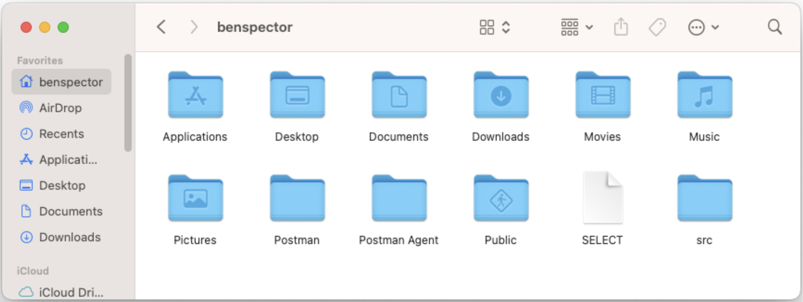
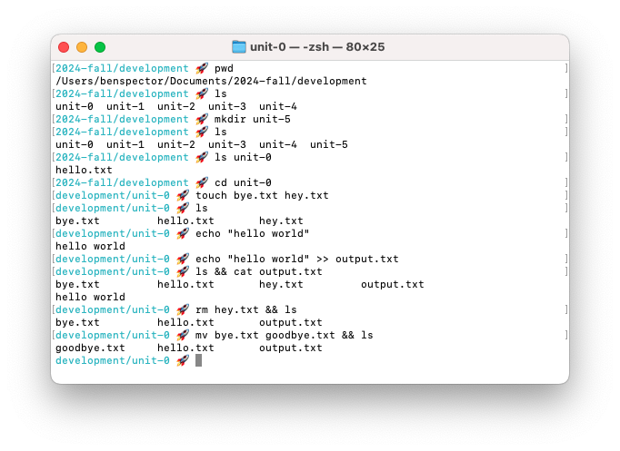
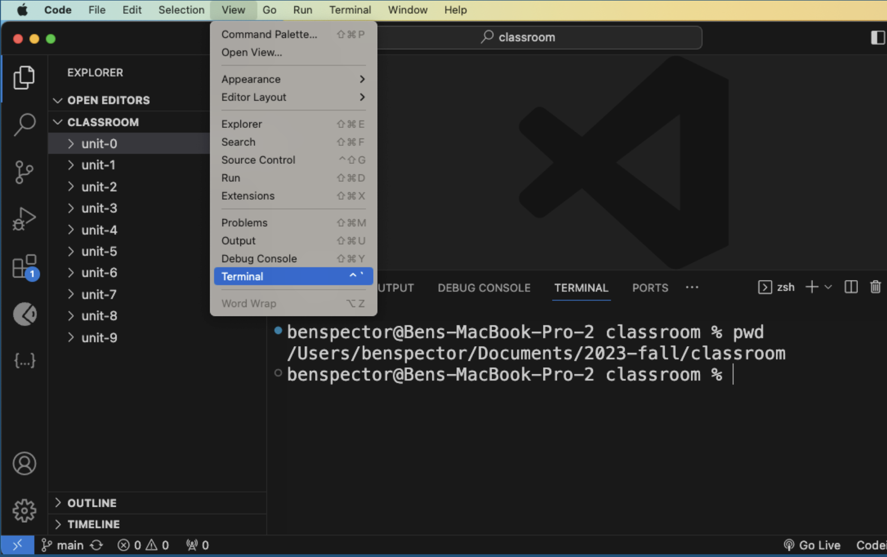
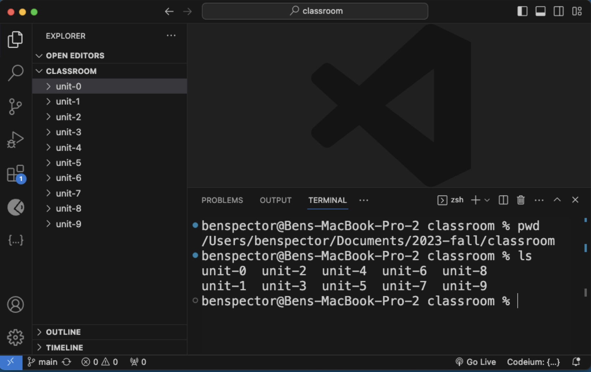
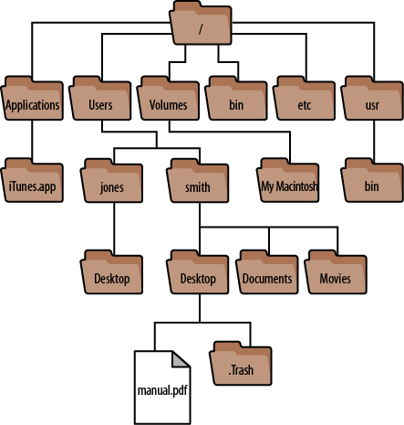
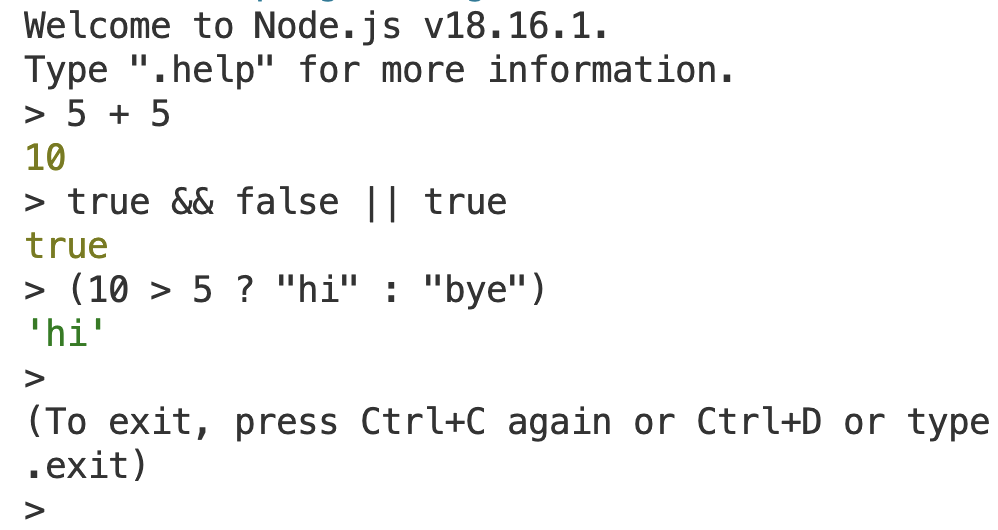

# Command Line Interfaces

* [Slides](1-clis.md#slides)
* [Overview](1-clis.md#overview)
* [Terminal vs. Finder/Explorer](1-clis.md#terminal-vs-finderexplorer)
* [Using the Terminal in VS Code](1-clis.md#using-the-terminal-in-vs-code)
* [Commands](1-clis.md#commands)
  * [Printing Directory Information with `pwd` and `ls`](1-clis.md#printing-directory-information-with-pwd-and-ls)
  * [Navigating Between Directories with `cd`](1-clis.md#navigating-between-directories-with-cd)
  * [Making Files and Directories with `mkdir` and `touch`](1-clis.md#making-files-and-directories-with-mkdir-and-touch)
  * [Executing JavaScript files with `node`](1-clis.md#executing-javascript-files-with-node)
  * [Terminating a Program with `Control+C`](1-clis.md#terminating-a-program-with-controlc)
* [Challenge](1-clis.md#challenge)

## Slides



## Overview

At the end of the day, a program is just a text file on a computer. So, before we begin programming, we need to learn how programmers create, organize, and otherwise manage the files on their computers.

In this lesson, we'll learn about the Terminal, a program for interacting with a computer's files and executing programs through a command line interface (CLI).

**Objectives**

You will be able to…

* Understand what a command line interface (CLI) is.
* Compare and Contrast CLIs and Graphical User Interfaces (GUIs)
* Navigate your local file tree
* Create, copy, delete, and move files and directories
* How to run a JavaScript program using your CLI
* Explain what an "argument" is

**Key Terms**

* **Terminal** — A program for interacting with a computer's files and executing programs through a command line interface.
* **Command Line Interface** — a type of user interface (UI) that let's a users perform actions by entering text-based commands.
* **Graphical User Interface** — a type of user interface that uses visual elements such as icons, buttons, windows, and dialog boxes, allowing users to perform actions such as clicking, drag-and-drop, and more.
* **Directory** — Another term for a "folder" in your computer that contains references to files or possibly other directories.
* **Command** - A single action to be performed on your computer. Examples include creating a new file, listing the contents of the current directory, navigating to a different directory, or executing a program.
* **Argument** — An additional piece of information provided to a command to change the command's behavior.
* **Node** — A program for executing JavaScript code directly on your computer (as opposed to in a browser).

**Important CLI commands**


**Note:** In the commands below, argument placeholders will be written like this: `<argument>`. When using these commands, replace the `<argument>` with your desired inputs, making sure to leave out the `<>` as well.


* `node <file_name.js>` — execute a given `.js` file using Node.
* `Control + C` — Terminate the currently running program
* `pwd` — Print the working directory, a.k.a where your terminal navigation currently is located.
* `ls` — Prints ("lists") the contents of the working directory
* `cd <directory>` — Change directories to the given directory
* `cd ../` — Change directories to the parent of the working directory
* `mkdir <dir_name>` — Make a new directory with the given name.
* `touch <file_name>` — Make a new file with the given name
* `cp <file> <dest>` — Move a file to the given directory

## Terminal vs. Finder/Explorer

As a programmer, you must become a master of the files on your computer. If you've ever dug into your computer's file system, you likely have done so using a program like Finder or Windows Explorer.



These applications allow you to manage files through a GUI (graphical user interface) — a user interface with buttons and icons that let you do things like click and drag-and-drop.

While these features are very beginner-friendly, they are often too slow for "power users" who want to perform more complex tasks or rapidly perform many repeated tasks.

Instead, programmers typically use a tool called the Terminal. The Terminal is a program for interacting with a computer's files and executing programs through a command line interface (CLI).



In the screenshot above, you can see this user entering commands:

```sh
pwd
ls
mkdir unit-5
ls
ls unit-0
cd unit-0
touch bye.txt hey.txt
ls
echo "hello world"
echo "hello world" >> output.txt
ls && cat output.txt
rm hey.txt && ls
mv bye.txt goodbye.txt && ls
```

See if you can interpret what each command is doing!

<details>



Use the <kbd>Tab</kbd> key to autocomplete commands and filenames! Just start typing and hit <kbd>Tab</kbd> to autocomplete.




<summary><strong>Q: Why use The Terminal?? It would be wayyy faster to do this in the Finder</strong></summary>

For this particular task it might be faster to use a GUI file manager like Finder, however there are many tasks where a CLI like the Terminal can outpace a GUI like Finder. In addition, there are some things that Finder simply can't do, like execute files with code.

</details>


## Using the Terminal in VS Code

While you can use the Terminal application that comes with your laptop, it is often just as convenient to use the one that comes built into your VS Code code editor.

To open up the Terminal panel, go to **File** > **Terminal** and it should show up at the bottom:



## Commands

Let's go through some of the most important and commonly used commands.

### Printing Directory Information with `pwd` and `ls`

A **directory** is another term for a "folder" in your computer's file system that contains references to files or possibly other directories.

The **working directory** is the current location of your terminal's navigation through that file system. Think of it as the "you are here" icon in a map.

The `pwd` command prints the full file path to the working directory while the `ls` command prints the contents of the working directory:




**Note:** In computing, most actions fall into one of the four categories called CRUD: **c**reating, **r**eading, **u**pdating, or **d**eleting data. Which of these actions do you think `pwd` and `ls` are?


### Navigating Between Directories with `cd`

The `cd <directory>` command allows you to move to another directory in the file system. However, unlike the previous commands, it requires an **argument**.

An **argument** is an additional piece of information that changes that behavior of a given command. For the `cd` command, we have to also provide a destination.

For example, suppose we were located in the `/Users` directory inside the following file system:



I could navigate to "down" to the `/Users/smith` directory with the command:

```
cd smith
```

You can also extend the directory provided with a `/` to quickly navigate to directories within directories. For example, if I were located in the `/Users` directory, I could navigate to the `/Users/smith/Documents` directory in one command:

```
cd smith/Documents
```

To navigate back "up" to the "parent" directory, you can use the special directory name `..` which always refers to the parent directory of the working directory.

For example, if I were in the directory `/Users/smith/Documents` and wanted to go back up to the `/Users/smith` directory, I could enter the command:

```
cd ..
```

If I had wanted to go up two levels from `/Users/smith/Documents` to `/Users`, I can again use `/` to extend the provided directory name:

```
cd ../..
```

<details>

<summary><strong>Suppose I were located in the <code>/Users/smith/Documents</code> directory, how could I navigate to the <code>/Users/jones/Desktop</code> directory in one <code>cd</code> command?</strong></summary>

```
cd ../../jones/Desktop
```

</details>

### Be Careful when using the `cd` command!

Using the `cd` command on its own will send you to the root of your entire file system. This is the equivalent of using the command:

```sh
cd ~
```

### Making Files and Directories with `mkdir` and `touch`

`mkdir <dir_name>` creates a new directory in the working directory

`touch <file_name>` creates a new file in the working directory. Make sure to include the file extension!


### Executing JavaScript files with `node`

A JavaScript program is any file with a `.js` extension, like `hello.js`

The code can be as simple as `console.log("Hello World")`

To run the program, use the command `node hello.js`

### Terminating a Program with `Control+C`

Many programs will end ("terminate") on their own when each statement has been executed.

Other programs can run forever, requiring us to stop them ourselves. For example, when we use the `node` command on its own, it will start the **Node REPL (Read, Evaluate, Print Loop)** program which just waits for Javascript input, executes it, and then prints the result:



To terminate the program, use the keyboard shortcut `Control+C` (you may need to cancel twice).

### Unfinished Double Quotes and `echo`

Another common occurrence is an unfinished string. You can test this with the `echo` command which will print a given string straight to the terminal.


You can also use the output from an `echo` command and send the output into another file using the `>>` append operator.

For example, this command will take the text `"hello world"` and append it to the file `output.txt` (it will create `output.txt` if it doesn't exist)

```sh
echo "hello world" >> output.txt
```

### Combining Commands with `&&` and the `cat` command

The `cat` command is used to read the contents of a given file.

You can combine any two commands with the `&&` operator.

```sh
ls && cat output.txt
```

For example, the command above lists the contents of the current working directory and print the contents of `output.txt`

### Removing, Renaming, and Copying

`rm <file_name>` removes a file from the working directory

`rm -r <directory_name>` removes a directory and all of its contents from the working directory. `-r` stands for "recursive".

`mv <file_name> <new_file_name>` renames a file in the working directory or allows you to move the file to another directory.

`cp <file_name> <dir_name>` copies a file into a directory.

## Challenges

Check out these [awesome challenges](https://github.com/mssalvatore/command-line-challenges) for additional practice. A lot of these challenges go way beyond what we've learned in this lesson and will push you to research and learn on your own!

</details>


