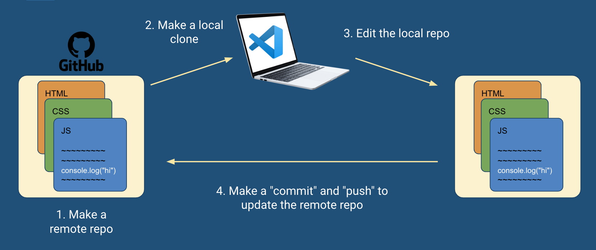

# Git & GitHub

- [Slides](#slides)
- [Overview](#overview)
- [What is a Repository?](#what-is-a-repository)
  - [1. Create A Repository On GitHub](#1-create-a-repository-on-github)
  - [2. Make A Local Clone Of The Repository](#2-make-a-local-clone-of-the-repository)
  - [3. Edit In VS Code](#3-edit-in-vs-code)
  - [4. Prepare Changes In The Staging Area](#4-prepare-changes-in-the-staging-area)
  - [5. Commit Changes To The Local Repository](#5-commit-changes-to-the-local-repository)
  - [6. Push Commits To the Remote Repository (GitHub)](#6-push-commits-to-the-remote-repository-github)
- [Commit History](#commit-history)
- [Git: What Is It? Why Use It?](#git-what-is-it-why-use-it)
- [GitHub: What is It? Why Use It?](#github-what-is-it-why-use-it)

<!-- ## Watch -->
<!--  -->

## Slides



## Overview

Imagine you're working on a paper. You've got all of your drafts saved in a folder and it looks something like this:

- `My First Draft.txt`
- `First revisions.txt`
- `Final.txt`
- `Final 2.txt`
- `Final 3.txt`
- `Final (this is it).txt`
- `Final (Okay now this is the real one).txt`
- `Final (This is it. final answer).txt`

Sound familiar? Managing versions of the same files can be tricky, but in this lesson, we'll learn how software engineers manage the changes to their project using a tool called Git. We'll also they can back up and share their projects online using the closest thing to a social network for programmers, GitHub.

**Objectives**

You will be able to…
* Learn what a repo is
* Differentiate between local and remote repos
* Create a remote repository on Github
* Know the steps of the Git workflow

**Key Terms**

* **Git** — A "version control system" that allows us to manage the history of changes made to a repo.
* **Repository (or just "repo")** — A collection of files pertaining to a single project.
* **Local Repository** — A repository stored on a developers computer.
* **Remote Repository** — A repository stored online on a service like GitHub.
* **Github** — An online host of git repositories with tools for managing git projects and features for collaboration.
* **Clone** — Copy a remote repo's files and commit history and store them locally (creates a local repository)
* **Staging Area** — A place to temporarily store changed files to include in the next commit.
* **Commit** — A "snapshot" of the changes made to a repo. A commit is typically created when a key milestone is reached in a project (e.g. a feature is completed).
* **Push** — Send a local repo's commit history to a remote repo to be synchronized.
* **Pull** — Download a remote repo's files and commit history to be synchronized locally.

**Important Git commands**


**Note:** In the commands below, argument placeholders will be written like this: `<argument>`. When using these commands, replace the `<argument>` with your desired inputs, making sure to leave out the `<>` as well.


* `git clone`
* `git status`
* `git add`
* `git commit`
* `git push`
* `git pull`

## What is a Repository?

As mentioned above, a program is just a text file. And managing programming files can be tricky, particularly when you're constantly changing them.To address this problem, software engineers store their code in **repositories (a.k.a "repos")**.

A **repository (repo)** is a collection of files relating to a single project. Sounds like a folder right?

But unlike normal folders, repositories provide a few benefits:
* They can be **synchronized** between a **remote** source (somewhere online like Github) and a **local** source (on your computer).

By storing the project code in two places (on GitHub and locally), 
The workflow looks something like this:

1. Create a repository on GitHub
2. Make a local clone of the repository
3. Edit in VS Code
4. Make commits and "push" to update the remote repository (GitHub)

### 1. Create A Repository On GitHub
### 2. Make A Local Clone Of The Repository
### 3. Edit In VS Code
### 4. Prepare Changes In The Staging Area
### 5. Commit Changes To The Local Repository
### 6. Push Commits To the Remote Repository (GitHub)

## Commit History

## Git: What Is It? Why Use It?

## GitHub: What is It? Why Use It?