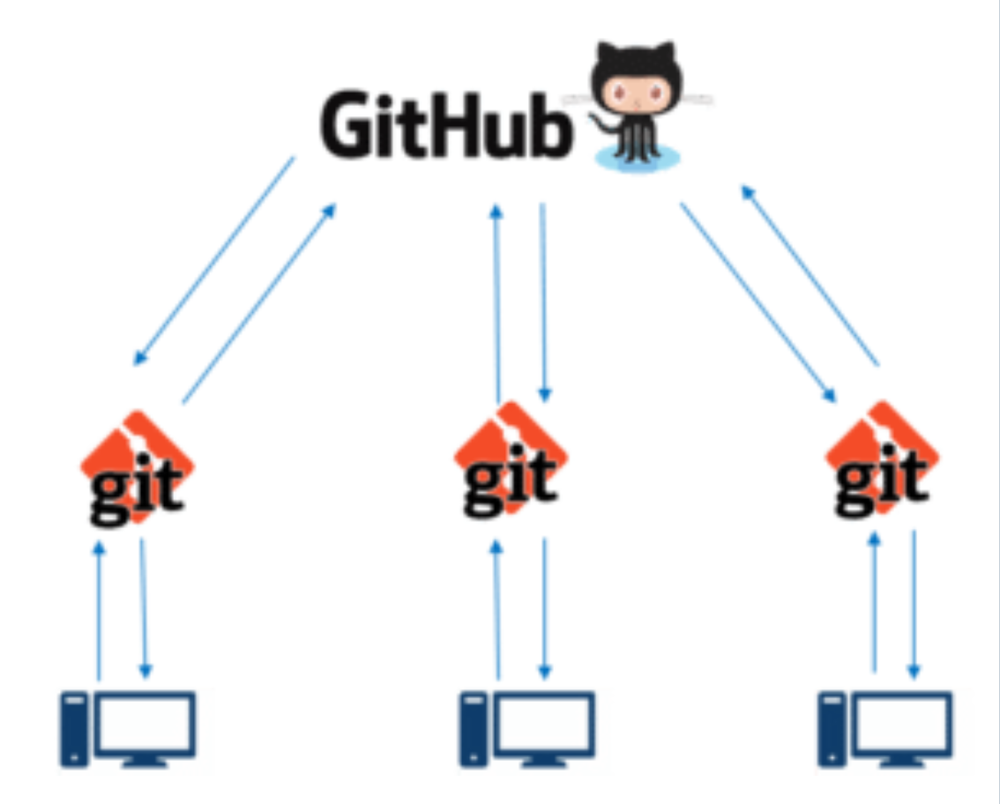
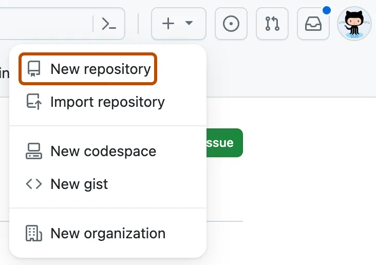
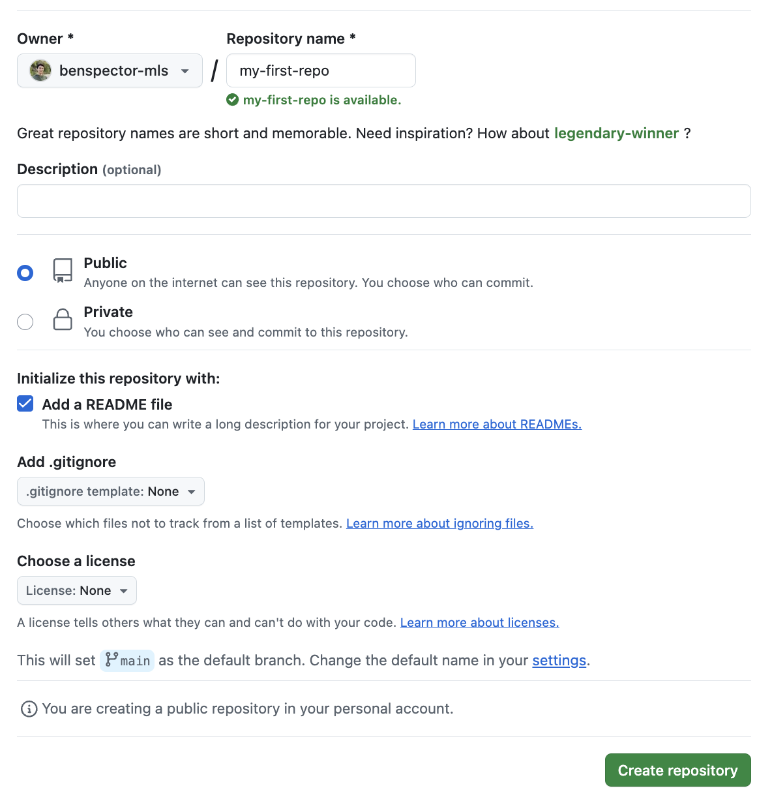
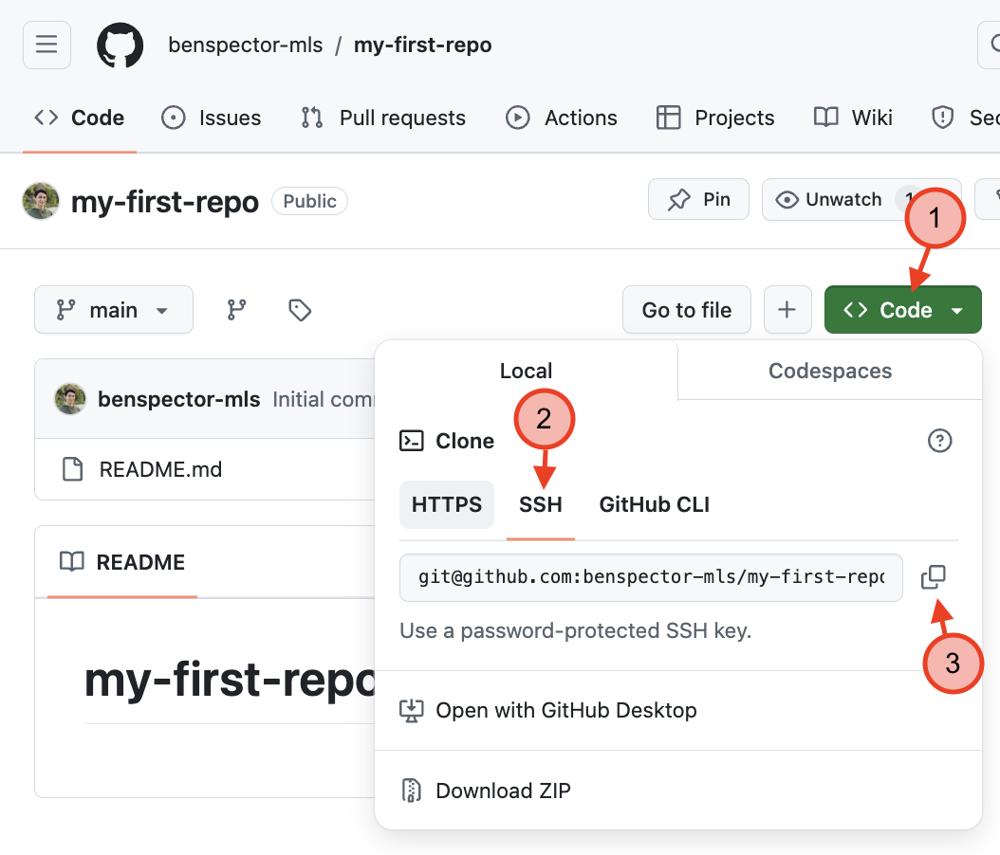
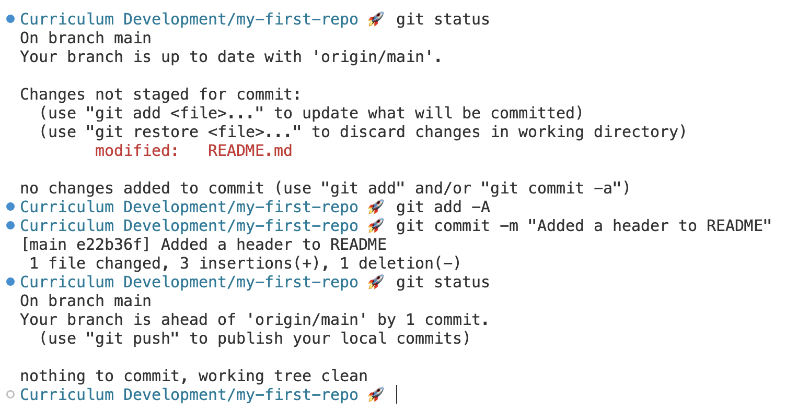
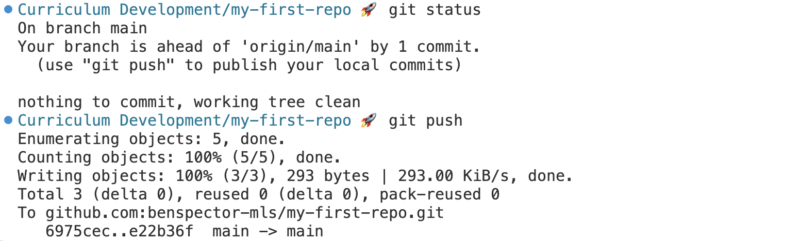
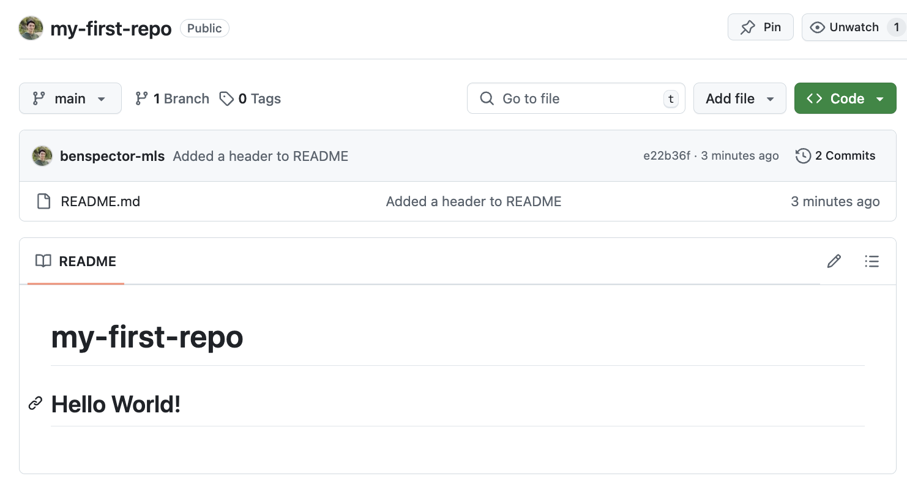

# Git & GitHub

* [Slides](2-git-github.md#slides)
* [Overview](2-git-github.md#overview)
* [Introduction: Managing Files Can Be Tricky](2-git-github.md#introduction-managing-files-can-be-tricky)
* [What is a Git Repository?](2-git-github.md#what-is-a-git-repository)
  * [Git Workflow](2-git-github.md#git-workflow)
  * [`git init` and `git status`](2-git-github.md#git-init-and-git-status)
  * [`git add`, `git commit`, and `git log`](2-git-github.md#git-add-git-commit-and-git-log)
* [GitHub: What is It? Why Use It?](2-git-github.md#github-what-is-it-why-use-it)
  * [GitHub Workflow](2-git-github.md#github-workflow)
  * [1. Create A Repository On GitHub](2-git-github.md#1-create-a-repository-on-github)
  * [2. Make A Local Clone Of The Repository with `git clone`](2-git-github.md#2-make-a-local-clone-of-the-repository-with-git-clone)
  * [3. Use the normal Git Workflow](2-git-github.md#3-use-the-normal-git-workflow)
  * [4. Upload local commits to GitHub with `git push`](2-git-github.md#4-upload-local-commits-to-github-with-git-push)
* [Summary](2-git-github.md#summary)

## Slides



## Overview

Managing versions of the same files can be tricky, but in this lesson, we'll learn how software engineers manage the changes to their project using a tool called Git. We'll also they can back up and share their projects online using the closest thing to a social network for programmers, GitHub.

**Objectives**

You will be able to…

* Learn what a repo is
* Differentiate between local and remote repos
* Create a remote repository on Github
* Know the steps of the Git workflow

**Key Terms**

* **Repository (or just "repo")** — A collection of files pertaining to a single project.
* **Git** — A "version control system" that allows us to manage the history of changes made to a repo.
* **Commit** — A "snapshot" of the changes made to a repo. A commit is typically created when a key milestone is reached in a project (e.g. a feature is completed).
* **Staging Area** — A place to temporarily store changed files to include in the next commit.
* **Github** — An online host of git repositories with tools for managing git projects and features for collaboration.
* **Local Repository** — A repository stored on a developers computer.
* **Remote Repository** — A repository stored online on a service like GitHub.
* **Clone** — Copy a remote repo's files and commit history and store them locally (creates a local repository)
* **Push** — Send a local repo's commit history to a remote repo to be synchronized.

**Important Git commands**


**Note:** In the commands below, argument placeholders will be written like this: `<argument>`. When using these commands, replace the `<argument>` with your desired inputs, making sure to leave out the `<>` as well.


* `git init`
* `git status`
* `git add`
* `git commit`
* `git clone`
* `git push`

## Introduction: Managing Files Can Be Tricky

Imagine you're working on a paper. You've got all of your drafts saved in a folder and it looks something like this:


Sound familiar? You don't want to delete them in case you want to go back to an older version. So what else can you do?

Even for programmers managing different versions of files can be tricky, particularly when you're constantly changing them. To address this problem, software engineers store their code in **Git repositories**.

## What is a Git Repository?

A **repository (or repo)** is a central location where data is stored and managed. Every folder with files can be considered a repository.

A **Git repository** is one that makes use of the **version control system** called **Git**.

Version control systems, like Git, maintain a history of every change made to a repo. These changes, called **commits**, are snapshots of a project's code after the completion of a feature.


<details>

<summary><strong>Q: What are the benefits of maintaining a commit history like this?</strong></summary>

Developers can revert to previous versions of their project if they need to (for example, if a feature is not working as expected).

</details>

### Git Workflow

Using git in a project involves moving our code between three phases:

1. The working directory (where we are editing files)
2. The staging area (where we temporarily store changes before committing them)
3. The repository (where we store our committed changes)


<details>

<summary><strong>Q: What is the point of temporarily storing changes before committing them?</strong></summary>

Check out [this StackOverflow post which does a great job of explaining!](https://stackoverflow.com/questions/49228209/whats-the-use-of-the-staging-area-in-git)

</details>


### `git init` and `git status`

To use Git in a project, we can start by turning the project into a Git repository with the command `git init`. We can then make changes and use `git status` to see what changes have been made:


1. In the Terminal, we navigated to a folder ran `git init`, turning the folder into a Git repository.
2. The `git status` command can be used at any time to see what changes have been made to the repository. At first, we can see that the repo has no changes.
3. The `echo` command combined with the `>` operator creates a new file called `myfile.txt` with the text `"insert text here"`
4. After the `ls` and `git status` commands, we can see that the `myfile.txt` file has been created.

### `git add`, `git commit`, and `git log`

One we have changes that we want to save in the repository, we use the `git add` command to "stage" the changes and `git commit` to save those changes!


1. In the Terminal, we use `git add myfile.txt` to move the `myfile.txt` file into the staging area.
2. `git status` shows us that `myfile.txt` is ready to be committed.
3. `git commit -m "added myfile.txt"` saves the changes to the repository with a message describing the change: `"added myfile.txt"`
4. `git status` now shows that all changes have been committed
5. Finally, `git log` shows that our new commit has been added to the commit history!

## GitHub: What is It? Why Use It?

While maintaining a Git repo is a great way to keep track of changes on your own computer, what if we wanted to share the project with others? Or perhaps work on the project on a different computer? Do we upload the files to Google Drive or email them to ourselves?

These options work, but almost every developer uses **GitHub**.



**GitHub** is like a social network for developers, making it easy to backup, share and collaborate on projects.

So, how do we use GitHub?

### GitHub Workflow

Storing our repos on GitHub involves a few setup steps...

1. Create a new repo on GitHub. We call this a **remote repository**. This is the equivalent to using `git init`.
2. **Clone** (copy) the repo from GitHub onto our own computer. Now we have a **local repository** that is linked to the remote repository.

After setup, whenever we want to make changes to the repo we:

3. Use the normal git workflow (make changes › `git add` › `git commit`)
4. After making commits on our local repository, we **push** the changes to the remote repository.


Let's practice this:

### 1. Create A Repository On GitHub

Instead of using the `git init` command to create a _local repository_. We're going to start by creating a _remote repository_.

In the upper-right corner of any page, select +, then click **New repository**.



Choose an owner of the repository (you) and give the repository a name.


Make sure to check the **Add a README file** box.


Then click **Create repository**.



### 2. Make A Local Clone Of The Repository with `git clone`

After setting up the repo, you should be brought to the repo's page on GitHub. Click on the **Code** button (1), make sure to select **SSH** (2), and then click on the **copy** button (3) to copy the git clone url beginning with `git@github.com:...`.



Then, back in your Visual Studio Code terminal, run the command:

```sh
git clone <pasted git clone url>
```

For example, it could look like this:

```sh
git clone git@github.com:benspector-mls/my-first-repo.git
```


Wherever your VC Code terminal is, the repository will be downloaded. If you want to clone the repository to a different location, you need to first change the directory you're in using `cd` before using `git clone`.


### 3. Use the normal Git Workflow

Now that you have cloned the repository, you can use the same Git workflow as above:

1. Make edits (for example, edit the `README.md` file)
2. Save your code
3. Use `git add -A` to add ALL changes to the staging area.
4. Use `git commit -m "commit message"` to commit those changes to your local repository

### 4. Upload local commits to GitHub with `git push`

Now here comes the fun part.



In the example above, notice how the first `git status` says

```
On branch main
Your branch is up to date with 'origin/main'.
```

But the last `git status` says

```
On branch main
Your branch is ahead of 'origin/main' by 1 commit.
  (use "git push" to publish your local commits)
```

Your local repository (on your computer) and your remote repository (on GitHub) are out of sync because I have a commit that exists locally but not on GitHub.

To upload the local commits to GitHub, run the command `git push`.



If we look at the repo on GitHub, we should see the latest commit message and the updated `README.md` file!



For future changes, repeat steps 3 and 4!

## Summary

So, in summary, Git and GitHub are invaluable tools in the toolkit of a software developer that make managing projects and versions easier!

**Git** is a "version control system" that allows us to manage the history of changes made to a repo.

**Github** is an online host of git repositories with tools for managing git projects and features for collaboration.

Together, we can manage code in **local repositories** and sync them with **remote repositories**.


The one command in this diagram that we didn't cover is `git pull`. We'll learn more about this in the next lesson!

Happy coding!
