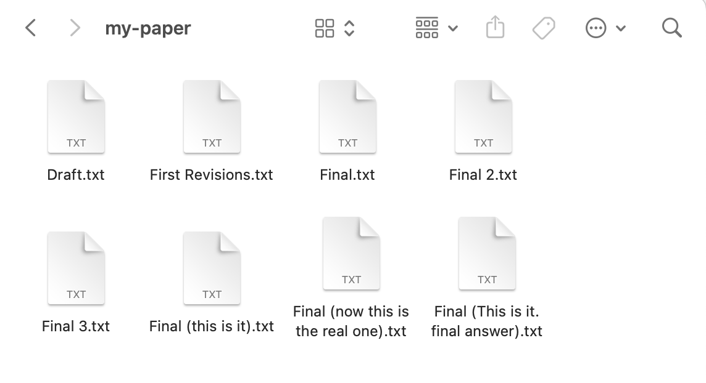
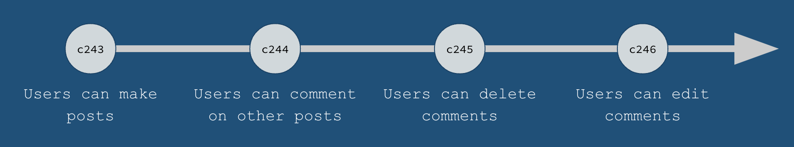
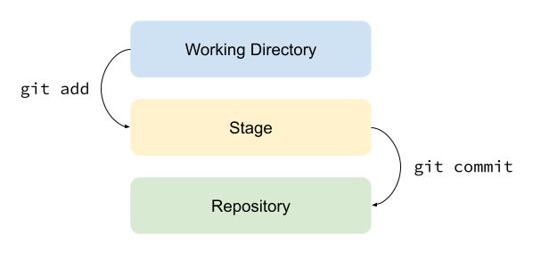
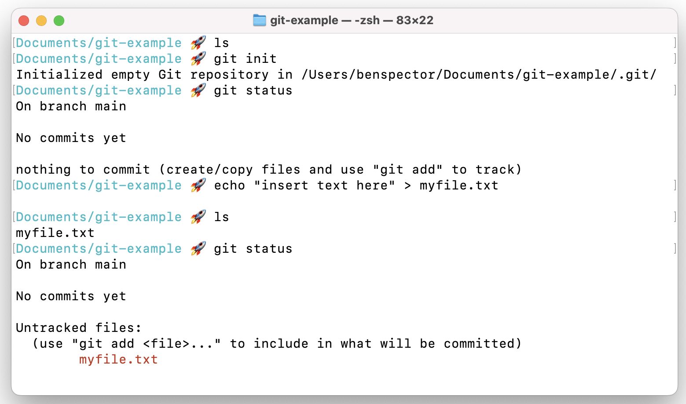
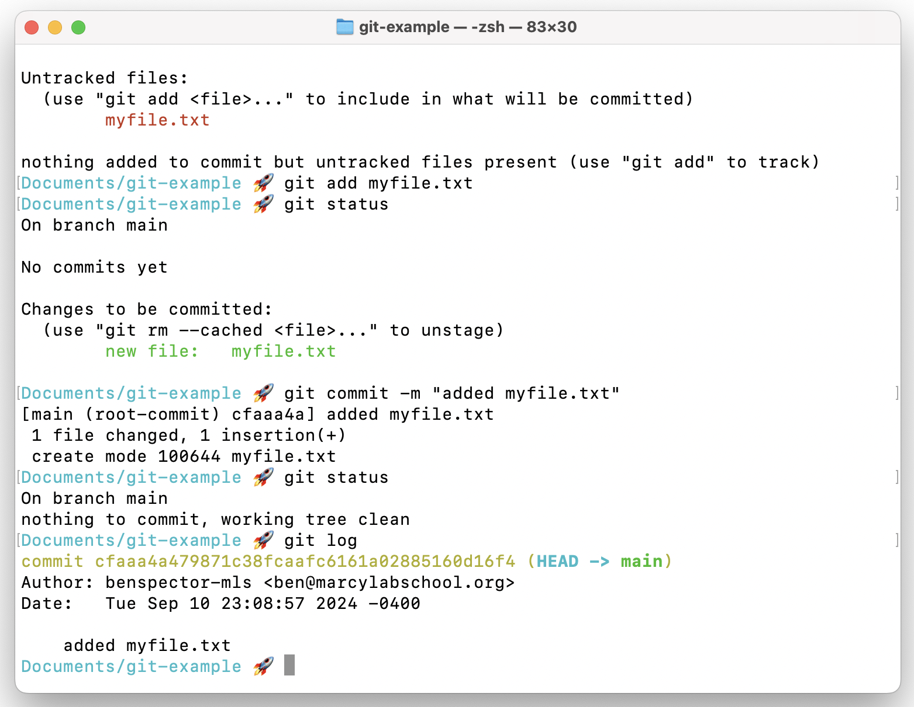
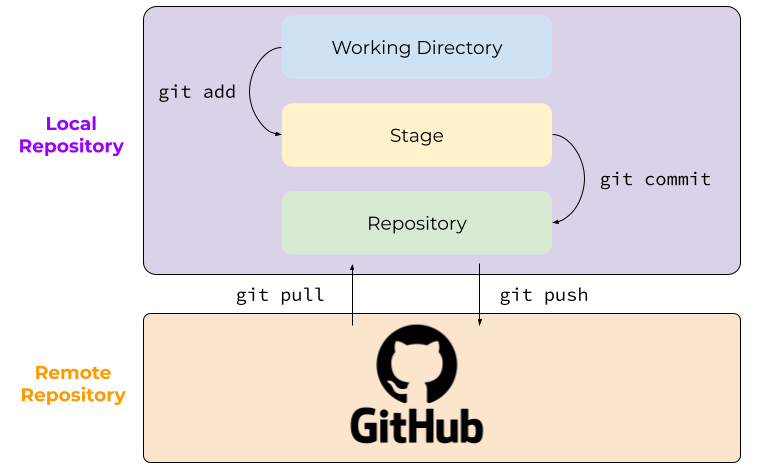

# Git & GitHub

- [Slides](#slides)
- [Overview](#overview)
- [Introduction: Managing Files Can Be Tricky](#introduction-managing-files-can-be-tricky)
- [What is a Git Repository?](#what-is-a-git-repository)
- [Git Workflow](#git-workflow)
  - [`git init` and `git status`](#git-init-and-git-status)
  - [`git add`, `git commit`, and `git log`](#git-add-git-commit-and-git-log)
- [GitHub: What is It? Why Use It?](#github-what-is-it-why-use-it)
- [Git \& GitHub Workflow](#git--github-workflow)
  - [1. Create A Repository On GitHub](#1-create-a-repository-on-github)
  - [2. Make A Local Clone Of The Repository](#2-make-a-local-clone-of-the-repository)
  - [3. Edit In VS Code](#3-edit-in-vs-code)
  - [4. Prepare Changes In The Staging Area](#4-prepare-changes-in-the-staging-area)
  - [5. Commit Changes To The Local Repository](#5-commit-changes-to-the-local-repository)
  - [6. Push Commits To the Remote Repository (GitHub)](#6-push-commits-to-the-remote-repository-github)

<!-- ## Watch -->
<!--  -->

## Slides



## Overview

Managing versions of the same files can be tricky, but in this lesson, we'll learn how software engineers manage the changes to their project using a tool called Git. We'll also they can back up and share their projects online using the closest thing to a social network for programmers, GitHub.

**Objectives**

You will be able to…
* Learn what a repo is
* Differentiate between local and remote repos
* Create a remote repository on Github
* Know the steps of the Git workflow

**Key Terms**

* **Git** — A "version control system" that allows us to manage the history of changes made to a repo.
* **Repository (or just "repo")** — A collection of files pertaining to a single project.
* **Local Repository** — A repository stored on a developers computer.
* **Remote Repository** — A repository stored online on a service like GitHub.
* **Github** — An online host of git repositories with tools for managing git projects and features for collaboration.
* **Clone** — Copy a remote repo's files and commit history and store them locally (creates a local repository)
* **Staging Area** — A place to temporarily store changed files to include in the next commit.
* **Commit** — A "snapshot" of the changes made to a repo. A commit is typically created when a key milestone is reached in a project (e.g. a feature is completed).
* **Push** — Send a local repo's commit history to a remote repo to be synchronized.
* **Pull** — Download a remote repo's files and commit history to be synchronized locally.

**Important Git commands**


**Note:** In the commands below, argument placeholders will be written like this: `<argument>`. When using these commands, replace the `<argument>` with your desired inputs, making sure to leave out the `<>` as well.


* `git clone`
* `git status`
* `git add`
* `git commit`
* `git push`
* `git pull`

## Introduction: Managing Files Can Be Tricky

Imagine you're working on a paper. You've got all of your drafts saved in a folder and it looks something like this:

Sound familiar? You don't want to delete them in case you want to go back to an older version. So what else can you do?

Even for programmers managing different versions of files can be tricky, particularly when you're constantly changing them. To address this problem, software engineers store their code in **Git repositories**.

## What is a Git Repository?

A **repository (or repo)** is a central location where data is stored and managed. Every folder with files can be considered a repository.

A **Git repository** is one that makes use of the **version control system** called **Git**.

Version control systems, like Git, maintain a history of every change made to a repo. These changes, called **commits**, are snapshots of a project's code after the completion of a feature.

**

Q: What are the benefits of maintaining a commit history like this?
**
> Developers can revert to previous versions of their project if they need to (for example, if a feature is not working as expected).

## Git Workflow

Using git in a project involves moving our code between three phases:
1. The working directory (where we are editing files)
2. The staging area (where we temporarily store changes before committing them)
3. The repository (where we store our comitted changes)

### `git init` and `git status`

To use Git in a project, we can start by turning the project into a Git repository with the command `git init`. We can then make changes and use `git status` to see what changes have been made:

1. In the Terminal, we navigated to a folder ran `git init`, turning the folder into a Git repository.
2. The `git status` command can be used at any time to see what changes have been made to the repository. At first, we can see that the repo has no changes.
3. The `echo` command combined with the `>` operater creates a new file called `myfile.txt` with the text `"insert text here"`
4. After the `ls` and `git status` commands, we can see that the `myfile.txt` file has been created.

### `git add`, `git commit`, and `git log`

One we have changes that we want to save in the repository, we use the `git add` command to "stage" the changes and `git commit` to save those changes!

1. In the Terminal, we use `git add myfile.txt` to move the `myfile.txt` file into the staging area.
2. `git status` shows us that `myfile.txt` is ready to be committed.
3. `git commit -m "added myfile.txt"` saves the changes to the repository with a message describing the change: `"added myfile.txt"`
4. `git status` now shows that all changes have been committed
5. Finally, `git log` shows that our new commit has been added to the commit history!

## GitHub: What is It? Why Use It?

While maintaing a Git repository is a great way to keep track of changes on your own computer, what if we wanted to share the project with others? Or perhaps work on the project on a different computer?

Git repositories are also often synchronized between a **remote** source (somewhere online like **Github.com**) and a **local** source (on your computer). This allows developers to easily share and collaborate on projects.

Online remote repositories, like **Github** make sharing and collaborating on projects easy.

On GitHub, developers can...
* View public repositories
* Comment on new changes
* Download repositories
* Contribute new code to repositories
* Get feedback on their additions
* Submit suggestions for improvements
* And more!

## Git & GitHub Workflow

When working with `GitHub`, we will introduce three new commands:
1. `git clone` to create a local copy of a remote repository
2. `git pull` to download changes from the remote repository
3. `git push` to push upload changes to the remote repository

### 1. Create A Repository On GitHub
### 2. Make A Local Clone Of The Repository
### 3. Edit In VS Code
### 4. Prepare Changes In The Staging Area
### 5. Commit Changes To The Local Repository
### 6. Push Commits To the Remote Repository (GitHub)