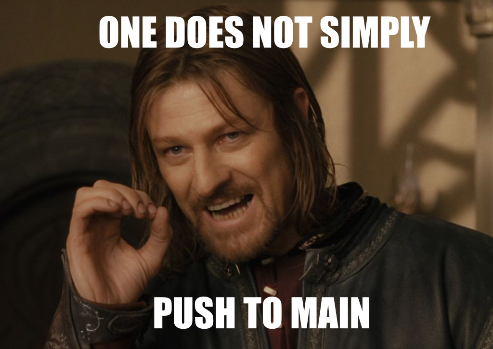
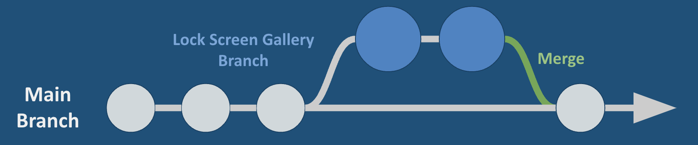

# Git Branching & Merging

- [Slides](#slides)
- [Overview](#overview)
- [Part I: Collaborating on a GitHub Repository](#part-i-collaborating-on-a-github-repository)
  - [`git pull` synchronizes local repositories](#git-pull-synchronizes-local-repositories)
  - [Creating a Merge Conflict](#creating-a-merge-conflict)
  - [Handling Merge Conflicts](#handling-merge-conflicts)
- [Part II: Branches](#part-ii-branches)
  - [Keep the Main Branch Stable](#keep-the-main-branch-stable)
- [Collaborating with Branches](#collaborating-with-branches)


<!-- ## Watch -->
<!--  -->

## Slides




## Overview

GitHub enables developers across the world to collaborate on projects. In this lesson, we'll learn how to use GitHub to create and manage branches, merge branches, create pull requests, and resolve merge conflicts.

**Objectives**

You will be able to…
* Pull changes from a repository
* Define the terms "branch" and "merge" as they relate to git
* Create a branch through the Github GUI and the CLI.
* Fork a repository.
* Create a pull request.
* Resolve merge conflicts through the Github GUI and CLI.

**Key Terms**

* **Branch** — a copy of a repository at a point in time that allows developers to work on a feature without impacting the rest of the project.
* **'origin/main'** — a nickname used by Git to refer to the main branch of the remote repository.
* **Merge** - to combine two or more branches into one
* **Pull Request** — a request for another developer to pull down your branch and review your code. If they approve the changes, they will merge your branch into the main branch!
* **Merge Conflict** — a situation in which two or more branches need to be merged but have modified the same lines of code, causing the merge to fail. This happens all the time and can be resolved through the Github GUI or the CLI.
* **Fork** — a copy of a repository that is disconnected from the main repository. Typically they include the entire commit history of the main repository at the time the fork was created.

**Important Git commands**


**Note:** In the commands below, argument placeholders will be written like this: `<argument>`. When using these commands, replace the `<argument>` with your desired inputs, making sure to leave out the `<>` as well.


* `git pull` — download changes from a remote repository
* `git branch <branch_name>` — create a new branch
* `git checkout <branch_name>` — switch to a branch
* `git merge <branch_name>` — merge a branch into the current branch
  
## Part I: Collaborating on a GitHub Repository

An app published to the App Store (or Play Store, I see you Android users) is essentially the same as a repository uploaded to GitHub. Just like downloading an app, anyone download a repo from GitHub using the `git clone` command.


And just like the App Store, anyone can download a GitHub repo (as long as its public), not just the creator of the repo. 

To demonstrate this, find a partner (or simply play the role of two developers). Then do the following:

1. Have one developer create a new repo called **git-pulling-practice**. Make sure it includes a `README.md` file
2. The owner of the repo should then go into the settings of the repo, go to Collaborators, and add their partner as a collaborator using their GitHub username. Then, share the URL with their partner.
3. Have both developers use their VS Code Terminal to navigate to their `unit-0` folder and clone the repo onto their computers using `git clone`
   * If working solo, clone the repo a second time but rename the second copy. You can do this by adding an additional input to the `git clone` command for the new name, resulting in something like this: `git clone <git_repo_url> git-pulling-practice-copy`.
4. Have both developers navigate into the repo using the `cd` command.
   * If working solo, I would recommend opening two VS Code Terminal windows for this, navigating each terminal to one of the copies of the repo so that you can easily switch back and forth between "developer 1" (the first clone) and "developer 2" (the second clone). 

Tada! Now you have the same repository on two computers! 

### `git pull` synchronizes local repositories

In the last lesson, you learned about the `git push` command which uploads a local repository's commits to the remote repository (GitHub). `git pull` does the opposite. If the remote repository on GitHub has commits that the local repository does not, `git pull` will download those commits.


By storing repositories remotely on GitHub, any number of developers can have access to a single repository, and this push and pull mechanism is essential for collaboration. 

Let's put this into practice. With your partner:

1. Have the developer who first created the repo on GitHub make some edits to `README.md`.
2. That same developer should then stage their changes (`git add README.md`), commit (`git commit -m "description of commit"`) and then push that commit (`git push`)!
3. Double check on GitHub that the commit shows up on the remote repository's commit history.
4. **Now, the second developer should run the command `git pull`** (if working solo, switch over to the location of the second copy of the repo and run `git pull`)

### Creating a Merge Conflict

However, this doesn't always work as intended. To demonstrate how things can go wrong, let's return to our activity.

In the first part of the activity, only one developer was making changes, while the other developer simply "pulled down" those changes. But what if both developers want to work simultaneously?

For this next part, it is going to be a race, so get your typing fingers ready!

1. Have both developers run `git pull` just to make sure that their local repository is in sync with the remote. This is a good habit to practice. 
2. Have both developers open up the `README.md` file and replace the content on line 1 with their own name. **This is the most important step. It is essential that both developers edit the same line of code**
3. Have both developers stage their changes (`git add README.md`), commit (`git commit -m "description of commit"`) and then push that commit (`git push`)!
4. Chaos

Whichever developer managed to push their changes first (or has a better internet connection) will have no problem pushing their code. However, the developer who pushed second will be given this message:


When you use `git push`, you are adding your local commit history to the remote repository's commit history. However, the developer who pushed second is missing the commits from their partner! They *could* try to "force" their push through by running `git push -f` but this would delete their partner's commit! Use this command with caution.

In order to keep the commit history in tact, as the message suggests, they should run `git pull`.


But another issue arises called a **Merge Conflict**:

```
Auto-merging README.md
CONFLICT (content): Merge conflict in README.md
Automatic merge failed; fix conflicts and then commit the result.
```

### Handling Merge Conflicts

Okay take a deep breath. Merge conflicts are often scary when they are first encountered, but they happen all the time and are an entirely expected part of the development process!

**Merge conflicts** occur when two developers edit the same lines of code in the same repo and unsuccessfully merge those changes together, as happened here.

VS Code provides a nice UI to help us resolve the conflict:


Let's break down what we see here:
* The three markers: `<<<<<<< HEAD`, `=======`, and `>>>>>>> b737ff...` are markers outlining two conflicting pieces of code
* The "current change" is the code in my local repo
* The "incoming change" is the code that I'm trying to merge into my local repo.

To resolve this conflict we can:
1. Use the buttons that VS Code provides:
   * "Accept Current Change" — replace the code from the remote with your code.
   * "Accept Incoming Change" — replace your code with the code from the remote.
   * "Accept Both Changes" — keep both!
   * "Compare Changes" — see the changes side by side
2. Alternatively, we can just delete the markers and keep the code you want to keep!
3. Once you've made your choice, save the file, stage the changes, commit them, and push the changes. 
   * Typically, you can use the commit message `"resolving merge conflicts"`


## Part II: Branches

Every repository's commit history has what is called a **"main branch"** or **"trunk"**. This is the original version of the repository and whenever anyone visits a repository and clones it down, this is what they will see.

Up until now, we've been pushing our commits entirely to the main branch. But as they say...



### Keep the Main Branch Stable

A **branch** is a copy of the repository at a point in time. Branches allow developers to work on a feature without impacting the main branch.



Branching ensures that the main branch is always a "stable" version. That is, if someone were to look at the repo, they can look at the main branch and know that it is fully functional. 

Meanwhile, developers can make multiple commits to their branch and only merge the completed feature into the main branch when they are done. 

Essentially, every time you merge, you create a new version!

## Collaborating with Branches

Branches also enable teammates to work in parallel without getting in the way of each other! 


When multiple teammates merge, it often causes merge conflicts, but this is expected and normal.
