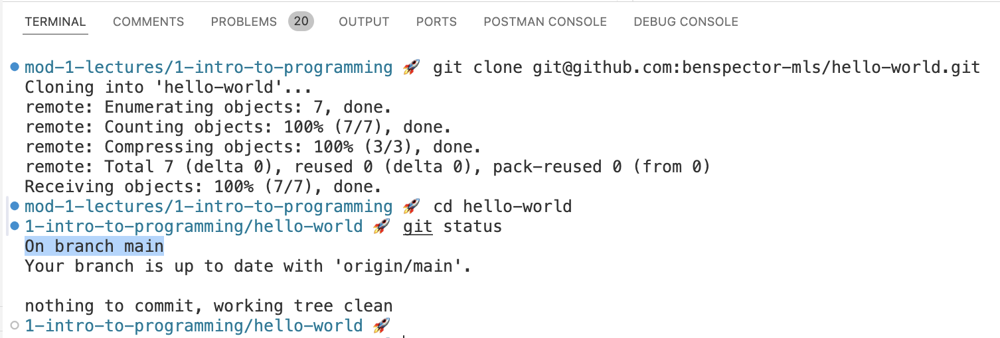
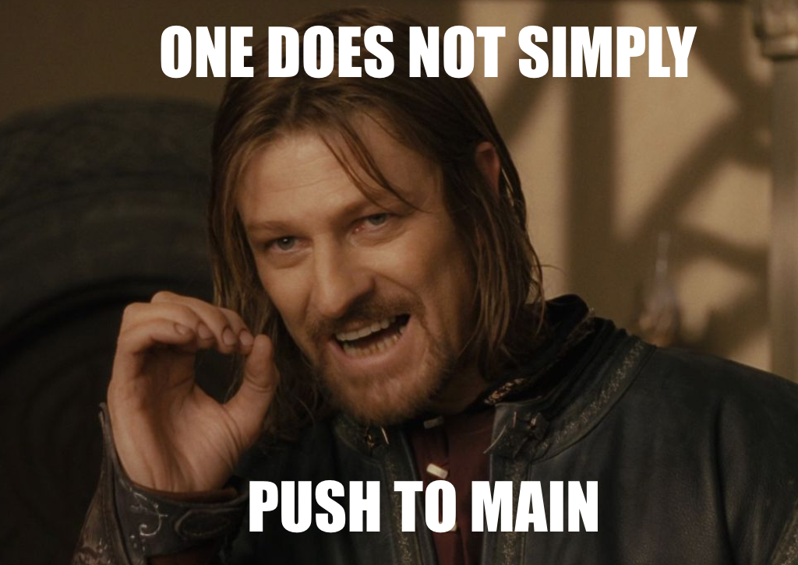
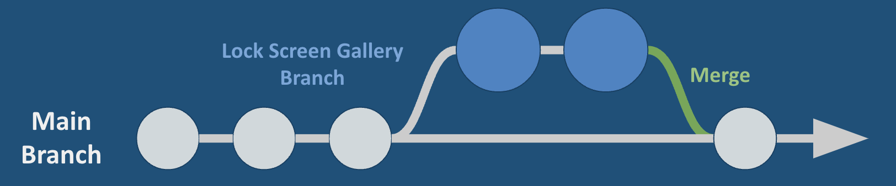
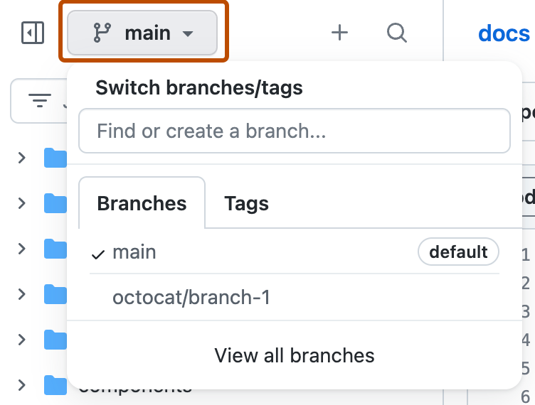
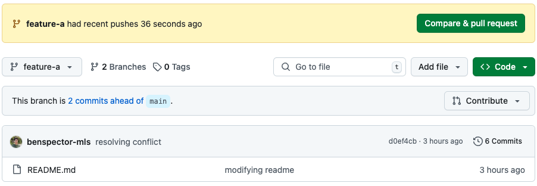
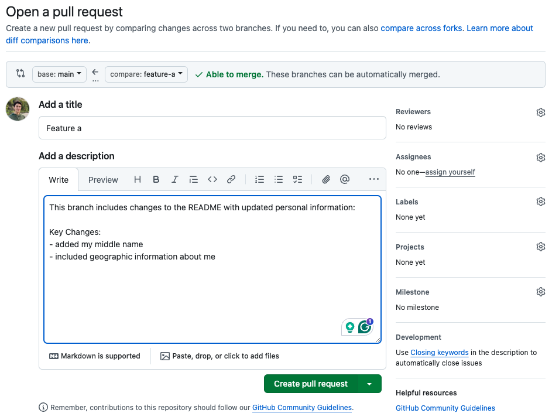
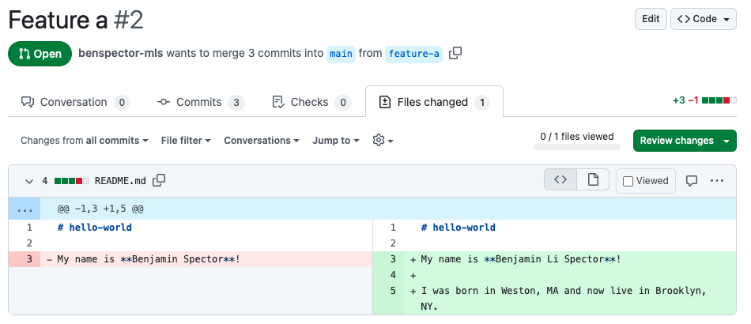
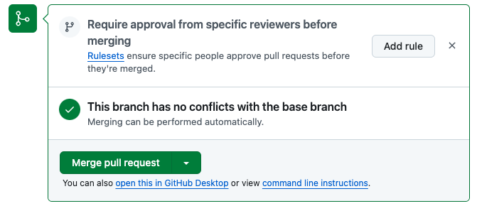
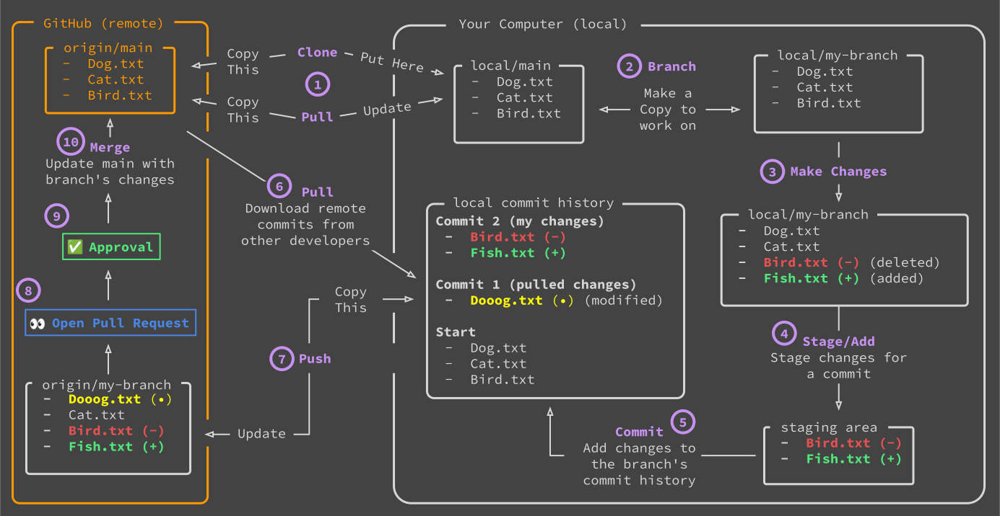

# Git Branching

- [Slides](#slides)
- [Overview](#overview)
- [Intro to Branches](#intro-to-branches)
  - [Keep the Main Branch Stable](#keep-the-main-branch-stable)
  - [Commands for Working with Branches](#commands-for-working-with-branches)
  - [Pull Requests and Code Review](#pull-requests-and-code-review)
  - [Don't Forget to Pull!](#dont-forget-to-pull)
- [How Teams Collaborate Using Branches](#how-teams-collaborate-using-branches)
- [Summary](#summary)


<!-- ## Watch -->
<!--  -->

## Slides




## Overview

GitHub enables developers across the world to collaborate on projects. In this lesson, we'll learn how to use GitHub to create and manage branches, merge branches, create pull requests, and resolve merge conflicts.

**Objectives**

You will be able to…
* Define the terms "branch" as it relates to git
* Create a branch through the Github GUI and the CLI.
* Create a pull request.
* Resolve merge conflicts through the Github GUI
* Fork a repository.

**Key Terms**

* **Main Branch** — The main branch of a repository. Whenever anyone visits a repository on GitHub or clones it down, this is what they will see.
* **Feature Branch** — a copy of a repository at a point in time that allows developers to work on a feature without impacting the rest of the project.
* **Merge** - to combine the commit history of two or more branches into one.
* **Pull Request** — a request for another developer to pull down your branch and review your code. If they approve the changes, they will merge your branch into the main branch!
* **Fork** — a copy of a repository that is disconnected from the main repository. Typically they include the entire commit history of the main repository at the time the fork was created.

**Important Git commands**


**Note:** In the commands below, argument placeholders will be written like this: `<argument>`. When using these commands, replace the `<argument>` with your desired inputs, making sure to leave out the `<>` as well.



```sh
git branch # see all branches in the local repository
git branch <branch_name> # create a new branch
git checkout <branch_name> # switch to a branch
git checkout main # switch to the main branch
git merge <branch_name> # merge a branch into the current branch
git branch -D <branch_name> # delete a branch 
```

## Intro to Branches

Every repository's commit history has what is called a **"main branch"** or **"trunk"**. Whenever anyone visits a repository on GitHub or clones it down, this is what they will see.



Up until now, we've been pushing our commits directly to the main branch. But as they say...



**<details><summary>Q: Why might pushing to main be a bad idea?</summary>**
> As mentioned above, whenever someone views the repository or clones it down, they will see the main branch. If we were to push changes to the main branch and those changes included mistakes (bugs), other developers would see those mistakes! And, well, that just wouldn't look very good.
> 
> If instead we could save our changes somewhere else until were sure that everything worked, that would be much better!
</details>

### Keep the Main Branch Stable

Rather than pushing our code to the main branch, we can create a separate **feature branch**!

A **feature branch** is a copy of the main branch at a point in time and allows developers to work on a feature without impacting the main branch. Branches can be saved on GitHub and are only merged into the main branch when a feature is completed.



Branching ensures that the main branch is always a "stable" version. That is, if someone were to look at the repo, they can look at the main branch and know that it is fully functional. Every merge represents a successful addition of a new feature.

**<details><summary>Q: How is branching similar to cloning?</summary>**
> When the repository is cloned, the local clone can be edited without affecting the remote repository, just like a feature branch  can be edited without affecting the main branch.
> 
> Pushing commits in the local repository to the remote repository is similar to merging a feature branch with the main branch.
</details>

### Commands for Working with Branches

In order to use branches in a project, we will introduce the following commands, typically in this order:

```sh
git branch # see all branches in the local repository
git branch <branch_name> # create a new branch
git checkout <branch_name> # switch to a branch

# make changes, add, commit, push
# this will add your branch to GitHub
# you may need to set an "upstream" remote branch for your branch
```


Use the `-b` flag with `git checkout` to create a new branch and switch to it in one line!
```sh
git checkout -b <branch_name>
``` 


Try these commands out for yourself! After you push your branch to GitHub, you should be able to see the new commit on the main branch as well as the new branch in the list of branches on GitHub.



### Pull Requests and Code Review

Now we have our code on GitHub in two branches: `main` and our new feature branch.

In the professional world, before we merge ANYTHING into the `main` branch, there is an additional step called **Code Review** in which another developer (typically an Engineering Manager) reviews new code and either accepts or rejects the changes.

After pushing an updated branch to GitHub, a notification will appear on the repository page with a call to action: "Compare and pull request".



A **pull request** (PR) is a request for another developer to review their branch and either merge the branch or request modifications.

When creating a PR, include a description of the changes so that reviewers can quickly provide feedback.



The Files Changed tab lets you see the lines of each file that were added, removed, or modified. You can also leave comments and provide a detailed review.



If everything looks good, you can merge the pull request directly on GitHub!



After merging, it is up to you if you want to delete the branch or keep working on it.

### Don't Forget to Pull!

A common step that developers of all levels forget is to return to their local repository and pull down the latest changes from GitHub.

```sh
git checkout main # switch to the main branch
git pull # download the latest commits from GitHub
```

This is a good practice to perform whenever you start a new programming session to ensure your `main` branch is always up to date.

## How Teams Collaborate Using Branches

When working on a project on your own, using branches is a good idea, but not always required. For example, if a project is just a personal project and you're not concerned about other people seeing a broken main branch, you can get away with pushing to main.

However, when working on teams, branching is a must. It does add some complexity to the process but the protection of the main branch is of the utmost importance.

Check out the process here:



* We're now dealing with two local repositories, each with their own branch (we'll call them `feature-x` and `feature-y`).
* The process for the first developer is mostly the same as if they were working solo!
  1. `git checkout -b feature-x` to create and switch to a new feature branch.
  2. Make changes, add, commit, and push their branch to GitHub.
  3. Make a PR and merge it!
  4. Return to your local repository and `git pull`.
* The second developer needs to do a bit more. They will perform the same first two steps. Then, they will need to:
  1. `git checkout main` and `git pull` to download the latest commits from GitHub.
  2. `git checkout feature-y` and `git merge main` to update their feature branch's commit history. 
  3. It is possible that merge conflicts occurred so resolve them and add, commit, and push!
  4. Make a PR and merge it!
  5. Return to your local repository and `git pull`.
* The first developer can now `git checkout main` and `git pull` to download the latest commits from GitHub.
  

**<details><summary>Q: Why does Developer 2 first merge the `main` branch into the `feature-y`? </summary>**
> This is all for the sake of ensuring our managers approve our PR! A PR with merge conflicts is unlikely to be approved.
> 
> When we merge the `main` branch into the `feature-y` branch, we deal with any merge conflicts in the feature branch before pushing our code to GitHub and making a PR
>
> This way, our PR will not have any merge conflicts and can be seamlessly merged!
</details>

## Summary

In this lesson, we learned how to create and manage branches in a project, and how to create a pull request!

The diagram below illustrates the entire process:



There are 10 steps in this process:
1. Clone or Pull from GitHub
2. Create a new local branch
3. Make changes
4. Stage/Add those changes
5. Commit
6. Pull and handle merge conflicts
7. Push the branch to GitHub
8. Open a Pull Request (PR)
9. Get the PR reviewed and approved
10. Merge the PR!