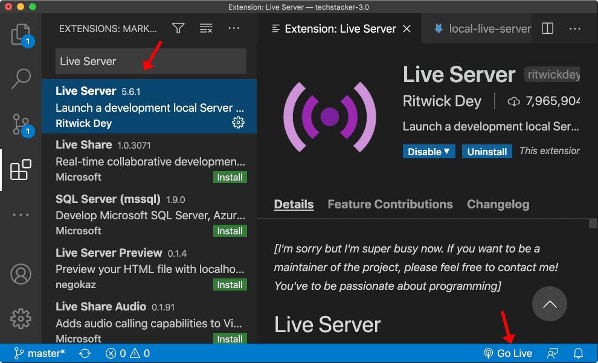

# ESModules


Follow along with code examples [here](https://github.com/The-Marcy-Lab-School/2-3-3-esmodules)!


- [Terms](#terms)
- [Loading JavaScript into our HTML](#loading-javascript-into-our-html)
  - [DOMContentLoaded](#domcontentloaded)
  - [Dealing with Multiple JavaScript Files](#dealing-with-multiple-javascript-files)
- [Remember Node Exports and Imports?](#remember-node-exports-and-imports)
  - [Importing and Exporting with ESModules](#importing-and-exporting-with-esmodules)
  - [CORS](#cors)
  - [Live Server To the Rescue!](#live-server-to-the-rescue)
- [Challenge](#challenge)

## Terms

* **ESModules** — the syntax for organizing code into modules in the browser.
* **Cross-Origin Resource Sharing (CORS)** — a security feature implemented by web browsers to restrict webpages from making requests to a different domain than the one that served the original web page. 
* **Server** — a computer that shares its resources over the internet. A user's computer acts as the **"client"** and requests resources from the server using the `https://` protocol (the hypertext transfer protocol). 
* **Development Server** — a server used in development to test and iterate on an application before publishing it.
* **Live Server** — a tool for starting a development server.


## Loading JavaScript into our HTML

So far, if we want our web applications to execute JavaScript code, we add a `script` tag to the end of the `body` of our HTML:

```html
<body>
  <h1>Hello World!</h1>
  <script src="./index.js"></script>
</body>
```

Then, we can run code like this:

```js
const main = () => {
  const h1 = document.querySelector('h1')
  h1.textContent = 'Coding is the best';
}

// Execute the main function upon loading this script
main();
```

**<details><summary>Q: Why do we put the script at the end of the body?</summary>**

Because our JavaScript uses the Elements in the body. If those Elements haven't loaded yet, we can't referenced them! We'll get errors like this:

```error
Uncaught TypeError: Cannot set properties of null (setting 'textContent')
```

</details>

### DOMContentLoaded

Organization is always important when programming and the organization of our application would be improved if we could put `script` tags within the `head`. The logic behind this is that our `script` isn't adding any visible content to our `body`. CSS files are linked in the `head` too, after all.

```html
<head>
  <!-- other meta tags + scripts -->
  <script src="./index.js"></script>
</head>
<body>
  <!-- Visible content -->
</body>
```

However, with the `script` in the `head`, we will get errors since our JavaScript attempts to access elements that have not yet loaded. 

The original solution to this was to wait for the HTML content to finish loading by adding an event listener to our JavaScript:

```js
// Executes immediately
console.log("hello from index.js");

const main = () => {
  const h1 = document.querySelector('h1')
  h1.textContent = 'Coding is the best';
};

// Only execute main once the DOM content has been loaded
document.addEventListener('DOMContentLoaded', main);
```

Here, we attach an event listener to the `document` that waits for all of the DOM content to load before invoking our `main` function.

This lets us put the `<script>` in the `<head>` which means the browser will start loading that file but won't run it until the DOM is complete.

**<details><summary>Q: Is it still possible for us to have errors in our app?</summary>**

Yes! If you accidentally put some DOM code outside of the safety of the `main` function.

```js
console.log("hello from index.js");

const h1 = document.querySelector('h1')

const main = () => {
  h1.textContent = 'Coding is the best';
  // ^ this will throw an error because h1 was declared before the content was loaded
};

document.addEventListener('DOMContentLoaded', main);
```

</details>

### Dealing with Multiple JavaScript Files

Suppose I wanted to load more JavaScript files. Like this one which declares a `posts` variable with data about posts that I want to render:


```javascript
// this is a global variable
const posts = {
  "dd1286de": {
    id: "dd1286de",
    caption: "the cutest cat in the world",
    src: "https://images.unsplash.com/photo-1529778873920-4da4926a72c2?w=800&auto=format&fit=crop&q=60&ixlib=rb-4.0.3&ixid=M3wxMjA3fDB8MHxzZWFyY2h8Mnx8Y3V0ZSUyMGNhdHxlbnwwfHwwfHx8MA%3D%3D"
  },
  // ... more objects like this one
};
```


And this one which renders posts from the file above:


```javascript
const renderPosts = () => {
  const postsContainer = document.querySelector('#posts-container');

  Object.values(posts).forEach((post) => {
    const li = document.createElement('li');
    const img = document.createElement('img');
    const caption = document.createElement('p');

    li.id = post.uuid;
    img.src = post.src;
    img.alt = post.caption;
    caption.textContent = post.caption;

    li.append(img, caption);
    postsContainer.append(li);
  });
}
```


To utilize this code, we just add `<script>`s for each file:

```html
<head>
  <!-- The order matters! -->
  <script src="./posts.js"></script>
  <script src="./dom-helpers.js"></script>
  <script src="./index.js"></script>
</head>
```

What happens is that the variable `posts` and the function `renderPosts` are added to the "global namespace" and can be referenced anywhere in subsequent files.

But this is an error prone process and will quickly become problematic if we add more and more files. If we just swap the order of the scripts in HTML, we will get an error.

```html
<head>
  <!-- other meta tags -->
  <script src="./index.js"></script>
  <script src="./dom-helpers.js"></script>
  <script src="./posts.js"></script>
</head>
```

We need a better solution.

## Remember Node Exports and Imports?

In Node, we can share code by exporting using `module.exports` syntax:


```javascript
const posts = {
  "dd1286de": {
    id: "dd1286de",
    caption: "the cutest cat in the world",
    src: "https://images.unsplash.com/photo-1529778873920-4da4926a72c2?w=800&auto=format&fit=crop&q=60&ixlib=rb-4.0.3&ixid=M3wxMjA3fDB8MHxzZWFyY2h8Mnx8Y3V0ZSUyMGNhdHxlbnwwfHwwfHx8MA%3D%3D"
  },
  // more objects
};

// use a default export
module.exports = posts;
```


And then we can import it using `require()`:


```javascript
const posts = require('./posts.js')

console.log(posts);
```


### Importing and Exporting with ESModules

In the browser, we need to use a different syntax called **ESModules**. To enable this functionality, we have to make a few changes.

Start by adding a `type="module"` to our `<script>`. We can also remove the other scripts since we'll be importing their code via JavaScript:

```html
<head>
  <!-- We only need to load the "entry point". Each file will manage its own imports. -->
  <script type="module" src="./index.js"></script>
</head>
```

Then, we can export values as "default exports" using the `export default value` syntax:


```javascript
const posts = {
  "dd1286de": {
    id: "dd1286de",
    caption: "the cutest cat in the world",
    src: "https://images.unsplash.com/photo-1529778873920-4da4926a72c2?w=800&auto=format&fit=crop&q=60&ixlib=rb-4.0.3&ixid=M3wxMjA3fDB8MHxzZWFyY2h8Mnx8Y3V0ZSUyMGNhdHxlbnwwfHwwfHx8MA%3D%3D"
  },
  // more objects
};

// use a default export with ESModules syntax
export default posts;
```


We can import that export default into `dom-helpers` and export a named function `renderPosts`:


```javascript
// Import the default export of posts.js and call it `posts`
import posts from './posts.js'

// Put the `export` keyword to export a "named export"
export const renderPosts = () => {
  // ...
}
```


And finally we can import the named `renderPosts` function into `index.js`


```javascript
// Use curly braces to import a "named export"
import { renderPosts } from './dom-helpers.js'

const main = () => {
  document.querySelector('h1').textContent = 'Coding is the best';
  renderPosts();
}

// We don't need the event listener anymore. Modules automatically wait for the content to load!
main();
```


Try to open this and... you'll run into an error :(

### CORS

The **Cross-Origin Resource Sharing (CORS)** policy is a security feature implemented by web browsers to restrict webpages from making requests to a different domain than the one that served the original web page. 

For some reason, when you open a file using the `file://` protocol (local file system) and attempt to access a resource from any other location (including your own file system), it will consider it to be a different origin. 


To get around this, **we need to serve our `html` file using the `http://` protocol from a Server, not from our file system**. This helps the browser see that all of the files are coming from the same origin.

([Learn more about CORS here](https://developer.mozilla.org/en-US/docs/Web/HTTP/CORS)).

### Live Server To the Rescue! 

A **server** is just a computer that shares its resources over the internet. A user's computer acts as the **"client"** and requests resources from the server using the `https://` protocol (the hypertext transfer protocol). 

When we visit a URL, like [https://www.google.com](https://www.google.com), our browser converts the **Domain Name** (`google.com`) into the **IP Address** of the server computer where the code for Google lives. Then, our computer sends a **request** to that server computer over the internet and the server sends a **response**.


However, we only get to this point once we **deploy** our project on a **server hosting service**. Until that point, we need to simulate this HTTP request and response cycle using a **development server** like **Live Server**. 

With a development server, our computer acts as both the client and the server.

**Do the following to add live server to your environment**:
* Go to the VS Code Extension library and find Live Server. Install it.
* Open your `index.html` file and click on the **Go Live** button in the bottom right corner of your screen



Running your web app through a local development server will allow you to simulate a more typical web environment with `http://` or `https://` protocols, which should prevent CORS issues during testing.

## Challenge

Take the example to the next level and insert a form to enable a user to add a new post to this page! Improve the appearance and layout of the page by modifying the styles.