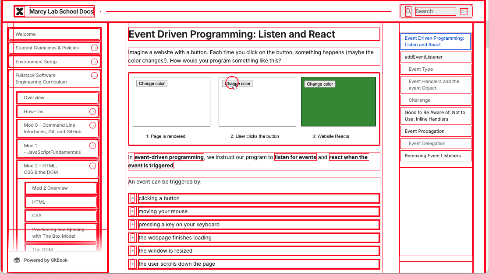
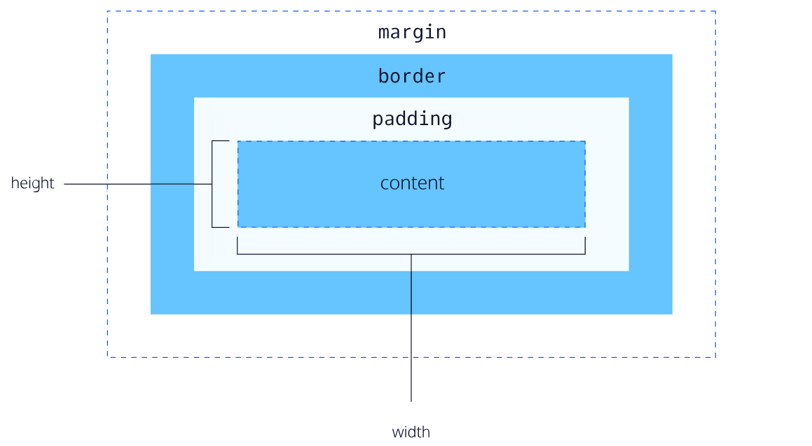
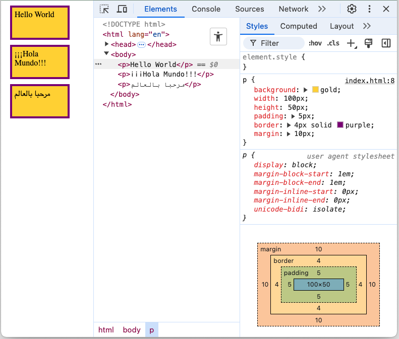
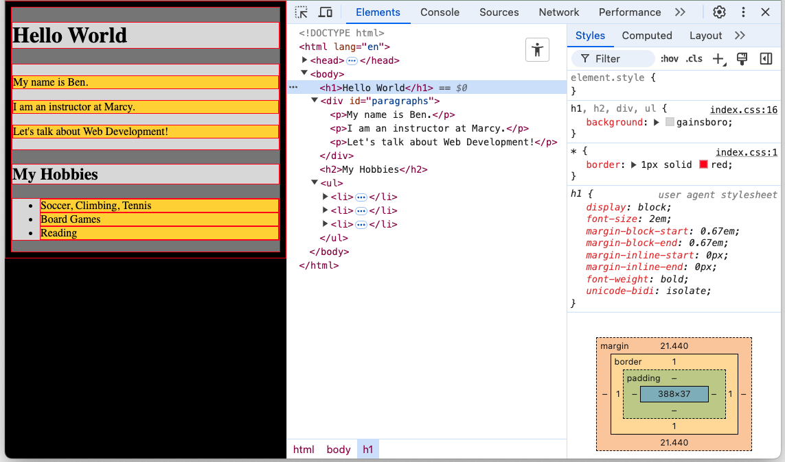

# The Box Model and Positioning


Follow along with code examples [here](https://github.com/The-Marcy-Lab-School/2-3-0-box-model-display-positioning)!


**Table of Contents**
- [Web Design: Everything is a Box](#web-design-everything-is-a-box)
- [Box Model](#box-model)
  - [Sizing is Based on the Content Box](#sizing-is-based-on-the-content-box)
  - [Box Model Defaults and a CSS Reset](#box-model-defaults-and-a-css-reset)
- [Display and Position](#display-and-position)
  - [Display](#display)
  - [Position](#position)
- [Tricks for Centering things](#tricks-for-centering-things)
  - [Text Align Center](#text-align-center)
  - [Margin Auto](#margin-auto)
  - [Flexbox](#flexbox)

## Web Design: Everything is a Box

You are a new web developer and you want to learn how to make pretty websites, right?

The first rule to understanding web design is that **in an HTML website, everything is a box**.



This becomes immediately clear when you add this CSS rule to a page:

```css
/* All elements have a 1px solid red border */
* {
  border: 1px solid red;
}
```

Knowing that everything is a box, we must start by learning how to control those boxes.

## Box Model

The **box model** defines the size and spacing of any element and it consists of 4 parts:



* The **content** — the space that the content of an element occupies (the text of a `<p>` tag, the image of an `img` tag, etc...)
  * Content can be modified with the `width` and `height` properties.
* The **padding**  — the space around the content but inside the border. This is the "background" of the content.
  * Padding can be modified with the `padding` property.
* The **border** — the space around the padding.
  * Border can be modified with the `border` and `border-radius` properties.
* The **margin** — the space around the border and "between" adjacent elements.
  * Margin can be modified with the `margin` property.
  * Note: Margin is always transparent and the margins of adjacent elements can overlap.

For example, consider the following styles applied to `p` elements:

```css
p {
  /* Adding a background helps us see the different parts of the box model */
  background: gold;

  /* Box Model Properties */
  width: 100px;
  height: 50px;
  padding: 5px;
  border: 4px solid purple;
  margin: 10px;
}
```

Resulting in the output below:




**Tip:** View your styles using the developer tools! Clicking on an element in the **Elements** tab will pull up the CSS applied to that element in the **Styles** sub-tab.


### Sizing is Based on the Content Box

An important detail to note is that the `width` and `height` properties affect the **content box**. As a result, by default, the total space that an element occupies is not the same as its `width` and `height`.

**<details><summary>Question: What is the total width and height of the paragraph elements in the example above (excluding the margins)?</summary>**

The total width excluding the margins is 100 + 10 + 8 or 118 (the sum of the content, the padding, and the border).

The total height excluding the margins is 50 + 10 + 8 or 68 (the sum of the content, the padding, and the border).
</details>

Now, Imagine you had a screen that was `1000px` wide and you needed to fit 5 elements perfectly inside that space. However, each element includes `10px` of padding and a `2px` border. 

**<details><summary>Question: What would the `width` property need to be?</summary>**
The answer is `176px`. We take `1000px` and divide it by 5 to get `200px` for each element. Then, we need to also subtract the padding and border from both sides (`200px` minus `20px` of padding minus `4px` of border).
</details>

We can greatly simplify this by changing the `box-sizing` of an element:

```css
p {
  background: gold;

  box-sizing: border-box;
  /* Now, width and height are the total width and height */
  width: 100px;
  height: 50px;
  padding: 5px;
  border: 4px solid purple;
  margin: 10px;

}
```

The `box-sizing: border-box` style makes it so that the `width` and `height` properties _include_ the padding and border.

As a result, the size of the content box shrinks so that the total width and height of the "border box" matches the `width` and `height` properties.

Learn more here: https://css-tricks.com/box-sizing/

**<details><summary>Question: What would the `width` property need to be with `box-sizing: border-box`?</summary>**

If we set `box-sizing: border-box` the answer is `200px`! 

</details>

### Box Model Defaults and a CSS Reset

Consider the website below which can be found in the `1-box-model-basics` folder. 

You can see the HTML structure contains some common HTML elements like `h1`, `h2`, `p`, `div`, `ul`, and `li`. To help see the where each element's box begins and ends, we've added `background` colors to each element and a `border` to all elements:



In the **Styles** panel of our developer tools, the browser has applied some default styles via the **user agent stylesheet**. For example, the `h1` element has these styles:

```css
/* User Agent Stylesheet */
h1 {
    display: block;
    font-size: 2em;
    margin-block-start: 0.67em;
    margin-block-end: 0.67em;
    margin-inline-start: 0px;
    margin-inline-end: 0px;
    font-weight: bold;
    unicode-bidi: isolate;
}
```

As you can see if you poke around in the example, most elements have some default `margin` and `padding` styles which can conflict with any styling that we want to apply. 

To address this, it is common to define a **CSS Reset** rule that eliminates those default styles:

```css
* {
  /* Remove the default margin and padding applied to many elements, giving us full control over spacing */
  margin: 0px;
  padding: 0px;

  /* Makes `width` apply to the border box (padding and content are included) */
  box-sizing: border-box;
}

ul {
  list-style: none;
}
```

In addition to resetting the `margin` and `padding` for all elements to `0px`, we change the `box-sizing` property to `border-box`.

I also like to remove bullets from `ul` elements.

## Display and Position

### Display
* Notice how the `div` and `p` tags each get a new line, but the `a` and `img` tags are in the same line? 
* That's because their `display` is different:

| Display Type            | New Line? | Accepts Height / Width?                    | When To Use                                                       | Default Elements |
| ----------------------- | --------- | ------------------------------------------ | ----------------------------------------------------------------- | ---------------- |
| `display: block;`       | Yes!      | Yes!                                       | When you want things on a new line.                               | Most things!     |
| `display: inline`       | No        | No (but accepts horizontal padding/margin) | For inserting an element within an existing line of text content. | span, b, i, a    |
| `display: inline-block` | No        | Yes!                                       | Buttons in a navigation bar!                                      | None             |
| `display: none`         | N/A       | N/A                                        | To completely remove an element from view.                        | None             |


See what happens when you assign each type of `display` to `div` an `a` and an `img` tag! 


### Position
We can also directly control positioning of our elements on the page through "position." This is a very powerful, **but very finicky tool**.

Use this [interactive documentation on MDN](https://developer.mozilla.org/en-US/docs/Web/CSS/position) to play around with it.

- `position: static`
  - Elements render in normal document flow and no offset values can move statically positioned elements
- `position: relative`
  - Elements are positioned relative to their normal position
  - Offset properties like `top`, `right`, `bottom`, `left`, etc. can move elements from their original spot
  - Other content flows around the *original* position

- `position: absolute`
  - Elements removed from normal document flow, and other elements will be able to fill that space
  - Positioned relative to nearest positioned ancestor.
    - This is important, as if the parent isn't `absolute` or `relative` then the child will be positioned relative to the entire body
    - I've included a parent div for the two rectangles exactly for this reason, so experiment with adding/removing `relative` to i

- `position: fixed`
  - Behaves like absolute positioning, except its positioned to the viewport

- `position: sticky`
  - this will behave like `relative` until you scroll past it, then it will stick on the top bottom or sides
  - Finicky, be careful about parents blocking it

## Tricks for Centering things

### Text Align Center

* For text, the most straightforward way to center is with the `text-align: center;` property:

```css
h1 {
  text-align: center;
}
```

* Keep in mind that **this will center the text within the parent container**! If the parent container is not the full width of the screen, then the text will not appear centered.

### Margin Auto

* Most `block` level elements will automatically take 
* When an element's width, it can be centered by using the `margin-inline: auto;` property to equally "push away" from both the left and the right side of the screen:

```css
div {
  /* assuming that this div does not stretch across the full width of the screen */
  width: 200px;

  /* Push away from both sides equally */
  margin-inline: auto;
}
```

* This will auto-increment the side margins to make sure they are even and the item is centered horizontally on the page.


### Flexbox

* We'll learn much more about Flexbox in the future, but it is an excellent tool to quickly place a child at the center of the parent:


```css
/* Use whichever selector necessary to select the parent */
.parent {
  display: flex;
  flex-direction: column;
  align-items: center;

  /* Use this to also center vertically */
  justify-content: center;
}
```