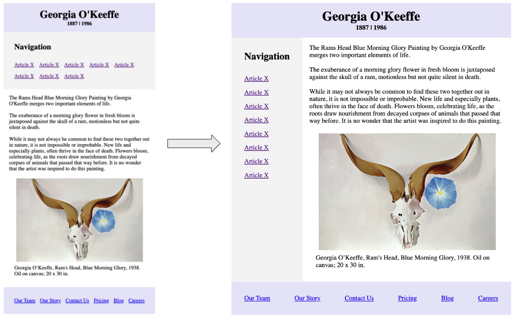

# Grid & Media Queries


Follow along with code examples [here](https://github.com/The-Marcy-Lab-School/2-1-1-lecture-grid-media-queries)!


**Table of Contents:**

* [Part 0 - Grid + Media Queries Demo!](6-grid-media-queries.md#part-0---grid--media-queries-demo)
* [Part 1 - Grid vs Flexbox](6-grid-media-queries.md#part-1---grid-vs-flexbox)
* [Part 2 - Grid Template Columns and Fractional Units](6-grid-media-queries.md#part-2---grid-template-columns-and-fractional-units)
* [Part 3 - Media Queries](6-grid-media-queries.md#part-3---media-queries)
* [Part 4 - Spanning Rows and Columns](6-grid-media-queries.md#part-4---spanning-rows-and-columns)
  * [Grid Tracks](6-grid-media-queries.md#grid-tracks)
* [Bonus! - Flexbox Media Query Challenge](6-grid-media-queries.md#bonus---flexbox-media-query-challenge)

## Part 0 - Grid + Media Queries Demo!

> **Pacing**: 10 minutes (10 minutes total) **Learning Objectives:** See what grid can do, see what media queries can do. Set up the rest of the lecture to dive into these concepts.
>
> * Using live server, render the page found in `0-photo-gallery-grid/` and demonstrate how the number of columns shown changes as the screen is resized. Have fellows follow along with their own copy if they would like.
> * Explain that `display: grid` turns the `ul` into a grid
> * You can mention the 2 grid properties shown in this example: `grid-template-columns`, `grid-auto-rows` but don't spend too much time. The next section you'll be able to go over it more in-depth
> * Remind fellows that they have already seen `gap` in the Flexbox lecture.
> * Briefly go over the concept of media queries and ask fellows why these may be useful.
> * Take questions but be mindful of time.

* **CSS Grid** is a `display` type that is useful for making grids (duh)!
* **Media queries** allow us to apply CSS _in response_ to changes to the device's screen size (and other things too!).
* Media queries are how we implement **responsive web design**, ensuring usability across all devices.


## Part 1 - Grid vs Flexbox

> **Pacing**: 5 minutes (15 minutes total) **Learning Objectives:** Compare and contrast grid and Flexbox. Understand that grid defines a layout with rows AND columns.
>
> * Use the diagram below to explain the difference between Flexbox and grid. Pose the question to the group, how many rows/columns are in the example pictured above?

* Flexbox is a `display` type that allows us to arrange items in rows OR columns
* Grid is a `display` type allows us to arrange items in rows AND columns
* In a grid, grid items can span across multiple rows and/or columns


**Q: How many rows and columns are there in the photo gallery example from the previous part?**

<details>

<summary>Answer</summary>

5 columns and 5 rows

</details>

\


## Part 2 - Grid Template Columns and Fractional Units

> **Pacing**: 15 minutes (30 minutes total) **Learning Objectives:** Learn how to define columns using fractional units.
>
> * Using live server, render the page found in `3-grid-template-columns/`.
> * This demo is all about showing how to define columns using fractional units. If time, you can show how %-based columns will cause an overflow when there is a `gap`.
> * Have fellows intuit when rows are created automatically and what the default row height will be.
> * Show `grid-auto-rows: 1fr` to achieve equal-height rows.

* Grid containers define their columns and rows
* `grid-template-columns` defines:
  * the number of columns
  * the width of each column
* The `fr` unit (the "fractional unit") is unique to grid. It evenly distributes the grid container's available width to each grid item without overflowing.

```css
.grid-container { 
  display: grid;
  grid-template-columns: 1fr 1fr 1fr 1fr; /* make 4 equal-sized columns */
}
```


**Q: There are 9 elements but only 4 columns. What do you notice happens when the elements overflow? How is the row height determined?**

<details>

<summary>Answer</summary>

* If there are more elements than columns, they will flow into a new row that is created automatically.
* By default, row height is determined by the largest row item.
* Use `grid-auto-rows: 1fr;` to make all rows have equal size.

</details>

\


**Q: How would you adjust this to make columns of different sizes? For example, make the middle two columns twice as wide as the outer two.**

<details>

<summary>Answer</summary>

We can make columns of different sizes by adjusting the relative `fr` units. To make the middle columns twice as wide as the outer columns, use `2fr` instead of `1fr`

```css
grid-template-columns: 1fr 2fr 2fr 1fr; /* make 4 equal-sized columns */
```

</details>

\


## Part 3 - Media Queries

> **Pacing**: 10 minutes (40 minutes total) **Learning Objectives:** Demonstrate how to create media queries using min-width and max-width
>
> * Using live server, render the page found in `3-media-queries/`
> * Have fellows look at the code in small groups and play with resizing their screen to see how the styles are applied
> * Have fellows update the breakpoints to match bootstrap's breakpoint sizes.
> * Review Flexbox `flex-direction` and have fellows change the flex direction to `row` for Medium devices

* **Media queries** allow us to apply CSS _in response_ to changes to the device's screen size (and other things too!). Media queries are how we implement **responsive web design**, ensuring usability across all devices.
* **Breakpoints** are points at which a responsive web design will shift.
* [Bootstrap](https://getbootstrap.com/docs/5.0/layout/breakpoints/) is one of the most popular CSS frameworks and uses the following breakpoint sizes:

| Breakpoint                         | Dimensions |
| ---------------------------------- | ---------- |
| X-Small Devices (portrait phones)  | < 576px    |
| Small Devices (landscape phones)   | ≥ 576px    |
| Medium Devices (tables)            | ≥ 768px    |
| Large Devices (desktops)           | ≥ 992px    |
| X-Large Devices (large desktops)   | ≥ 1200px   |
| XX-Large Devices (larger desktops) | ≥ 1400px   |

* They don't target every specific use case or device, but the ranges provide broad coverage.
* **Challenge**: At `700px` and `900px`, change the number of columns to 2 and then to 3.

<details>

<summary>Answer</summary>

To set the number of grid columns to 2 at 700 pixels, we need to add a second ruleset to the media query.

```css
@media (min-width: 700px) {
  .box {
    background: orchid;
  }
  .container {
    grid-template-columns: 1fr 1fr;
  }
}
```

</details>

\


## Part 4 - Spanning Rows and Columns

> **Pacing**: 15 minutes (55 minutes total) **Learning Objectives:** Learn how to define columns using fractional units.
>
> * Using live server, render the page found in `4-responsive-grid/`.

* In a grid, the position of grid-items can span multiple rows and/or columns


**Q: How many rows and columns does this layout have?**

<details>

<summary>Answer</summary>


</details>

\


### Grid Tracks

* **Grid Tracks** are numbered starting at `1` and go between columns and rows.
* Grid track numbers can be used to span grid items across columns and/or rows using `grid-row` and `grid-column`

```css
.grid-item:nth-child(1) {
  grid-row: 1;
  grid-column: 1 / 3;
}
.grid-item:nth-child(4) {
  grid-row: 2;
  grid-column: 2 / 4
}
.grid-item:nth-child(5) {
  grid-row: 1 / 3;
  grid-column: 3
}
```

* To specify the starting row / column for a grid-item, simply provide the grid track number as the value.
* To span across multiple rows/columns, the syntax is `start-row / end-row`

**Challenge: Using media queries and `grid-row`/`grid-column`, produce the grid layout below for screen sizes above `992px`**


<details>

<summary>Answer</summary>

```css
@media (min-width: 992px) {
  .grid-container {
    grid-template-columns: 1fr 1fr 1fr 1fr;
  }
  .grid-item:nth-child(1) {
    grid-row: 1;
    grid-column: 1 / 3;
  }
  .grid-item:nth-child(4) {
    grid-row: 2;
    grid-column: 2 / 4;
  }
  .grid-item:nth-child(5) {
    grid-row: 1 / 3;
    grid-column: 4;
  }
}
```

</details>

\


## Bonus! - Flexbox Media Query Challenge

Using media queries and the `display: flex` properties, achieve the responsive design below starting with the code found in `5-responsive-flexbox-challenge/`



**Q: What do you notice if different about the two layouts?**

<details>

<summary>Answer</summary>

* Mobile view: navigation links are in a row and are above the `main`
* Desktop view: navigation links are in a column and are to the side of `main`

</details>

\
