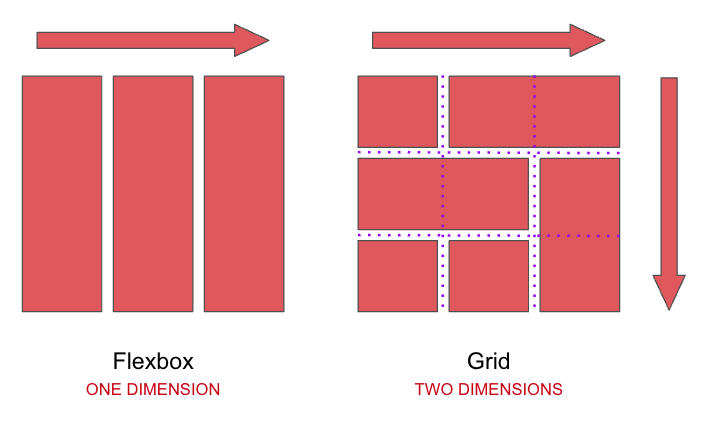
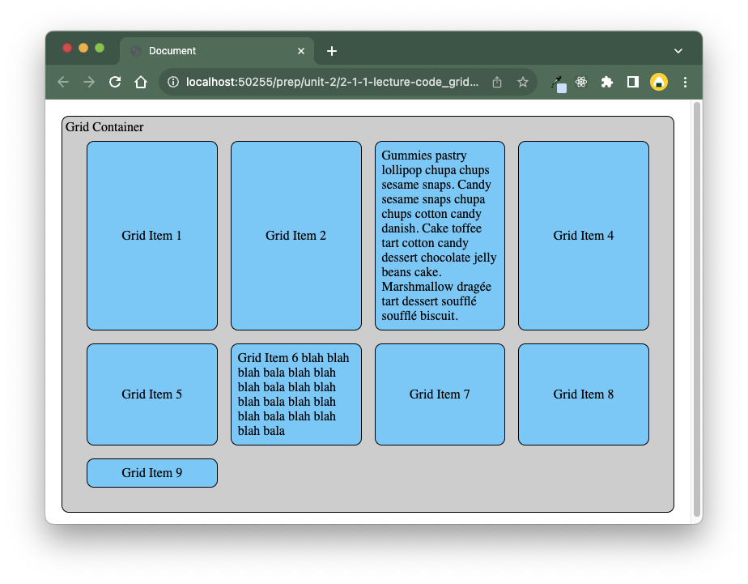
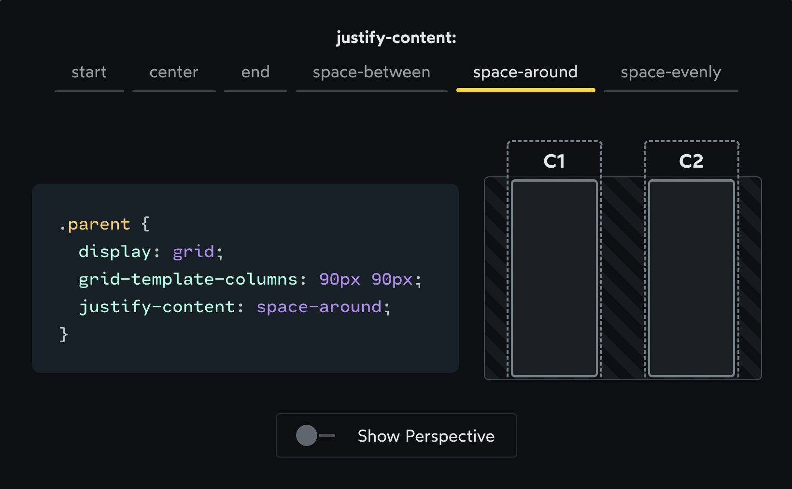

# Grid & Media Queries


Follow along with code examples [here](https://github.com/The-Marcy-Lab-School/2-3-1-grid-media-queries)!


- [Terms](#terms)
- [Grid vs Flexbox](#grid-vs-flexbox)
- [Grid Template Columns and Fractional Units](#grid-template-columns-and-fractional-units)
- [Media Queries](#media-queries)
- [Spanning Rows and Columns](#spanning-rows-and-columns)
  - [Grid Tracks](#grid-tracks)
- [Bonus! - Flexbox Media Query Challenge](#bonus---flexbox-media-query-challenge)
- [Grid Areas](#grid-areas)
- [Grid Alignment](#grid-alignment)

## Terms

* **CSS Grid** is a `display` type that is useful for arranging items in a container into rows and columns!
  * By default, grid items are arranged in a single column
* The `fr` unit (the "fractional unit") is unique to grid. It evenly distributes the grid container's available width to each grid item without overflowing.
* **Grid Tracks** are numbered starting at `1` and go between columns and rows.
* **Grid Properties**
  * `grid-template-columns` defines for the grid container the number of columns and the width of each column
    * `grid-auto-rows` controls the size of newly created rows
    * `grid-column` determines which column a grid item will start in (and, optionally, which column it will end in)
    * `grid-row` determines which row a grid item will start in (and, optionally, which row it will end in)
  * `grid-template-area` defines the layout and size of the `grid-area`s (see below) within the grid container.
    * `grid-area` assigns a grid-area name to a grid item
* **Media queries** allow us to apply CSS _in response_ to changes to the device's screen size (and other things too!). They are how we implement **responsive web design**, ensuring usability across all devices.
* **Breakpoints** are points at which a responsive web design will shift. We set them using `@media (min-width)` and `@media(max-width)`
* **Mobile-First Design** is a strategy for designing our websites for mobile devices and using media queries to modify that design for progressively larger screens.

```css
.grid-container { 
  display: grid;
}


/* Small devices (landscape phones, 576px and up) */
@media (min-width: 576px) {
  .grid-container {
    grid-template-columns: 1fr 1fr;
  }
}

/* Medium devices (tablets, 768px and up) */
@media (min-width: 768px) {
  .grid-container {
    grid-template-columns: repeat(3, 1fr);
  }
}

/* Large devices (desktops, 992px and up) */
@media (min-width: 992px) {
  .grid-container {
    grid-template-columns: repeat(4, 1fr);
  }
}
```

## Grid vs Flexbox

We've learned that Flexbox is a `display` type that allows us to arrange items inside a container into rows OR columns.

**Grid** on the other hand is a `display` type that allows us to arrange items inside a container into rows AND columns



<details><summary>Q: Consider the gallery in the image below. It is made using grid. How many rows and columns are there in the photo gallery example from the previous part?</summary>

There are 5 columns and 5 rows

In a grid, grid items can span across multiple rows and/or columns

</details><br>


## Grid Template Columns and Fractional Units

By default, a grid will have only 1 column. We can add additional columns using `grid-template-columns`:

```css
.grid-container { 
  display: grid;
  /* make 2 columns. The first will be 100px wide, the second will be 200px wide. */
  grid-template-columns: 100px 200px; 
}
```

The `fr` unit (the "fractional unit") is unique to grid. It evenly distributes the grid container's available width to each grid item without overflowing.

```css
.grid-container { 
  display: grid;
  /* make 4 equally sized columns that take up all available space */
  grid-template-columns: 1fr 1fr 1fr 1fr; 
}
```

We often simplify this using the `repeat()` function:

The `fr` unit (the "fractional unit") is unique to grid. It evenly distributes the grid container's available width to each grid item without overflowing.

```css
.grid-container { 
  display: grid;
  /* make 4 equally sized columns that take up all available space */
  grid-template-columns: repeat(4, 1fr) 
}
```




**Q: There are 9 elements but only 4 columns. What do you notice happens when the elements overflow? How is the row height determined?**

<details><summary>Answer</summary>

* If there are more elements than columns, they will flow into a new row that is created automatically.
* By default, row height is determined by the largest row item.
* Use `grid-auto-rows: 1fr;` to make all rows have equal size.

</details><br>

**Q: How would you adjust this to make columns of different sizes? For example, make the middle two columns twice as wide as the outer two.**

<details><summary>Answer</summary>

We can make columns of different sizes by adjusting the relative `fr` units. To make the middle columns twice as wide as the outer columns, use `2fr` instead of `1fr`

```css
grid-template-columns: 1fr 2fr 2fr 1fr; /* make 4 equal-sized columns */
```

</details><br>

## Media Queries

**Media queries** allow us to apply CSS _in response_ to changes to the device's screen size (and other things too!). Media queries are how we implement **responsive web design**, ensuring usability across all devices.

**Breakpoints** are points at which a responsive web design will shift. Below are commonly agreed upon breakpoints for web development. They don't target every specific use case or device, but the ranges provide broad coverage.

| Breakpoint                         | Dimensions |
| ---------------------------------- | ---------- |
| X-Small Devices (portrait phones)  | < 576px    |
| Small Devices (landscape phones)   | ≥ 576px    |
| Medium Devices (tables)            | ≥ 768px    |
| Large Devices (desktops)           | ≥ 992px    |
| X-Large Devices (large desktops)   | ≥ 1200px   |
| XX-Large Devices (larger desktops) | ≥ 1400px   |

**Challenge**: At `700px` and `900px`, change the number of columns to 2 and then to 3.

<details><summary>Answer</summary>

To set the number of grid columns to 2 at 700 pixels, we need to add a second ruleset to the media query.

```css
@media (min-width: 700px) {
  .box {
    background: orchid;
  }
  .container {
    grid-template-columns: 1fr 1fr;
  }
}
```

</details><br>

## Spanning Rows and Columns

In a grid, the position of grid-items can span multiple rows and/or columns


**Q: How many rows and columns does this layout have?**

<details><summary>Answer</summary>


</details><br>

### Grid Tracks

* **Grid Tracks** are numbered starting at `1` and go between columns and rows.
* Grid track numbers can be used to span grid items across columns and/or rows using `grid-row` and `grid-column`

```css
.grid-item:nth-child(1) {
  grid-row: 1;
  grid-column: 1 / 3;
}
.grid-item:nth-child(4) {
  grid-row: 2;
  grid-column: 2 / 4
}
.grid-item:nth-child(5) {
  grid-row: 1 / 3;
  grid-column: 3
}
```

* To specify the starting row / column for a grid-item, simply provide the grid track number as the value.
* To span across multiple rows/columns, the syntax is `start-row / end-row`

**Challenge: Using media queries and `grid-row`/`grid-column`, produce the grid layout below for screen sizes above `992px`**


<details><summary>Answer</summary>

```css
@media (min-width: 992px) {
  .grid-container {
    grid-template-columns: 1fr 1fr 1fr 1fr;
  }
  .grid-item:nth-child(1) {
    grid-row: 1;
    grid-column: 1 / 3;
  }
  .grid-item:nth-child(4) {
    grid-row: 2;
    grid-column: 2 / 4;
  }
  .grid-item:nth-child(5) {
    grid-row: 1 / 3;
    grid-column: 4;
  }
}
```

</details><br>

## Bonus! - Flexbox Media Query Challenge

Using media queries and the `display: flex` properties, achieve the responsive design below starting with the code found in `5-responsive-flexbox-challenge/`


**Q: What do you notice if different about the two layouts?**

<details><summary>Answer</summary>

* Mobile view: navigation links are in a row and are above the `main`
* Desktop view: navigation links are in a column and are to the side of `main`

</details><br>

## Grid Areas


## Grid Alignment

Honestly, to learn about alignment, just visit [Josh Comeau's interactive guide to CSS grid](https://www.joshwcomeau.com/css/interactive-guide-to-grid/#alignment-9) but here are the bullets.

**Controlling the Horizontal Alignment of Columns**
* `justify-content` controls the horizontal alignment of the *columns* within the entire grid
* `justify-items` controls the horizontal alignment of each item within its own column
* `justify-self` controls the horizontal alignment of a single item within the grid.


  
**Controlling the Vertical Alignment of Rows**
* `align-content` controls the vertical alignment of the *rows* within the entire grid
* `align-items` controls the vertical alignment of each item within its own row
* `align-self` controls the vertical alignment of a single item within the grid.