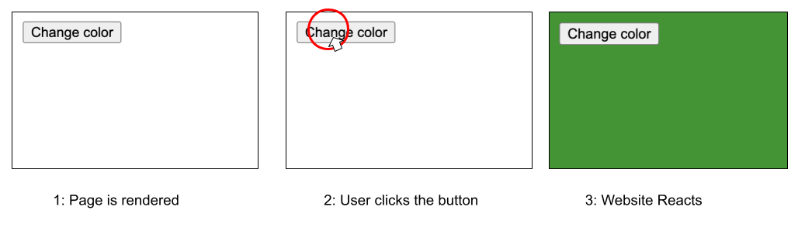

# 2-2-1-dom-events


Follow along with code examples [here](https://github.com/The-Marcy-Lab-School/2-2-1-lecture-dom-events)!


**Table of Contents**
- [Event Driven Programming](#event-driven-programming)
- [addEventListener](#addeventlistener)
  - [Event Type](#event-type)
  - [Event Handlers and the `event` Object](#event-handlers-and-the-event-object)
  - [Challenge](#challenge)
- [Good to Be Aware of, Not to Use: Inline Handlers](#good-to-be-aware-of-not-to-use-inline-handlers)
- [Event Propagation](#event-propagation)
  - [Event Delegation](#event-delegation)
- [Removing Event Listeners](#removing-event-listeners)

## Event Driven Programming

Imagine a website with a button. Each time you click on the button, something happens (maybe the color changes!). How would you program something like this?



So far, the code that we have written will be executed, one line at a time, when the program first is ran.

In **event-driven programming**, we can write code that will wait to be executed until an **event** occurs such as:
* clicking a button
* moving your mouse
* pressing a key on your keyboard
* the webpage finishes loading
* the window is resized
* the user scrolls down the page

In event-driven programming, we **listen** for events and when the event is **triggered**, we react (often by invoking a function)

```js
// 1. Select the "target" element
const button = document.querySelector('button#click-me')

// 2. Add an event listener to invoke a callback when a 'click' event occurs
button.addEventListener('click', () => {
  console.log('a click event occurred!')
});
```

We refer to the callback as the **event handler**.


The terms "event listener" and "event handler" are often used interchangeably but technically they work together.


## addEventListener

The `addEventListener` function is available on all elements in the DOM and is invoked with two values, an **event type** string and an **event handler** callback.

A single element can have multiple event listeners / event handlers.

```js
button.addEventListener('click', () => {
  console.log('a click event occurred!')
});

button.addEventListener('mousemove', () => {
  console.log('a mousemove event occurred!')
});
```

### Event Type

The first argument of `.addEventListener()` is a string that defines the event type to listen for such as:
- `"click"` - an element was clicked
- `"mousemove"` - the mouse moved over an element
- `"keydown"` - a key was pressed down
- `"keyup"` - a key was released
- `"submit"` - a form was submitted
- `"input"` - the `value` of an `input`, `select`, or `textarea` has changed

You can find more information about [Events on MDN](https://developer.mozilla.org/en-US/docs/Web/API/Element/click_event).

### Event Handlers and the `event` Object

The second argument of `addEventListener` is an **event handler**, a callback function that is invoked when the specified event fires "on" the given element. 

The handler will be invoked by `addEventListener` with an `event` object as an input. This `event` object has many useful properties / methods about the event, like the `event.type` and `event.target`:

```js
const handleEvent = (event) => {
  console.log(`An event of type "${event.type}" occurred!`);
  console.log("It was triggered by:", event.target);
  console.log(event);
}

const button = document.querySelector('button#click-me');
button.addEventListener(handleEvent);
```

These two properties are perhaps the most important. They are on every `event` object regardless of the event type:
- `event.target` — the Element that triggered the event.
- `event.currentTarget` — The Element that is is handling the event (often the same as `event.target` but can also be different. See [event delegation](#event-delegation) below).


Tip: Whenever you are trying a new type of event, log the `event` object to the console to see what properties are available! For example, the [MouseEvent object](https://developer.mozilla.org/en-US/docs/Web/API/MouseEvent) has different properties than the [KeyboardEvent object](https://developer.mozilla.org/en-US/docs/Web/API/KeyboardEvent).


### Challenge

Suppose you had this event handler:

```js
const changeToRandomColor = (event) => {
  // Generate a random color string
  const red = Math.floor(Math.random() * 256);
  const green = Math.floor(Math.random() * 256);
  const blue = Math.floor(Math.random() * 256);
  const color = `rgb(${red}, ${green}, ${blue})`

  // event.target is the element that "triggered" the event
  event.target.style.backgroundColor = color;
}
```

How would you trigger it to be invoked whenever a key was pressed anywhere on the page? What about if you moved your mouse over an element with the id `mouse-area`?

**<details><summary>Solution</summary>**

```js
document.querySelector("#mouse-area").addEventListener('mousemove', changeToRandomColor)
document.body.addEventListener('keydown', changeToRandomColor)
```

</details>

## Good to Be Aware of, Not to Use: Inline Handlers

You can also define event handlers inline directly in HTML:

```html
<button onclick="console.log('hello world');">I have an inline handler!</button>
```

This is good to be aware of for when we get to React but you should NOT use this since we want to keep our JavaScript logic in our `.js` files and out of `.html` files.

## Event Propagation

> **Propagation**: the act or process of spreading something

Imagine we had the following structure:

```html
<div id="outer">
  <div id="middle">
    <button id="inner">Click me!</button>
  </div>
</div>
```

When an event is triggered by an element (e.g. a button is clicked), that element and all of its parent elements can "hear" that event and can listen to/handle those events. We call this **event propagation** or **bubbling**.

This means that an event listener added to `div#middle` and `div#outer` will be triggered when we click on the `button#inner` element.

```js
const testPropagation = (event) => {
  console.log(`Event triggered by: #${event.target.id} (event.target)`);
  console.log(`Handled by: #${event.currentTarget.id} (event.currentTarget)`);
}

document.querySelector('#inner').addEventListener('click', testPropagation);
document.querySelector('#middle').addEventListener('click', testPropagation);
document.querySelector('#outer').addEventListener('click', testPropagation);
```

When an event is handled by an element that is different from the element that triggered the event, the values of `event.target` and `event.currentTarget` will be different:
- `event.target` is the Element that fired the event
- `event.currentTarget` is the Element handling the event

To prevent events from bubbling up, use the `event.stopPropagation()` method available on all events:

```js
const testPropagation = (event) => {
  console.log(`Event detected on #${event.target.id}`);
  console.log(`Event handled by: #${event.currentTarget.id}`);
  event.stopPropagation()
}
```

**Q: What would happen if we removed the event handlers for `#inner` and `#middle`?**

### Event Delegation

> **Delegation**: the act of empowering to act for another.

Event propagation/bubbling allows a really powerful design pattern called **event delegation**. Suppose you had the following list:

```html
<ul id="picture-list">
  <li></li>
  <li></li>
  <li></li>
</ul>
```

Each list item has a picture and a solid black border. As long as we have our mouse hovering over on an image, we want the border of that image (and only that image) to turn red! We can do that with an event listener like this:

```js
const toggleBorder = (event) => {
  console.log(event.type + ' event detected on: ', event.target);
  console.log('event handled by: ', event.currentTarget);

  // toggle the highlight class (which will make the border red) on the closest li to the image
  event.target.closest('li').classList.toggle('highlight');

  event.stopPropagation()
}
```

Now, to get that to work for all of our images, one solution would be to add `mouseover` and `mouseout` event handlers to every single image...

```js
document.querySelector("#picture-list img:nth-child(1)").addEventListener('mouseover', toggleBorder);
document.querySelector("#picture-list img:nth-child(1)").addEventListener('mouseout', toggleBorder);
document.querySelector("#picture-list img:nth-child(2)").addEventListener('mouseover', toggleBorder);
document.querySelector("#picture-list img:nth-child(2)").addEventListener('mouseout', toggleBorder);
document.querySelector("#picture-list img:nth-child(3)").addEventListener('mouseover', toggleBorder);
document.querySelector("#picture-list img:nth-child(3)").addEventListener('mouseout', toggleBorder);
```

...but that looks kind of awful. If we had 100 images, then we'd need 200 event listeners... 🤮 

Instead, we can just add the event listener to the container, the `ul#picture-list`. This requires one important tweak: we have to make sure that only events triggered by the `img` elements themselves are handled with a guard clause

```js
const toggleBorder = (event) => {
  console.log(event.type + ' event detected on: ', event.target);
  console.log('event handled by: ', event.currentTarget);

  // Element.matches returns true if the given element would be selected by the given CSS selector
  // If the target of the event wasn't an image, we don't care about it
  if (!event.target.matches('img')) return;

  event.target.closest('li').classList.toggle('highlight');
}
const ul = document.querySelector('#picture-list');
ul.addEventListener('mouseover', toggleBorder);
ul.addEventListener('mouseout', toggleBorder);
```

Pretty neat, right?!

## Removing Event Listeners
One of the reasons why passing a named callback function to your listeners is better is because you can then remove them if you need to. 

```js
const handleCountClick = (e) => {
  e.target.dataset.count++;
  e.target.innerText = e.target.dataset.count;
};
const counterButton = document.querySelector("#counter");
counterButton.addEventListener('click', handleCountClick);

const removeListenerButton = document.querySelector("#remove-listener");
removeListenerButton.addEventListener('click', (e) => {
  // To remove an event listener, provide the event type and the handler
  counterButton.removeEventListener('click', handleCountClick);
})
```

We remove event listeners to limit user interactions and also be 100% sure that we aren't committing memory leaks when we remove elements. (However, modern browsers are pretty good at cleaning up after us). 

**Q: Why can we write the `removeListenerButton` event listener as an inline arrow function but we can't for the `counterButton` event listener?**
