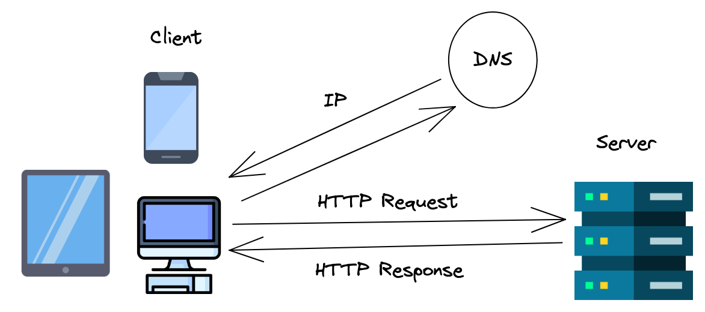
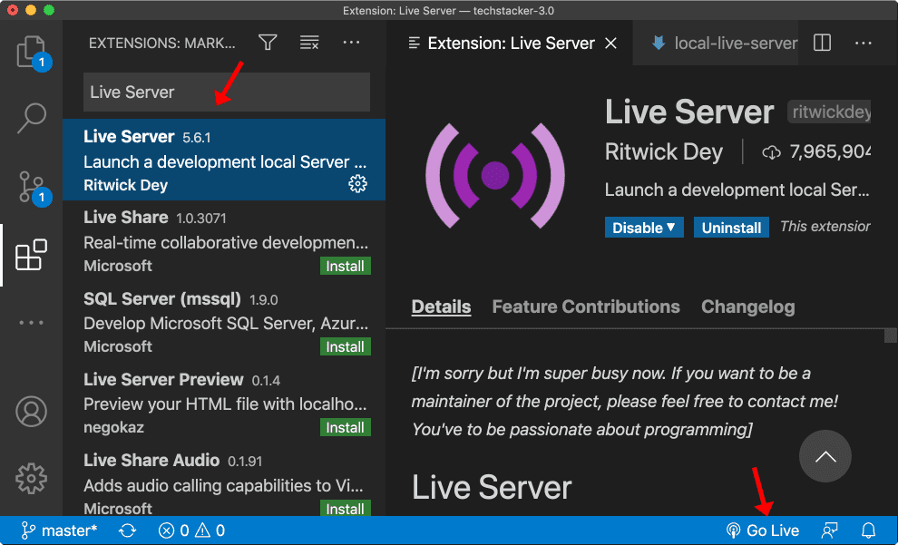

# ESModules


Follow along with code examples [here](https://github.com/The-Marcy-Lab-School/2-3-3-esmodules)!


- [Key Concepts](#key-concepts)
- [Loading JavaScript into our HTML](#loading-javascript-into-our-html)
- [Remember `module.exports` and `require()`?](#remember-moduleexports-and-require)
- [Importing and Exporting with ESModules](#importing-and-exporting-with-esmodules)
  - [Turning Scripts Into Modules](#turning-scripts-into-modules)
    - [CORS](#cors)
  - [What is a Server?](#what-is-a-server)
  - [Live Server](#live-server)
  - [Summary](#summary)
- [Challenge](#challenge)

## Key Concepts

* **CommonJS** — the import/export syntax used by Node. It is not supported by browsers.
* **ESModules** — the syntax supported by browsers for organizing code into modules.
  * **Default Export** — used to export the single most important value from a file

    ```js
    const theMainFunction = () => {};

    // this must be its own statement;
    export default theMainFunction;

    // in Node, we would have written:
    // module.exports = theMainFunction;
    ```


  * **Named Export** — used to export one of many values from a file

    ```js
    // we can put export before the declaration of a variable
    export const oneOfMany = () => { /* something worth exporting */ };

    // or export it as a separate statement
    const anotherOfMany = () => { /* something worth exporting */ };
    export anotherOfMany;

    // in Node, we would have written:
    // module.exports = { oneOfMany, anotherOfMany }
    ```

  * **Importing**

    Note: you *must* specify the file type `.js`
  
    ```js
    // Default import
    import theMainFunction from './the-main-function.js'

    // Named imports
    import { oneOfMany, anotherOfMany } from './named-exports.js'
    ```

* **Module Script** — The `type="module"` attribute added to a `script` tag enables a few pieces of desired functionality:
  * We can put the `script` in the `head` since a module script will always wait for the dom content to load before executing.
  * It enables us to use ESModule syntax (see above)
  * Variables declared in module scripts are NOT added to the global namespace

    ```html
    <head>
      <script type="module" src="filename.js"></script>
    </head>
    ```

  * The one drawback is that we cannot use modules with the `file://` protocol without running into CORS issues. We must use a development server to enable the `http://` protocol.
* **Cross-Origin Resource Sharing (CORS)** — a security feature implemented by web browsers to restrict webpages from making requests to a different domain than the one that served the original web page. 
* **Server** — a computer that shares its resources over the internet. A user's computer acts as the **"client"** and requests resources from the server using the `https://` protocol (the hypertext transfer protocol). 
* **Development Server** — a server used in development to test and iterate on an application before publishing it.
* **Live Server** — a tool for starting a development server.


## Loading JavaScript into our HTML

Thus far, when we've wanted to execute JavaScript in our web applications, we've added  `script` tags to the end of the `body` of our HTML:

```html
<body>
  <h1>Hello World!</h1>
  
  <script src="./posts.js"></script>
  <script src="./dom-helpers.js"></script>
  <script src="./index.js"></script>
</body>
```

Doing so executes the scripts in the order they are loaded (so order matters) and all variables declared are added to the **global namespace**. That is, variables declared in one file can be used in *subsequent* files (again, the order of the scripts matters).

Take a look at the `0-intro/index.js` file to see this in action:


```javascript
const main = () => {
  const numPosts = Object.keys(posts).length;
  updateHeading(`Check out my ${numPosts} posts!`);

  renderPosts();
}

main();
```


This file uses three values that are declared in other files.
* `posts` is declared in the `posts.js` file
* The functions `updateHeading` and `renderPosts` are declared in the `dom-helpers.js` file.

Loading `script` tags at the end of the `body` and adding variables to the global namespace enable us to organize our JavaScript into separate files. However, there are some downsides to this implementation.

**<details><summary>Q: What are the possible downsides of adding `script` tags at the end of the `body` and adding variables to the global namespace?</summary>**

**Downsides of adding `script` tags to the end of the `body`**
* To start, it just doesn't make much sense. The `body` is reserved for visible content while the `head` is where we load in other files. That's where we load in CSS after all.

    ```html
    <head>
      <!-- other meta tags + scripts -->
      <script src="./index.js"></script>
    </head>
    <body>
      <!-- Visible content -->
    </body>
    ```

* Additionally, we have to load in every single JavaScript file that we want to use. If had 1000 `.js` files, our `index.html` file would become really clunky.
* Lastly, we have to make sure that the order is correct. If we load a script *after* its variables are needed, the file that depends on those variables will throw an error.

**Downsides of adding variables to the global namespace**
* It is not explicitly clear where a variable comes from. If I were a new programmer looking at `index.js`, I would have no idea where any of those values came from.
* Additionally, it makes it really difficult to keep track of changes to variables that are shared globally for an application if multiple files are using the same variables.

</details>

We need a better approach that enables us to avoid adding `script` tags to our `body`, avoids the issue of order mattering, and avoids adding variables to the global namespace. Thankfully, there is one!

## Remember `module.exports` and `require()`?

In Node, we can share code by exporting assigning a value to the `module.exports` variable:


```javascript
const posts = {
  // objects
};

// Exporting a single value
module.exports = posts;
```


We can also export an object with multiple "named exports"


```javascript
const add = (a, b) => a + b;

const isEven = (num) => {
  const remainder = num % 2;
  return remainder === 0;
}

// Exporting multiple values inside an object
module.exports = { add, isEven };
```


And then we can import using `require()`:


```javascript
// Importing a "default export" (a single value)
const posts = require('./posts.js')

// Importing "named exports" (multiple values)
const { add, isEven } = require('./math-utils.js');

console.log(posts);
console.log(add(5, 6));
console.log(isEven(5));
```


## Importing and Exporting with ESModules

The import/export syntax used by Node is called **CommonJS** but it is unfortunately not supported by browsers.

In the browser, we need to use a different syntax called **ESModules**. Using this syntax will help us explicitly share values between files, rather than relying on adding variables to the global namespace to share values.

* **Default Export** — used to export the single most important value from a file

    ```js
    const theMainFunction = () => {};

    // this must be its own statement;
    export default theMainFunction;

    // in Node, we would have written:
    // module.exports = theMainFunction;
    ```

* **Named Export** — used to export one of many values from a file

  ```js
  // we can put export before the declaration of a variable
  export const oneOfMany = () => { /* something worth exporting */ };

  // or export it as a separate statement
  const anotherOfMany = () => { /* something worth exporting */ };
  export anotherOfMany;

  // in Node, we would have written:
  // module.exports = { oneOfMany, anotherOfMany }
  ```

* **Importing**

  Note: you *must* specify the file type `.js`

  ```js
  // Default import
  import theMainFunction from './the-main-function.js'

  // Named imports
  import { oneOfMany, anotherOfMany } from './named-exports.js'
  ```

**TODO:** Do the following to export values from `posts` and `dom-helpers`
* In `posts.js`, export the `posts` variable as a default export
* In `dom-helpers.js`, first import `posts` as a default import. Then, export each function as a named export.
* In `index.js` import `posts` from `posts.js` and import both of the functions from `dom-helpers.js`

Try running your code and you will be met with an annoying error:

```
Uncaught SyntaxError: Unexpected token 'export' (at posts.js:20:1)Understand this errorAI
Uncaught SyntaxError: Cannot use import statement outside a module (at index.js:3:1)
```

Unfortunately, we can't use this syntax either! But actually, we can. We just need to turn our script into a module.

### Turning Scripts Into Modules

To enable the use of ESModules, just add a `type="module"` attribute to the `<script src="./index.js">` opening tag.

Doing so will also enable us to put that script in the `head`! Module scripts automatically wait for the DOM content to load before executing so we don't need to put them at the end of our `body` anymore!

```html
<head>
  <!-- We only need to load the "entry point". Each file will manage its own imports. -->
  <script type="module" src="./index.js"></script>
</head>
```

Furthermore, the use of ESModules makes it unnecessary to load all of the scripts in our `html` file. When our `index.js` file imports values from `posts.js` and `dom-helpers.js`, those files will be loaded automatically.

Try to open this and... you'll run into another error :(

#### CORS

The **Cross-Origin Resource Sharing (CORS)** policy is a security feature implemented by web browsers to restrict webpages from making requests to a different domain than the one that served the original web page. 

For some reason, when you open a file using the `file://` protocol (local file system) and attempt to access a resource from any other location (including your own file system), it will consider it to be a different origin. 


To get around this, **we need to serve our `html` file using the `http://` protocol from a Server, not from our file system**. This helps the browser see that all of the files are coming from the same origin.

([Learn more about CORS here](https://developer.mozilla.org/en-US/docs/Web/HTTP/CORS)).

### What is a Server? 

A **server** is just a computer that shares its resources over the internet. A user's computer acts as the **"client"** and requests resources from the server using the `https://` protocol (the hypertext transfer protocol). 

When we visit a URL, like [https://www.google.com](https://www.google.com), our browser converts the **Domain Name** (`google.com`) into the **IP Address** of the server computer where the code for Google lives. Then, our computer sends a **request** to that server computer over the internet and the server sends a **response**.



With a **development server**, we can simulate this **HTTP request-response cycle** by having our computer act as both the client and the server.

### Live Server

While it is easy enough to build a server of your own using [Express](../mod-8-backend/1-intro-to-express.md), we can also use a tool like Live Server.

**Do the following to add live server to your environment**:
* Go to the VS Code Extension library and find Live Server. Install it.
* Open your `index.html` file and click on the **Go Live** button in the bottom right corner of your screen



Running your web app through a local development server will allow you to simulate a more typical web environment with `http://` or `https://` protocols, which should prevent CORS issues during testing.

### Summary

**And now it works!** 

Wow that may have seemed like a lot of work to get the same functionality but we've learned a valuable new way of organizing our code. If we use this approach from the start, we won't have any issues and we'll only have the benefits. Here is what we did:

* We added ESModule exports and imports to explicitly share values between our files.
* We added the `type="module"` attribute to our `index.js` script.
* We moved that script to the `head` and removed the other script tags.
* We ditched the `file://` protocol and instead served our website using the `http://` protocol via the Live Server development server.

## Challenge

Take the example to the next level and insert a form to enable a user to add a new post to this page!