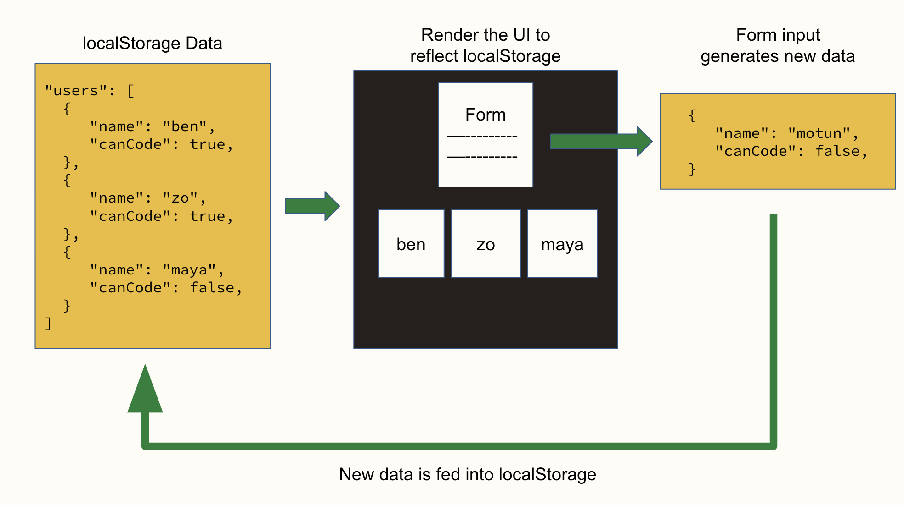

# LocalStorage


Follow along with code examples [here](https://github.com/The-Marcy-Lab-School/2-4-0-localStorage)!


**Table of Contents**

- [Key Terms](#key-terms)
- [Lets Make a Leaderboard!](#lets-make-a-leaderboard)
- [`localStorage` Lets Us Store Data That Persists](#localstorage-lets-us-store-data-that-persists)
- [JSON.stringify() and JSON.parse()](#jsonstringify-and-jsonparse)
  - [Adding the leaderboard to LocalStorage](#adding-the-leaderboard-to-localstorage)
- [`localStorage` Helpers](#localstorage-helpers)
- [Data Layer](#data-layer)
- [Removing Values](#removing-values)

## Key Terms

* **`localStorage`** — an API for storing persistent data in a user's browser.
  * **`localStorage.setItem(key, value)`** — stores the given key:value pair in `localStorage`. The value is converted to a string using the value's `.toString()` method
  * **`localStorage.getItem(key)`** — retrieves the value associated with the given key in `localStorage`. It will always return a string.
  * **`localStorage.removeItem(key)`** — removes the value associated with the given key from `localStorage`.
  * **`localStorage.clear()`** — removes all key:value pairs from `localStorage`
* **`.toString()`** — converts the source value or object to a string. How the string is converted varies depending on the source value or object.
* **`JSON.stringify(value)`** — converts the given value to a string in the JSON format and returns it.
* **`JSON.parse(jsonStr)`** — parses (inspects) a given JSON string, constructing and returning the JavaScript value or object described by the string. If the given string is not valid JSON, a `SyntaxError` will be thrown.

## Lets Make a Leaderboard!

Making video games is one of the greatest joys of programming. And for good reason! Not only are they fun to play, but they are rewarding to create. Video games also can teach us important lessons about programming. 

Suppose we had a game where the user is challenged to click a button as many times as they can in 5 seconds.


To encourage the competitive spirit of gaming, a key feature that we want to implement is a leaderboard to display the user's previous scores. Take a look at the `speed-clicker-game` where we've implemented this game!

**<details><summary>Q: Look at `main.js` and see how the `leaderboard` is stored "in memory". What are the issues with storing a leaderboard in memory?</summary>**
> When the user refreshes the page or closes their browser, the program will end and all "in memory" variables will be thrown away. When we return to the page, a new `leaderboard` will be created.
</details>

## `localStorage` Lets Us Store Data That Persists

The `localStorage` API allows you to store data in a user's browser that will **persist** across browser sessions. That is, the data from a previous session can be retrieved even after they close their browser.

`localStorage` is a globally available Object with the following methods:

* `localStorage.setItem(key, value)` — stores the given key:value pair in `localStorage`. The value is converted to a string using the value's `.toString()` method
* `localStorage.getItem(key)` — retrieves the value associated with the given key in `localStorage`. It will always return a string.

You can play around with these functions in your browser's Console to get a sense of how they work:

```js
// localStorage.setItem(key, value)
localStorage.setItem('secret', 'hello world!');

// localStorage.getItem(key) — always returns a string
localStorage.getItem('secret'); // returns the string 'hello world!'

// let's try storing a leaderboard array!
localStorage.setItem('leaderboard', [10, 20, 30]);
localStorage.getItem('leaderboard'); // returns '10,20, 30'
```

Notice anything weird about the `'leaderboard'` array that we stored in `localStorage`? It was converted to a string!

Let's try to add a new score to the leaderboard array:

```js
// first get the existing leaderboard
const leaderboard = localStorage.getItem('leaderboard');

// try to push a new score into the array
leaderboard.push(40);

// Uncaught TypeError: leaderboard.push is not a function
```

**<details><summary>Q: Why did we get a TypeError?</summary>**
> Because `localStorage.setItem` converted the given array into a string. When we try to retrieve that array, it is no longer an array!
</details>

## JSON.stringify() and JSON.parse()

When using `setItem`, the value is turned into a string before being stored. It does this using the given value's `.toString()` method (every data type has this method).

As you can see, this is particularly annoying when dealing with Arrays and Objects. Try copying and pasting these statements into your browser Console:

```js
const nums = [1, 2, 3];
const user = { name: 'ben' };

// toString will convert arrays and objects into strings
nums.toString() // '1,2,3'  <-- mildly annoying that the [] are gone
user.toString() // '[object Object]'  <-- what is this garbage??

localStorage.setItem('nums', nums);
localStorage.setItem('user', user);

localStorage.getItem('nums'); // '1,2,3' 
localStorage.getItem('user'); // '[object Object]'
```

When we want to store Arrays and Objects in `localStorage`, we often use `JSON.stringify()` to convert the string into a JSON-formatted string.

```js
const startingLeaderboard = [10, 20, 30];

// JSON.stringify() turns a value into a JSON-formatted string, preserving their structure (still a string)
JSON.stringify(startingLeaderboard); // '[1, 2, 3]'

// stringify values before storing them in localStorage
localStorage.setItem('leaderboard', JSON.stringify(startingLeaderboard));
```

When we want to get the value out of `localStorage`, we use `JSON.parse()` which will create a JavaScript value / object from a JSON-formatted string.

```js
// The item will be stored as a JSON string
localStorage.getItem('leaderboard'); // returns '[10,20,30]'

// JSON.parse it to get an Array back
JSON.parse(localStorage.getItem('leaderboard')); // returns [10,20,30]
```

In summary, when working with arrays and objects in `localStorage`, any time we need to insert a value into `localStorage` we will first stringify it with `JSON.stringify` and any time we want to get a value from `localStorage`, we will use `JSON.parse()`:

```js
// First get the value from localStorage to make an "in memory" copy
const leaderboard = JSON.parse(localStorage.getItem('leaderboard'));

// We can modify the copy
leaderboard.push(40);

// And then stringify it before updating the item in localStorage
localStorage.setItem('leaderboard', JSON.stringify(leaderboard));

// We can check out work after!
localStorage.getItem('leaderboard');
```

For now, lets empty out the `localStorage`:

```js
localStorage.clear();
```

### Adding the leaderboard to LocalStorage

Let's try to use `localStorage` to implement our leaderboard! 

Previously, we had initialized `leaderboard` as an empty array "in memory" and then whenever the game ended, we would push the current score into that array. 

To use `localStorage`, we'll follow a common pattern:
1. Check to see if there is a `leaderboard` value in `localStorage` and store it in memory.
2. If there isn't any previously-stored `leaderboard`, make a new array in memory.
3. Modify the in-memory array with our new data.
4. Store the in-memory array in `localStorage`, replacing the old value.

```js
// 1. Check if there is a leaderboard value in localStorage (from previous games played).
let leaderboard = JSON.parse(localStorage.getItem('leaderboard'));

// 2. If none exists, create a new array
if (leaderboard === null) {
  leaderboard = [];
}

// 3. Add the score to the leaderboard
leaderboard.push(clickerBtn.dataset.clicks);

// 4. Store the updated leaderboard in localStorage
localStorage.setItem('leaderboard', JSON.stringify(leaderboard));

// 5. update the leaderboard display
updateLeaderboard(leaderboard);
```

Return to the game and test it out! It should work:



**Pro Tip** you will often see the following syntax when retrieving a value from `localStorage`

```js
let leaderboard = localStorage.getItem('leaderboard') || [];
```

When used in this way, the `||` operator returns the left value (`localStorage.getItem('leaderboard')`) if it is truthy and returns the right value `[]` if the left value is falsy.

In this case, `getItem()` will return `null` (a falsy value) if there isn't a `leaderboard` stored in `localStorage`.

As a result, we don't need this code:

```js
// 2. If none exists, create a new array
if (leaderboard === null) {
  leaderboard = [];
}
```



## `localStorage` Helpers

That's quite a bit of code to write and re-write every time we can to set or get values to/from `localStorage`.

To reduce repetition, we often write these two helper functions:

```js
const setLocalStorageKey = (key, value) => {
  localStorage.setItem(key, JSON.stringify(value))
}

const getLocalStorageKey = (key) => {
  try {
    return JSON.parse(localStorage.getItem(key))
  } catch (err) {
    console.error(err);
    return null;
  }
}
```

We wrap the `JSON.parse()` function invocation in a `try/catch` block in the event that `JSON.parse()` can't determine the value type of the given string.

* If it can, it will return the value.
* If it can't, the error will be printed (and not break everything) and `null` will be returned.

Now, we can safely use these functions instead of the `localStorage` ones and know that all values will be properly stored and retrieved.

```js
setLocalStorageKey('nums', [1, 2, 3])
const storedArr = getLocalStorageKey('nums');

setLocalStorageKey('user', { name: 'ben' });
const storedUser = getLocalStorageKey('user');

console.log(storedArr);  // [1, 2, 3]
console.log(storedUser); // { name: 'ben' }
```

## Data Layer

As you can see, working with `localStorage` can be quite tricky. We want to ensure that our application works in a **consistent and predictable** manner.

To achieve this, we will typically:

* **isolate the logic** for dealing with `localStorage` in its own file.
* create functions for interacting with `localStorage`.
* **only export the functions that indirectly interact with `localStorage`**.

This way, we create a **consistent** and **predictable** interface.

```js
// local-storage.js

// Generic localStorage helpers
const setLocalStorageKey = (key, value) => {
  localStorage.setItem(key, JSON.stringify(value))
}

const getLocalStorageKey = (key) => {
  try {
    return JSON.parse(localStorage.getItem(key))
  } catch (err) {
    console.error(err);
    return null;
  }  
}

// These two will be used by the rest of the functions a lot
export const getNames = () => getLocalStorageKey('names');
export const setNames = (names) => setLocalStorageKey('names', names);

// More helper functions
export const initializeNames = () => setNames(['ben', 'gonzalo', 'motun']);

export const addName = (name) => {
  const names = getNames();
  setNames([...names, name]);
}

export const removeName = (nameToRemove) => {
  const names = getNames().filter((name) => name !== nameToRemove);
  setNames([...names]);
}
```

And always remember to test your code!

```js
// mains.js
import { initializeNames, addName, getNames } from './local-storage.js';

initializeNames();
console.log(getNames());  // ['ben', 'gonzalo', 'motun']

addName('carmen');
addName('zo');
console.log(getNames());  // ['ben', 'gonzalo', 'motun', 'carmen', 'zo]

removeName('ben');
console.log(getNames());  // ['gonzalo', 'motun', 'carmen', 'zo]
```

**Q: What makes this predictable and consistent?**

<details>

<summary>Answer</summary>

This is predictable and consistent because

* we control what the user of these functions can do (set, get, initialize, add, remove)
* the caller of those exported functions doesn't directly interact with `localStorage`
* the exported functions handle the interaction with `localStorage`

Sure, we can interact with `localStorage` outside of this file too but we should avoid that if we want to maintain the predictable and consistent behavior.

</details>

That file acts as a **data layer**. We might also decide to isolate our DOM manipulation code and create a **DOM layer** or create an **event handling layer**.

Using `localStorage`, we will build a **data layer** that is used to inform what is rendered, know as the **view layer**. When users interact with the view through the form, the data layer will be updated and we re-render the view.

This cycle of **data > view > handle events > data** looks like this:



## Removing Values

The `localStorage` API provides two methods for removing values. You can either remove a single value or clear all values from `localStorage`:

* `localStorage.removeItem(key)` — removes the value associated with the given key from `localStorage`.
* `localStorage.clear()` — removes all key:value pairs from `localStorage`

```js
localStorage.setItem('name', 'alice');
localStorage.setItem('email', 'alice@mail.com');
localStorage.setItem('age', '25');

console.log(localStorage.getItem('name')); // Prints 'alice'

localStorage.removeItem('name');

console.log(localStorage.getItem('name')); // Prints undefined

console.log(localStorage.getItem('name')); // Prints 'alice'
```