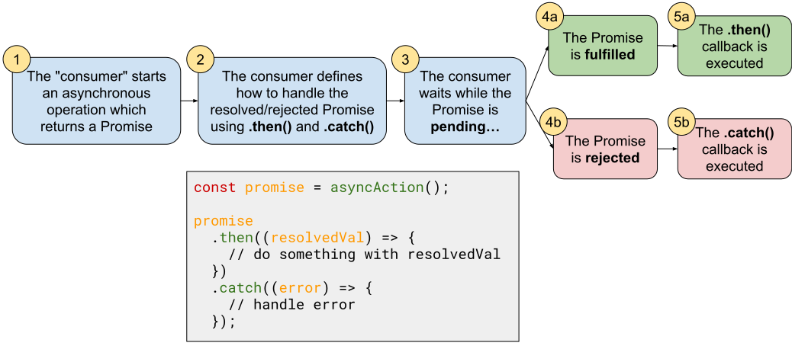

# Promises


Follow along with code examples [here](https://github.com/The-Marcy-Lab-School/3-0-0-intro-to-promises-f23)!


**Table of Contents**

- [Synchronous vs. Asynchronous Operations and `setTimeout`](#synchronous-vs-asynchronous-operations-and-settimeout)
  - [Executing Asynchronous Code With Callbacks](#executing-asynchronous-code-with-callbacks)
  - [Sequential Asynchronous Callbacks Leads to Callback Hell](#sequential-asynchronous-callbacks-leads-to-callback-hell)
- [Promises!](#promises-1)
  - [Sequential Asynchronous Operations With Promises](#sequential-asynchronous-operations-with-promises)
- [Making Promises](#making-promises)
- [The Pizza Shop Analogy](#the-pizza-shop-analogy)
- [Coming up...](#coming-up)

## Synchronous vs. Asynchronous Operations and `setTimeout`

**Synchronous operations**
- make up most of our code
- typically take very little time to complete
- JavaScript must complete the execution of a synchronous operation before moving on to the next one.

As a result, the order in which synchronous operations execute is the same as the order in which they are written.

```js
console.log("A");
console.log("B");
console.log("C");
```

**Asynchronous operations**:
- Often take time to execute.
- Are "non-blocking" — they can be started and then completed at a later time without causing the rest of the program to wait.
- Examples include:
  - processing an image
  - fetching data over the internet
  - counting down a timer
  - waiting for a user to click on a button. 

Unlike their synchronous counterparts, asynchronous operations do NOT need to be completed immediately. They can be started and then completed at a later time without causing the rest of the program to wait. 

We can see this clearly with `setTimeout`:

```jsx
console.log("starting the first task");
setTimeout(() => {
  console.log("first task completed")
}, 3000)

console.log("starting the second task");
setTimeout(() => {
  console.log("second task completed")
}, 1000)

console.log("starting the third task");
setTimeout(() => {
  console.log("third task completed")
}, 2000)
```


Asynchronous operations allow us to start longer operations without blocking the execution of our quicker operations. That is why we call asynchronous operations "non-blocking".

<details><summary><strong>Q: In what order will the console log statements be executed? What happens if we set the timeouts to <code>0</code> milliseconds?</strong></summary>

With `setTimeout`, the scheduling of each callback happens synchronously but the actual invocation of the callbacks happens asynchronously. As a result, the `"starting the X task"` statements are printed first and in order. While we don't see it happening, the timers are also started synchronously.

Then, as each timer finishes, the console.log statements are executed asynchronously.

```
starting the first task
starting the second task
starting the third task
second task completed
third task completed
first task completed
```

Even if we set all of the timers to 0, synchronous operations will always complete first, then asynchronous operations. This is due to [how the event loop works](https://www.youtube.com/watch?v=8aGhZQkoFbQ&ab_channel=JSConf).

</details>

### Executing Asynchronous Code With Callbacks

There are many examples of functions that use callbacks to handle asynchronous operations.

Another great example is the `fs.readFile` function in Node. It allows the programmer to access files in their filesystem. Here, we are reading a file called `booksHuge.csv` to figure out how many books it represents

```js
// This code helps us assemble a filepath to the booksHuge.csv data file
const path = require('node:path');
const booksHugeFilePath = path.join(__dirname, '../data/booksHuge.csv');

// fs.readFile also uses a callback to execute asynchronous code
const fs = require('node:fs');
fs.readFile(booksHugeFilePath, 'utf-8', (err, data) => {
  // this code is scheduled to run when the file is done being processed
  if (err) {
    console.error(err);
  } else {
    const lines = data.split('\n').length;
    console.log(`Done reading the booksHuge.csv file. There were ${lines - 1} books.`);
  }
});
```

The `fs.readFile` function takes in a filepath and begins reading the file. 
* When it is done, the provided callback will be invoked asynchronously
* The file's contents are provided to the `data` parameter as a single string.
* To count the number of books, we split the string on every new line (`\n`) and then subtract `1` to account for the header row.


A **comma-separated value (CSV) file** is a simple way to represent large datasets in rows and columns. Each row in a CSV file represents a single entry in the table (except the first line which defines the names of each column). Each entry contains data separated by some uniform character like a comma `,` or semicolon `;`.

For example, this CSV file has three columns and 3 entries.

```csv
"name","age","email"
"kobe","25","kobe@mail.com"
"lebron","39","lebron@mail.com"
"sue","42","sue@mail.com"
```



**<details><summary>Q: What's another example we've already seen that uses callbacks to handle asynchronous operations?</summary>**

Event handlers!

```js
console.log('start');

document
  .querySelector('#clickButton')
  .addEventListener('click', () => {
    console.log('the button has been clicked!');
  });

console.log('end');
```

No matter how quickly the user clicks the button, the order will always be:

```
start
end
the button has been clicked
```

In the code snippet above, the callback provided to `addEventListener` is an example of an **asynchronous operation**. 

</details>

### Sequential Asynchronous Callbacks Leads to Callback Hell

Okay, so asynchronous callbacks are great for executing time-consuming tasks without blocking our synchronous code.

But what if we DO want our asynchronous code to be blocking. That is, to wait for one operation to finish before starting the next, just like synchronous code?

With callbacks, we are forced to do something like this, appropriately called **callback hell**:

```js
console.log("starting the first task!");
setTimeout(() => {
  console.log("first task completed");
  console.log("starting the second task!");
  setTimeout(() => {
    console.log("second task completed");
    console.log("starting the third task!");
    setTimeout(() => {
      console.log("third task completed");
    }, 2000);
  }, 1000);
}, 3000);
```

Yikes, that is hard to read! Here is what is happening:

* Start the first task
  * After 3 seconds, the first task will complete and we start the second task
    * After 1 seconds, the second task will complete and we start the third task
      * After 2 seconds, the third task will complete


## Promises!

Promises provide an alternate approach to callbacks for resolving asynchronous operations. The main benefit of Promises are that they can help us avoid callback hell.

A **Promise** is a type of object (a "class" of object) that represents the eventual completion of an asynchronous operation.
* A Promise object can exist in one of three states:
  - **pending** - the operation is still in process.
  - **resolved** - the operation was a success! We got the value we wanted. Also referred to as "fulfilled”
  - **rejected** - the operation failed. We got an error back.
* The `Promise.then()` method schedules a callback to be executed when the promise resolves.
* The `Promise.catch()` method schedules a callback to be executed when the promise rejects.
* `Promise.then()` returns a Promise allowing it to be chained.

Consider the example below which uses the Promises version of the `fs.readFile` function. Instead of accepting a callback as a third argument, it returns a Promise object (compare it to the callback version):



 

```js
// Now, we'll use the promises version of fs
const fs = require('node:fs/promises');

console.log("Reading the-raven.txt");

// A Promise object is returned
const promise = fs.readFile(ravenFilePath, 'utf8');

// The .then and .catch methods schedule resolve/reject handlers
promise
  .then((data) => {
    const ravenCount = data.match(/raven/gi).length;
    console.log(`Done reading the-raven.txt.`)
    console.log(`There were ${ravenCount} mentions of "Raven".`);
  })
  .catch((err) => {
    console.log('Something went wrong!');
    console.error(err);
  });
```



 
```js
// Here, we use the default callback version of fs
const fs = require('node:fs');

console.log("Reading the-raven.txt");

// We have to provide a callback as the third argument
fs.readFile(ravenFilePath, 'utf-8', (err, data) => {
  if (err) {
    console.log('Something went wrong!');
    console.error(err);
  } else {
    const ravenCount = data.match(/raven/gi).length;
    console.log(`Done reading the-raven.txt.`)
    console.log(`There were ${ravenCount} mentions of "Raven".`);
  }
});

```





The Promise version of `readFile` returns a Promise object instead of taking in a callback
- We provide a callback to `.then` to be invoked when the promise "resolves" 
- We provide a  callback to `.catch` to be invoked if the promise "rejects"
- In both cases, the callbacks are executed asynchronously

### Sequential Asynchronous Operations With Promises

At this point, the code isn't dramatically different. However, Promises start to shine when we want to perform multiple asynchronous operations sequentially.

Compare and contrast these two approaches for reading the `booksHuge.csv` file followed by the `books.csv` file:



 

```js
const fs = require('node:fs/promises');

console.log("Reading the booksHuge.csv file");

// Often, we will just call .then directly on the function call
fs.readFile(booksHugeFilePath, 'utf-8')
  .then((data) => {
    const lines = data.split('\n').length;
    console.log(`Done reading the booksHuge.csv file. There were ${lines} lines.`);
  })
  .then(() => {
    console.log("Reading the books.csv file");
    // by returning the new readFile promise, we can continue to chain .then() calls
    return fs.readFile(booksFilePath, 'utf-8')
  })
  .then((data) => {
    const lines = data.split('\n').length;
    console.log(`Done reading the books.csv file. There were ${lines} lines.`);
  })
  .catch((err) => {
    // We only need one error handler.
    console.error(err);
  });
```



 

```js
const fs = require('node:fs');

console.log("Reading the booksHuge.csv file");

fs.readFile(booksHugeFilePath, 'utf-8', (err, data) => {
  if (err) {
    console.error(err);
  } else {
    const lines = data.split('\n').length;
    console.log(`Done reading the booksHuge.csv file. There were ${lines - 1} books.`);

    console.log("Reading the books.csv file");
    fs.readFile(booksFilePath, 'utf-8', (err, data) => {
      if (err) {
        console.error(err);
      } else {
        const lines = data.split('\n').length;
        console.log(`Done reading the books.csv file. There were ${lines - 1} books.`);
      }
    });
  }
});
```


 

As you can see in the callbacks version of the code, we very quickly get to four levels of indentation, causing the readability of our code suffer.

## Making Promises

To better understand promises, we can make them ourselves! To create a promise, use the `new Promise()` constructor function:

```js
const myPromise = new Promise((resolve, reject) => {
  // asynchronous operations here
});
```

* The `new Promise()` constructor function takes in a callback that contains the asynchronous operations to be performed. 
* The provided callback will be given two functions as parameters: `resolve` and `reject`.
  * Invoke `resolve(...)` to indicate that the asynchronous operation succeeds.
  * Invoke `reject(...)` to indicate failure.

```js
// 1. Create the new promise object, determining when it resolves and when it rejects
const rollPromise = new Promise((resolve, reject) => {
  // wait 5 seconds before settling the promise
  setTimeout(() => {
    const roll = Math.ceil(Math.random() * 6);

    // In this case, rolls 3,4,5, or 6 will resolve the promise
    // Rolls 1 or 2 will reject the promise
    if (roll > 2) {
      resolve(`Success! ${roll} was rolled`);
    } else {
      reject(`Failure. ${roll} was rolled`)
    }
  }, 5000);
});

// schedule a callback to execute when the promise resolves or rejects
rollPromise
  .then((successMessage) => {
    console.log(successMessage);
  })
  .catch((failureMessage) => {
    console.log(failureMessage);
  })
```

* In this example, we use `setTimeout(...)` to simulate async code. A more realistic example might make an HTTP request or interact with a database, something that takes time.
* Most often, you don’t create Promises yourself. You’ll just "consume" them from functions like `fs.readFile` or `fetch`

<details>

<summary><strong>Q: Is it possible for an asynchronous operation to complete before a synchronous operation?</strong></summary>

Synchronous code will **always** be executed before asynchronous code.

</details>

## The Pizza Shop Analogy

> Imagine walking into a Pizza shop and you ask for a slice of cheese pizza. The pizza isn’t ready yet so you have to wait. The person at the register gives you a ticket to claim your slice when it is ready. Meanwhile, you are free to run other errands and can return later to pick up your pizza. You get notified that the pizza is done so you return to the shop, hand in your ticket, and take your pizza home.

<details>

<summary><strong>Q: In the pizza shop example, what is the promise object we are given? what is the resulting value?</strong></summary>

The ticket is the promise. The resulting value is the pizza (or them telling us that they ran out of pizza).

</details>

Using a Promise involves two steps:

1. Start the asynchronous operation and get a Promise back (order your pizza, get your ticket)
2. Define how to handle the resolved/rejected Promise using `.then()` and `.catch()` (when ready, I will hand in my ticket and get my pizza)



As the asynchronous operation is carried out, the Promise will exist in one of three states:

## Coming up...

Next time, we’ll write code like this:

```jsx
// Execute async code that returns a Promise
const fetchPromise = fetch('https://pokeapi.co/api/v2/pokemon/pikachu');

// Define what to do with the resolved Promise
fetchPromise
  .then((response) => response.json())
  .then((jsonData) => console.log(jsonData))
  .catch((error) => console.error(error.message))
```
