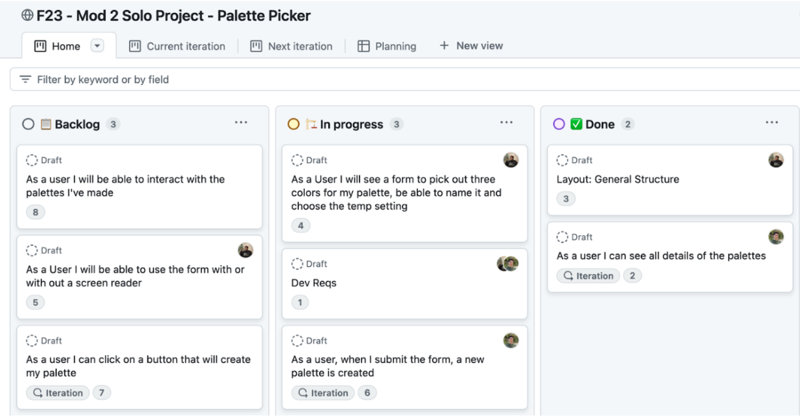

# Mod 4 Project Week

- [Overview](#overview)
  - [Learning Objectives](#learning-objectives)
  - [Deliverables](#deliverables)
  - [Roles](#roles)
  - [API](#api)
- [Agile Methodologies](#agile-methodologies)
  - [Scrum Board](#scrum-board)
  - [Daily stand-up and stand-down](#daily-stand-up-and-stand-down)
- [Milestones](#milestones)
  - [Day 1](#day-1)
  - [Day 2](#day-2)
  - [Day 3](#day-3)
  - [Day 4](#day-4)
  - [Day 5](#day-5)
- [Technical Requirements Checklist](#technical-requirements-checklist)
  - [Fetching Requirements](#fetching-requirements)
  - [User Interface: Structure \& Accessibility](#user-interface-structure--accessibility)
  - [Meta](#meta)
  - [Form Requirements](#form-requirements)
- [Tips for Success](#tips-for-success)
  - [Focus on demonstrating your learning, not building something unique.](#focus-on-demonstrating-your-learning-not-building-something-unique)
- [Make Decisions Quickly](#make-decisions-quickly)
  - [Plan and Delegate!!](#plan-and-delegate)
  - [Meet on your own time](#meet-on-your-own-time)
  - [Test your API!](#test-your-api)

## Overview

For this project week, you and a partner will build an application that interacts with a third-party API. You will fetch data, render the fetched data to the DOM, and then fetch some more data\! 

The main technical goal of your app is to **send two fetches** and render the fetched data: 

1. First, fetch a collection of resources (GET a set of users, a set of pictures, a set of authors) and render all of those resources   
2. Fetch more details about a single one of those resources (GET details about a single user, a single picture, a single author, etc…) and then render those details

Check out [this deployed example](https://art-viewer-mike-example.github.io/art-viewer-day-3/) called "Art Viewer". Notice that the application fetches a bunch of pieces of art but you can also click on a single piece of art to see more details. The search feature and the ability to choose how many pieces are shown per page are bonuses. Of course, you can do more than this, but this is the minimum idea\!

### Learning Objectives

* Demonstrate your skills learned from Mods 1-3: Core JavaScript, HTML & CSS, DOM Manipulation, and Asynchronous JavaScript  
* Develop teamwork skills including communication, problem-solving, compromise, and task management  
* Strengthen your Git workflow fundamentals, managing branches, navigating merge conflicts, and maintaining a repository  
* Practice Agile methodologies by managing a scrum board and by performing daily stand-up and stand-down.  
* Deploy a project\!  
* Practice your technical communication through a presentation.

### Deliverables

* [Project Proposal Template](https://docs.google.com/document/d/1gSM_RWRAP_EJGQ7pp58Pti6PXKQJ_YWx3uvC4iRQ1EI/edit) ([Example](https://docs.google.com/document/d/1ekNpWx_LKCFGPQ74qijXTMRJJoq4sHJIB1mv9Mg8HHk/edit#heading=h.dwz367p60bre))  
* Github organization ([Example](https://github.com/Art-viewer-mike-example)) — you only need one repository  
* Scrum Board with Backlog, In Progress, and Done ([Example](https://github.com/users/benspector-mls/projects/3/views/1?layout=board))  
* A Deployed project link ([Example](https://art-viewer-mike-example.github.io/art-viewer-day-3/))  
* A walkthrough demo video \+ Presentation ([Template](https://docs.google.com/presentation/d/1NvzL4yUaVSNFlmNtG3shNdK4j0oW3Ll2zbq8gK2vrzQ/edit?usp=sharing), [Example 1](https://docs.google.com/presentation/d/1SRZRr3ioL3TYyPTPFwVcayp4q47ia9I6NV9kFSUofxQ/edit#slide=id.g2b32ee03b40_0_717), [Example 2](https://docs.google.com/presentation/d/1zyfnu7PDpf5E3Ff7FIUdqAyvMGiAzdh_06RHAau4nF4/edit#slide=id.g2b32ee03b40_0_717))

### Roles

* Software Engineer  
* Scrum Master  
* Engineering Manager (instructor)

### API

You *must* choose an API from this [list of free APIs](https://gist.github.com/MostlyFocusedMike/2a0825c062b79d33e5003f0f767ad0fa) as they are all free and, importantly, do not require an API key. The purpose of this project is to demonstrate your ability to perform fetches and render the returned data on the screen. **The subject matter itself is not important and you do not need to create a unique project.** 

## Agile Methodologies

As you build this project, you will need to be incredibly organized and communicate well with your partner. Throughout your career, as you work on more projects and on more teams, you will realize that the people you enjoy working with most are excellent communicators and are highly organized. And finally, to hiring managers, being able to demonstrate your communication skills and approach to organization can really set you apart in the hiring process.

In the world of software engineering, one methodology for successful communication and organization is called "The Agile Methodology" (look it up\!). While there are many aspects to this methodology, we will focus on two of its most important practices: maintaining a scrum board and holding stand-up and stand-down meetings.

### Scrum Board

A scrum board is a tool for managing tasks called "tickets". The scrum board separates these tickets into what needs to be completed, what is in progress, or what tasks are in the "backlog." It is also used for assigning tickets to be owned by individuals on the team and assigning due dates for them. This practice is essential for ensuring that every task is completed and every team member is contributing meaningfully.

### Daily stand-up and stand-down

Stand-up and stand-down meetings are held daily and are meant to take only a few minutes. The purpose of this meeting is to update the status of scrum board tickets and for every team member to share three things:

* What did they get done?  
* What do they plan on completing next?  
* What are they stuck on and may need help with?

By sharing these details, the scrum board is meticulously maintained and every team member can be aware of the overall progress made on the project.

## Milestones

The key to success on this project is to break down your goals into attainable chunks. For this Art Viewer project, you can see the progress made on each day.

* [https://art-viewer-mike-example.github.io/art-viewer-day-1](https://art-viewer-mike-example.github.io/art-viewer-day-1/) (just the app is deployed. It doesn't do anything yet)  
* [https://art-viewer-mike-example.github.io/art-viewer-day-2](https://art-viewer-mike-example.github.io/art-viewer-day-2/) (we can fetch and then render a list of pictures)  
* [https://art-viewer-mike-example.github.io/art-viewer-day-3](https://art-viewer-mike-example.github.io/art-viewer-day-3) (we can click on a picture to fetch more details about that one picture)

*Note: no need to create a new repo for each day \- this is just done this way for demonstration purposes.*

As you work on this project, don't set your sights on the fully completed project from the jump. Give yourself smaller goals that you can reach each day and focus on one goal at a time. As long as your goals build on each other, you will eventually reach your final destination.

Below, we've laid out some daily milestones that you can strive for.

### Day 1

- **5pm:** The [proposal document](https://docs.google.com/document/d/1gSM_RWRAP_EJGQ7pp58Pti6PXKQJ_YWx3uvC4iRQ1EI/edit) is complete and posted in the group Slack channel.   
  - **Bare Minimum:** Two examples of API fetch calls. One for many things. One for one thing.  
  - **Ideal:** Descriptions of user stories. Wireframe shows thoughtful idea about what data is displayed.  
  - **Stretch:** Link to their created GitHub organization and repo in their group slack channel  
- Note: If you have not submitted your proposal and are undecided about your API by this deadline, you will be assigned an API by your Engineering Manager.

### Day 2

- **1:30pm (soft deadline):** Construct your scrum board with tickets.  
- **3pm (soft deadline):** Start working on deploying skeleton code to GitHub pages if you have not already done so  
  - **Bare minimum:** The repo has an `index.html` file with a title of the project name  
  - **Ideal:** The above, *plus* 2 console logs showing the two successful fetches. One fetch for the full set of data and a second fetch for details on just one resource.  
  - **The stretch:** The 2 fetch’s data is displayed *roughly* on the page somehow (e.g. you just dump the data into the body with `document.body.innerHTML += "..."`)  
- **5pm:** Deploy the skeleton code and share a link to your website in Slack. Repo has a filled-out scrum board.

### Day 3

- **9am-5pm:** Work on your Minimum Viable Product (MVP). MVP is:  
  - **Bare minimum:** Full set of data is fetched and displayed  
  - **Ideal:** You can click on one item and fetch details about that one item (don't need to render it yet)  
  - **Stretch:** You can click on and render data about a single item  
- Meet with your Engineering Manager to provide a detailed update on progress.  
- **5pm:** Post a screenshot of the deployed MVP in their group chats.	

### Day 4

- **5pm:** Post a screenshot(s) of their app with some “marked improvement” so either: a rough new stretch feature from their proposal, or a more fully styled site (layout, colors, fonts, animations)  
  - **Bare minimum:** Flexbox / Grid is used to organize fetched data set  
  - **Ideal:** Consistent fonts and colors used throughout the page with a mobile view and a desktop view.  
  - **Stretch:** A new feature is added (`localStorage`, a form to filter fetches, additional fetches, etc…)

### Day 5

- **4pm:** Deploy whatever the “final” version of the app is with screenshots. The app should be frozen in its deployments. That should be:   
  - 2 fully completed MVP Features   
  - 1 or more fully completed stretch features   
  - Fully styled and responsive site   
- **5pm:** Complete Presentation with a walkthrough video that is no longer than 3 minutes.   
  - The walkthrough is a simple screen share of one user walking through the site and narrating what they’re doing. The minimum 2 features should be demonstrated on a deployed site.

## Technical Requirements Checklist

In order to see how well you're doing with this project, here are all the things we need to see from you. If you get all of these, then you know that you're where you need to be\!

### Fetching Requirements

- [ ] The application makes two fetches:  
    - [ ] A fetch is made to an API that returns an array of data.  
    - [ ] A fetch is made to an API that returns a single data value  
- [ ] On page load, a fetch call is made, rendering initial fetch data to the screen  
- [ ] Asynchronous code uses `async` and `await`  
- [ ] Fetch calls are made using a `try` / `catch` block  
    - [ ] Errors are handled by `console.warn()`  
- [ ] `response.ok` is checked before parsing  
    - [ ] Throw a new error if the response is NOT ok

### User Interface: Structure & Accessibility

- [ ] The `head` has a `title`  
- [ ] There is a single `main` element on the page  
- [ ] There is a single `h1` element on the page  
- [ ] There is a `section` for the rendering an array of fetched data  
    - [ ] The section has an `h2`  
    - [ ] The section has a `ul` with `li` items that display the fetched data  
    - [ ] Fetched items appear next to each other in a grid-like pattern (flex or grid presentations fine)  
- [ ] There is a `section` for displaying a single fetched item  
    - [ ] The section has an `h2`  
    - [ ] The section displays information about the single fetched item  
- [ ] `section` elements have an `aria-label` or `aria-labelledby` attribute that describes the section   
- [ ] There are no instances of recreating any semantic elements (using a `div` for a `nav`)  
- [ ] The entire application is responsive with mobile and desktop compatibility (we recommend a mobile-first approach)

### Meta

- [ ] The project is created using Vite  
- [ ] The code exists in more than one JS file  
- [ ] The project is deployed via GitHub Pages properly  
- [ ] CSS `flexbox` or `grid` was used  
- [ ] The code does not render unescaped text directly to the DOM (`createElement` or other escape method used)

### Form Requirements

- [ ] There is a `form` for triggering a fetch or for modifying the fetch results  
    - [ ] `form` elements have an aria-label or aria-labelledby attribute that describes the form  
    - [ ] The form has an `h2`   
    - [ ] The form has at least one `input`  
    - [ ] Every `input` element has an associated `label` element (it can be invisible but it must be in the HTML)  
    - [ ] The form has a `button` to submit the form  
- [ ] At least one field is a required field, and the form cannot be submitted without it  
- [ ] Clicking the form submit button does not reload the page because the default behavior is prevented  
- [ ] Clicking the form submit button clears the form

## Tips for Success

### Focus on demonstrating your learning, not building something unique.

One of the easiest ways to get off track is by worrying about creating a unique project:

* Student projects are not meant to be unique.   
* You're not creating a new app that addresses a gap in the market.   
* You aren't deploying this app for the purpose of having real users.   
* **Student projects are meant for learning and demonstrating your learning**

## Make Decisions Quickly

You may have a great idea that you really want to implement, but remember, **you are working as a team and you only have a week**. Time is not on your side and the more time you waste disagreeing with your partner about what features to implement or what API to use, the less time you'll have to actually build the thing.

### Plan and Delegate\!\!

* Use branches and make PRs  
* Use your scrum board  
* Assign tasks  
* Don't do duplicate work

### Meet on your own time

Be in alignment with your teammate outside of the scheduled meetings with your engineering manager

### Test your API\!

Actually write a fetch to make sure that the API works before choosing it for your proposal  
