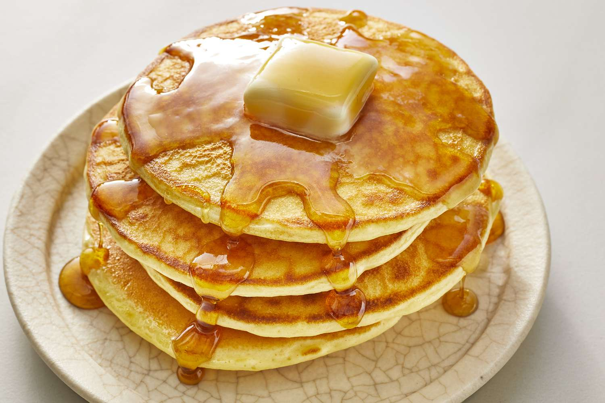
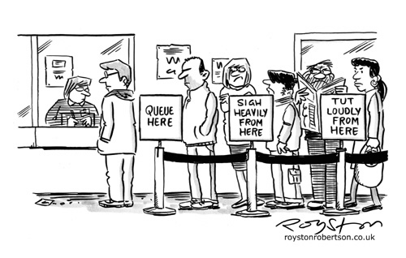

# Stacks & Queues

- [Essential Questions](#essential-questions)
- [Key Terms](#key-terms)
- [Introduction: Why Learn Data Structures?](#introduction-why-learn-data-structures)
- [Abstract Data Types](#abstract-data-types)
- [What is a Stack?](#what-is-a-stack)
  - [A Stack of Pancakes](#a-stack-of-pancakes)
  - [Stack Implementation](#stack-implementation)
  - [Use Cases in Programming: Stack Overflow](#use-cases-in-programming-stack-overflow)
- [What is a Queue?](#what-is-a-queue)
  - [Get in line!](#get-in-line)

## Essential Questions

* What is an _abstract data type_?
* How does the ordering of stack differ from the ordering of items in a queue?
* Where do we see stacks and queues in the real world?
* What are common use cases for stacks and queues in computer science?
* What are the run times for insertion, deletion, and accessing from stacks & queues?

## Key Terms

* Abstract data type
* Stack
* Queue
* FIFO
* LIFO

## Introduction: Why Learn Data Structures?

Let's start with a question. 

**<details><summary style="color: purple">Q: Why is it important to know different data structures? For example, if Arrays and Objects can both store collections of data, why should I know how to use both of them?</summary>**
> Every data structure has advantages and disadvantages. While Arrays and Objects can both store collections of data, but the operations you can perform with them are different. Knowing their differences allows you to choose the right data structure for every situation.
</details><br>

## Abstract Data Types

An **abstract data type (ADT)** is a high-level ("abstract") description about how a particular type of data behaves *without concern for how it is implemented*. You already know about the Array and Object abstract data types!

* For example, we know that the Array abstract data type stores values in order and each value can be accessed by its index. In JavaScript, we know that the syntax to do this is `array[index]`, and yet we don't need to know how JavaScript implements this functionality "under the hood" in order to use it!
* We also know that Objects store data in `key: value` pairs rather than using indexes.
* Knowing *what* an Object can do compared to an Array is enough for us to decide which to use for a particular situation.

Abstract data types are **language-agnostic** — they may be implemented differently in different programming languages but they will all have the same high-level behavior. Arrays in every programming language will have ordered values that are accessible via an index!


In the real world, the idea of a car is similar to an abstract data type. All cars have doors, wheels, and an engine and with my driver's license, I can operate pretty much any kind of car. However, each manufacturer has a different approach to creating their cars and, under the hood (literally), they may look very different.

**Q: What are some other real world analogies of abstract data types?**

## What is a Stack?

A stack is a abstract data type that serves as a collection of values with two operations:

* push — inserts a new element to the "top" of the stack.
* pop — removes the most recent element added to the stack.

Stacks are often referred to as a "last in, first out" (LIFO) data structure.

If you're thinking — "hey these operations are the same as an Array!" — you're right! In fact, Stacks are often implemented using Arrays (though they can be implemented using other data structures as well).

### A Stack of Pancakes

Imagine you are making pancakes. When each pancake is ready, you add it to a plate until you have a nice *stack* of pancakes. 



Which pancake would you eat first? The first pancakes you added to the plate, or the last?

The top one right? The *last* pancake that you added to the stack is the *first* one that you eat! 

Another example! Let stay you have a bunch of plates you wouldn't try to take the one all of the way at the bottom. You need to take the one that is on the top of the stack ... again that was probably the last one in, so it would be the first one out.

### Stack Implementation

In JavaScript, we will often implement abstract data types using a `class`. This let's us effectively create a new data type! Each implementation of a data type should have a way to store values and methods for accessing them. 

With a Stack, since we want the `push` and `pop` methods, we can use a private Array as the **underlying data structure** and then add methods for `push` and `pop` that access the private Array.

```js
class Stack {
  #values = [];

  push(data) {
    this.#values.push(data)
  }

  pop() {
    return this.#values.pop();
  }
}
```

While all Stacks need to have a `push` and `pop` method, sometimes, they can have additional methods like `peek` (look at the top value but don't remove it), `isEmpty` (check if the stack is empty), and `size` (get the number of values in the stack). **How would you implement those functions?**

### Use Cases in Programming: Stack Overflow

A stack overflow occurs when a program tries to use more memory space than the stack can hold. The stack is a region of memory used for storing temporary data, such as function call frames and local variables. Each time a function is called, a new frame is added to the stack, and each time a function returns, its frame is removed. When the stack becomes full and there is no more space for new frames, a stack overflow occurs. This can lead to the program crashing or behaving in unexpected ways. It can also be caused by infinite recursion, where a function calls itself endlessly without returning, filling up the stack with repeated call frames.

## What is a Queue?

A Queue is a collection of values, similar to the Stack, with these two operations:

* enqueue — inserts a new element to the "back" of the Queue.
* dequeue — removes the element at the "front" of the Queue.

Queues are often referred to as "first in, first out" (FIFO) data structures.

### Get in line!

Imagine you go to a restaurant. There's a line of people waiting. Some audacious, rule-breaking people may cut straight to the front, but they will likely receive some serious glares. 



According to the norms of society, the **first** person in line is the **first** person to be served.

### Queue Implementation

To implement a Queue, we can again use an Array! The `enqueue` method is just like the Stack and Array `push` method. However, the `dequeue` method requires us to remove the first element from the Array.

Rather than using `pop`, we can use `shift`.

```js
class Queue {
  #values = [];

  enqueue(data) {
    this.#values.push(data)
  }

  dequeue() {
    return this.#values.shift();
  }
}