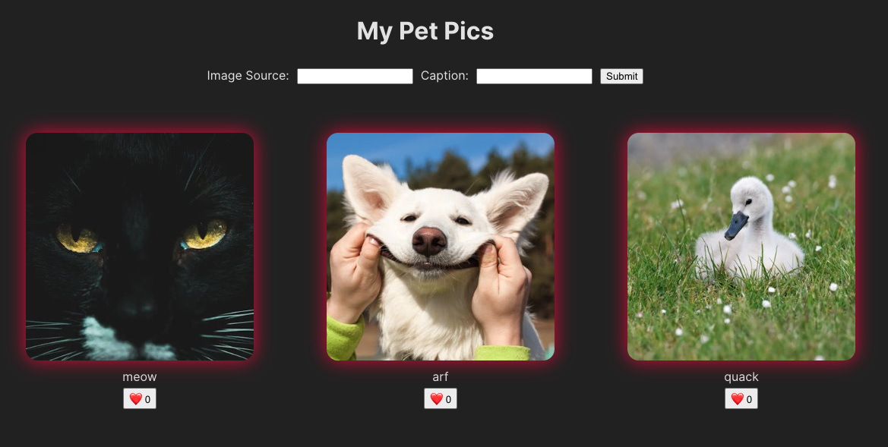
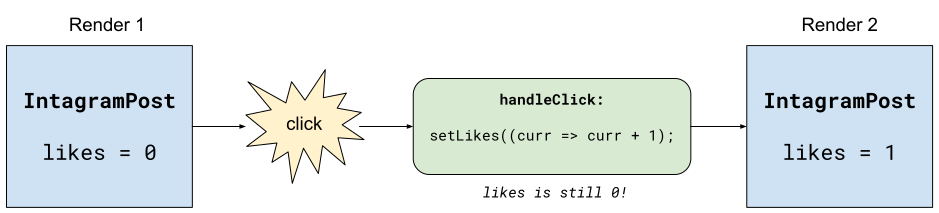
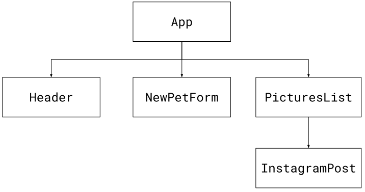

# Events, State, and Forms


Follow along with code examples [here](https://github.com/The-Marcy-Lab-School/7-0-1-managing-state-and-forms)!


In this lesson, we will look at how to respond to events in React and use those events to manage the ever-changing state in our application.

**Table of Contents**

* [Terms](2-events-state-and-forms.md#terms)
* [Instapets](2-events-state-and-forms.md#instapets)
* [Handling Changing State](2-events-state-and-forms.md#handling-changing-state)
  * [Our Components Already Render Data](2-events-state-and-forms.md#our-components-already-render-data)
  * [Changing A Variable In Reaction to Events](2-events-state-and-forms.md#changing-a-variable-in-reaction-to-events)
* [`useState`](2-events-state-and-forms.md#usestate)
  * [Import useState from react](2-events-state-and-forms.md#import-usestate-from-react)
  * [Invoke useState at the top of your component](2-events-state-and-forms.md#invoke-usestate-at-the-top-of-your-component)
  * [Use the setter function to update the state](2-events-state-and-forms.md#use-the-setter-function-to-update-the-state)
  * [All Together Now](2-events-state-and-forms.md#all-together-now)
  * [`setLikes` does NOT change the value of `likes`](2-events-state-and-forms.md#setlikes-does-not-change-the-value-of-likes)
* [Forms](2-events-state-and-forms.md#forms)
  * [Controlled Forms](2-events-state-and-forms.md#controlled-forms)
* [Discussion! Lifting State Up](2-events-state-and-forms.md#discussion-lifting-state-up)

## Terms

* **State** — Data that is used by an application at a particular point in time. State is often mutable, meaning it can be changed over time, usually in response to user actions or other events
* **Stateful Component** — A component that depends on state and is re-rendered whenever the state changes.
* **Hooks** — Functions that provide a wide variety of features for React components. They all begin with `use()`.
* **`useState`** – A react hook for managing state within a React component. It returns an array with a state value and a setter function. It triggers the component to re-render when the state changes.
* **Lifting state up** — A practice where state is defined in a parent component so that it can be used by its child components.
* **Controlled Form** — A form whose value changes are controlled by a piece of state.

## Instapets

In this lesson, we'll be using an app called `instapets` to demonstrate building **stateful components**. A stateful component is one that depends on state and re-renders whenever the state changes.

**State** is the data that is used by an application at a particular point in time. State is often mutable, meaning it can be changed over time, usually in response to user actions or other events

Right now the app is not stateful. It renders 3 hard-coded pet pictures, the form doesn't work and neither do the "Like" buttons.



Let's build this thing!

## Handling Changing State

Let's tackle the likes buttons first.

### Our Components Already Render Data

Each `InstagramPost` component renders a picture, a caption and a button to increment and display likes.

> Notice how we added an `onClick` prop with the `handleClick` callback function.

```js
const InstagramPost = ({ picture }) => {

  let likes = 0;

  const handleClick = {
    
  }

  return (
    <div className="insta-pic">
      
      <p>{picture.caption}</p>
      <button onClick={handleClick}>❤️ {likes}</button>
    </div>
  );
};

export default InstagramPost;
```

A stateful component is one that renders state — data values that may change.

<details>

<summary><strong>Q: What data values does this component render? Is any of that considered "state"?</strong></summary>

`likes` and `picture` These values are not considered state because they are hard-coded! They will not change.

</details>

\


### Changing A Variable In Reaction to Events

Let's make `likes` a piece of mutable state.

We want to update `likes` each time we click on the `Like` button. So, maybe this will work?

```js
const InstagramPost = ({ picture }) => {
  console.log('rendering InstagramPost');
  
  let likes = 0;

  const handleClick = () => {
    likes++;
    console.log(likes);
  }

  return (
    <div className="insta-pic">
      
      <p>{picture.caption}</p>
      <button onClick={handleClick}>❤️ {likes}</button>
    </div>
  );
};
```

While this _does_ increment the `likes` value, it doesn't cause the component to re-render because React isn't watching this value for changes.

## `useState`

So how do we make the component re-render with the updated `likes` value?

We need a **hook**. Hooks in react are functions that perform a variety of jobs. They can be identified by their name which starts with "use":

* `useState()`
* `useEffect()`
* `useNavigate()`
* `useParams()`
* `useContext()`
* etc...

The `useState` hook allows us to create a piece of state that React will watch and when the state changes, it will re-render.

Here's how it works:

### Import useState from react

```jsx
// InstagramPost.jsx
import { useState } from "react";
```

* `useState` is a _named export_ of the `react` package (note the `{}` around the function in the `import` statement).

### Invoke useState at the top of your component

```jsx
const InstagramPost = () => {
  const [likes, setLikes] = useState(0);

  // handleClick and the return statement
};
```

* `useState` _must_ be called at the top of a component. [Otherwise weird stuff happens](https://legacy.reactjs.org/docs/hooks-rules.html).
* `useState(0)` returns an array with two values:
  1. A piece of state data (`likes`) with a starting value (`0`)
  2. A "setter" function for updating that state data (`likes`) and re-rendering the component
* The convention is to name state variables like `[something, setSomething]` using array destructuring.

### Use the setter function to update the state

```jsx
const handleClick = () => {
  setLikes(likes + 1); // this is OK but can cause some race issues
  setLikes((currentLikes) => currentLikes + 1); // this is better when the next value depends on the current value
  likes++; // Don't do this
};
```

* When the event handler is clicked, we'll invoke `setLikes` which either accepts:
  * the new value that we want to set `likes` to or...
  * a callback function for turning the current value of `likes` into the next value of `likes`.
* As we saw, incrementing `likes` directly does not cause the component to re-render
* `setLikes` will cause the component to re-render with the provided value as the new value for `likes`

### All Together Now

```jsx
import { useState } from 'react';

const InstagramPost = ({ picture }) => {
  const [likes, setLikes] = useState(0)

  const handleClick = () => {
    setLikes((currentLikes) => currentLikes + 1)
  }

  return (
    <div className="insta-pic">
      
      <p>{picture.caption}</p>
      <button onClick={handleClick}>❤️ {likes}</button>
    </div>
  );
};
```

**Quiz!**

* Why did we pass in `0` when we invoked `useState`?
* What does `useState()` return?
* What does `setLikes()` do? What kinds of inputs does it take?

### `setLikes` does NOT change the value of `likes`

Interestingly `setLikes` does NOT change the value of `likes` within the `handleClick` callback. It tells React to re-render the `InstagramPost` component with a new value of `likes`.



You can see this if you place a `console.log(likes)` statement inside of `handleClick` callback.

This kind of makes sense: `setLikes` isn't actually changing any value. It's just saying what the next value _should_ be.

## Forms

Next up we'll make a form for the user to add new pet pictures.

Creating a form using JSX in React is almost identical to creating a form using HTML. Take a look at `NewPetForm.jsx`:

```jsx
const NewPetForm = () => {
  const handleSubmit = (e) => {
    e.preventDefault();
  }

  return (
    <form onSubmit={handleSubmit}>
      <label htmlFor="src-input">Image Source:</label>
      <input type="text" name="src" id="src-input"/>
      <label htmlFor="caption-input">Caption:</label>
      <input type="text" name="caption" id="caption-input" />
      <button>Submit</button>
    </form>
  )
}
```

* Instead of `for` we use `htmlFor` when connecting labels and inputs.
* We use `onSubmit` instead of using `addEventListener`.

Now, how do we handle the submission event?

### Controlled Forms

A **controlled form** is a form element whose input values are controlled by React state rather than through DOM manipulation.

To create a controlled form, we will:

1. Create a piece of state for each input we want to control
2. Assign the `value` prop of the input to the input state value we just created
3. Assign an `onChange` handler to the input that invokes the state setter function
4. When handling submissions, we can simply reference the input state values.
5. Remember to reset the state values after submission.

```jsx
const NewPetForm = () => {

  // 1. Create a piece of state for each input we want to control
  const [src, setSrc] = useState('');
  const [caption, setCaption] = useState('');

  const handleSubmit = (e) => {
    e.preventDefault();

    // 4. When handling submissions, we can simply reference the input state values.
    console.log(src, caption);

    // 5. Remember to reset the state values after submission.
    setSrc('');
    setCaption('');
  }

  // 2. Assign the `value` prop of the input to the input state value we just created
  // 3. Assign an `onChange` handler to the input that invokes the state setter function
  return (
    <form onSubmit={handleSubmit}>
      <label htmlFor="src-input">Image Source:</label>
      <input 
        type="text" 
        name="src" 
        id="src-input" 
        value={src} 
        onChange={(e) => setSrc(e.target.value)} 
      />
      <label htmlFor="caption-input">Caption:</label>
      <input 
        type="text" 
        name="caption" 
        id="caption-input" 
        value={caption} 
        onChange={(e) => setCaption(e.target.value)} 
      />
      <button>Submit</button>
    </form>
  )
}
```

* Notice how each input has a `value` and an `onChange` prop associated with a particular piece of state.
* When it is time to submit the form, we can easily use the `src` and `caption` state values without digging through the form.

## Discussion! Lifting State Up

The last step to putting this together is having the form submission actually add a new picture to the list of pictures.

Here is the component tree of the application:



The challenge is that `PicturesList` is where the `pictures` are defined but we want to update the list of pictures from `NewPetForm`.

If we were to turn the `pictures` array into some state like this:

```jsx
const [pictures, setPictures] = useState(initialPictures);
```

<details>

<summary><strong>Q: Where should I put this? Why?</strong></summary>

The state should be defined in the `App` which is the closest shared ancestor of the `NewPetForm` and the `PicturesList`. The `App` can then pass those values down to its children as props. This is called **"lifting state up"**. Check out the `1-instapets-final/` to see how this is done:

* `App` uses `useState` to define the `pictures` and `setPictures` values
* It passes down `pictures` to `PicturesList`
* It makes an `addPicture` helper function and passes it down to `NewPetForm` to invoke upon submission.
* Notice how `addPicture` sets the state by copying the existing array and adding a new object.

</details>

\
