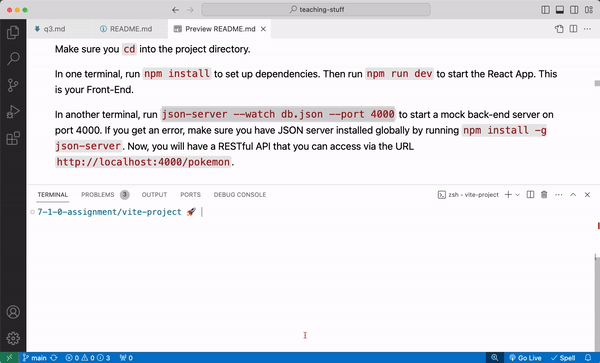

# React + Vite Flashcard App

## Brainstorming

I want to build a flashcard app. 

### MVP

I'm imagining a dataset of questions/answers and I can display each question as a "card". When I click on the card, it will "flip" and show me the answer.

### Stretch features

I don't have as clear of a picture of how I will implement these details so when planning, I'll list these features as user stories:

* Users can keep score
* There is a form so that users can add new flashcards
* Users can make "playlists" or "quizzes" that show a specific set of flashcards

## Setup

First, create the app using Vite: `npm create vite@latest` (you may be prompted to install the latest version of vite)

```sh
npm create vite@latest
# Name it flashcards
# Select React
# Select JavaScript

cd flashcards
npm i

# Delete the contents of App.jsx
```

## Data

I know that I'll need some flashcard data to render.

To get myself started, I used ChatGPT to give me a dataset of flashcards rather than come up with my own set of questions. I asked for the data in JSON format so that I could easily import it into my app.


I then stored the resulting data in a `.json` file called `src/db/flashcards.json` (I made a `src/db` folder since this is sort of like my "database").

```json
{
  "flashcards": [
    {
      "id": 1,
      "question": "What is React?",
      "answer": "React is a JavaScript library for building user interfaces."
    },
    {
      "id": 2,
      "question": "What is JSX?",
      "answer": "JSX is a syntax extension for JavaScript used with React to describe what the UI should look like."
    },
    {
      "id": 3,
      "question": "What are components in React?",
      "answer": "Components are the building blocks of a React application. They encapsulate logic and UI."
    },
    ...
  ]
}
```

ChatGPT did a great job of giving me data in a format that I could easily use. 
* The data was in an Array which means I can render a "card" for each object using `.map()` in a `ul`
* Each flashcard object had:
  * an `id` which I can use for list item `key` props and much more
  * a `question` and an `answer` which will be useful for when I want to toggle which text I show to the user.

## JSON Server

JSON Server is a tool to we use to spin up a mock API. It basically lets us turn any properly formatted `.json` file into a full API running on `localhost`.

It is a great alternative when you don't have the time to build out a full Express API. It does have its limitation in that it cannot support a robust relationships database. Read the [JSON Server documentation](https://github.com/typicode/json-server#getting-started) for more information.

Using the JSON file we created above, we can create a mock API. To set it up we can:

1. Run `npm install -g json-server` to install json server globally
2. Create the `.json` file. We did this already: `db/flashcards.json`
3. From the root of your vite project, split your terminal and run `json-server --watch db/flashcards.json --port 4000` to start a mock back-end server on port 4000. 



4. Now, you will have an API that you can access via the URL http://localhost:4000/flashcards (try visiting that URL in your browser!)

`json-server` only works if the `.json` file is in the proper format. The JSON file needs to store a JSON object with a top-level property that names the resource to be fetched. 

Something like (feel free to copy this):

```json
{
  "flashcards": [
    {
      "id": 1,
      "question": "What is React?",
      "answer": "React is a JavaScript library for building user interfaces."
    },
    {
      "id": 2,
      "question": "What is JSX?",
      "answer": "JSX is a syntax extension for JavaScript used with React to describe what the UI should look like."
    },
    {
      "id": 3,
      "question": "What are components in React?",
      "answer": "Components are the building blocks of a React application. They encapsulate logic and UI."
    }
  ]
}
```

In this example, `"flashcards"` is the top-level property which makes http://localhost:4000/flashcards a valid endpoint. When we send a `GET` request to that endpoint, we'll get back the value of `"flashcards"`.

**Q: What would be the endpoint(s) created if this were our JSON file?**

```json
{
  "friends": [
    "ben",
    "gonzalo",
    "carmen"
  ],
  "message": {
    "data": "hello world"
  }
}
```

**<details><summary style="color: purple">Answer</summary>**
> http://localhost:4000/friends and http://localhost:4000/messages
</details><br>

**Q: How would I make a http://localhost:4000/flashcards/react or http://localhost:4000/flashcards/fetch endpoint?**

**<details><summary style="color: purple">Answer</summary>**
```json
{
  "flashcards": {
    "react": [
      {
        "id": 1,
        "question": "What is React?",
        "answer": "React is a JavaScript library for building user interfaces."
      },
      ...
    ],
    "fetch": [
      {
        "id": 1,
        "question": "What does fetch do?",
        "answer": "fetch sends an HTTP request to the provided url."
      },
      ...
    ]
  }
}
```
</details><br>

## Component Structure

To make the MVP, the app can be quite simple. Just render a `ul` with an `li` "card" for each flashcard object. So I basically just need my `App` component and `Flashcard` component. I'll then map each object in the dataset to a `<Flashcard />`.

For the MVP, here is what I came up with:

### Flashcard Component

The `Flashcard` component should be focused solely on rendering a single `flashcard` object. It can maintain its own state to toggle back and forth between showing the question and the answer.

```jsx
import { useState } from 'react'

const Flashcard = ({ flashcard }) => {
  const [text, setText] = useState(flashcard.question)
  const [backgroundColor, setBackgroundColor] = useState('lightblue')

  const flipCard = () => {
    if (text === flashcard.question) { // show the answer
      setText(flashcard.answer);
      setBackgroundColor('lightgreen');
    } else {
      setText(flashcard.question); // show the question
      setBackgroundColor('lightblue');
    }
  }

  // set the style dynamically using the backgroundColor state
  const style = { background: backgroundColor }

  return (
    <li className="card" onClick={flipCard} style={style}>
      <p>{text}</p>
    </li>
  )
}
```
* The `Flashcard` component takes in a `flashcard` object as a prop.
* It also keeps track of two state values: `text` and `backgroundColor` which can be toggled between showing the question and showing the answer
* We provide a `style` prop to dynamically set the style of the component using the `backgroundColor` state
* We render the flashcard as an `li` with an `onClick` prop, a `style` prop, and with the `text` state rendered.

### App Component

The App component needs to fetch the set of flashcards from the json-server URL http://localhost:4000/flashcards when the component first loads and then use that data to render a list of flashcards.

```jsx
import './App.css'
import { useState, useEffect } from 'react'
import fetchData from './utils/fetchData'
// Check out the helper function ^

const Flashcard = () => {
  // flashcard component
}

function App() {
  const [flashcards, setFlashcards] = useState([]);
  const [error, setError] = useState(null);

  useEffect(() => {
    const doFetch = async () => {
      const [data, error] = await fetchData('http://localhost:4000/flashcards');
      if (data) setFlashcards(data);
      if (error) setError(error);
    };
    doFetch();
  }, []); // run the effect only once

  // Conditionally render the error message 
  if (error) return <p>{error.message}. Refresh to try again.</p>

  return (
    <>
      <h1>Flash Cards</h1>
      <ul>
        {
          flashcards.map((flashcard) => <Flashcard key={flashcard.id} flashcard={flashcard} />)
        }
      </ul>
    </>
  )
}

export default App
```

Let's break it down:
* The `App` keeps track of `flashcards` and `error` state. 
* We use `useEffect` to fetch the flashcard data from our json-server when the component first renders (and only that one time).
  * Then we either invoke `setFlashcards` or `setError` depending on the returned data.
* The `App` component maps over the `flashcards` data, creating a `Flashcard` component for each `flashcard` object.
* When rendering a list of components, we use the `flashcard` object's `id` as the `key` and pass along the `flashcard` object as a prop.
* Since I kept the starting CSS styles that came with the Vite project, it actually looks okay.

## Next Steps

* Organize my components into separate files
* Build out stretch features
* Add better styling