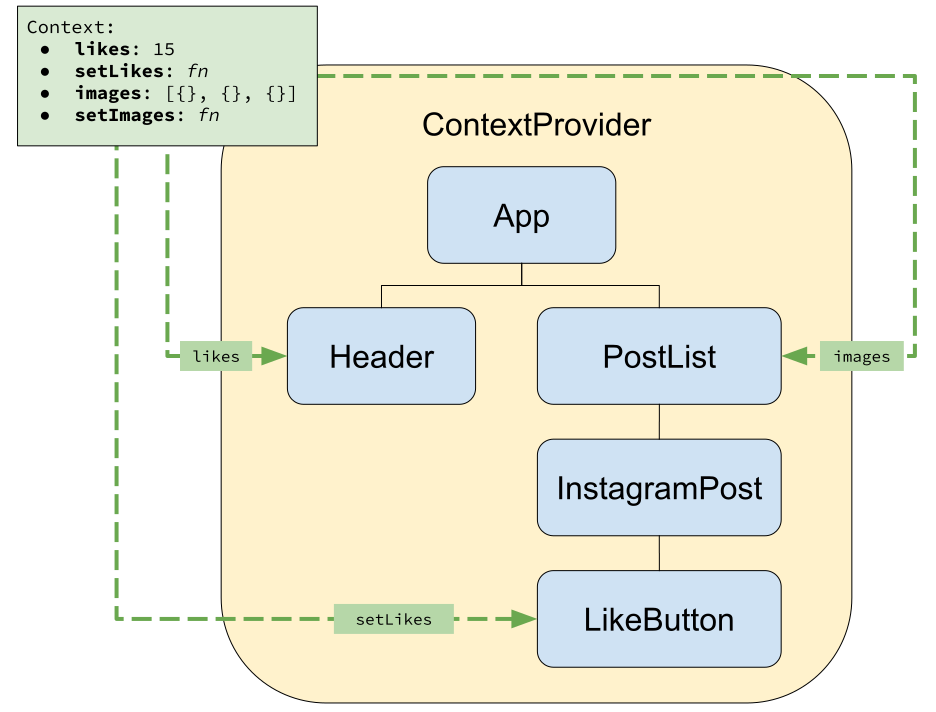

# Global Context Design Pattern


Follow along with code examples [here](https://github.com/The-Marcy-Lab-School/7-1-1-global-context-pattern)!


**Table of Contents**:
- [Global Context Design Pattern](#global-context-design-pattern-1)
  - [1) Create a `ContextProvider` wrapper component](#1-create-a-contextprovider-wrapper-component)
  - [2) Import and Render the ContextProvider component in main.jsx](#2-import-and-render-the-contextprovider-component-in-mainjsx)
  - [3) Refactor other components as necessary](#3-refactor-other-components-as-necessary)


## Global Context Design Pattern



The illustration above shows how we can **wrap the _entire_ `App` component in our context**, but in the example we only wrap the `PostList` component.

```jsx
import Header from "./components/Header";
import PicturesList from "./components/PicturesList";
import { useState } from "react";
import InstagramContext from "./context/InstagramContext";

const App = () => {
  const [totalLikes, setTotalLikes] = useState(0);
  const incrementTotalLikes = () => setTotalLikes(totalLikes + 1);

  return (
    <>
      <Header likes={totalLikes} />
      <InstagramContext.Provider value={incrementTotalLikes}>
        <PicturesList />
      </InstagramContext.Provider>
    </>
  );
};
```

If we import the `InstagramContext` into `main.jsx` and render the `InstagramContext.Provider` around the `App` component...

```jsx
import ReactDOM from "react-dom/client";
import App from "./App.jsx";
import "./index.css";
import InstagramContext from "./context/InstagramContext";

ReactDOM.createRoot(document.getElementById("root")).render(
  <InstagramContext.Provider value={"???"}>
    <App />
  </InstagramContext.Provider>
);
```

...we run into an issue - what `value` do we provide?

The state values that we want to provide (`incrementTotalLikes`) lives in the `App` component. We can't lift that state up to the `main.jsx` file because there isn't a component here!

Wrapping the `App` component is common, and there is a common solution:

### 1) Create a `ContextProvider` wrapper component

We start by creating a new "wrapper-style" component that imports the Context object and renders its `.Provider`.

```jsx
// src/context/InstagramContextProvider.jsx
import { useState } from "react";
import InstagramContext from "./InstagramContext";

// children is whatever this component is wrapped around
const InstagramContextProvider = ({ children }) => {
  const [totalLikes, setTotalLikes] = useState(0);
  const incrementTotalLikes = () => setTotalLikes(totalLikes + 1);

  const contextValues = {
    totalLikes,
    incrementTotalLikes,
  };

  return (
    <InstagramContext.Provider value={contextValues}>
      {children}
    </InstagramContext.Provider>
  );
};

export default InstagramContextProvider;
```

- All of the global state for this application can be managed by this component.
- Note how the `children` prop is used. This will become clearer next.

### 2) Import and Render the ContextProvider component in main.jsx

It is easier to see how `InstagramContextProvider` is a wrapper by looking at how it is used:

```jsx
import ReactDOM from "react-dom/client";
import App from "./App.jsx";
import "./index.css";
import InstagramContextProvider from "./context/InstagramContextProvider";

ReactDOM.createRoot(document.getElementById("root")).render(
  <InstagramContextProvider>
    <App /> {/* <--- This is the `children` */}
  </InstagramContextProvider>
);
```

It is literally wrapped around the `App` component which is automatically provided to `InstagramContextProvider` as its `children` prop.

### 3) Refactor other components as necessary

With this change, the rest of our components that previously needed to manage state become greatly simplified:

Our `App` now is just a container for `Header` and `PicturesList`

```jsx
import Header from "./components/Header";
import PicturesList from "./components/PicturesList";

const App = () => {
  return (
    <>
      <Header />
      <PicturesList />
    </>
  );
};
```

Our `Header` previously needed to take in a `totalLikes` prop. Now, it retrieves it from `InstagramContext`.

```jsx
import { useContext } from "react";
import InstagramContext from "../context/InstagramContext";

const Header = () => {
  const { totalLikes } = useContext(InstagramContext);

  return (
    <header>
      <h1>My Pet Pics</h1>
      <p>My pictures have been liked {totalLikes} times!</p>
    </header>
  );
};
```

However, there is still room for other pieces of state that can be managed more "locally":

```jsx
import { useState, useContext } from "react";
import InstagramContext from "../context/InstagramContext";

const LikesButton = () => {
  // Only this one component needs this state
  const [likes, setLikes] = useState(0);
  const incrementTotalLikes = useContext(InstagramContext);

  const handleClick = () => {
    incrementTotalLikes();
    setLikes(likes + 1);
  };

  return (
    <div className="likes-container">
      <button onClick={handleClick}>Like</button>
      <p>Likes: {likes}</p>
    </div>
  );
};
```