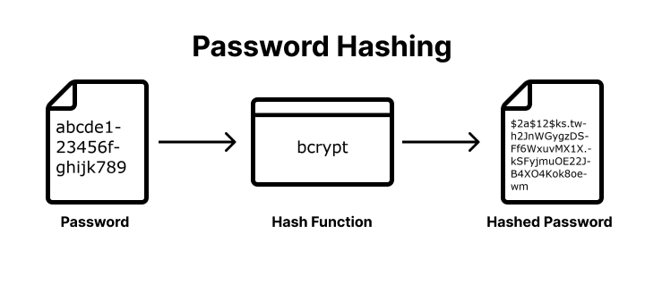
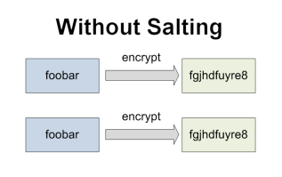
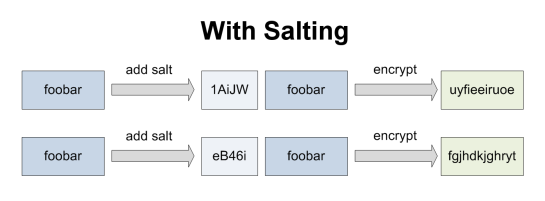

# Hashing Passwords with Bcrypt

**Table of Contents:**
- [Terms](#terms)
- [Pre-Learning](#pre-learning)
- [Hashing](#hashing)
  - [Verifying Passwords](#verifying-passwords)
- [Salting](#salting)
- [Bcrypt](#bcrypt)

## Terms

* **Hashing** - a mathematical algorithm that transforms a string of characters into a fixed-length string of characters. 
* **Password Salt** - A salt is a random string of data that is added to the input data before the hash function is applied. This changes the hash value that is produced, even for the same input data.
* **Salt Rounds** - the number of times a password has been salted before being hashed
* **Plaintext password** - the password as it was entered by the user, before it is hashed.
* **Bcrypt** - a Node module that provides functions for hashing strings and verifying hashed strings.

## Pre-Learning

Check out this video to learn about hashing, salting, and various attacks used by hackers to get accessed to your password! 

[Video: Password Hashing, Salts, Peppers | Explained!](https://www.youtube.com/watch?v=--tnZMuoK3E&ab_channel=Seytonic)

## Hashing

**Hashing** is a mathematical algorithm that transforms a string of characters into a fixed-length string of characters. 



The purpose of password hashing is to prevent attackers who obtain a database of user passwords from easily obtaining the passwords themselves. 
* Without password hashing, an attacker who obtains a user database can simply read the passwords in plain text. 
* With password hashing, the passwords are stored as **hash values**, and an attacker would need to spend significant time and resources attempting to crack the hash values back into the original passwords.

```js
const hash = (pw) => {
  return convertPasswordToHashedPassword(pw);
}

const users = []; // our "database"

const createNewUser = (username, password) => {
  const hashedPassword = hash(password);
  const user = { username, hashedPassword }
  users.push(user);
}

createNewUser('dogPerson123', 'hElLo')
createNewUser('catsRule678', 'abc')
console.log(users)
// [
//  { username: 'dogPerson123', hashedPassword: 'iFmMp' },
//  { username: 'catsRule678', hashedPassword: 'bcd' }
// ]
```

**Q: What does this hashing function do?**

### Verifying Passwords

**Q: let's say I want to try logging in as user `dogPerson123` and I provide the password `ihatedogs`, how can I verify that the password `ihatedogs` does or dot not match the hashed password?**

The beauty of a hashing function is that it MUST be pure: if given the same plaintext string, it must return the same hashed string every time. We can use this to verify any incoming password attempt:
* hash the password attempt
* compare it to the stored hashed password
* return if they match or not

```js
const hash = (plaintextPassword) => {
  // ...
}

const users = []; // our database

const createNewUser = (username, password) => {
  const hashedPassword = hash(password);
  const user = { username, hashedPassword }
  users.push(user);
}

// take a password attempt and hash it.
// if the same result is produced as the hashed password, its a match!
const authenticate = (passwordAttempt, user) => {
  return hash(passwordAttempt) === user.hashedPassword;
}

createNewUser('dogPerson123', 'hElLo123')
createNewUser('catsRule678', 'abc123')
console.log(users);

authenticate('abc123', users[1]); // true
authenticate('abc1234', users[1]); // false
```

## Salting

A salt is a random string of data that is added to the input data before the hash function is applied. This changes the hash value that is produced, even for the same input data.




Even if two users have the same password, a new salt will be generated and added to the password, generating a unique hash each time. 

```js
// A salt is a random string of data that is added to the 
// input data before the hash function is applied. This changes 
// the hash value that is produced, even for the same input data.
const getSalt = () => {
  // this salt is just a random string of 3 letters from alphabet
  let randomSalt = '';
  for (let i = 0; i < 3; i++) {
    randomSalt += alphabet[Math.floor(Math.random() * alphabet.length)];
  }
  return randomSalt;
}

const createNewUser = (username, password) => {
  const salt = getSalt();
  const hashedPassword = hash(salt + password);
  // store the salt along with the hashed password
  // hackers still need 
  const user = { username, hashedPassword, salt };
  users.push(user);
}

const authenticate = (passwordAttempt, user) => {
  // use the salt to hash the password attempt and compare
  return hash(user.salt + passwordAttempt) === user.hashedPassword;
}
```

## Bcrypt

The `bcrypt` module does this all for us! It has two key methods:
* `bcrypt.hash(password, saltRounds)`
* `bcrypt.compare(password, hashedPassword)`

```js
const hashPassword = async (password, saltRounds = 8) => {
  try {
    const hashedPassword = await bcrypt.hash(password, saltRounds);
    return hashedPassword;
  } catch (err) {
    return console.error(err.message);
  }
};
const isValidPassword = async (password, hash) => {
  try {
    const isValid = await bcrypt.compare(password, hash);
    return isValid;
  } catch (err) {
    return console.error(err.message);
  }
};
```
