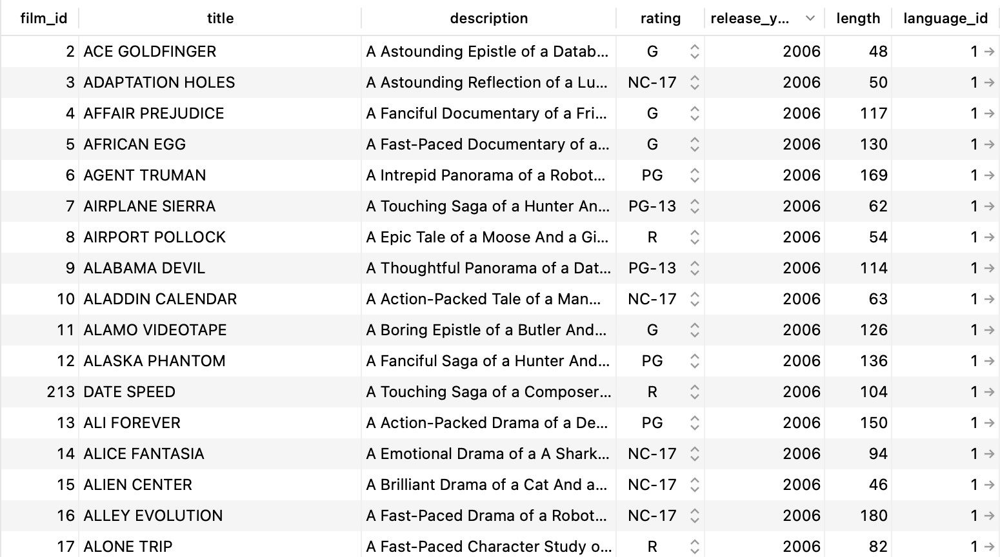

# 8-2-0 SQL and Databases

We've learned how to build a server application using Express. It can serve the static assets for a frontend and can handle requests through an API. But the data is not persistent! 

This week, we'll learn about the tools needed to build a truly "fullstack" web application with a proper database.

Let's dive in!

## Table of Contents

- [Table of Contents](#table-of-contents)
- [Terms](#terms)
- [What is a database?](#what-is-a-database)
  - [What is Postgres?](#what-is-postgres)
- [What is SQL?](#what-is-sql)
  - [Tips to avoid SQL errors](#tips-to-avoid-sql-errors)
- [Summary](#summary)

## Terms

* **Fullstack** - refers to the combination of frontend (client-side) and backend (server-side) technologies.
* **PERN** - an acronym for a specific set of technologies used to build a fullstack web application: Postgres, Express, React, and Node. This acronym is useful when asked "what stack do you use?"
* **Database** - a structured collection of data that is organized in a manner for easy retrieval.
* **Database Management System (DBMS)** - a piece of software used to create and maintain a database.
* **Postgres** - a popular "relational" database management system that stores data in a table-like manner
* **Table** - a collection of related data organized in rows and columns.
  * A **row** represents a single object/instance/record in the table 
  * A **column** represents a property/attribute/field of that object. Columns have data types such as integer, string, date, boolean, etc...
  * A **primary key** serves as the unique identifier for a row in a table
* **SQL (Structured Query Language)** - a language used by relational database management systems to create, read, update, or delete data from a database.


## What is a database?

A **database** is a structured collection of data. The data could be stored in a file or in RAM. In the old days, it was stored on a physical "punch card".


Nowadays, the data is often stored on a dedicated "database server" managed by a piece of software called a **database management system (DBMS)** such as Postgres, MongoDB, SQLite, MySQL, Firebird, Apache Cassandra, and many more.


A server application can send queries to the DBMS using the **Structured Query Language (SQL)** and the DBMS responds with the requested data.

By separating the database from the server application, we achieve greater separation of concerns:
* The database layer is focused solely on managing and securing the data.
* The application layer is focused solely on receiving client requests, retrieving the appropriate data from the database, and sending it back to the client.
* If we need to update or restart the application server, the database server can continue running without losing the data.

### What is Postgres?

PostgreSQL is a popular "relational" DBMS that organizes its data in **tables**. Below is an example of a table called `films` with data about various films:



Each table is made up of **rows** and **columns**.
* Each row represents a single object/instance/record in the table 
* Each column represents a property/attribute/field of that object. Columns have data types such as integer, string, date, or boolean.
* Every table has a column called `id` (or `film_id` in this case) that serves as the **primary key** - a unique identifier for each row in the table.

**Q: In JavaScript, how would this data be organized?**

## What is SQL?

SQL (Structured Querying Language) is the language used by many relational DBMSs to create, modify, and retrieve data from a database.

SQL is written in **query statements** that are composed of **keywords** and **clauses**. Keywords determine the operation to be performed. Clauses modify the operation.

* Common keywords: `SELECT`, `FROM`, `INSERT INTO`, `UPDATE`, `DELETE`
* Common clauses: `WHERE`, `GROUP BY`, `ORDER BY`


For example: 

```sql
SELECT title, release_year FROM films WHERE length <= 90;
```

**Q: What does the query above look for?**

<details><summary>Answer</summary>

The title and release year of the movies that are 90 minutes or less in length from the `film` table.

</details><br>

```sql
SELECT * FROM films;
```

**Q: What about this one?**

<details><summary>Answer</summary>

This query will get all of the data from the films table.

</details><br>

### Tips to avoid SQL errors
* SQL is NOT case sensitive. However, it is a standard practice to write keywords in all-caps to distinguish them from values.
* SQL strings MUST be written with single quotes `''` to avoid unwanted errors.
* SQL queries MUST end in a semicolon `;` to avoid unwanted errors.

## Summary

* **Database** - a structured collection of data that is organized in a manner for easy retrieval.
* **Database Management System (DBMS)** - a piece of software used to create and maintain a database.


* **Postgres** - a popular "relational" database management system that stores data in a table-like manner
* **Table** - a collection of related data organized in rows and columns.
  * A **row** represents a single object/instance/record in the table 
  * A **column** represents a property/attribute/field of that object. Columns have data types such as integer, string, date, boolean, etc...
  * A **primary key** serves as the unique identifier for a row in a table


* **SQL (Structured Query Language)** - a language used by relational database management systems to create, read, update, or delete data from a database.

```sql
SELECT title, release_year FROM films WHERE length <= 90;
```