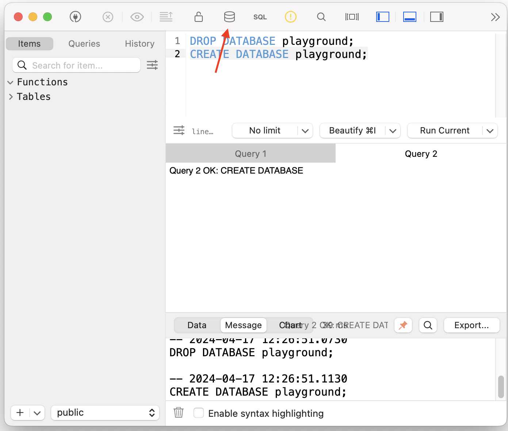
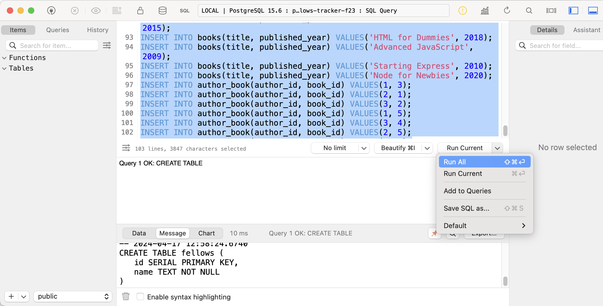
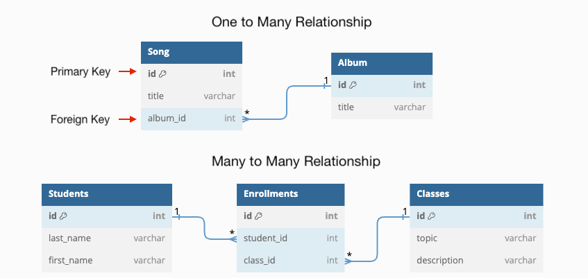

# Knex

TablePlus and `psql` in our terminal are great for testing out SQL statements, but they can only take us so far since we have to manually run the SQL statements ourselves. 

In this lesson, we will learn [Knex](https://knexjs.org/), a library that allows a Node project to connect to a databases and execute SQL queries. This will enable our server applications to access data from a Postgres database and have a persistent data layer.

**Table of Contents**

- [Terms](#terms)
- [Getting Started: Setting up a Database](#getting-started-setting-up-a-database)
- [What is Knex?](#what-is-knex)
- [Configuring Knex](#configuring-knex)
  - [0) Installing modules](#0-installing-modules)
  - [1) Provide connection details with a `knexfile.js`](#1-provide-connection-details-with-a-knexfilejs)
  - [2) Create a `knex` object to connect to the database](#2-create-a-knex-object-to-connect-to-the-database)
  - [3) Use the `knex` connection object to execute queries](#3-use-the-knex-connection-object-to-execute-queries)
- [Writing queries using `knex.raw`](#writing-queries-using-knexraw)
  - [Multi-Line Queries](#multi-line-queries)
  - [Dynamic Queries](#dynamic-queries)
  - [A more complex example](#a-more-complex-example)
  - [Create, Update, and Delete](#create-update-and-delete)
- [Challenges](#challenges)


## Terms

* **Knex** - a library that allows a Node project to connect to a databases and execute SQL queries.
* **Deployment Environment** - where an application is deployed. The two main ones are:
  * Development Environment (your own computer) and 
  * Production Environment (a hosting service like Render)
* **`knexfile.js`** - a file that holds configuration data for connecting to a database
* **`knex.js`** - a file that exports a `knex` object which has been configured to execute SQL commands to a database.
* **`knex.raw(query)`** - a method used to execute a given SQL query.

## Getting Started: Setting up a Database

Take a look at the `db.sql` file. It contains the SQL commands to create and populate a database called `playground`. This database will have five tables: `people`, `pets`, `customers`, `orders`, `products`.

1. Turn on your Postgres server

   * Windows users open your Ubuntu Terminal and run: `sudo service postgresql start`
   * Mac users open the Postgres app and click <kbd>Start</kbd>

2. Open up the TablePlus SQL query editor (or use the `psql` CLI)
3. Run these commands:

    ```sql
    DROP DATABASE playground;
    CREATE DATABASE playground;
    ```

4. Connect to the `playground` database (or, in the `psql` CLI, run `\c playground`)



5. Copy-Paste the commands from `db.sql` into the TablePlus SQL query editor (or in `psql` connected to the `playground` database) and <kbd>Run All</kbd>



1. Mac users can run <kbd>CMD+R</kbd> and you will see the tables!

## What is Knex?

When we move the data of our server application out of the server's memory and into a database, we need some way of having our server application communicate with the database. That's where Knex comes in.

**Knex** is a library that allows a Node project to connect to a database and execute SQL queries using that database.


Assuming we already have a database, in order to use Knex in a server application, we must:
1) Provide connection details (username, password, database name) with a `knexfile.js`
2) Create a `knex` object to connect to the database
3) Use the `knex.raw` method to execute SQL queries

## Configuring Knex

### 0) Installing modules

We will be using the `knex` and the `pg` modules from NPM:

```sh
npm i knex pg 
```

`pg` is the module that helps `knex` connect to a Postgres database. If we were to use a different kind of database, we would need to install a different module alongside `knex`.

### 1) Provide connection details with a `knexfile.js`

In order to use a database, we need to tell our server:
* the name of the database
* the username we will connect to it with
* the password for that username.

All of this is done using a special file called `knexfile.js`:

Run the command `npx knex init` which will generate a `knexfile.js` file in the root of your project directory. The `knexfile.js` holds configuration data for connecting to a database.

> ⚠️ NOTE: The `knexfile.js` file MUST be located in the root of your project. Otherwise, other `knex` configurations won't know where to find it.

The exported object contains configuration objects that can be used for various **deployment environments**.

```js
// knexfile.js
module.exports = {
  development: {},  // Work in progress. Only on your computer
  staging: {},      // "Fake" production, fake data, fake users, test integrations
  production: {},   // Deployed. Real users, real data.
}
```

For now, we'll be working in the `development` environment and can wait to set up the other environment configurations.

Each deployment environment needs a `client` that specifies the kind of database we're connecting to (we will use `pg` which is short for Postgres). 

```js
  development: {
    client: 'pg',
    connection: {
      user: 'postgres', // unless you want to use a different user
      password: 'postgres', // unless you changed your password
      database: 'playground', 
      // the database name ^
    }
  },
```

The `connection` object is where we provide the username, password, and specific database we want to connect to.

### 2) Create a `knex` object to connect to the database

To actually use the database details specified by the `knexfile.js`, we need to create a `knex` object. 

```js
const makeKnex = require('knex');
const knexConfigs = require('./knexfile.js')
const env = process.env.NODE_ENV || 'development';
const knex = makeKnex(knexConfigs[env]);

module.exports = knex;
```
* The `knex` module exports a function for creating a database connection. To use that function, we need a configuration from `knexfile.js`
* Since our `knexfile.js` exports 3 configurations (`development`, `staging` and `production`), we specify which of those configurations we use with the `env` variable
  * We use `"development"` unless the `NODE_ENV` environment variable is set. [When we deploy using Render.com](https://docs.render.com/environment-variables#node), it will provide a `NODE_ENV` environment variable set to `"production"`.
* Finally, we create a `knex` object by invoking `makeKnex` and providing `knexConfigs[env]` as an argument.
  * The `knex` object represents our connection to the database specified in `knexfile.js`.
  * We export it so that other files can use the `knex` connection object.

### 3) Use the `knex` connection object to execute queries

We can play with our `knex` connection directly in our `index.js` file. 

> 💡 NOTE: In future projects, only our `models` will interact with `knex`.

The `knex` connection object has an _asynchronous_ method called `raw` that takes in SQL statements and returns a `result` object.

```js
// index.js
const knex = require('./db/knex.js');

const getPets = async () => {
  // knex.raw returns a query result object
  let result = await knex.raw("SELECT * FROM pets");
  
  // .rows is an array containing the query data
  return result.rows;
};

const getPeople = async () => {
  // often, we just destructure the rows and return
  let { rows } = await knex.raw("SELECT * FROM pets");
  return rows;
};

const main = async () => {
    const pets = await getPets()
    const people = await getPeople();

    // Destroy the connection to the database.
    knex.destroy(); 
};

main();
```

* Most of the time, we'll use the `.rows` property to get the results as an array.
* Without the `knex.destroy()`, the file will not terminate.

## Writing queries using `knex.raw`

Now that we have `knex` set up, let's have some fun!

### Multi-Line Queries

```js
// Use `` to create multi-line strings
const getPeople = async () => {
  const query = `
    SELECT * 
    FROM people;
  `
  const { rows } = await knex.raw(query);
  return rows;
};
```

### Dynamic Queries

```js
const createPet = async (name, type, owner_id) => {
  // The ? are placeholders
  const query = `
    INSERT INTO pets (name, type, owner_id)
    VALUES (?, ?, ?)
  `
  // The array passed to knex.raw assigns values to the ? in order
  const { rows } = await knex.raw(query, [name, type, owner_id]);
  return rows;
};
```

* In the `query` string, the `?`s act as placeholders.
* To assign values to the `?`s, we pass an array of ordered values as a second argument to `knex.raw`. 
  * Order matters! In this example, `name` will be the first `?`, then `type`, then `owner_id`.
* To avoid SQL injection attacks, we want to avoid inserting dynamic values into a SQL query through interpolation: `${}`

### A more complex example

Consider the `pets` table below. 

| id  | name       | type | owner_id |
| --- | ---------- | ---- | -------- |
| 1   | Khalo      | dog  | 3        |
| 2   | Juan Pablo | dog  | 2        |
| 3   | Bora       | bird | 1        |
| 4   | Tora       | dog  | 1        |
| 5   | Frida      | cat  | 3        |
| 6   | Pon Juablo | cat  | 2        |
| 7   | Kora       | dog  | 1        |

**Q: What is the SQL query to find the name and id of the dogs owned by Ann Duong?**

<details><summary>Answer</summary>

```sql
SELECT pets.name, pets.id
FROM pets
  JOIN people ON pets.owner_id = people.id
WHERE people.name='Ann Duong' AND pets.type='dog'
```

**Explanation:** We have to specify that we want the `name` and `id` columns from the `pets` table since the `people` table also has columns with those names. We then query from the join of `pets` and `people`, connecting rows from each table using the `pets.owner_id` foreign key and the `people.id` primary key. We finally filter the results to only show the rows where the person's name is `Ann Duong` and the pet's type is `dog`.

</details><br>

To turn this query into a function that can show us the pets of ANY given `type` owned by ANY given `owner_id`, we will need to create a **dynamic query**:

```js
const getPetsByOwnerNameAndType = async (ownerName, type) => {
  const query = `
    SELECT pets.name, pets.id
    FROM pets
      JOIN people ON pets.owner_id = people.id
    WHERE people.name=? AND pets.type=?
  `
  const { rows } = await knex.raw(query, [ownerName, type]);
  console.log(rows);
  return rows;
}
```
* In the query, the `?` act as placeholders.
* If we pass an array of values as a second argument to `knex.raw`, we assign values for those placeholders. 
* In this query, the first `?` will be replaced by the value of the `ownerName` parameter, and the second `?` will be replaced by the value of the `type` parameter.

### Create, Update, and Delete

So far, we've read from the database, let's create, update, and delete using `knex.raw`.

**Create a pet:**

```js
const createPet = async(name, type, ownerId) => {
  const query = `
    INSERT INTO pets (name, type, owner_id)
    VALUES (?, ?, ?)
    RETURNING *
  `
  const { rows } = await knex.raw(query, [name, type, ownerId]);

  return rows[0];
};
```

* `RETURNING *` returns the created record. Without this, `result.rows` will be an empty array.
* `result.rows[0]` will be the one created value.

**Update a pet's name:**

```js
const updatePetNameByName = async(oldName, newName) => {
  const query = `
    UPDATE pets
    SET name=?
    WHERE name=?
    RETURNING *
  `
  let { rows } = await knex.raw(query, [newName, oldName]);

  console.log(rows[0]);
}
```

**Delete a pet:**

```js
const deletePetByName = async(name) => {
  const query = `
    DELETE FROM pets
    WHERE name=?
    RETURNING *
  `
  let { rows } = await knex.raw(query, [name]);

  console.log(rows[0]);
};
```

## Challenges

These challenges illustrate many-to-many relationships:



**`authors`, `books`, and `author_book`**
* get all the books that a certain author has ever written.
* get all the authors of a certain book.
* create a new book, by a provided author (make sure to connect them!)
* update the title of a book
* delete a book (make sure to remove the associated connection as well)

**`customers`, `products`, and `orders`**
* get all the orders the belong to certain customer.
* get all the products that a certain customer has ever bought.
* get the top 3 most recent orders.
* get the cheapest product.
* get all the customers that have ever bought a certain product.
* create a new order
* delete an order
* update an order
