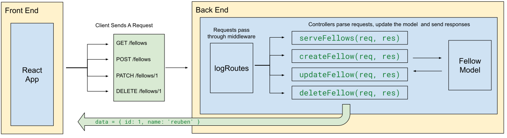

# Your First Fullstack App!

Up until now, the app structure has looked like this:



The model is the layer of the application that directly manipulates the data. It provides methods that the controllers can use to execute those changes whenever the frontend makes the appropriate request. 

Currently, the model uses an in-memory array to store data. The issue is that the data is not persistent — each time we restart the server, all data created during that "session" is lost. 

Now that we have a database and can connect to it using Knex, we can refactor our model to use that database and have our data persist.

## Part 1 - Adding a DB for the fellows

1. create a database called `fellows_tracker_f23`
2. Create the table structure

    ```sql
    CREATE TABLE fellows (
      id SERIAL PRIMARY KEY,
      name TEXT NOT NULL
    )
    ```

3. `cd` into `server/`
4. `npm i pg knex`
5. `npx knex init` to create `knexfile.js` in the root of the `server/` directory
6. modify the file to use `pg` and the `fellow-tracker-f23` database with a valid username and password
7. create a `knex.js` file in the `model/` directory
   - make sure the import statement for `knexfile.js` is accurate

    ```js
    // Set the deployment environment variable
    // Depending on where it is deployed, this could be "staging" or "production"
    const env = process.env.NODE_ENV || 'development';

    // Grab the corresponding knex configuration object from knexfile.js
    const knexConfig = require('../knexfile.js')[env];

    // Create the knex connection object using that config
    const knex = require('knex')(knexConfig);

    module.exports = knex;
    ```

8.  Refactor `Fellow.js`!
    1. Import `knex` into the `Fellow` model
    2. Remove the import of the `getId` function
    3. Remove the `Fellow.#all` array
    4. Remove the `constructor` entirely and create a `static async create` method (we'll use the constructor for another purpose)
    5. All functions need to be `async` to use `await knex.raw()`
    6. Every function needs to return *something* (use `RETURNING *`)
       1. Create should return the new fellow
       2. Get ALL should return an array of all fellows
       3. Get One should return a single fellow object (the first object in the `rows` array)
       4. Update should return the updated fellow object
       5. Delete should return the deleted fellow object
9.  Refactor `fellowControllers.js` to use the new model methods and to `await` everything


## Part 2 - Adding posts

1. Create a posts table that references the fellows table
2. Create a `Post` model with methods:
   - create(content, fellowId)
   - list() (not really used other than for testing)
   - findById(id) (not really used other than for testing)
   - findPostsByFellowId(fellowId)
   - delete(id)
   - deleteAllPostsForFellow(fellowId)
3. make the `postControllers`
4. define endpoints in `index.js`
5. test with postman
6. add frontend components + fetching on the FellowDetails page
    - components:
      - list of posts with delete buttons
      - form for adding a new post 
    - event handlers / fetching:
      - useEffect now also fetches fellow posts -> `GET /api/fellows/:fellowId/posts`
      - list item delete button on click -> `DELETE /api/posts/:id`
      - new post form on submit -> `POST /api/fellows/:fellowId/posts/:id`
7. when deleting a fellow, we need to delete posts first

## Part 3 - Adapters

Create an "adapter" file for fetching fellows and posts