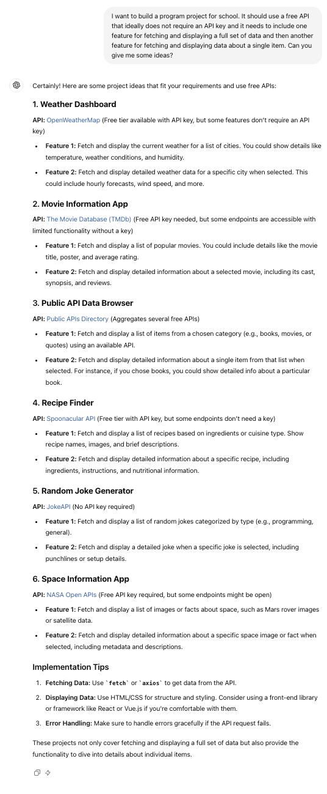

# AI Policy

## Our Views on AI and Learning

Over the last few years, generative AI tools like ChatGPT have become increasingly popular, particularly for tasks like programming. And there are many good reasons for it! AI tools can make us more efficient and can be useful for reviewing, writing, and generating ideas. 

However, Marcy is first and foremost a learning institution, and as such, generative AI tools must be used responsibly and for the purposes of learning, not as a substitute for learning or as a shortcut for completing work. 

So, yes! You can use generative AI tools like ChatGPT at Marcy, but you must know how they will help you and how they can hurt you. Whenever you find yourself using ChatGPT, ask yourself, “Is this helping me learn?”

### AI makes writing code faster, but there is no shortcut for learning.

Let us be clear, generative AI is very good at quickly writing simple pieces of code. With basic prompting, you could likely use it to complete 50% of Marcy’s homework assignments. **However, your responsibility at Marcy is to learn, not to complete assignments.** 

If you use ChatGPT to complete your assignments, then you are robbing yourself of the chance to learn on your own. Remember, y**our completed assignments will not get you a job. What you know, what you can do, and your ability to learn will.** 

We certainly understand that generative AI coding tools are used by experts in the professional world. However, you must first prove that you can program without those tools before earning the privilege of using them. 

> *"You can give a carpenter a nail gun and they will drive 100 nails in a minute, but if they don’t know how to design and build a chair, what’s the point?"* — Ben Spector
> 

Using AI is a privilege earned by those experts who took the time to first master their craft, and then utilized AI to enhance their work. **AI coding tools make experts faster, they can’t make you smarter.**

### AI can make mistakes. Always verify it yourself.

One of the biggest risks of using ChatGPT is that it can “hallucinate”, meaning it can provide answers that seem reasonable but are completely inaccurate. As such, **ChatGPT should always be checked against another resource or verified yourself.**

Do not trust responses generated by ChatGPT. Instead, find a human who has provided an answer to your questions and **use ChatGPT to summarize the answer in simpler language.**

### AI can debug simple things, but not everything

There will be many times when you want to reach for ChatGPT to help you debug your code. Up to a certain point, it will be quite good at this. However, its usefulness will quickly run out, and you will be left without the critical skills to solve problems on your own.

For example, ChatGPT can likely identify a logical mistake inside of a single function, but it will be much less likely to be able to tell you why the 5 different functions in your full-stack program aren’t working together properly.

**Debugging is a critical skill that you MUST develop a strategy for.**

### Recommended resources

So, what learning resources do we recommend you use to learn?

* If you want to learn about a topic for the first time, we recommend **Eloquent JavaScript**, **W3Schools**, **MDN**, **Codecademy**, and **Freecodecamp**. If you want alternative learning modes, use **YouTube**!
* When learning about tools and frameworks (like Express, React, Postgres, etc…), use **official documentation.** It will be painful at first, but this is a skill that you must hone.
* If you have a bug or error code that you don’t understand, Google that too! It is more than likely that someone on **StackOverflow** will have run into the same issue and can provide a direct answer to your question.

For each of these resources, if you find a definition or explanation confusing, use ChatGPT to summarize it for you!

## Our Policy

Any student work submitted using AI tools should clearly indicate what work is the student’s work and what work is generated by the AI. In such cases, no more than 25% of the student work should be generated by AI. Assignments that are in large part quoted from an AI assistant are very unlikely to be evaluated positively. In addition, if a student's work is substantially identical to another student's work, that will be grounds for an investigation of plagiarism regardless of whether the prose was produced by an AI assistant

Below, you will find the use cases under which you can and cannot use AI at Marcy. When in doubt about permitted usage, please ask for clarification.

### Acceptable Use of AI

The use of generative AI tools like ChatGPT is permitted at Marcy for the following activities (expand each use case to see an example):

 Brainstorming and refining your ideas

_ChatGPT is excellent at providing you with ideas for your projects. Make sure to specify the requirements of the projects and explain the desired features._

Generating example data sets

_ChatGPT is excellent at generating well-formatted data sets for your projects! Make sure to specify the data types of the dataset you wish to generate and the language or format of the dataset (JavaScript, Python, JSON, comma-separated values/CSV, etc…)_

Simplifying or summarizing technical documentation

_When you encounter a definition in a piece of technical documentation that confuses you, see if ChatGPT can summarize it for you. The documentation should ALWAYS be your “source of truth”, but ChatGPT can help explain complex concepts in language that may be easier to digest. First, state that you want to simplify a definition and then copy-paste the definition below._

Checking grammar, spelling, and style in writing

_Use ChatGPT as a final review before submitting your writing submissions. Specify the question you are answering to provide the necessary context for ChatGPT to potentially correct any incorrect answers you may be providing. Specify that you want it to check for grammar, spelling, and style to reduce the degree to which it will rewrite your work._

Checking code style

_ChatGPT can be used to identify common code style issues such as variable names, spacing, indentation, and best practices. Specify the language that you are programming in to reduce the likelihood of hallucinations._

Drafting the structure of emails and other forms of communication

_Use ChatGPT to provide a structure for communication with mentors, instructors, and other professionals. We often get feedback from hiring partners that they can tell when applications and emails are written using AI so always review the provided structure and revise it before sending to ensure that the writing sounds like YOU. Review the key points to learn how to write messages like this on your own._

### Unacceptable Use of AI

The use of generative AI tools is not permitted in this course for the following activities:

* Writing entire sentences, paragraphs, or papers to complete class assignments.
* Generating solutions to complete technical homework assignments.
* Use in any form during a GCF
* Use in any form on the coding portion of a technical assessment.
* Use of VS Code AI auto-complete extensions.
