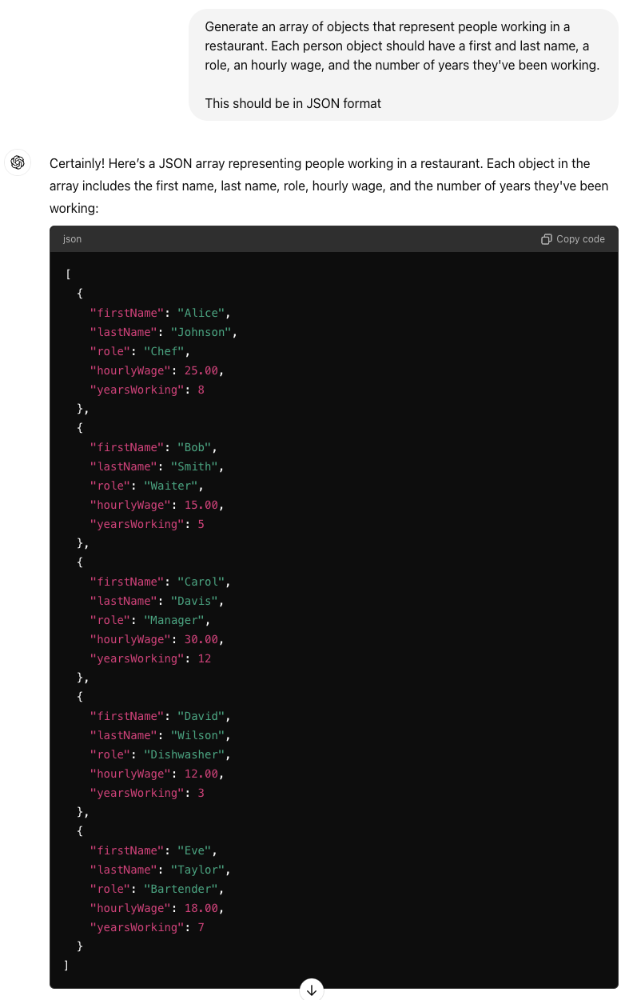

# Student Handbook

* [Mission, Our Promise, Pillars of Character](student-handbook.md#mission-our-promise-pillars-of-character)
  * [The Marcy Lab School Mission:](student-handbook.md#the-marcy-lab-school-mission)
  * [Our Logo:](student-handbook.md#our-logo)
  * [Our Promise to You:](student-handbook.md#our-promise-to-you)
  * [Our Pillars of Character:](student-handbook.md#our-pillars-of-character)
* [Schedules, Calendar and Learning Expectations](student-handbook.md#schedules-calendar-and-learning-expectations)
  * [Hybrid Weekly Schedule](student-handbook.md#hybrid-weekly-schedule)
  * [Daily Schedule](student-handbook.md#daily-schedule)
  * [Remote Learning Expectations](student-handbook.md#remote-learning-expectations)
  * [Attendance Expectations](student-handbook.md#attendance-expectations)
  * [Work Submission Expectations](student-handbook.md#work-submission-expectations)
  * [Academic Calendar](student-handbook.md#academic-calendar)
* [Academic Course Outlines and Graduation Requirements](student-handbook.md#academic-course-outlines-and-graduation-requirements)
  * [Academic Graduation Requirements](student-handbook.md#academic-graduation-requirements)
  * [Software Engineering Curriculum Overview:](student-handbook.md#software-engineering-curriculum-overview)
  * [Data Analytics Curriculum Overview:](student-handbook.md#data-analytics-curriculum-overview)
  * [Leadership and Development Curriculum Overview:](student-handbook.md#leadership-and-development-curriculum-overview)
* [Student Culture and Community](student-handbook.md#student-culture-and-community)
  * [Fellow Of The Week:](student-handbook.md#fellow-of-the-week)
  * [Thoughtful Thursdays:](student-handbook.md#thoughtful-thursdays)
  * [Big / Little Tradition:](student-handbook.md#big--little-tradition)
  * [Young Trustee:](student-handbook.md#young-trustee)
  * [“Pass the Pin” Tradition:](student-handbook.md#pass-the-pin-tradition)
  * [Graduation Sash Tradition:](student-handbook.md#graduation-sash-tradition)
  * [Job Celebration Traditions:](student-handbook.md#job-celebration-traditions)
  * [Student and Staff Events:](student-handbook.md#student-and-staff-events)
  * [Student Feedback and Input:](student-handbook.md#student-feedback-and-input)
  * [Feedback Thursday:](student-handbook.md#feedback-thursday)
  * [Surveys:](student-handbook.md#surveys)
* [Student Supports and Well-being](student-handbook.md#student-supports-and-well-being)
  * [Coaching Conversations:](student-handbook.md#coaching-conversations)
  * [Family Chats:](student-handbook.md#family-chats)
  * [Transitions:](student-handbook.md#transitions)
  * [Student Well-Being Reporting:](student-handbook.md#student-well-being-reporting)
  * [Student Well-Being Resources](student-handbook.md#student-well-being-resources)
* [Campus Facility and Safety](student-handbook.md#campus-facility-and-safety)
  * [Campus Safety](student-handbook.md#campus-safety)
  * [Emergency Procedures:](student-handbook.md#emergency-procedures)
* [Behavioral Code of Conduct](student-handbook.md#behavioral-code-of-conduct)
* [Academic Integrity, Plagiarism and AI Acceptable Use Policy](student-handbook.md#academic-integrity-plagiarism-and-ai-acceptable-use-policy)
  * [Academic Integrity](student-handbook.md#academic-integrity)
  * [Plagiarism](student-handbook.md#plagiarism)
  * [AI Acceptable Use](student-handbook.md#ai-acceptable-use)
  * [Unacceptable Use of AI](student-handbook.md#unacceptable-use-of-ai)
* [Neighborhood Guide and Local Resources](student-handbook.md#neighborhood-guide-and-local-resources)
  * [Neighborhood Guide](student-handbook.md#neighborhood-guide)
* [Networking, Alumni-hood and Beyond](student-handbook.md#networking-alumni-hood-and-beyond)
  * [Career Talks and Guest Speakers:](student-handbook.md#career-talks-and-guest-speakers)
  * [Company Visits:](student-handbook.md#company-visits)
  * [Career Launch Accelerator:](student-handbook.md#career-launch-accelerator)

## Mission, Our Promise, Pillars of Character

Welcome to The Marcy Lab School! We are so happy to have you as a part of our family. This handbook is designed to be a roadmap for you. Here, you'll understand our mission and values, our hybrid school culture, a look into the daily, weekly, and yearly life as a Fellow, what you can expect _from us_ as a Marcy Lab Software Engineering Fellow, and what we expect _of you._

### The Marcy Lab School Mission:

Our mission is to build economic mobility. We help young people accelerate their careers. Our yearlong college alternative provides young adults from underestimated backgrounds with the skills, the habits, and the network necessary to launch a rewarding, purpose-driven career in the tech sector.

### Our Logo:

The logo of The Marcy Lab School is the _Fawodhie,_ the West African Adinkra Symbol that translates to "Independence, Freedom, and Emancipation." Directly translated, it means "that with independence comes great responsibility." This symbol is a source of inspiration for our community each day as we support our fellows in building their righteous pathways into the middle class for themselves and those who come after them. As they prepare to step into opportunity, independence, wealth, and mobility, this symbol brings us back to their driving force: that path they're building is not just for them to walk but, rather, the path that paves the way for all those to follow.

### Our Promise to You:

By the end of this year, you will know yourself, your worth, and your standard of excellence. And you will mobilize these to step into wealth and become a leader in your community.

### Our Pillars of Character:

At The Marcy Lab School, we have five pillars of character we hold central for this community and use as a guide through all that we do. These pillars are inspired by what we learned from the very first Marcy cohort and specifically, the qualities that they embodied throughout their fellowship year, which supported them in finding success and launching their careers in the tech industry. Since then, we have learned that in order to fulfill our promise to you, your commitment to these pillars of character will support you in achieving the goals of this yearlong journey. Throughout your year as a fellow, you can expect to come back to these pillars to reflect on your individual growth and to select your Fellow of the Week every week (_more on that in Student Culture & Community_).

These are our five pillars of character:

* **Unwavering Discipline 🏃🏾‍♂️** We hold ourselves accountable to a relentlessly high bar day in and day out, in ways big and small.
* **Bold Determination 🧗🏾‍♀️** Our goals are audacious because we refuse to sell ourselves short. While we will experience failure, doubt, and fatigue, we will persist because we see where we want to go and are 100% committed to getting there. There is no turning back.
* **Tough Love 💜**  No matter the circumstances, we are worthy of love and hard work and will push ourselves to do the wholehearted labor of stepping into our own power. We deserve every opportunity to realize success, wealth, and solutions for ourselves and our communities.
* **Ingenious Curiosity 🧠** We are wildly talented, yet also have a world of brilliance and potential to unlock. Our passion for thinking and figuring it out will always guide us in the right direction, and we will leave no stone unturned to solve problems and build solutions. When we get lost, curiosity can bring us home.
* **Collective Responsibility 🌍** We care deeply for each other and are beholden to our networks and communities. We are responsible to them as much as to ourselves, in our daily work, in our future aspirations, and in our ultimate solutions. We are in this together, and we carry this value with us wherever we go.

## Schedules, Calendar and Learning Expectations

So, what does our hybrid weekly schedule include and what does it look like to be an engaged learner and member of our professional learning community?! The Marcy Lab School is an alternative to college, and we are proud to have created a warm, welcoming and supportive community. Through our in-person classes, community moments, company visits, brave discussions in Leadership Seminar, and countless hours studying beside each other, Fellows have the college experience that they always dreamed of but never got: deep friendships, personal and professional development, and the chance to hold each other down through the most rigorous computer science program in the country.

Our hybrid weekly schedule gives students the _best_ of both worlds. Each week, Fellows will have a hybrid Monday-Friday schedule. It's important to acknowledge that many of you are living in full households, with little or bigger siblings, nieces and nephews, family members, and pets! 🥰 It will be important that you communicate with your family about both your workload and our hybrid schedule, setting some expectations of what they can expect from you this next year. You will have roughly 40 hours a week of where will be immersed in your schoolwork.

At The Marcy Lab School, you will typically be in class from roughly 9:00 a.m. to 4:30 p.m. on weekdays. Below, find descriptions of what you can expect within your daily schedule! We are so, so excited to present you all with a schedule that we believe will help you get every single drop out of what this program has to offer!

### Hybrid Weekly Schedule

* **3 on-campus days (Tuesday, Wednesday, Thursday).** On in-person days, class begins at 9:30am, with our days still ending by 4:30pm.
*   **1 remote day (Monday).**

    Remote days are not "free" or “off” days at Marcy Lab. However, we're hopeful that our daily schedule will allow you to both be a presence at home while also tending to your school responsibilities. Our Program Managers will work to gain an understanding your environment during your first coaching conversations, and will be there to help you set yourself up for success.
*   **1 flexible day (Friday).**

    It is so important to us that you have moments for you to care for you and your loved ones factored into your schedule. While you'll be responsible for keeping up with your work and meeting your deadlines, it's important to us that you have time offline throughout the week that is sacred for you. Flexible Fridays are an intentional way we provide you with the time, space and support you need to set yourself up for success. These are ways you might use this day:

    * **Work and focus time** - study time, getting caught up on assignments, personal organization etc.
    * **Student support** - check-ins with Program Managers, Lead Instructors or support sessions with Teaching Assistants and Resident Advisors.
    * **Student well-being** - taking time to rest and attend to personal needs and responsibilities; spending time on campus in community with other fellows.
    * **Important note** - if you are missing assignments and/or not on track to meeting Graduation Requirements, you may be required to have check-ins with Program Managers, Lead Instructors or Teaching Assitants to support your continued success during the Fellowship.

### Daily Schedule

*   **Mindful Morning:**

    You will begin your days at Marcy with our practice of Mindful Morning. This shared ritual allows us to take space and set an intention for the day as a group through guided meditation, practicing gratitude, and morning pages/journaling.
*   **Stand Ups:**

    These are meetings that are used heavily in the tech industry to keep teams accountable to their work, track progress, and determine what is need to help move projects forward each day. At Marcy, we aim to give you the same meaningful experience.

    With Stand Up, you will typically give a quick recap of where you are at, what your focus is for that specific day, and what obstacles you need to overcome to reach your goal.
*   **Code Challenge:**

    Code Challenge is where you will be given the tools to beat the biggest hurdle of entry _into_ the career: the technical interview. These sessions will be where you will prep each day for the technical interview and learn how to tackle the coding interview with your Associate Instructor.
*   **Technical Lecture (Remote & In Person):**

    Monday through Thursday, you will have Technical Lecture with your Lead Instructor. This is your main learning space for the technical content throughout this next year. You will be expected to come to lecture prepared, too, having read and reviewed material prior so you can jump right into the details of the topic!
*   **Labs & Lab Review:**

    Within your daily schedule, there is designated work time called Labs. During this time, you will be actively making progress on any upcoming assignments that are due. Lab Review will then come at the end of the day, and your Lead Instructor, or Associate Instructor, will use this space to review any concepts and/or problem sets from the homework.
*   **Office Hours:**

    Instructors and Teaching Assistants will lead Office Hours weekly to provide technical support. You can see Office Hours as individualized tutoring! It’s an amazing time to make sure that you have your content down and to get a ton of technical support in a small group.

    **Mondays:**

    * 4:30 - 6pm (Teaching Assistant Office Hours)

    **Tuesdays and Thursdays:**

    * 3:30 - 4:00pm (Lead Instructor & Lecture Office Hours)
    * 4:30 - 6:30pm (Teaching Assistant Office Hours)

    **Wednesdays:**

    * 5:00 - 6:30pm (Teaching Assistant Office Hours)
*   **Stand Down & Weekly Closeout:**

    To end your day, you will come together with your cohort for Stand Down. This time will be used to complete your day, reflect on what went well (and what didn’t), and then set a plan for the next day. Just like Mindful Morning, this ritual is designed to help us take space and reflect as a group on what is to come.

    To end the week, you will have Weekly Closeout in place of Stand Down. This time will include some of the rituals you will read about below and gives us the time to finish out our weeks together while also getting prepared for the weekend.

    _**Note:**_

    * Occasionally, we will add in a block to the schedule for Scoping & Goal Setting. Throughout your year at Marcy, you will be balancing multiple streams of work, and this shared space allows us to hold each other accountable to the work by naming our specific focus for the day.

### Remote Learning Expectations

In 2020, The Marcy Lab School decided to be a remote-first school. In this section, you'll learn about _how_ we do it, and _why_ these expectations will enable you to have a joyful and productive learning experience.

_**Why**_ are we investing in remote learning?

When you first think of a "remote days" you may think "Oh! That's just classes on Zoom!" Don't worry, we thought that too when the COVID Pandemic first hit! We've learned, though, just how many benefits there are in being a remote-first school as we train you as software engineers. Below, find the biggest contributing reasons we have committed to remote learning this year:

* **Time Management:** One of your biggest learnings this year will be in learning how each of you manage your time and workload. We are excited to help you figure this out each step of the way as you build your own independence as a Software Engineer. One gift of our remote world is that it buys you back time that would often be lost on the commute. This has allowed us to build in time into your days, weeks, and our year, for work blocks, mental health days, and structured discovery of how you work best.
* **Building Your Skillset as Remote Communicators:** Our world has changed beneath our feet as offices have closed, many schools and colleges have gone online, and businesses and industries around our nation have had to shift their strategy to provide remote work. With this change in our economy has come a change in the skillsets that you must now be fluent in in order to enter it. Collaboration is no longer as easy as turning to the person next to you, going up to your manager to ask a question, or using a whiteboard to capture your thought process when you're stuck. Now, workers have had to rely on "asynchronous communication" (e-mail, virtual communication, Zoom, Slack, data sharing and file transmission) to keep their work going outside of offices. This is a whole new skillset that we must prepare you for in this next chapter of our digital world, and we know that in this case, we learn how to do this by _doing_. In our virtual world, we can promise that you will become fluent remote and asynchronous communicators and we are confident that our remote world will be able to provide you with the support and practice to do so.
* **Flexibility:** We understand that you have responsibilities to your families and communities outside of Marcy, too. Last year, we learned that remote days provided our team and fellow community with more flexibility to take care of life.

_**How**_ do we do remote learning at The Lab?

We are purposeful and intentional with how we use Zoom with a split of both "Cameras On" and "Cameras Off" moments of the day.

*   **📸 Camera's on:** It is a **non-negotiable** that when you are learning virtually that you keep your camera on. This is so that your Lead Instructors and Program Managers can _see_ you as they teach you and coach you! We expect you to keep our cameras on during:

    * _All_ technical lectures and during Leadership Seminar
    * As instructed during Code Challenge
    * Community moments: After journaling in Mindful Morning, Feelings Friday, and Close Outs
    * During sessions with employer partners throughout the year

    Teaching rests on understanding where your students are at, and our team relies on body language and person-to-person connection, presence, and engagement as we deliver you our virtual programming. If there is a reason that you **cannot** be on Camera, you must communicate that to your Lead Instructor or Program Manager through the chat box. Our staff will reach out to you personally if this expectation is not met consistently to better understand and support your learning.
* **📷 Camera's off:** We also want to protect your energy and know that being "on" all day in front of your computer can be tiring. We believe it is so important to manage our collective energy, so we've made sure there is a balance of "off camera time" throughout the day- and these moments have been intentionally tied to moments of introspection, work time, and community moments that require less vulnerability. Please feel free to keep your cameras off for the beginning of Mindful Mornings, in our virtual lounges on Tandem, and for shared or independent work-time in Labs.
* **Zoom Display Names:** We create a safe remote space for all community members and future employees by ensuring that our display names capture our full names and pronouns. More on this in Leadership Seminar!
* **Honoring Privacy:** We also honor the privacy of each other and our loved ones, siblings, family members, by using zoom backgrounds whenever we want/need to!

### Attendance Expectations

Just like any job, attendance at Marcy Lab is required and a key component of your success. Attendance means being on time and attending all scheduled sessions including mindful mornings, code challenges, tech discussion, classes (lecture and leadership seminar), community time, coaching and school meetings. **Every day, Instructors will take daily attendance in Mindful Morning.** We expect you to be _on time and on camera_ for **every** virtual or in-person class in our "Camera's On" spaces. Failure to be on camera in these spaces will result in an absence.

**Attendance requirements are:**

* Students are required to maintain a 90% average attendance rate.
* No more than 4 absences (pro-actively communicated to your Program Manager ) per fall and spring term.
* Three tardies = one absence.

A student who is ill, or who has a family emergency, should contact their Program Manager, Associate Instructor, and Lead Instructor as soon as possible to let them know. If absent, you will be held responsible for taking initiative to get caught up on anything you missed.

### Work Submission Expectations

This program is designed to provide fellows with the knowledge, versatility, skills, network, leadership, and career coaching to be employed as a software engineer in one year. Thus, it is crucial that each assignment and deliverable is treated like an on-the-job assignment, project, or product for us to do right on our promise. To be able to fully prepare you for your career, we hold you to a high standard of excellence, marked by **firm deadlines** that you must meet _on time._

All fellows are **expected to meet deadlines at a rate of 90% (even if assignments are not complete),** and must proactively communicate to the relevant instructor by e-mail or slack if there is a barrier that will keep you from doing so.

Because of our high standard of excellence, it is common for instructors to ask fellows to **resubmit work that has not yet met our bar**. If an instructor asks a fellow to resubmit an assignment, fellows are expected to implement the given feedback and turn in an improved version of their assignment _within 48 hours_ of the when the feedback was given.

### Academic Calendar

* [Fall 2024 School Year Calendar](https://docs.google.com/document/d/1T3tDmzUW762B8fi4oNPJoMxOCZ0eh3sKgM4lR5ka31Q/edit?usp=sharing)
* [Spring 2024 School Year Calendar](https://www.notion.so/2f5ba2fb060f464a87ebffa55231fc25?pvs=21)

## Academic Course Outlines and Graduation Requirements

We are excited to share an overview of our curriculum and academic requirements at Marcy. In this section, you'll learn more about Marcy's academic requirements and our curriculum's ethos.

### Academic Graduation Requirements

On the first day of orientation, we share our promise to you: _“You will know yourself, your worth, and your standard of excellence. You will mobilize these to step into wealth and become a leader in your community.”_ Part of fulfilling this promise means prioritizing academics at Marcy—from investing in instructor learning and development, refining the curriculum to be responsive to market needs, and setting clear academic expectations for Fellows that align with industry needs.

From Day One, we are transparent about what academic success at Marcy means. Below are the academic requirements that must be met to graduate from The Marcy Lab School, which we ask you to use as a guide during your learning journey. Throughout the year, you can expect academic checks to measure your progress in our program.

1. Maintain ≥90% Average Daily Attendance
2. Maintain ≥90% Average Technical Assignment Completion
   * _Inclusive of all Mod 7 and Mod 8 Technical Assignments_
3. Maintain ≥90% Average L\&D Assignment Completion
4. Achieve ≥3/4 (75%) Score on all Summative Technical Assignments
   * _Assessments and Portfolio Projects_
5. Achieve a ≥ 389 GCF Score at least three times
6. Achieve ≥3/4 (75%) Score on all L\&D Summative Assignments

### Software Engineering Curriculum Overview:

Over the next year, you will learn how to be a full-stack software engineer! You'll learn the basics of the JavaScript syntax, how to use JavaScript to solve real problems, and then how to organize and optimize your code like a pro! We’ll also learn the various tools and frameworks web developers use to build web applications!

### Leadership and Development Curriculum Overview:

The concept of leadership is central to everything we do at The Marcy Lab School. It is our promise to help our Fellows prepare for the professional world, and this means fully understanding the systems that they are entering and being able to successfully navigate these spaces beyond their time in the Fellowship. Who each of our Fellows are and where they come from is an asset - their empowered story is something to contribute to each of the spaces they enter. By spending time on leadership and identity development, we are cultivating conversations with our Fellows that allow them to question the systems that they are a part of and to critically think through what meaningful change can look like in any opportunity they pursue beyond their time at Marcy.

## Student Culture and Community

### Fellow Of The Week:

Every week, you and your peers select a Fellow of the Week who embodied or lived into our core values and embodies a specific Pillar of Character each week! When you are selected as the fellow of the week, it's your job to keep an eye on your team and look for the ways they are shining. During Weekly Closeout, you share the Pillar of Character you saw this person live into and what inspired you to choose them as our Fellow of the Week! It's up to them to choose the next Fellow of the Week! 🌟

### Thoughtful Thursdays:

Every week, we will unite as a community in our ritual called "Thoughtful Thursdays!" We cherish this weekly ritual to be in community together as human beings. Thoughtful Thursdays is an unprompted and open space for each member of our community to share their feelings, _any_ feelings, updates, thoughts, or reflections. This space has been so helpful for our community in processing current events, supporting each other through hardships or times, reflecting on the week, or sharing anything in our hearts. After each person shares, our community snaps, and the next community members get to share.

While we each make our way through the world as whole people, we wanted to make space for unstructured time to come together as a community to share and reflect on _anything_ on our minds. We call this Thoughtful Thursdays! Every Thursday, we use this time to share and connect (if we want to) anything that we are feeling or thinking about- whether it's moments of imposter syndrome, something taking place politically or through current events that you are processing, a positive personal update, a current challenge you're facing, or TRULY anything else!

### Big / Little Tradition:

As the Marcy community grows, so does the opportunity to cultivate meaningful relationships among individuals across cohorts and classes. We aim to accomplish this by having “Bigs” in the cohort 6 months ahead, reminiscent of widespread practice in college Greek life. In the same way, fellows acting as “Bigs” will be advisors and role models to their “Littles,” helping them learn by sharing their own experiences and providing a safe space to ask questions. In addition, “Bigs” can also act as a source of social support.

### Young Trustee:

Every year, our fellows nominate one Young Trustee to sit on our governing board. It is important to Maya, Reuben, and our community to have our fellows' voices at the table.

This fellow should exemplify our Pillars of Character and will participate in a formal interview process. A team of peers and program staff will select the fellow. The Young Trustee will also present a speech at Graduation to our graduating class and the larger community.

### “Pass the Pin” Tradition:

The Passing of the Pin tradition at The Marcy Lab School is rooted in the meaning of our logo, the Fawohodie. This West African Adinkra symbol translates to independence, freedom, and emancipation. Further translated, it means that “Independence and freedom come with their responsibilities."

We don’t ask our fellows to pay anything to The Marcy Lab School – instead, we ask them only to pay it forward. And our fellows do that each year by “Passing their Pin.” As each fellow walks the stage today and gets their graduation pin, know that each of them will be paying it forward to a member of our incoming class whose Marcy Lab journey is about to begin.

### Graduation Sash Tradition:

During our graduation ceremony, we honor our fellows and where they’re from by presenting our graduates with a cultural sash.

### Job Celebration Traditions:

Our job celebration traditions began at The Marcy Lab School with our very first cohort as they landed opportunities during their fellowship year. When a fellow was about to receive an offer phone call, they would send the code words “banana bread” in Slack to gather everyone to experience this offer in community. This tradition shifted to an asynchronous celebration for cohorts to follow in light of COVID — fellows began to share “banana bread messages” in the #marcy-lab-family to celebrate with this community when an offer was signed, paired with pictures and/or memes of banana bread (_see below_). Sharing our wins as a community this way has been a beautiful reminder of the opportunities your time at Marcy can lead to!

<strong>Banana Bread Examples</strong>

Balancing our asynchronous banana bread celebrations, we also built upon this tradition in Spring 2024 by adding an on-campus celebration for when someone receives a job offer. At the front of our campus, you will notice that we have a bell affixed to the wall and when someone receives/signs a job offer, they ring the bell to announce to our community that a banana bread has taken place. Once the bell has been rung, that fellow or alumni will add a Polaroid photo of themselves to our “Wall of Banana Breads,” noting the company where they will launch their career and any words of advice for those job searching in our community. This wall has become a source of inspiration for our community through the fellowship and beyond!

### Student and Staff Events:

On our monthly calendar, we'll have a student and staff campus-wide event approximately once per month. Often, these events will build off a specific cultural, religious or specific Marcy tradition. We want to bring joy and celebration to our community and these events will be invaluable ways for you to forge deeper relationships on campus.

### Student Feedback and Input:

At The Marcy Lab School, we believe in "getting 1% better every day." And that applies to us as an organization, too! In your interviews, we reminded each of you that by joining us, you would be the pioneers of helping us build a remote world for the first time, and we meant it. We know that we are not perfect, and we constantly want your feedback, ideas, and honest take on your experience at The Marcy Lab School for all those who come after you. After every project, unit, or coaching conversation, we want to know how it _felt for you_, the highs and the lows, and what else you would like to see happen here at Marcy.

### Feedback Thursday:

Every Friday, before Shout Outs and Fellow of the Week, we will ask you to reflect on the week that you had through a Weekly Survey called "Feedback Thursday" and share with us any highlights or challenges, moments or rituals you enjoyed, or ideas you have to make our program better. We read each piece of feedback carefully and work to respond to each idea, highlight, or challenge thoughtfully.

### Surveys:

We’ll use surveys throughout the year to learn more about your experience and how we can improve it! Every few months, we’ll use anonymous surveys to improve our practices and use named surveys to monitor the ebbs and flows of the year for each of you.

## Student Supports and Well-being

### Coaching Conversations:

One of the first things you read when you started reading this handbook was our promise that by the end of this year, you will know yourself, your worth, and your standard of excellence. Most of all, you will learn how to mobilize these to step into wealth and become a leader in your community and for all who come after you. We know this is hard work you can't do alone — this is where your Program Managers come in! Your Program Managers are your in-house support system (in addition to your peers), academic advisor, career counselor, accountability partner, and biggest cheerleader. Together, you set personal goals, and they help you reach them. Whether you are paralyzed with anxiety when public speaking, need help pushing your immigration paperwork through, or have surmountable at-home, personal, or family barriers, this is the kind of "executive coaching" that CEOs at Fortune 500 companies depend on. We believe that you deserve the same thing, future CEO!

In many ways, Program Managers also serve as "HR" here at The Lab, and they are who you should go to if there has been a code of conduct violation or if a challenge comes up with another peer that you are struggling with.

_**So what are coaching conversations?**_

You will have a "coaching conversation" every few weeks for 30-45 minutes. These will be planned sessions with activities around your goals and your mindsets, and this time is 100% for you. Coaching conversations are rooted in building trust and creating a safe space for you to process your progress towards your goals, cultivate leadership mindsets, process your challenges, wins, and disappointments, challenge any limiting beliefs, provide you with an empowering and personal toolkit, and most importantly, to remind you of your brilliance!

### Family Chats:

There may be times this year when you need help to meet our academic or career-fluency expectations. In these cases, we always want to support and get you back on track. If there is a pattern of you falling behind, arriving late, missing assignments, or not showing up in the way that you need to, you may be invited to a "Family Chat" with your Program Managers and Instructors to problem-solve together and get you back on track. 💜

### Transitions:

We recognize and honor that our fellows come from different backgrounds and bring various strengths and needs to excel in their learning journeys. The fellowship is an incredible opportunity for self-discovery, and our staff is committed to supporting our fellows and ensuring that this fellowship is the right step at the right time. We are proud to meet fellows where they are and support them in transitioning to programs that continue to inspire and empower them to prepare for life-changing careers in technology and unlock their full potential as leaders in their community.

### Student Well-Being Reporting:

We are committed to ensuring our community's health, safety, and well-being.

* [**Student Well-Being Report Form**](https://docs.google.com/forms/d/e/1FAIpQLSfqi0KV89ocJmKxxhpIWn4k4YnZ-gXod4mYiELGyRIbD3UUkA/viewform)

This form is a resource for students and staff to share information about situations that may compromise your well-being or that of someone you know who could benefit from support. After we receive the report, we will discuss it with community members on a need-to-know basis to collaborate on the best ways to support it.

### Student Well-Being Resources

* [**988 NYS Crisis Line**](https://nyc988.cityofnewyork.us/en/)
* [**The Door Health Center**](https://www.door.org/health/) offers NYC young people ages 12 to 24 no-cost, confidential health services in a diverse and caring setting. If you are interested in using these services, please contact Motun Bolumole, Director of Leadership & Development, who will support you in accessing this resource.
* [**NYC Well**](https://nycwell.cityofnewyork.us/en/) is a free online service available 24/7. If you’re experiencing a mental health crisis, you can text “WELL” to 65173, call their hotline, 1-888-NYC-WELL, or chat with a trained counselor or peer support specialist on their website.
* [**Black Girls Smile**](https://www.blackgirlssmile.org/) was founded to provide young Black women with education, resources, and support to lead mentally healthy lives. BGS' mission is grounded in research, focus group findings, and personal experiences highlighting the under-served and underrepresented mental health needs of young Black women. They also have a financial assistance scholarship to help individuals pay for access to mental health care.
* [**Loveland Foundation**](https://thelovelandfoundation.org/) is committed to showing up for communities of color in unique and powerful ways, focusing on Black women and girls. Resources and initiatives are collaborative, and they prioritize opportunity, access, validation, and healing. With the barriers affecting access to treatment by members of diverse ethnic and racial groups, the Loveland Therapy Fund provides financial assistance to Black women and girls seeking therapy nationally.
* [**The Boris Lawrence Henson Foundation’s**](https://borislhensonfoundation.org/) vision is to eradicate the stigma around mental health issues in the African-American community by providing support and bringing awareness to mental health issues that plague communities of color. Individuals can access 5 free sessions with a licensed therapist through their online directory.

## Campus Facility and Safety

We've invested in a beautiful 16,000-square-foot campus to provide you all with an inspiring workspace you can call your own, and have found the most incredible Computer Science Instructors who will be leading your learning. We've hired the best instructional team to support you technically on your in-person and remote days, and finally, the world's best Program Managers, your coaches, to support your leadership development through in-person Leadership Seminar, coaching conversations, and whole school moments!

We are so, so excited to be able to be able to present you all with a campus facility and schedule that we believe will help you get every single drop out of what this program has to offer!

<strong>Student Lounge Amenities:</strong>

* **Refrigerators** - We have two refrigerators on campus. One is for student and staff food storage. The other is for catering leftovers that are open to our community.
* **Microwave** - We have one microwave for food heating.
* **Dishwasher** - Please load the dishwasher or wash dishes and place in the dishrack.
* **Basic kitchen supplies** - We have plates, cups, utensils and napkins.
* **Nitro cold brew and Seltzer** - Enjoy these beverages on tap!
* **Snacks** - We provide an assortment of snacks to support your well-being throughout your time on campus.
* **Ping Pong table** - Grab a friend and engage in some friendly competition!

<strong>Campus Facility Norms</strong>

* **Room Booking Norms**
  * Book the room for only 1-2 hours at a time
  * Use the right sized space for your needs (Ex: 1 person = 1 pod)
* **Space Norms**
  * Push in chairs
  * Wipe down dry-erase surfaces
  * Throw away trash
  * Return all items and furniture to original location
  * Turn off lights
* **Wellness Room Norms**
  * The primary purpose of this room is to provide a space for nursing and lactating mothers.
  * The secondary purpose of this room is to provide a space for our community to pray and be at peace throughout the day.
  * Book the room for no more than 1 hour at a time and be mindful of sharing this space with other members of our community.

### Campus Safety

All members of our community should feel safe and secure while on campus. This means that all current fellows and Marcy staff should know how to respond in common emergencies to keep themselves and our community safe.

**In order to do this we have taken the following safety measures:**

* All Instructors, Program Managers, Resident Advisors and on-site Operations team members will have continuous CPR/AED training.
* Operational AED on-site
* First Aid supplies on-site
* Staff and student training

**Resident Advisor:**

Our Resident Advisors ensure that the Marcy Lab School maintains a safe, clean, and operationally compliant campus outside of normal in-person school hours. They provide supervision to our fellows and alumni while they are present on campus. They also serve as the main point of contact to report any incidents and emergencies that may arise on campus when staff are not present.

**Campus Hours:**

* Monday and Friday: 9am - 10pm
* Tuesday, Wednesday and Thursday: 8am - 10pm
* Saturday and Sunday: 10am - 6pm

### Emergency Procedures:

<strong>Best Practices for Responding to Emergencies:</strong>

In the event of an emergency, follow these general procedures:

* **Stay Calm:** Keep a clear mind to assess the situation and make informed decisions.
* **Alert Others:** Notify your coworkers and assist those who may need help.
* **Use Emergency Equipment:** If applicable, use fire extinguishers, first aid kits, or other emergency equipment as trained.
* **Evacuate if Necessary:** If instructed to evacuate, leave the building immediately and gather at the designated assembly point.
* **Do Not Use Elevators:** Use stairs during evacuations.
* **Follow Instructions:** Listen to supervisors, emergency personnel, or announcements instructions.
* **Account for All Employees:** Ensure everyone is accounted for during an evacuation.

<strong>Fire Action Steps</strong>

1. Pull the fire alarm
2. Call 911 & notify the fire command station with the following information:
   1. Area of the fire
   2. The severity of the fire
   3. Employees who require special assistance
   4. Exits being used for evacuation
   5. Exits that cannot be used for evacuation
3. Evacuate the building by proceeding to designated exits
4. Close doors
5. Ask fellows and staff to evacuate the bathrooms
6. Gather information
7. Fill out an Incident Form
8. Contact HR and Operations (Ashley Lusky and Caitlin Davidson)
9. Call 911 & notify the fire command station with the following information:
   1. Area of the fire
   2. The severity of the fire
   3. Employees who require special assistance
   4. Exits being used for evacuation
   5. Exits that cannot be used for evacuation
10. Evacuate the building by proceeding to designated exits
11. Close doors
12. Ask fellows and staff to evacuate the bathrooms
13. Gather information
14. Fill out an Incident Form
15. Contact HR or Operations

<strong>Fire Safety - Emergency Action Plan</strong>

* **Warden** - Caitlin Davidson - 814-573-2130
  * **Duties:** During an emergency making sure that the fire alarm is transmitted, alert other members of the Fire and Life Safety Team, start the evacuation of the floor if necessary by utilizing the closest uncontaminated exits. Notify the fire command station in the lobby by using the fire warden phone of the following:
  * Area of fire
  * Severity of fire
  * Employees that require special assistance
  * Exits being used for evacuation
  * Exits that cannot be used
  * Any information you think may be helpful
* **Deputy Warden** - Motun Bolumole 347-703-0576
  * **Duties:** Would assume the duties of the Warden if they are not present or cannot perform responsibilities.
* **Male Searcher** - Michael Oppong - Phone
  * **Duties:** In an emergency would search the male bathroom to ensure it is vacated.
* **Female Searcher** - Sirrea Reeves - Phone
  * **Duties:** In an emergency would search the female bathroom to ensure it is vacated.

<strong>Unwanted/Suspicious Intruder Action Steps</strong>

1. Identify the unwanted visitor
2. If the person refuses to leave, call 911
3. If the person threatens violence or has a weapon, call 911 immediately and issue a “Code Marcy” over the “all-school” Slack channel
4. Follow the ABCs - Avoid, Barricade, and Confront.
   1. **Avoid:** Get as far away from the situation as possible. If this means evacuating through your nearest emergency exit, do so as quickly and quietly as possible.
   2. **Barricade:** Close the door and lock it. Turn off the lights and slide something in front of the door, move as far away from the door as possible, stay hidden and quiet.
   3. **Confront:** If you are unable to do the first two options or the intruder has entered your barricaded room, pick up something you can use to defend yourself. Use any object around you to injure the intruder and make an escape.
5. Do not return to the office until you receive “Marcy All Clear” messaging on the “all-school” Slack channel
6. Gather information
7. Fill out an Incident Form
8. Contact HR & Operations (Ashley Lusky and Caitlin Davidson)

<strong>Medical Emergency Action Steps</strong>

1. Get the individual to a safe place
2. Assess the situation
3. Call 911
4. Assist the injured to the best of your ability
5. Gather information
6. Fill out an Incident Form
7. Contact HR or Operations

💡 Basic first aid supplies are available in the first aid kit across from the mechanical room.

<strong>Incident Reporting:</strong>

You should use the Incident Report Form in the following situations:

* Workplace accidents
* Injuries, whether minor or severe
* Fires
* Natural disasters (e.g., earthquakes, floods)
* Suspicious activities or security breaches
* Any event that poses a risk to safety
* Sexual harassment
* Suicidal ideation
* Bullying

## Behavioral Code of Conduct

We take pride in the work we pour into helping you meet your bar for excellence, of the ways we prepare you for the industry, and finally, for the social and educational atmosphere of our campus. Whether learning online or in person, the idea of learning as a connected community that supports and lifts one another up is central to our school culture as we work to create, to build, and to lead the tech sector.We emphasize excellence and foster a connected, supportive learning environment—whether online or in person—as we strive to lead in the tech sector.

We expect all Marcy Lab School fellows, faculty, teachers, mentors, guests, and friends to help us create a safe, positive, and empowering environment for everyone. As such, we hold each other accountable for conduct in the same way that you would be at future employers. Below, find our Code of Conduct. Let's build a place and community where we can achieve more together than we ever could alone!

Fellows who violate our Code of Conduct may be dismissed from the Fellowship.

**Unacceptable behaviors:** Harassment, abuse, discrimination, derogatory conduct, violence, and plagiarism are violations of our Code of Conduct. Such violations should be reported to Maya, Chief Program Officer.

**Smoke, Drug, and Alcohol-Free Campus:** To maintain a safe environment, Marcy Lab School is a smoke, drug, and alcohol-free campus, applicable to all events, regardless of age. Violations will lead to immediate removal and possible dismissal.

**Sexual Misconduct:** We enforce a zero-tolerance policy against sexual misconduct, which includes any unwelcome sexual behavior or language. Violations will be thoroughly investigated.

**Fair Treatment, Inclusivity, and Respect:** Treating each other with dignity and respect is fundamental to our culture. Open communication and integrity are crucial; gossiping or discussing confidential matters is not tolerated. For concerns, please contact Maya directly.

Together, let’s create a thriving community!

## Academic Integrity, Plagiarism and AI Acceptable Use Policy

The Marcy Lab Fellows are expected to uphold their responsibilities with the utmost transparency and honesty in all aspects. We know that by carving out this path, we are carving a path for all who come after us. While we encourage collaboration, teamwork, and collective problem-solving, we do not condone cheating, plagiarism, or academic shortcuts. Fellows who violate this policy or who are suspected to have violated this policy will be interviewed by relevant staff to determine the course of action. Below, find all things that we constitute as "cheating" or "plagiarism,” as well as our Acceptable Use of AI policy at Marcy.

### Academic Integrity

_Cheating occurs when a fellow has availed him/herself of an unfair or disallowed advantage which includes but is not limited to:_

* Theft of unauthorized access to an exam, answer key, or other graded work from previous cohorts
* Use of an alternate, stand-in, or proxy during a remote examination or Super Code Challenge
* Use of previously authored code during an examination
* Copying from the examination or work of another person or source
* Submission or use of falsified data
* Use of the Zoom chat feature to pass answers during an examination

### Plagiarism

_Plagiarism is defined as the use of work or concepts contributed by other individuals without proper attribution or citation. Unique ideas or materials taken from another source for either written or oral use must be fully acknowledged in written, academic work, or blog posts. Examples of sources expected to be referenced include but are not limited to:_

* Text, either written or spoken, that is quoted directly
* Graphic elements
* Scientific Data
* Concepts or material derived from the work (published or unpublished) of another person

### AI Acceptable Use

Any student work submitted using AI tools should clearly indicate what work is the student’s work and what work is generated by the AI. For example, in your coding assignments, indicate with comments which portions of the assignment were completed using AI. To ensure your growth and development, **aim for no more than 25% of your work to be generated by AI.** Assignments that are in large part quoted from an AI assistant are very unlikely to be evaluated positively.

Below, you will find the use cases under which you can and cannot use AI at Marcy. When in doubt about permitted usage, please ask for clarification.

The use of generative AI tools like ChatGPT is permitted at Marcy for the following activities (expand each use case to see an example):

Brainstorming and refining your ideas

_ChatGPT is excellent at providing you with ideas for your projects. Make sure to specify the requirements of the projects and explain the desired features._

Generating example data sets

_ChatGPT is excellent at generating well-formatted data sets for your projects! Make sure to specify the data types of the dataset you wish to generate and the language or format of the dataset (JavaScript, Python, JSON, comma-separated values/CSV, etc…)_

Simplifying or summarizing technical

documentation

_When you encounter a definition in a piece of technical documentation that confuses you, see if ChatGPT can summarize it for you. The documentation should ALWAYS be your “source of truth”, but ChatGPT can help explain complex concepts in language that may be easier to digest. First, state that you want to simplify a definition and then copy-paste the definition below._

Checking grammar, spelling, and style in

writing

_Use ChatGPT as a final review before submitting your writing submissions. Specify the question you are answering to provide the necessary context for ChatGPT to potentially correct any incorrect answers you may be providing. Specify that you want it to check for grammar, spelling, and style to reduce the degree to which it will rewrite your work._

Checking code style

_ChatGPT can be used to identify common code style issues such as variable names, spacing, indentation, and best practices. Specify the language that you are programming in to reduce the likelihood of hallucinations._

Drafting the structure of emails and other

forms of communication

_Use ChatGPT to provide a structure for communication with mentors, instructors, and other professionals. But beware, it is easy to tell when emails and resumes were written by AI so only use the suggestion as inspiration for your own writing and make sure to revise it to ensure that it sounds like YOU. Review the key points to learn how to write messages like this on your own until you no longer need ChatGPT to support you._

### Unacceptable Use of AI

The use of generative AI tools is not permitted in this course for the following activities:

* Writing entire sentences, paragraphs, or papers to complete class assignments.
* Generating solutions to complete technical homework assignments.
* Use in any form during a GCF or Code Challenge. You will not have this tool available during technical interviews, so build your muscle for not having it!
* Use in any form on the coding portion of a technical assessment.
* Use of VS Code AI auto-complete extensions.

For additional details and recommended learning resources, please refer to our [AI Policy](ai-policy.md).

## Neighborhood Guide and Local Resources

### Neighborhood Guide

[Industry City Visitor Map.pdf](img/Industry\_City\_Visitor\_Map.pdf)

## Networking, Alumni-hood and Beyond

### Career Talks and Guest Speakers:

At The Marcy Lab School, you will often hear us refer to "social capital," which for so many is the biggest benefit of colleges and universities. At The Marcy Lab School, one of the most important things that we do is support you in building your network by bringing dynamic industry professionals and leaders in to meet you through "career talks." When Career Talks and Guest Speakers come to The Lab, it's because they are people who you can learn from personally or professionally, who are interested in hiring Marcy Lab Engineers, or whom have power or influence at your dream companies. During Career Talks and Guest Lectures, it is your chance to shine, to ask thoughtful questions, to engage fully, and most of all, to learn and enjoy! As the year goes on and you get closer to your first day on the job, our career talks and guest speakers become more and more frequent. After each career talk, you get to add one more person to your LinkedIn network, and you have another professional relationship in your life who can serve as a cheerleader, thought partner, connector and resource for you. 🙏🏾

### Company Visits:

In previous years, we often visited companies such as Google, Microsoft, 2U, Democracy Works, or The New York Times for you to get a feel of what "office life" you enjoy the most. The Partnerships Team will be planning visits to companies _and_ visits to Marcy Lab HQ! We hope to be able to take you to a variety of company visits for you to get a feel for the kinds of offices you would like to show up to every day! Sometimes, we will also have virtual company visits \*\*\*\*in their place, where you will get a chance to meet members of the team virtually, learn more about the brand, and begin getting a sense of the company cultures that you enjoy the most.

### Career Launch Accelerator:

In response to the evolving tech industry hiring landscape, the Career Launch Accelerator AKA Job-Seekers Program was created to support a growing group of Marcy alumni with the advanced skills, habits, work products, and experiences necessary for success in the competitive tech job market.

Through this program, participants will:

1. Develop a personalized job search strategy tailored to their unique goals.
2. Master technical interviews through targeted practice and expert feedback.
3. Boost their confidence and communication skills for seamless networking.
4. Participate in hands-on experiences like hackathons and field trips
5. Receive one-on-one and group coaching from seasoned tech professionals
6. Gain exclusive insights from industry leaders through a speaker series.
7. Polish the resources they need to showcase what they know to employers.
