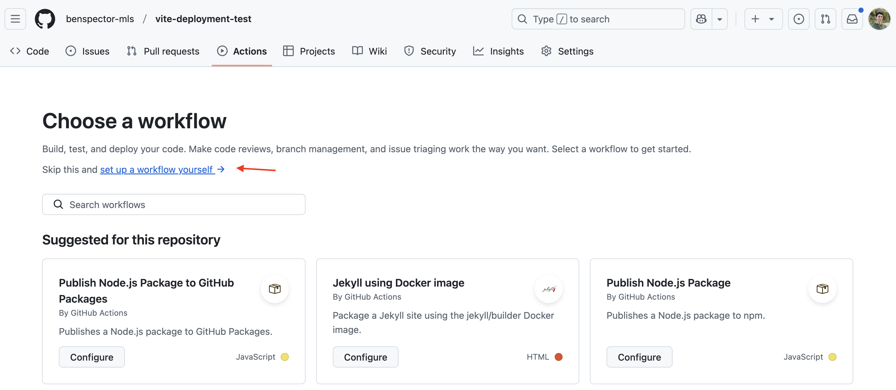

# Deploying a Vite Project with Github Pages

So, you've built an app - congrats! You can run it locally, but wouldn't it be sweet if everyone on the internet could use it??

This resource covers deploying a Vanilla JS Vite app using Github Pages. 

> Note: These details can also be found on [Vite's own docs](https://vitejs.dev/guide/static-deploy).

**Table of Contents**
- [Prerequisites](#prerequisites)
- [What is Github Pages?](#what-is-github-pages)
- [Configure Vite for Deployment on Github Pages](#configure-vite-for-deployment-on-github-pages)
- [Publish on Github Pages](#publish-on-github-pages)

<!--  -->

## Prerequisites

In order to deploy to Github using this guide, you will need 
* A project built using Vite
* A Github repo with that Vite project inside.

## What is Github Pages?

Github Pages is ([according to their website](https://docs.github.com/en/pages/getting-started-with-github-pages/about-github-pages))

> _... a static site hosting service that takes HTML, CSS, and JavaScript files straight from a repository on GitHub, optionally runs the files through a build process, and publishes a website._

There are a few ways to utilize Github Pages but the most straightforward is **to have an `index.html` in the root of our repo** that Github Pages can easily find and serve.

With a few VERY easy settings, we can publish our repo as long as that `index.html` file is in the root.

**To test this out**:
* add an `index.html` file to the root of your repo
* commit and push it
* follow the instructions below in the [Publish On Github Page section](#publish-on-github-pages). 
* delete the `index.html` file once you've tested it.

## Configure Vite for Deployment on Github Pages

**Objective(s)**: Build the production version of the app in the root of the directory.

> If you made an `index.html` file for testing above, delete it now.

Assuming you built that app using Vite, the first step is to make the **production version** of the application. To do this, run the command:

```
npm run build
```

This will create the **production version** of your app in a folder called `dist/` (short for "distribution"). Take a look inside! It will have an `index.html` file and an `assets/` folder with your JavaScript and CSS.

To see how it looks, run the command:

```
npm run preview
```

**However, we need that `index.html` to be in the root of the repo:**

In order to do that, we'll need to configure Vite to create that version in the right location.

Create a Vite configuration file

```sh
touch vite.config.js
```

And put this inside:

```js
import { defineConfig } from 'vite'

export default defineConfig({
  // Keep the forward slashes / / around your repo name
  base: '/your-repo-name-here/', 
});
```

* `base` determines how the `index.html` file connects to the `.js` and `.css` files in your `assets/` folder

Again, run the command

```sh
npm run build
```

This will **compile** the code you've written in your `app/` folder into optimized static files that can quickly be served by Github pages. It will put those files in the root directory of your repo, where Github expects to find an `index.html` file and any associated `assets`.

You can see what this "deployed" version will look like by running the command...

```sh
npm run preview
```

...which will serve the application at http://localhost:4173/

Finally, **commit and push** your new compiled version to Github!

> Note: each time your `npm run build`, new versions of your `assets` will be created and will overwrite the old versions.

## Publish on Github Pages

**Objective(s)**: Publish your web app!

Deploying your application on Github Pages can be achieved by following these steps:

1. Open the repo on Github.com
2. Go to the <kbd>Settings</kbd> tab
3. Find the <kbd>Pages</kbd> section
4. Make sure that **Source** is **GitHub Actions**
5. Then click on **Actions** and select **set up a workflow yourself**



6. This will create a `main.yaml` file and will allow you to edit it. Here is an example you can follow:

```yaml
# Simple workflow for deploying static content to GitHub Pages
name: Deploy static content to Pages

on:
  # Runs on pushes targeting the default branch
  push:
    branches: ['main']

  # Allows you to run this workflow manually from the Actions tab
  workflow_dispatch:

# Sets the GITHUB_TOKEN permissions to allow deployment to GitHub Pages
permissions:
  contents: read
  pages: write
  id-token: write

# Allow one concurrent deployment
concurrency:
  group: 'pages'
  cancel-in-progress: true

jobs:
  # Single deploy job since we're just deploying
  deploy:
    environment:
      name: github-pages
      url: ${{ steps.deployment.outputs.page_url }}
    runs-on: ubuntu-latest
    steps:
      - name: Checkout
        uses: actions/checkout@v4
      - name: Set up Node
        uses: actions/setup-node@v4
        with:
          node-version: 20
          cache: 'npm'
          cache-dependency-path: app/package-lock.json
      - name: Install dependencies
        run: npm ci
        working-directory: './app'
      - name: Build
        run: npm run build
        working-directory: './app'
      - name: Setup Pages
        uses: actions/configure-pages@v4
      - name: Upload artifact
        uses: actions/upload-pages-artifact@v3
        with:
          # Upload dist folder
          path: './app/dist'
      - name: Deploy to GitHub Pages
        id: deployment
        uses: actions/deploy-pages@v4
```

7. Commit the file. This will immediately cause the action to begin!