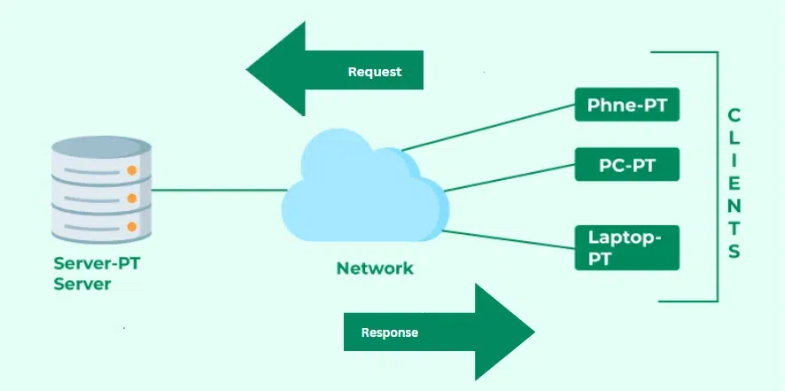
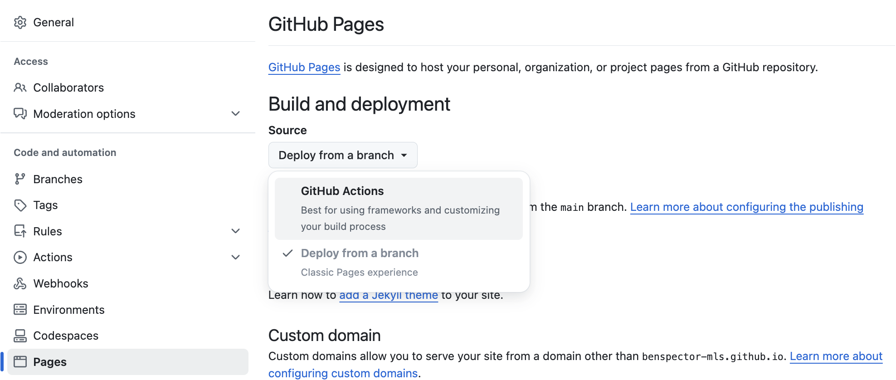
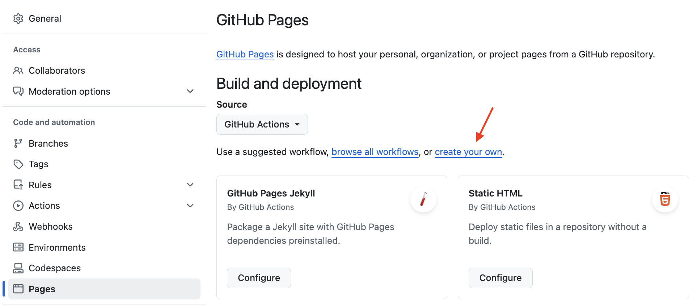

# Deploying a Vite Project with Github Pages

So, you've built an app - congrats! You can run it locally, but wouldn't it be sweet if everyone on the internet could use it??

This resource covers deploying a Vanilla JS Vite app using Github Pages. 

> Note: These details can also be found on [Vite's own docs](https://vitejs.dev/guide/static-deploy).

**Table of Contents**
- [Prerequisites](#prerequisites)
- [What is Github Pages?](#what-is-github-pages)
- [Steps to Deploy on GitHub Pages](#steps-to-deploy-on-github-pages)
  - [1) Configure Vite for Deployment on Github Pages](#1-configure-vite-for-deployment-on-github-pages)
  - [2 and 3) Configure GitHub Pages and Create an Action](#2-and-3-configure-github-pages-and-create-an-action)

<!--  -->

## Prerequisites

In order to deploy to Github using this guide, you will need 
* A project built using Vite.
* A Github repo with that Vite project inside.
* A `main` branch with code that is ready to be deployed.

## What is Github Pages?

Github Pages is ([according to their website](https://docs.github.com/en/pages/getting-started-with-github-pages/about-github-pages))

> _... a static site hosting service that takes HTML, CSS, and JavaScript files straight from a repository on GitHub, optionally runs the files through a build process, and publishes a website._

A static site hosting service is one in which the resources being served are static files that the recipient (the client) can receive and immediately use. When a user (a client) visits your deployed website, GitHub pages will simply send the HTML, CSS, and JavaScript files that make up your website to the user. 



In this article, you will configure GitHub pages to execute a "build process" to convert your Vite project into a production-ready version and deploy it. 

Check out this example repository:

[https://github.com/benspector-mls/vite-deployment-test](https://github.com/benspector-mls/vite-deployment-test)

And you can see the deployed version here:

[https://benspector-mls.github.io/vite-deployment-test/](https://benspector-mls.github.io/vite-deployment-test/)

Notice how the URL that is generated for this deployed site follows the pattern of `https://YOUR_ACCOUNT.github.io/YOUR_REPO/`

## Steps to Deploy on GitHub Pages

The steps required to deploy your project are:
1. Configure Vite to properly build your project to be compatible with GitHub pages
2. Configure your GitHub repository to use GitHub actions.
3. Create a new "Action" on GitHub to build your project.

Let's get into it!

### 1) Configure Vite for Deployment on Github Pages

Return to your own local repository. Make sure that you have switched to the `main` branch. Then, `cd` into your Vite project and do the following:

First, create a Vite configuration file:

```sh
touch vite.config.js
```

And copy this code inside, inserting your repository's name between the forward slashes (keep the forward slashes around the name):

```js
import { defineConfig } from 'vite'

export default defineConfig({
  // Keep the forward slashes / / around your repo name
  base: '/your-repo-name-here/', 
});
```

What did this do?

When we deploy our project, we will instruct GitHub pages to run the command `npm run build` command. Go ahead and run that command to see what it does locally:

```
npm run build
```

This will create the **production version** of your app in a folder called `dist/` (short for "distribution"). 

Take a look inside. It will have an `index.html` file and an `assets/` folder with your JavaScript and CSS compressed into just two files! 

This minification is one of the benefits of Vite as a "build tool". It prepares your project to run lightning-quick because it removes a lot of the bloat that make our lives easier during development but isn't necessary for a deployed project.

Your `index.html` file will mostly be the same as you wrote it, however it will load your `.js` and `.css` files like so:

```html
<script type="module" crossorigin src="/your-repo-name/assets/index-DgrCVH_D.js"></script>
<link rel="stylesheet" crossorigin href="/your-repo-name/assets/index-CWlHu58b.css">
```

The `vite.config.js` file you created and the `base` property that you set determines what goes before `/assets` in these two tags. Doing so ensures that the `.js` and `.css` files in the `/assets` folder have the correct paths.

If you comment out the code inside of `vite.config.js` and run `npm run build` again, you'll notice that the path to the `/assets` folder no longer includes the name of your repo. Remember to uncomment that code so that your configuration is set again.

Finally, **add, commit and push** your changes to add the `vite.config.js` file to your repo.

> Note: each time your `npm run build`, new versions of your `assets` will be created and will overwrite the old versions.
> At any point after running `npm run build`, you can run `npm run preview` to see what the production version will look like.

### 2 and 3) Configure GitHub Pages and Create an Action

Now that your Vite project inside of your repo is set up to properly execute the `npm run build` command, we can instruct GitHub Pages to run that command and to deploy the generated production build.

1. Open the repo on Github.com
2. Go to the <kbd>Settings</kbd> tab
3. Find the <kbd>Pages</kbd> section
4. Change the **Source** to **GitHub Actions**



5. Then click on **Actions** and select **set up a workflow yourself**



6. This will create a `main.yml` file and will allow you to edit it. Here is an example you can follow (note that this assumes that you have called your Vite project folder `app` inside of your repo. If you have named it something else, replace every instance of `app` with the name of your Vite project folder):

```yml
# Simple workflow for deploying static content to GitHub Pages
name: Deploy static content to Pages

on:
  # Runs on pushes targeting the default branch
  push:
    branches: ['main']

  # Allows you to run this workflow manually from the Actions tab
  workflow_dispatch:

# Sets the GITHUB_TOKEN permissions to allow deployment to GitHub Pages
permissions:
  contents: read
  pages: write
  id-token: write

# Allow one concurrent deployment
concurrency:
  group: 'pages'
  cancel-in-progress: true

jobs:
  # Single deploy job since we're just deploying
  deploy:
    environment:
      name: github-pages
      url: ${{ steps.deployment.outputs.page_url }}
    runs-on: ubuntu-latest
    steps:
      - name: Checkout
        uses: actions/checkout@v4
      - name: Set up Node
        uses: actions/setup-node@v4
        with:
          node-version: 20
          cache: 'npm'
          cache-dependency-path: app/package-lock.json
      - name: Install dependencies
        run: npm ci
        working-directory: './app'
      - name: Build
        run: npm run build
        working-directory: './app'
      - name: Setup Pages
        uses: actions/configure-pages@v4
      - name: Upload artifact
        uses: actions/upload-pages-artifact@v3
        with:
          # Upload dist folder
          path: './app/dist'
      - name: Deploy to GitHub Pages
        id: deployment
        uses: actions/deploy-pages@v4
```

7. Commit the file using the GitHub GUI. This will immediately cause the action to begin!
8. On your GitHub repo homepage, look for the About section on the right side of the screen and click on the cog icon. Click on "Use your GitHub Pages website". This will add the deployed site to your repo's homescreen!
9. Lastly, return to your repo and `git pull` to bring the new `main.yml` file into your local repository.

That's it! Share your deployed link with friends and family to show off your work :)