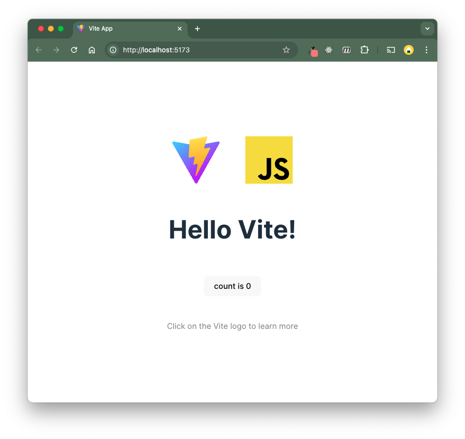

# How to Create Projects with Vite

**Table of Contents**:

* [Background](vite.md#background)
  * [What is a Server?](vite.md#what-is-a-server)
  * [Development Servers and Deployment](vite.md#development-servers-and-deployment)
* [What is Vite?](vite.md#what-is-vite)
  * [Vite Quick Starter](vite.md#vite-quick-starter)
  * [Make the Project Your Own!](vite.md#make-the-project-your-own)
* [Play Around with Vite Features](vite.md#play-around-with-vite-features)
  * [Importing CSS](vite.md#importing-css)
  * [Importing JSON and other Files](vite.md#importing-json-and-other-files)
  * [Importing Node Modules](vite.md#importing-node-modules)
* [Vite's Build Tool and Deployment](vite.md#vites-build-tool-and-deployment)



## Background

Before diving into Vite, it's important to go over a few key concepts. We'll go over the terms below:

**Key Terms**

* **Server** — Any computer that stores, manages, and shares resources over the internet.
* **Client** — Any computer that requests resources from a server
* **HTTP** — Hypertext Transfer Protocol. The protocol used to transfer data between two computers over the internet.
* **Deploy** — To transfer web application files from ones own computer to a server for the purposes of distribution.
* **Development Server** — A program that runs on a developer's computer to simulate a deployed project.

Vite will help us to deploy our project to a server allowing for clients around the world to access our projects via the HTTP protocol. Vite will also help us during development by simulating a deployed environment via a development server.

Let's get into it!

### What is a Server?

Until now, you've been using the `file://` protocol to open up projects on your own computer. All web applications, even project like Google, started out this way. So, how is it that you can access Google with your browser? When you visit [https://google.com](https://google.com), what exactly is happening?

Well, Google is "hosted" on a server that lets you access it over the internet.

A **server** is any computer that stores, manages, and shares resources over the internet.


A user's computer acts as the **"client"** and sends an **HTTP request** (**h**yper**t**ext transfer protocol) to get resources from the server using the `https://` protocol (the hypertext transfer protocol).

The server then sends an **HTTP response** with the requested content.

* For example, our browsers send an HTTP request to google when we visit [https://www.google.com](https://www.google.com). In response, Google's servers send us the HTML, CSS, and JavaScript that makes up the Google site.


`google.com` is just the human-readable **domain name** of Google's servers. Every server also has a unique 4-digit IP address (**I**nternet **P**rotocol address) that precisely locates the server in the vast world wide web.

For example, Google's servers have the IP address [142.251.41.14](http://142.251.41.14/). Put that IP address into your search bar and it will also take you to Google!

When we send an HTTP request, our browser takes the domain name (`google.com`) and looks up the IP address using a DNS (Domain Name Service) before sending a request to the server.


### Development Servers and Deployment

All web applications, even Google, started out as a coding project on someone's computer. Then, then they **deploy** their project to a publicly accessible server allowing anyone to access their code via the internet and the `https://` protocol.

Until now, our browsers have been using the `file://` protocol to access files located on our own computers. But if we ever want to deploy our projects, sharing them with the world via the `https://` protocol, then we should begin using that protocol during development.

> _Deployment: the action of bringing resources into effective use._

With a **local development server**, we can simulate the HTTP protocol to access the files on one's own computer, even though the internet is not required to do so.


The standard domain name and IP address of a local development server are:

* Domain Name: `http://localhost`
* IP Address: `127.0.0.1`


There are important differences between how the `file://` and `https://` protocols serve resources. One key difference between the `file://` and `https://` protocols are how they handle resource sharing.

As we discovered in the [ESModules lecture](mod-2-html-css-dom/esmodules.md), we can't use ESModules with the normal `file://` protocol without running into CORS (cross-origin resource sharing) issues. We need to use the `http://` protocol to enable our files to import values from each other.

By using a development server, we can use the HTTP protocol throughout the entire development process.

## What is Vite?

According to the [Vite](https://vite.dev/guide/#getting-started) documentation:

> Vite (French word for "quick", pronounced /vit/, like "veet") is a build tool that aims to provide a faster and leaner development experience for modern web projects. It consists of two major parts:
>
> * A **development server** that provides rich feature enhancements over native ES modules, for example extremely fast Hot Module Replacement (HMR).
> * A **build command that bundles your code** with [Rollup](https://rollupjs.org/), pre-configured to output highly optimized static assets for production.

In simpler terms, Vite provides a feature-rich developer server as well as a command line tool that will optimize our application when we are ready to deploy.

Once we learn how Vite works, it can dramatically improve our development and deployment experience. It will be slow at first to use a new development tool, however the long-term benefits often outweigh the short-term frustrations so be patient!

The best way to learn is by doing so, without further ado, let's make a project using Vite!

### Vite Quick Starter

To start a new project using Vite, do the following:

1. Start by creating a new repository on GitHub. Make sure it has a `README.md` file
2. Clone down the repo
3.  Inside the repo, create a [Vite](https://vitejs.dev/guide/) project using the `npm create vite` command:

    ```sh
    npm create vite@latest
    # > Project Name: app
    # > Select a framework: Vanilla
    # > Select a variant: JavaScript
    ```

    This will create a folder in your repo called `app` that will serve as the "development" version of the application (later, when you are ready to deploy, you will also create a "production" version).
4. Open up the `app` directory and look around. Vite will have created the following files and directories for you to get started:
   * `package.json`: defines the scripts and dependencies of your project. Notably, when you run `npm i` in your `app` directory, it will install the `vite` command-line tool. It's the first place to look when working on a new project.
     * `package-lock.json`: Read more about package lock files [here](https://docs.npmjs.com/cli/v9/configuring-npm/package-lock-json).
   * `index.html`: the "entry point" of your application. It contains only a `div#app` element and loads the `src/main.js` file. This must remain in the root of your `app` directory.
   * `.gitignore`: lists filepaths to be ignored when making a commit. Importantly, you'll see that `node_modules/` are ignored.
   * `public/`: contains files that you want to be publicly accessible. Often, these are images that you reference in your HTML or CSS.
   * `src/`: contains the JavaScript and CSS that makes up your application!
     * `main.js`: is the "entry point" of your JavaScript code. You can move this file and any other JS files into sub-directories for better organization if you so desire.
     * `style.css`: contains the CSS for your application and is imported into `main.js` (yes, you can import CSS in JavaScript with Vite!). You can move this file and any other CSS files into sub-directories for better organization if you so desire.
     * `counter.js`: defines the logic for a simple counter application. We'll delete this "starter application" when we begin working on our own project.
     * `javascript.svg`: a logo for JavaScript. We'll also delete this file.
5.  `cd` into the `app` directory and install the `vite` command line tool and other dependencies for the project

    ```sh
    cd app
    npm i
    ```
6.  Start the Vite development server:

    ```sh
    # according to package.json, this runs the vite command
    npm run dev 
    ```
7. Open up [http://localhost:5173](http://localhost:5173) to view the starter application. As you can see, Vite provides you with a simple counter application to get started.




💡 **Tips**: You don't need to stop and start you Vite development server when you make changes because it has "hot reloading". Make a few changes to the application and notice it auto-update!

To stop the development server enter <kbd>Ctrl + C</kbd>.

To restart the development server, use the command `npm run dev`.


### Make the Project Your Own!

Vite provides an application for you to get started with but we want to make it our own.

First, remove these unnecessary files

```sh
# delete these files
rm src/counter.js src/javascript.svg
```

Then, we can edit the provided starter code:

* Empty out the `style.css` file (unless you want to keep some of the styles)
* Empty out the `main.js` file, keeping the `import './style.css'` line

Now, we have an empty project that we can use as a starting point!

In the `index.html`, go ahead and modify the body such that it looks like this:

```html
<body>
  <header>
    <h1>My Website</h1>
  </header>
  <main>
    <p>Hello World!</p>
  </main>
  <footer>
    <p>Created by me</p>
  </footer>
  <script type="module" src="/src/main.js"></script>
</body>
```

In `main.js`, replace the contents with the following:

```js
import './style.css';

const main = () => {
  const p = document.createElement('p');
  p.textContent = 'Vite is amazing!';

  document.querySelector('main').append(p);
}

main();
```

...and then reopen [http://localhost:5173](http://localhost:5173) to see your website!

To save these changes in your repository, add, commit, and push them!


If you want to make a multi-page app with multiple `.html` files, refer to Vite's documentation on this matter:

https://vite.dev/guide/build.html#multi-page-app


## Play Around with Vite Features

While this takes a bit more setup than simply making a folder with your project files, Vite provides many upgrades that are well worth the upfront setup. Plus, as you get more used to using Vite, you will get much faster at setting up your projects.

### Importing CSS

As you may have noticed, rather than linking the `style.css` in the `index.html` file, we imported it into `main.js`! For now, compared to linking in HTML, this approach doesn't provide much benefit. However, when we get to React it will provide some benefits.

```js
import './style.css';
```

### Importing JSON and other Files

With Vite we can import JSON files directly and other file types directly.

To test this, stop the server if it was running (<kbd>Ctrl+C</kbd>) and then run the commands below to create a file called `example.json` and add some data to it:

```sh
# Create the JSON file
touch example.json
# Pipe the array string into the JSON file
echo "[1,2,3,4,5]" >> example.json
```

Then in `main.js`, add the following code:

```js
import data from '../example.json'
console.log(data);
```

Start the server again and check your console to see the data from `example.json`.

We can't do this using the `file://` protocol or simple development servers like Live Server.


**A Note on Storing Static Files**:

* Files stored in the `public` directory are treated as if they were stored in the root of the project. `/` represents the `public` folder so the `vite.svg` file in the root of `public` is accessed like so: `/vite.svg` (see `index.html`).
* Files stored anywhere else within the `app` directory are accessed using a relative file path. For example, `../example.json` is referenced as one level above `main.js`.


### Importing Node Modules

Lastly, we can install NPM dependencies into our projects and import them by only their name. To test this, install the `uuid` package:

```sh
npm i uuid
```

This `uuid` package provides functions for generating **Universally Unique IDs** which are helpful for identifying objects in a large dataset.

Finally, add the following code to `main.js` below the other imports:

```js
import { v4 as generateUUID } from 'uuid';

const newUUID = generateUUID();
document.body.append(`your new uuid is ${newUUID}`);
```

In order to use this `uuid` package with Live Server, we'd have to specify the full path to this module:

```
./node_modules/uuid/dist/esm-browser/index.js
```

Yuck! 🤮

## Vite's Build Tool and Deployment

The other main feature of Vite is its "build tool". When it is time to deploy our project, Vite will bundle all of our files into one HTML file, one JS file, and one CSS file to be efficiently delivered to our users over the internet.

This will improve load times and our user's overall impression and experience using our application!

To run the build command, run the command:

```sh
npm run build
```

This will create a `dist/` folder (short for "distribution", a synonym for the "production" version of your application). Inside will be the aforementioned HTML file and JS and CSS files in the `dist/assets/` folder. Take a look at those files to see how they have been "minified"!

To see how this distribution version runs, run the command:

```sh
npm run preview
```

To deploy this distribution version of your application, check out the article on [How to Deploy on GitHub Pages](https://marcylabschool.gitbook.io/marcy-lab-school-docs/how-tos/deploying-vite-with-github-pages).
