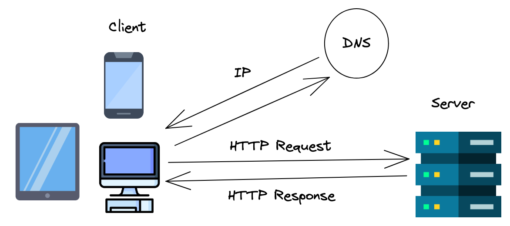

# Vite

**Table of Contents**:
- [Review: Development Servers](#review-development-servers)
- [What is Vite?](#what-is-vite)
  - [Vite Quick Starter](#vite-quick-starter)
- [So, What Can We Do With Vite?](#so-what-can-we-do-with-vite)
  - [Importing CSS, JSON, and Node Modules](#importing-css-json-and-node-modules)
  - [Build Command](#build-command)
- [Make the Project Your Own!](#make-the-project-your-own)



## Review: Development Servers

A **server** is just a computer that shares its resources over the internet. A user's computer acts as the **"client"** and requests resources from the server using the `https://` protocol (the hypertext transfer protocol). 

When we visit a URL, like [https://www.google.com](https://www.google.com), our browser converts the **Domain Name** (`google.com`) into the **IP Address** of the server computer where the code for Google lives. Then, our computer sends a **request** to that server computer over the internet and the server sends a **response**.



With a **development server**, we can simulate this **HTTP request-response cycle** by having our computer act as both the client and the server.

One of the quickest development servers to set up is Live Server.

**<details><summary>Why do we need a development server? What benefit does it provide over just opening `html` files using the `file://` protocol?</summary>**
> 1. **To avoid CORS errors:** As we discovered in the [ESModules lecture](./esmodules.md), we can't use ESModules with the normal `file://` protocol without running into CORS issues. We need to use the `http://` protocol to enable our files to import values from each other.
> 
> 2. **To simulate how our application will be accessed in "production":** We will eventually want to **deploy** our projects, making them accessible by anyone on the internet. When we do, our application will be accessed via the `http://` protocol, not the `file://` protocol. As we've seen, there are some differences between how our browser operates using each protocol so it can be beneficial to test our application using the same protocol that our future users will be using.
</details>

## What is Vite?

While Live Server is an incredibly easy development server to setup, it is a bit basic for our needs.

According to the [Vite](https://vite.dev/guide/#getting-started) documentation: 

> Vite (French word for "quick", pronounced /vit/, like "veet") is a build tool that aims to provide a faster and leaner development experience for modern web projects. It consists of two major parts:
> 
> * A **dev server** that provides rich feature enhancements over native ES modules, for example extremely fast Hot Module Replacement (HMR).
> * A **build command that bundles your code** with [Rollup](https://rollupjs.org/), pre-configured to output highly optimized static assets for production.

In simpler terms, Vite provides a developer server with more features than Live Server as well as a command line tool that will create a highly optimized version of our application when we are ready to deploy.

> **Deploy:** to transfer the completed code changes from one environment to another (e.g. from development to production).

### Vite Quick Starter

To start a new project using Vite, do the following:

1. Start by creating a new repository on GitHub and clone it down into your `unit-2` directory. 
2. Inside the repo, create a [Vite](https://vitejs.dev/guide/) project using the `npm create vite` command:

    ```sh
    npm create vite
    # > Project Name: app (or any name of your choosing)
    # > Select a framework: Vanilla
    # > Select a variant: JavaScript
    ```

    This will create a folder in your repo called `app` that will server as your "development" version of the application (when you are ready to deploy, you will also create a "production" version).

3. Open up the `app` directory and look around. Vite will have created the following files for you to get started (in order of importance):
    * `package.json`: defines the scripts and dependencies of your project.
    * `index.html`: contains only a `div#app` element and loads the `main.js` file.
    * `main.js`: is the "entry point" of your JavaScript code.
    * `style.css`: contains the CSS for your application and is imported into `main.js` (yes, you can import CSS in JavaScript with Vite!)
    * `counter.js`: defines the logic for a simple counter application.
    * `.gitignore`: lists filepaths to be ignored when making a commit.
    * `public/`: contains files that will not be transformed or bundled by Vite (images, logos, fonts, etc...) when running the build command.
    * `javascript.svg`: a logo for JavaScript

4. `cd` into the `app` directory, install Vite dependencies and other dependencies for the project, and start the Vite development server:

    ```sh
    cd app
    npm i
    npm run dev
    ```

5. Open up [http://localhost:5173](http://localhost:5173) to view the starter application. As you can see, Vite provides you with a simple counter application to get started. 


> 💡 **Tips**: You don't need to stop and start you Vite development server when you make changes because it has "hot reloading". Make a few changes to the application and notice it auto-update!
>
> To stop the development server enter <kbd>Ctrl + C</kbd>.
>
> To restart the development server, use the command `npm run dev`. 

## So, What Can We Do With Vite?

While this takes a bit more setup than Live Server, Vite provides many upgrades that are well worth the upfront setup. Plus, as you get more used to using Vite, you will get much faster at setting up your projects.

### Importing CSS, JSON, and Node Modules

As you may have noticed, rather than linking the `style.css` in the `index.html` file, we imported it into `main.js`! For now, compared to linking in HTML, this approach doesn't provide much benefit. However, when we get to React it will provide some benefits.

What IS much better is the ability to import JSON files directly. Suppose we had an `example.json` file that we wanted to import into our project. We can easily do this:

```js
import data from './example.json';
```

We can't do this using Live Server.

Lastly, we can install NPM dependencies into our projects and import them by only their name. To test this, install the `uuid` package:

```sh
npm i uuid
```

This `uuid` package provides functions for generating **Universally Unique IDs** which are helpful for identifying objects in a large dataset.

Finally, add the following code to `main.js` below the other imports:

```js
import { v4 as generateUUID } from 'uuid';

const newUUID = generateUUID();
document.body.append(`your new uuid is ${newUUID}`);
```

In order to use this `uuid` package with Live Server, we'd have to specify the full path to this module:

```
./node_modules/uuid/dist/esm-browser/index.js
```

Yuck! 🤮

### Build Command

The other main feature of Vite is that when it is time to deploy our project, it will bundle all of our files into one HTML file, one JS file, and one CSS file to be efficiently delivered to our users over the internet.

This will improve load times and our user's overall impression and experience using our application!

To run the build command, run the command:

```sh
npm run build
```

This will create a `dist/` folder (short for "distribution", a synonym for the "production" version of your application). Inside will be the aforementioned HTML file and JS and CSS files in the `dist/assets/` folder. Take a look at those files to see how they have been "minified"!

To see how this distribution version runs, run the command:

```sh
npm run preview
```

To deploy this distribution version of your application, check out the article on [How to Deploy on GitHub Pages](https://marcylabschool.gitbook.io/marcy-lab-school-docs/how-tos/deploying-vite-with-github-pages).

## Make the Project Your Own!

Now that we know what Vite can do, let's start making an application with it! Vite provides an application for you to get started with but we want to make it our own.

First, remove these unnecessary files

```sh
# delete these files
rm counter.js javascript.svg
```

Next, make a `src` directory for all of our non-configuration code

```sh

# make a src directory
mkdir src

# move these files into src
mv main.js src/
mv style.css src/
```

We leave only the `index.html` file at the root of the project because it serves as the **entry point** for the rest of the application.

All future JavaScript and CSS files you create should exist somewhere within `src`. Feel free to create more folders inside it if you'd like.

Finally, we can edit the provided starter code:
* Edit the `<script>` tag in `index.html` (line 11) so that it references the new location of `main.js`: `"/src/main.js"`
* Empty out the `style.css` file
* Empty out the `main.js` file.

Now, we have an empty project that we can use as a starting point! To test it out, go ahead and replace the `main.js` file with the following code:

```js
import './style.css'
import { v4 as generateUUID } from 'uuid';

// Ordinarily, you'd add these elements to index.html
const uuidButton = document.createElement('button');
const uuidText = document.createElement('p');
document.body.append(uuidButton, uuidText);

uuidButton.textContent = 'Generate UUID';

uuidButton.addEventListener('click', () => {
  const newUUID = generateUUID();
  uuidText.textContent = `your new uuid is: ${newUUID}`
});
```

...and then reopen [http://localhost:5173](http://localhost:5173). You should see this!


To save these changes in your repository, add, commit, and push them!

When you are ready to deploy your project, check out the article on [How to Deploy on GitHub Pages](https://marcylabschool.gitbook.io/marcy-lab-school-docs/how-tos/deploying-vite-with-github-pages).
