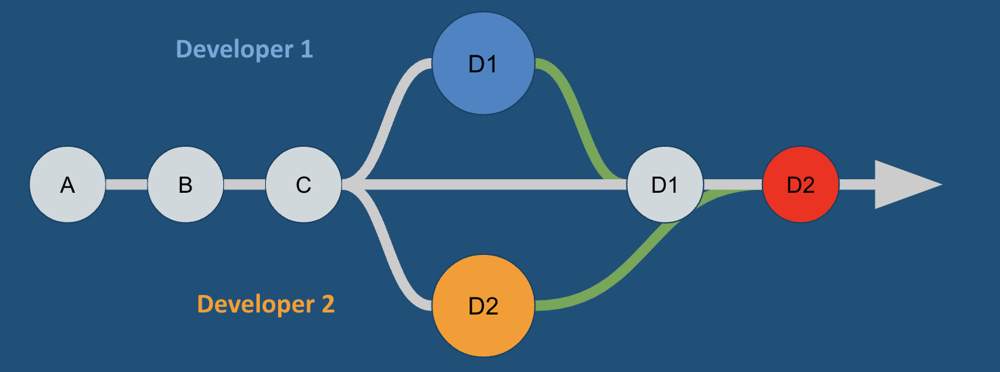

# 3. Git Pulling & Merging

GitHub enables developers across the world to collaborate on projects. In this lesson, we'll learn how to use GitHub to create and manage branches, merge branches, create pull requests, and resolve merge conflicts.

You will be able to…

* Pull changes from a repository
* Resolve merge conflicts

**Table of Contents:**

* [Key Terms & Commands](3-git-pulling-merging.md#key-terms--commands)
* [Collaborating on a GitHub Repository](3-git-pulling-merging.md#collaborating-on-a-github-repository)
  * [`git pull` synchronizes local repositories](3-git-pulling-merging.md#git-pull-synchronizes-local-repositories)
  * [Adding a Collaborator](3-git-pulling-merging.md#adding-a-collaborator)
  * [Creating a Merge Conflict](3-git-pulling-merging.md#creating-a-merge-conflict)
  * [Why Can't I Push?](3-git-pulling-merging.md#why-cant-i-push)
  * [Handling Merge Conflicts](3-git-pulling-merging.md#handling-merge-conflicts)
* [Tips for success](3-git-pulling-merging.md#tips-for-success)

## Key Terms & Commands

**Key Terms**

* **Pull** — to download changes from a remote repository
* **Merge** - to combine two or more branches into one
* **Merge Conflict** — a situation in which two or more branches need to be merged but have modified the same lines of code, causing the merge to fail. This happens all the time and can be resolved through the Github GUI or the CLI.

**Important Git commands**


**Note:** In the commands below, argument placeholders will be written like this: `[argument]`. When using these commands, replace the `[argument]` with your desired inputs, making sure to leave out the `[]` as well.


```sh
git pull # download changes from a remote repository
```

## Collaborating on a GitHub Repository

An app published to the App Store (or Play Store, I see you Android users) is essentially the same as a repository uploaded to GitHub.


Just like downloading an app, anyone can download a repo from GitHub using the `git clone` command.

To demonstrate this, find a partner (or simply play the role of two developers). Then do the following:

1. Have one developer create a new repo called **git-pulling-practice**. Make sure it includes a `README.md` file. Then, share the URL with their partner.
2. Have both developers use their VS Code Terminal to navigate to their `unit-0` folder and clone the repo onto their computers using `git clone`
   * If working solo, clone the repo a second time but rename the second copy. You can do this by adding an additional input to the `git clone` command for the new name, resulting in something like this: `git clone <git_repo_url> git-pulling-practice-copy`.
3. Have both developers navigate into the repo using the `cd` command.
   * If working solo, open two VS Code Terminal windows for this, navigating each terminal to one of the copies of the repo so that you can easily switch back and forth between "developer 1" (the first clone) and "developer 2" (the second clone).

Tada! Now you have the same repository on two computers!

### `git pull` synchronizes local repositories

In the last lesson, you learned about the `git push` command which uploads a local repository's commits to the remote repository (GitHub).

`git pull` does the opposite. If the local repository (on your computer) is missing commits that are on the remote repository (on GitHub), `git pull` will download those commits.

Let's put this into practice. With your partner do the following:

1. Have the developer who first created the repo on GitHub make some edits to `README.md`.
2.  That same developer should then stage their changes, commit, and push:

    ```sh
    git add README.md
    git commit -m "[description of your commit]"
    git push
    ```
3. Double check on GitHub that the commit shows up on the remote repository's commit history.
4. **Now, the second developer should run the command `git pull`** (if working solo, switch over to the location of the second copy of the repo and run `git pull`)


By storing repositories remotely on GitHub, any number of developers can have access to a single repository. This push and pull mechanism is essential for collaboration.

### Adding a Collaborator

So far only one developer was making changes, while the other developer simply "pulled down" those changes. But what if both developers want to work simultaneously?

Before moving on, the owner of the shared repo should add their partner as a collaborator:

1. Go into the settings of the repo, go to Collaborators, and click on "Add people".
2. Add their partner as a collaborator using their GitHub username or Email and have their partner accept the invitation.


### Creating a Merge Conflict

For this next part, it is going to be a race, so get your typing fingers ready! Both developers should:

1. Run `git pull` to make sure that their local repository is in sync with the remote.
2. Open up the `README.md` file and replace the content on line 1 with their own name. **This is the most important step. It is essential that both developers edit the same line of code**
3. Stage their changes (`git add README.md`)
4. Commit (`git commit -m "description of commit"`)
5. Push (`git push`)!
6. Chaos

Whichever developer managed to push their changes first (or has a better internet connection) will have no problem pushing their code.

The developer who pushed second will be given this message:


### Why Can't I Push?

You are only allowed to push to the remote repository if your local repository has the exact same commit history as the remote repository.


They _could_ try to "force" their push through by running `git push -f` but this would delete their partner's commit! Use this command with caution.


In this case, developer 2 is missing the commit from developer 1 in their local repo and needs to pull down the changes.



So, the developer who pushed last should run `git pull`

However, in this situation, the conflict will cause a **Merge Conflict** like this:

```
Auto-merging README.md
CONFLICT (content): Merge conflict in README.md
Automatic merge failed; fix conflicts and then commit the result.
```

### Handling Merge Conflicts

Okay take a deep breath. Merge conflicts are often scary when they are first encountered, but they happen all the time and are an entirely expected part of the development process!

**Merge conflicts** occur when two developers edit the same lines of code in the same repo and unsuccessfully merge those changes together, as happened here.

VS Code provides a nice UI to help us resolve the conflict:

.png>)

Let's break down what we see here:

* The three "markers" outline the two conflicting pieces of code:
  * `<<<<<<< HEAD` on line 1
  * `=======` on line 3
  * `>>>>>>> b737ff...` on line 5
* The "current change" is the code already in my local repo.
* The "incoming change" is the code that I'm trying to merge into my local repo (from the remote repository).

To resolve this conflict we can:

1. Use the buttons that VS Code provides:
   * "Accept Current Change" — replace the code from the remote with your code.
   * "Accept Incoming Change" — replace your code with the code from the remote.
   * "Accept Both Changes" — keep both!
   * "Compare Changes" — see the changes side by side
2. Alternatively, we can just delete the markers and keep the code you want to keep!
3. Once you've made your choice, save the file, stage the changes, commit them, and push the changes.
   * Typically, you can use the commit message `"resolving merge conflicts"`


Hurrayy!!! You've solved the merge conflict! Piece of cake.

## Tips for success

* Pay attention to the details and take notes! Do not shy away from the messages in your terminal. Seek to understand them and you'll gain so much more confidence.
