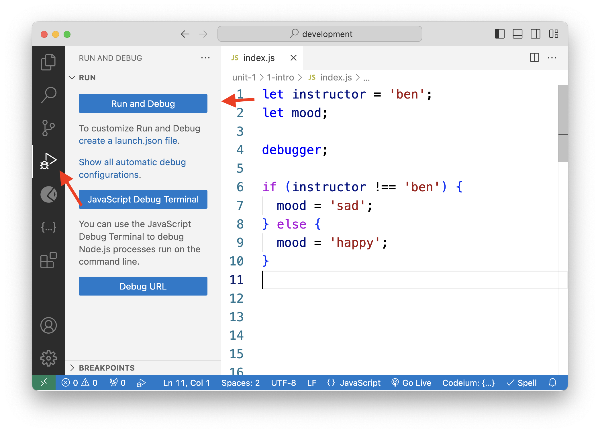
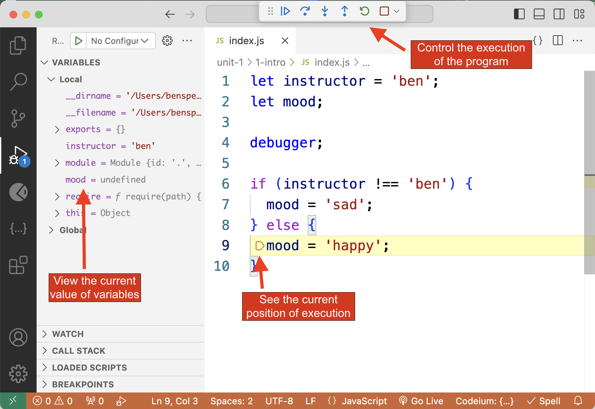
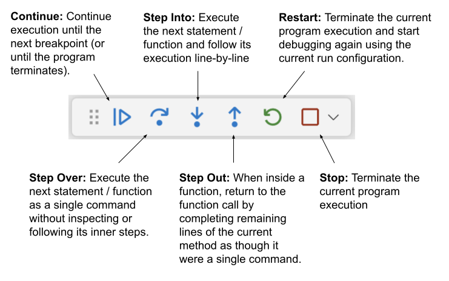

# Intro to Programming

* [Setup](0-intro-to-programming.md#setup)
* [What is a program?](0-intro-to-programming.md#what-is-a-program)
* [Running a file with Node](0-intro-to-programming.md#running-a-file-with-node)
* [Debunking the Console Log Myth](0-intro-to-programming.md#debunking-the-console-log-myth)
* [Control Flow](0-intro-to-programming.md#control-flow)
  * [Inspecting the Control Flow With Node](0-intro-to-programming.md#inspecting-the-control-flow-with-node)
* [Code Style and Readability](0-intro-to-programming.md#code-style-and-readability)

**Key Concepts**:

* A **program** is a text file with instructions to accomplish some task.
* **Comments** are ignored and help to explain the code.
* **Expressions** are raw data values or the results of operations. Expressions on their own do nothing.
* **Statements** change the program.
  * Creating a variable increases the memory used by the program.
  * `if` statements change the "control flow" of a program by skipping lines of code.
* **Node** is a program that interprets and executes JavaScript code.
* `console` is a built-in object with functions that print text to the Terminal output. A program can run without any console statements, you just won't see any output in the Terminal.
* **Control Flow** is the order in which lines of code are executed.
* **Code Style** refers to the formatting of the code in a way that makes it easier to read and understand. Refer to the [style guide](https://marcylabschool.gitbook.io/marcy-lab-school-docs/cheatsheets/style-guide) for more details.

## Setup

* In your `unit-1` folder, create a new folder called `1-intro-to-programming`
* `cd 1-intro-to-programming`
* `touch index.js`

## What is a program?

* A program is a text file with instructions to accomplish some task.
* Comments are ignored and help to explain the code.
* **Expressions** are raw data values or the results of operations. Expressions on their own do nothing.

```js
// index.js
5 + 5
'hello'
true
```

* **Statements** change the program.


```js
// creating a variable increases the memory/storage used by the program
let instructor = 'ben';
let mood;

// if statements change the "control flow" of a program (which line of code comes next)
if (instructor !== 'ben') {
  mood = 'sad';
} else {
  mood = 'happy';
}
```


* References to variables are also expressions, since they retrieve the raw data held inside of them.
* Expressions can be composed of multiple smaller expressions! For example, the `instructor` and `'ben'` expressions are combined using the `!==` operator to create an expression that returns the value `false`

## Running a file with Node

* When we want to run the code in a file, we use Node
* Node is a program for interpreting and executing JavaScript code
* It is installed on your computers and can be activated in the Terminal using the `node <filename>` command:

```sh
node index.js
```

* **Question:** Any guess as to why we're not seeing anything when we run this file?

## Debunking the Console Log Myth

* `console.log()` is a built-in function that prints text to the Terminal output
* The word "Console" is a reference to the Terminal.

```js
console.log('hello');
```

* Every language has a built-in console output function:

```python
# run a .py file like this: 
# python3 index.py
print('hello')
```

* The most common assumption that beginner developers make is that `console.log()` is the only way to make your program work. This is not the case!

```js
let x = 0;

/* A loop with 1 billion iterations will actually take a second to run! Increase that number to 10 billion and it could take a minute or more. */
for (let i = 0; i < 1000000000; i++) {
  x++;
}
```

* Your computer is executing the instructions you give it, but you just can't see the results. `console.log()` just prints the results to the Terminal.

```js
let x = 0;

console.time("x timer");

/* A loop with 1 billion iterations will actually take a second to run! Increase that number to 10 billion and it could take a minute or more. */
for (let i = 0; i < 1000000000; i++) {
  x++;
}

console.timeEnd("x timer");

console.log(x);
```

* As you can see, `console` is actually an object with functions inside (a.k.a "methods") that can each be used to print things to the Terminal.

## Control Flow

* **Control Flow** refers to the order in which code is executed.
* The default control flow is top to bottom, with every line of code being executed in order.

```js
console.log('1')
console.log('2')
console.log('3')
```

* `if` statements change the control flow of a program, causing certain lines to be skipped.

```js
let instructor = 'ben';
let mood;

// if statements change the "control flow" of a program (which line of code comes next)
if (instructor !== 'ben') {
  mood = 'sad'; // this is skipped
} else {
  mood = 'happy'; // this line of code is executed next
}
```

* Functions are containers for statements. A **function call** statement changes the control flow by "activating" the function. Calling a function sets the first line of code in the function as the next line of code to be executed.


```js
// functions are containers for statements. we've created the function, but haven't activated it yet
const say = (speaker, message) => {
  console.log(`${speaker}: ${message}`);
  return; // often, a blank return statement like this is omitted
};
 
// call the functions - activate the function, tell it start
say("ben", "hi Fall 2024")
say("Fall 2024", "hi ben")
```


* The `return` statement "returns" the control flow to the line of code that called the function. The `return` statement can be omitted if no value is returned but technically its still there (otherwise the program wouldn't know to go back to the function call!).

**Question:** What is the control flow of the code above? (Describe it using line numbers.)

### Inspecting the Control Flow With Node

* You can view the exact control flow of a program by using the built in VS Code **Run and Debug panel**.



* Once you open the panel, open a `.js` file and add a `debugger;` statement wherever you would like to inspect your code. Then, click "Run and Debug" and select the "Node" configuration.



* At the top, you will see the debugger control panel where you can control the execution of the program.



## Code Style and Readability

* **Readability** is how easy it is for another engineer to read and understand your code (including future you).
* Indentation shows the scope of each line of code. Without it, it is harder to read and understand.

```js
const canVote = (age) => {
if (age >= 18) {
return true;
} else {
return false;
}
}
```

* Whenever a block of code is created with curly braces `{}`, we indent the code inside using the Tab key:

```js
const canVote = (age) => {
  if (age >= 18) {
    return true;
  } else {
    return false;
  }
}
```

**Question:** How would you fix the code style of this function?

```js
const sayTheTime = (time) => {
if (time <= 12) {
  console.log("Good morning");
        } else if (time <= 18) {
  console.log("Good afternoon");
} else {
  console.log("Good evening");
}
}
```
