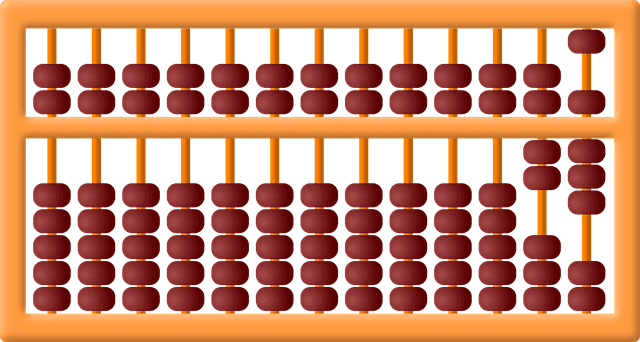

# Data Types and Variables


Follow along with code examples [here](https://github.com/The-Marcy-Lab-School/1-1-data-types-variables)!


**Table of Contents:**
- [Summary](#summary)
- [Computation is All About Data](#computation-is-all-about-data)
- [Data Types](#data-types)
- [Operators](#operators)
  - [Ternary Operator](#ternary-operator)
  - [typeof Operator](#typeof-operator)
  - [Resolution Order of Operations](#resolution-order-of-operations)
- [Type Coercion \& Truthy vs. Falsy](#type-coercion--truthy-vs-falsy)
- [Variables](#variables)
  - [Referencing and Reassigning Variables](#referencing-and-reassigning-variables)
  - [Variable Scope](#variable-scope)
  - [The Four Ways To Declare Variables](#the-four-ways-to-declare-variables)
  - [Hoisting: Why We Don't Use `var`](#hoisting-why-we-dont-use-var)

## Summary

* **Data types** are categories of values in JavaScript. There are 5 primitive types (String, Number, Boolean, undefined, null) and 3 reference types (Object, Array, Function). Knowing the type of a value helps determines how you can use that value. Choosing the right type to represent your data is essential.
* **Operators** are symbols (e.g. `+`, `>=`, `&&`) that generate new data from existing values. Arithmetic, comparison, and logical operators allow you to perform calculations and make decisions.
* **Type coercion** is the process of converting a value from one data type to another, sometimes automatically. Values can be "truthy" or "falsy" depending on their content.
* **Variables** are named containers for data. You can reference and reassign variables to store and update information in your program.
  * There are four ways to declare variables: `const` (preferred for values that don't change), `let` (for values that do change), `var` (legacy, avoid using), and global variables (avoid using).
* **Hoisting** allows some variables and functions to be referenced before they are declared, which can lead to confusing bugs. Prefer `const` and `let` to avoid hoisting

## Computation is All About Data

Every computational device, even the earliest device the abacus, is used to manipulate and generate data.



Our modern computers, while much more powerful, are still oriented around this singular goal: manipulating and generating data. 

What has changed and evolved over time is what we do with those calculations and how quickly our devices can perform them. Here are some modern applications of how our computers make use of data:
* **Rendering images & video**: Calculating pixel positions, color values, and frame rates turns raw math into Netflix streams and 3D games.
* **Navigation systems**: Continuous GPS data (latitude/longitude as numbers) is transformed into live maps, directions, and traffic updates.
* **Social media**: Posts are stored as text data, likes as counts, and relationships as graph data — powering your feed and recommendations.
* **Online shopping**: Prices (numbers), product info (strings), and cart contents (arrays of objects) are combined to let you browse, compare, and buy.
* **Music & audio**: Sound waves are stored as numerical data, then processed and streamed as songs, podcasts, and phone calls.
* **Healthcare & fitness apps**: Heart rate, steps, and sleep cycles (all data points) are tracked and analyzed to monitor your health.
* **Artificial intelligence**: Images, text, or speech are converted into numbers (vectors, matrices) that models process to recognize faces, generate text, or translate languages.

In this lesson, we'll learn about the different types of data, how our computers store data in variables, and then the many ways that we can compute new data.

## Data Types

All values have a **data type** that determines what you can do with that value. 

For example, you can use numbers to perform mathematical calculations and can use strings to construct messages. Knowing the different data types allows you to choose the best data type for your particular use case.

There are five main **primitive data types**: Number, String, Boolean, `undefined`, and `null`

| Data Type     | Syntax Example           | What It Represents                                          | Common Use Cases                                                      |
| ------------- | ------------------------ | ----------------------------------------------------------- | --------------------------------------------------------------------- |
| **String**    | `"hello"` or `'@abc123'` | Text (any sequence of characters)                           | Usernames, chat messages, product descriptions, search queries        |
| **Number**    | `50` or `10.5` or `-2`   | Numeric values                                              | Scores in a game, count of likes on a post, timers                    |
| **Boolean**   | `true` or `false`        | Truth value                                                 | Login status, feature toggles (dark mode on/off), win/lose conditions |
| **Undefined** | `undefined`              | A variable that has been declared but not yet given a value | “Not yet set” values                                                  |
| **Null**      | `null`                   | Intentional absence of a value                              | Representing “no result”                                              |

There are also three **reference data types**: Objects, Arrays, and Functions.

| Reference Type | Syntax Example                             | What It Represents              | Common Use Cases                                               |
| -------------- | ------------------------------------------ | ------------------------------- | -------------------------------------------------------------- |
| **Object**     | `{ name: "Alex", age: 25 }`                | A collection of data relating to one "thing" | Storing user profile data, storing data about a product |
| **Array**      | `[ "apple", "banana", "cherry" ]`          | An ordered list of similar values       | Storing lists of items (shopping cart, leaderboard, messages)  |
| **Function**   | `function greet() { console.log("Hi!"); }` | A reusable block of code        | Performing actions, handling events, calculations              |

## Operators

Now that we know the types of data, let's use our computers to generate data with **operators**!

An operator is a symbol that uses data values to generate a new piece of data, forming an **expression**:

```js
5 + 2; // the value 7 is created by the + operator in this expression
```

Let's start by reviewing the basic categories of operators: arithmetic, comparison, and logical.

**Challenge:** Can you tell what each expression will produce?

```javascript
// Arithmetic Operators
console.log("Arithmetic Operators:");
console.log(5 + 2);   // Addition
console.log(5 - 2);   // Subtraction
console.log(5 * 2);   // Multiplication
console.log(5 / 2);   // Division
console.log(5 % 2);   // Modulus (remainder)
console.log(5 ** 2);  // Exponentiation

// Comparison Operators
console.log("\nComparison Operators:");
console.log(5 > 2);     // x greater than y
console.log(5 < 2);     // x less than y
console.log(5 >= 5);    // x greater than or equal to y
console.log(5 <= 4);    // x less than or equal to y
console.log(5 == "5");  // x is loosely equal to y
console.log(5 === "5"); // x is strictly equal to y
console.log(5 != 2);    // x is loosely not equal to y
console.log(5 !== "5"); // x is strictly not equal to y

// Logical Operators
console.log("\nLogical Operators:");
console.log(true && false); // And
console.log(true || false); // Or
console.log(!true);         // Not
```

### Ternary Operator

The ternary operator `boolExpression ? valA : valB` produces one of two values based on the `boolExpression` value:
* `valA` is produced if the `boolExpression` evaluates to `true`
* `valB` is produced if the `boolExpression` evaluates to `false`

```js
console.log(5 % 2 === 0 ? "it is even!" : "it is odd!");
```

### typeof Operator

The `typeof` operator returns the type of a given value as a string.

```javascript
console.log(typeof "hi");         // Prints "string"
console.log(typeof 4);            // Prints "number"
console.log(typeof NaN);          // Prints "number"
console.log(typeof true);         // Prints "boolean"
console.log(typeof undefined);    // Prints "undefined"
console.log(typeof console.log);  // Prints "function"

// Beware: objects, null, and arrays all show up as "object"
console.log(typeof {});     // Prints "object"
console.log(typeof null);   // Prints "object"
console.log(typeof []);     // Prints "object"
```

### Resolution Order of Operations

Operators can be combined to form complex expressions. In these cases, understanding the order in which operators are evaluated — also called **operator precedence** — is crucial.

Let's look at this code snippet as an example, what is the value of `result`?:

```js
const result = Math.random() > 0.5 ? "Heads" : "Tails";
```



In JavaScript `Math` is a globally available object with methods and properties for doing various mathematical calculations. `Math.random()` returns a random number that is `≥0` and `<1`



Below is the order of precedence:
1. Function calls are evaluated first
2. Then arithmetic operators. `*`, `/`, `%` are evaluated before `+` and `-`.
3. Followed by comparison operators. Relational operators (`<`, `<=`, `>`, `>=`) are evaluated before equality operators (`===`, `!==`, `==`, `!=`)
4. Then logical operators. AND (`&&`) has higher precedence than logical OR (`||`).
5. Ternary operator (`x ? y :z`) and assignment happens last (`=`)

Parentheses `()` can always be used to override the default order and make the evaluation order explicit.

```js
const result = Math.random() > 0.5 ? "Heads" : "Tails";
```

**<details><summary>Q: So, what is the order of operations? What is the value stored in result?</summary>**

The order of operations is as follows:
1. `Math.random()` resolves to a random number between 0 and 1.
2. `Math.random() > 0.5` resolves to `true` or `false` based on the value from step 1.
3. `Math.random() > 0.5 ? "Heads" : "Tails"` resolves to `"Heads"` or `"Tails"` based on the result from step 2.
4. `const result = Math.random() > 0.5 ? "Heads" : "Tails"` --> assigns the `"Heads"` or `"Tails"` to the variable `result` based on step 3.

</details>

**Challenge**: what values are produced by the code snippet below?

```js
// Arithmetic
console.log(5 + 2 * 3);  
console.log((5 + 2) * 3);

// Comparison
console.log(5 + 2 > 6);     
console.log(5 + (2 > 6));   

// Logical
console.log(true || false && false);    
console.log((true || false) && false);  

// Combined
console.log(5 > 3 && 2 + 2 === 4);     
console.log((5 > 3 && 2 + 2) === 4);
console.log(Math.ceil(Math.random() * 6))
```

**<details><summary>Answers</summary>**

```js
// Arithmetic
console.log(5 + 2 * 3);       // 11 -> Multiplication before addition
console.log((5 + 2) * 3);     // 21 -> Parentheses override precedence

// Comparison
console.log(5 + 2 > 6);       // true -> Addition happens before comparison
console.log(5 + (2 > 6));     // 5 -> Comparison happens first due to parentheses

// Logical
console.log(true || false && false);     // true -> && has higher precedence than ||
console.log((true || false) && false);   // false -> Parentheses change the evaluation order

// Combined
console.log(5 > 3 && 2 + 2 === 4);       // true -> Arithmetic and comparison combined with logical
console.log((5 > 3 && 2 + 2) === 4);     // true -> Parentheses change how the logical operation is grouped
```
</details>

## Type Coercion & Truthy vs. Falsy

We can "coerce" a value of one data type to become another data type using type casting functions:

```js
// EVerything can easily be turned into a string
console.log(String(1))          // -> "1"
console.log(String(true))       // -> "true"

// Not everything becomes a number in a nice way
console.log(Number(false))      // -> 0
console.log(Number("hello"))    // -> NaN (not a number)

// Values that are "non-values" or "empty values" are considered "falsy"
// All other values are "truthy"
console.log(Boolean(0))         // -> false
console.log(Boolean(''))        // -> false
console.log(Boolean(null))      // -> false
console.log(Boolean(undefined)) // -> false
console.log(Boolean(100))       // -> true
console.log(Boolean('hello'))   // -> true
```

In some cases, type coercion happens automatically, potentially without us knowing.

For example, what is the result of the expression below? What data type is produced? Do you think we should even be allowed to do something like this?

```js
console.log("1" + 1);
```

**<details><summary>Answer</summary>**

`"1" + 1;` produces the string `11` because the number `1` is coerced into a string.

Depending on your perspective, you may think that it is nonsensical to allow this kind of operation. Why would anyone want to add a string and a number in this way? 

Throwing an error in this case would alert the programmer to the problem so that they can fix it. If this is the intention, then the program should be written with more explicit coercion.

```js
console.log("1" + String(1));
```
</details>

## Variables

A **Variable** in JavaScript is a named container for data. By labeling our data, variables enable us to perform a series of computations in a program and "save" our progress along the way.

Consider the two approaches below to produce the same result. The first does not use variables while the second does. What are the tradeoffs of each approach?

**Approach 1: No Variables**

```js
console.log(`The sum of 4 + 3 + 2 + 1 is ${4 + 3 + 2 + 1} and the average is ${(4 + 3 + 2 + 1) / 4}`);
// Output: The sum of 4 + 3 + 2 + 1 is 10 and the average is 2.5
```

**Approach 2: Variables**

```js
const sum = 4 + 3 + 2 + 1;  
const average = sum / 4;   
const message = `The sum of 4 + 3 + 2 + 1 is ${sum} and the average is ${average}`;
console.log(message);
// Output: The sum of 4 + 3 + 2 + 1 is 10 and the average is 2.5
```

**<details><summary>Tradeoffs of each approach</summary>**

The first approach can be written in one line, however, it is very long. This makes it more difficult to read and predict the output. Additionally the `4 + 3 + 2 + 1` expression must be calculated twice since that calculation is not saved anywhere.

With variables, each expression is nicely labeled for readability and comprehension. Additionally, the calculation for the sum is stored in the `sum` variable allowing us to use it to calculate the `average` and to help construct the `message`. However, more lines of code are used. 

In most cases, the benefits of readability, comprehension, and minimizing repetition outweigh the extra space taken up in a file.

</details>

### Referencing and Reassigning Variables

We can either "reference" a variable by name to access its current value or "reassign" the variable to hold a new value:

```js
// Use let because we will reassign this variable
let count = 0;

// Reference the count variable to access its current value, 0
console.log(`count starts at ${count}`);

// Reassign the variable to hold a new value: 1
count = 1;

// Reference the count variable again to access its current value, 1
console.log(`count is now ${count}`); 
```

We can even use the current value of a variable to calculate the value we reassign it to:

```js
// The right side of `=` resolves before reassignment. Count is 2
count = count + 1;

// The "increment" operator is the same as `count = count + 1`. Count is 3
count++;

// The "addition assignment" operator is the same as `count = count + 3`. Count is 6
count += 3;

console.log(`count is now ${count}`); // Output: count is now 6
```

### Variable Scope

**Scope** refers to the area in our code where a variable is declared that impacts where it can referenced. Files, functions, and code blocks `{}` each create a new scope of varying levels of "visibility".

For example, a variable declared in the scope of a function can be referenced within that function, but cannot be referenced outside of that function:

```js
const printX = () => {
  const x = 10; // A function scope variable

  console.log(x); // Can reference x without errors
}
printX();

console.log(x); // ReferenceError: x is not defined
```

Variables can be declared at the following levels of scope, from highest to lowest. Variables can be referenced within lower scopes but not higher scopes:
* **Global Scope** — Variables that can be referenced across all code running in "script" mode. Includes things like `console`, `Math`, and the `global` object.
* **Module Scope** — Variables that can only be referenced anywhere within the module in which they are defined. Includes variables declared within a file and outside of a function.
* **Function Scope** — Variables (and parameters) that can only be referenced within the function where they are defined.
* **Block Scope** — Variables that can be referenced only within the code block where they are defined.
 
```javascript
// Global Scope: this value can be referenced in any file. DON'T DO THIS
global.x = 10; 

// Module Scope: this value can only be referenced within this file
const friend = 'John'; 

// Function Scope: The myName parameter and message variable can only be referenced within greetFriend
const greetFriend = (myName) => {
  // We can access the module scoped `friend` here since we are in a lower scope.
  const message = `Hi, ${friend}, I'm ${myName}`;
  
  console.log(message);
}

greetFriend('Jane'); 
// Output: "Hi, John, I'm Jane"

console.log(message); // ReferenceError: message is not defined in this scope
```

Variables can be referenced by lower scopes but not by higher scopes. For example, the `friend` variable can be referenced in the `greetFriend` scope because it was defined at the higher module scope.

**<details><summary>Q: What would happen if we defined a separate `message` variable in the module scope? Would we still get an error? How would the message variable in the greetFriend scope be impacted?</summary>**

If a separate `message` variable were added to the module scope, the `console.log(message)` statement that is at the end of the program would NOT result in an error. The value for the module scoped `message` would be printed.

Within `greetFriend` however, the "closer" `message` variable would be used and would not interfere with the `message` variable of the outer scope.

</details>

### The Four Ways To Declare Variables
There are 4 ways to declare a new variable, *but only the first two of should be used*:
 1. `const` declares a block-scoped variable that cannot be reassigned. This should be your go-to variable declaration.
 2. `let` declares a re-assignable block-scoped variable. Use only when reassignment is necessary.
 3. `var` declares a re-assignable, hoisted, function-scoped variable. **Do not use `var`**. Hoisting and function-scoped variables can cause unexpected behavior (read more below).
 4. Global variables are declared without a keyword. **Do not use global variables**.

```js
// Good
const myName = 'John';

// Uncaught TypeError: Assignment to constant variable. Hmm, time to use a let.
myName = 'Johnny'; 

// Also good
let myAge = 101;

// No error!
myAge = 5;

// Bad
var status = 'happy';

// Very bad
globalStatus = 'sad';
```

### Hoisting: Why We Don't Use `var`


**TLDR:** Don't use `var` or `function`. Do not reference a variable or function before it has been declared.


**Hoisting** is a feature of JavaScript that allows certain variables/functions to be referenced before they are declared.
  * Variables declared with the `var` keyword and Functions declared with the `function` keyword are hoisted.
  * Variables declared with `const` or `let` and Arrow Functions are NOT hoisted.
* Variables declared with `var` will be given the value `undefined` until their assignment statement is reached. 
* Functions declared with `function` are fully invoke-able anywhere within their scope.

```js
// Good — Uncaught ReferenceError: Cannot access 'name' before initialization
console.log(`Hi ${name}!`); 
const name = 'Jane';

// Also Good — Uncaught ReferenceError: Cannot access 'age' before initialization
console.log(`I'm ${age}.`); 
let age = 101;

// Bad! — Prints "Hi, undefined?" with no Error
console.log(`Hi, ${weird}?`); 
var weird = 'Tom';

// Confusing! — Throws an error but only because `undefined` doesn't have a `toUpperCase` method
console.log(str.toUpperCase());
var str = 'Some string';


// Bad! - This works but it really shouldn't
foo();
function foo() {
  console.log('foo!');
}
```


Hoisting (like most weird JS things) stems from the fact that when JS was invented eons ago, there was a desire that JS should never crash a site. Ever. So bugs that would normally get caught in development would sneak through so the page wouldn’t crash, but it also wouldn’t work properly. Nowadays, we prefer to find these errors in development, so crashing is ok.

