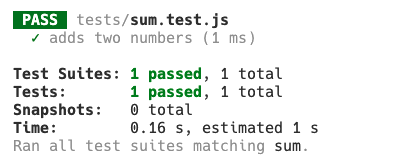

# Introduction to Unit Testing with Jest


Follow along with code examples [here](https://github.com/The-Marcy-Lab-School/1-11-unit-testing)!


**Table of Contents**

- [Learning Objectives](#learning-objectives)
- [A Basic Example](#a-basic-example)
  - [Test Files](#test-files)
- [Jest](#jest)
  - [Installation \& Setup](#installation--setup)
  - [First Test](#first-test)
  - [Practice: Add A Test](#practice-add-a-test)
  - [`toEqual` and `.not`](#toequal-and-not)
  - [Refactor with Confidence](#refactor-with-confidence)
- [Test-Driven Development](#test-driven-development)
  - [Step 1: Define New Requirements](#step-1-define-new-requirements)
  - [Step 2: Write Tests Before Code (They Will Fail)](#step-2-write-tests-before-code-they-will-fail)
  - [Step 3: Implement Just Enough Code to Pass](#step-3-implement-just-enough-code-to-pass)
  - [Reflection](#reflection)
- [Banking System Challenge](#banking-system-challenge)
  - [Refactoring with Confidence](#refactoring-with-confidence)
  - [Adding a New Feature with TDD](#adding-a-new-feature-with-tdd)
- [Extension / Practice](#extension--practice)
- [Key Takeaways](#key-takeaways)

## Learning Objectives

By the end of this lesson, you should be able to:

* Explain what unit tests are and why they matter.
* Write tests with Jest using `test()` and `expect()`.
* Use unit tests to safely **refactor** code that uses loops into **higher-order array methods**.
* Apply **test-driven development (TDD)** to add new functionality by writing tests before implementation.
* Use Jest’s common matchers to check equality.
  * `.toBe`
  * `.toEqual`
  * `.not`

## A Basic Example

Consider this pure function that takes in an array of numbers and returns a copy of that array where each value is doubled:

```js
const doubleArrayPurely = (arr) => {
  const doubled = [...arr]
  for (let i = 0; i < doubled.length; i++) {
    doubled[i] *= 2;
  }
  return doubled;
};
```


**<details><summary>Q: Imagine you were given this function and asked to verify that it works. How would you test it? What do you expect to happen when testing?</summary>**

To test this manually, you could invoke the function with some sample data and see if the *output* matches what you *expect*.

```js
const nums = [1, 2, 3, 4];

const copyOfNums = doubleArrayPurely(nums);

console.log(nums);
console.log(copyOfNums);
```

`nums` should not be mutated and `copyOfNums` should contain all of the values doubled. We would expect to see:

```
[1, 2, 3, 4]
[2, 4, 6, 8]
```

</details>

</details>

### Test Files

> "Now that we've tested the application, what should we do with the tests? Do we delete them? Do we comment them out? If we keep them, where can they live?"

With manual testing, you're always left with this question. You've spent time and effort to create the tests so deleting them is wasteful, but we can't just leave them in our code because they add clutter.

Rather than testing functions directly in the files where they live, it is better to create separate **test files** that import functions and test them against sample inputs. Test files provide a number of benefits:
* **Separation of concerns**: our source code can focus on functionality while test files focus on testing.
* **Automation**: test files can be executed with a single command or can be configured to run automatically whenever a commit is made, ensuring all new code is functional.
* **Documentation**: test files serve as living documentation, showing how functions are expected to behave.
* **Confidence**: having a comprehensive test suite gives developers confidence when making changes.

## Jest

Let's learn [Jest](https://jestjs.io/docs/getting-started), the most popular framework for creating test files in JavaScript / Node. 

### Installation & Setup

Install `jest` as a developer dependency (with the `--save-dev` flag)

```bash
npm install --save-dev jest
```

Modify the `package.json` file to include a `"test"` script.

```json
"scripts": {
  "test": "jest"
}
```

### First Test

We've created a simple example to demonstrate how to create a test file. 

In the file called `src/sum.js`, we've exported a simple `sum` function.

```js
// sum.js
const sum = (a, b) => a + b;

module.exports = sum;
```

In the `tests` directory, create a file called `sum.test.js` (the test file name should always match the name of the file being tested).

Then, add the following code:

```js
// sum.test.js
const sum = require('../src/sum');

test('adds two numbers', () => {
  expect(sum(1, 2)).toBe(3);
});
```

The `test()` function creates a new test to run with a description of the test and a callback function that should contain at least one `expect().matcher()` call.
* `expect(expression)` takes in an expression to test
* `toBe(expected)` is an example of a **matcher method** (there are many others). It takes in the value we expect the `expression` to be *strictly equal* to as if we had compared them using the `===` operator.

Run the test with:

```bash
npm test sum
```

And you should see:



Each time we invoke `test(message, fn)`, a new test is created and will appear with the provided `message` in the test output. 

We see a passing test because in the `test()` callback, the `expect(expression)` value was equal to the `toBe(expected)` value.

### Practice: Add A Test

In the `tests/sum.test.js` file, add a new test with the message `"adds negatives"` and confirms that the `sum` function will work properly for inputs like `-3` and `-2`.

**<details><summary>Solution</summary>**

```js
test('addsNegatives', () => {
  expect(sum(-3, -2)).toBe(-5);
});
```

</details>

Run the `npm test sum` command again and you should now see both tests in the test output.

### `toEqual` and `.not`

Take a look back at the `src/doubleArrayPurely.js` file. 

We've already created a test for you in the accompanying `tests/doubleArrayPurely.test.js` file. 

Since we are now working with a reference type (an array), we need to test the output of our function using the `.toEqual` matcher method.

```js
test('doubles each value in the array', () => {
  // toEqual compares the contents of objects and arrays
  expect(doubleArrayPurely([1, 2, 3, 4])).toEqual([2, 4, 6, 8]);
});

test('does not mutate the original array', () => {
  const original = [1, 2, 3, 4];
  const copy = doubleArrayPurely(original);
  
  // A new array should be returned, not the original
  expect(copy).not.toBe(original);

  // The copy should be doubled and 
  expect(copy).toEqual([2, 4, 6, 8]);

  // The original should not be mutated
  expect(original).toEqual([1, 2, 3, 4]);
});
```

This example demonstrates a few new details about `expect()` calls.
* The `toEqual()` matcher is used to compare equality of the contents within objects and arrays, rather than comparing their references
* The `.toBe()` matcher can be used to compare the references of objects
* The `.not` property can be added in the middle of any `expect().matcher()` statement to check the opposite of an expectation.


### Refactor with Confidence

Now that we have passing tests, we can change *how* the code works — as long as it keeps passing the same tests.

**<details><summary>Challenge: Refactor `doubleArrayPurely` to use the higher-order method `map`</summary>**

```js
const doubleArrayPurely = (arr) => {
  return arr.map((num) => num * 2);
};
```

</details>

Run `npm test doubleArrayPurely` again: the tests should still pass.

## Test-Driven Development

So far we've been looking at tests *after* we have already written the code. The tests just tell us whether the code we've already written works as expected.

**Test-driven development** is a workflow for creating software that starts with tests and then uses those tests as a guide for what code to write. Test driven development has a number of benefits:
* **Clear Requirements** - Writing tests first forces you to clearly define what your code should do before writing it
* **Better Design** - Starting with tests helps you design cleaner, more modular code that's easier to test
* **Fewer Bugs** - Having comprehensive tests from the start helps catch bugs early in development
* **Faster Development** - While it may seem slower at first, TDD often leads to faster development by catching issues early

Let's try it out. We'll follow 4 steps:
1. Define new requirements
2. Write tests before code (they will fail)
3. Implement just enough code to pass
4. Refactor if necessary while keeping the tests passing

### Step 1: Define New Requirements

**New Feature:** The `doubleArrayPurely` function should be able to arrays containing numbers mixed with strings and other values.

**Requirements:**
* If a given value in the array is a number, multiply the number by 2
* If a given value in the array is a string, concatenate the value to itself: (`"abc"` > `"abcabc"`)
* If a given value is neither, do nothing to it, just add it to the array.

### Step 2: Write Tests Before Code (They Will Fail)

**<details><summary>Solution</summary>**

```js
test('can double strings and numbers', () => {
  expect(doubleArrayPurely([1, 2, 'a', 'b'])).toEqual([2, 4, 'aa', 'bb']);
});
```
</details>

### Step 3: Implement Just Enough Code to Pass

**<details><summary>Solution</summary>**

```js
const doubleArrayPurely = (arr) => {
  return arr.map((value) => {
    if (typeof value === "number") {
      return value * 2 
    } else if (typeof value === "string") {
      return value + value;
    } else {
      return value;
    }
  });
};
```
</details>


### Reflection

* How did writing tests *before* code clarify what the function should do?

## Banking System Challenge

Consider an array of bank account objects like this:

```js
const bankAccounts = [
  { owner: "Bob", balance: 100 },
  { owner: "Alice", balance: 300 },
  { owner: "Charlie", balance: 200 },
];
```

And a `transaction` like this:

```js
const depositTransaction = { owner: "Alice", amount: 50 };
```

The `deposit` function below is designed to process one of these transactions and get an updated set of bank accounts. It is a pure function: 

```js
const deposit = (accounts, transaction) => {
  let updatedAccounts = [];
  for (let i = 0; i < accounts.length; i++) {
    // Make a clone of the account object
    const accountClone = { ...accounts[i] };

    // If the account owner matches the transaction owner, update the balance.
    if (accountClone.owner === transaction.owner) {
      accountClone.balance += transaction.amount;
    }
    
    // Add the account clone to the updatedAccounts array
    updatedAccounts.push(accountClone);
  }

  return updatedAccounts;
};
```

It works by doing the following:
1. It iterates through each account and makes a copy of the account object, adding it to the `updatedAccounts` array.
2. It then updates the balance of only the account whose owner matches the `transaction` owner.
3. Finally, it returns the updated accounts.

Take a look at the `bank.test.js` file which contains tests for this `deposit` function.

```js
// bank.spec.js
const { deposit } = require('../src/bank');

describe('deposit', () => {
  test('deposits money into the correct account', () => {
    const bankAccounts = [
      { owner: "Bob", balance: 100 },
      { owner: "Alice", balance: 300 },
      { owner: "Charlie", balance: 200 },
    ];
    const transaction = { owner: "Alice", amount: 50 };
    const updatedAccounts = deposit(bankAccounts, transaction);

    // We use `toEqual` to test equality of objects
    expect(updatedAccounts).toEqual([
      { owner: "Bob", balance: 100 }, // Bob's account should not be affected
      { owner: "Alice", balance: 350 },
      { owner: "Charlie", balance: 200 }, // Charlie's account should not be affected
    ]);

  });

  test('does not mutate the original bank accounts array', () => {
    const account = { owner: "Bob", balance: 100 };
    const bankAccounts = [account];

    const transaction = { owner: "Bob", amount: 1 };
    const updatedAccounts = deposit(bankAccounts, transaction);

    // the returned array should be a new array
    expect(updatedAccounts).not.toBe(bankAccounts);

    // the original account should not be mutated
    expect(account).toEqual({ owner: "Bob", balance: 100 });
  });
});
```

### Refactoring with Confidence

Now that we have passing tests, we can change *how* the code works — as long as it keeps passing the same tests.

**<details><summary>Challenge: Refactor `deposit` to use the higher-order method `map`</summary>**

```js
const deposit = (accounts, transaction) => {
  return accounts.map((account) => {
    const accountCopy = { ...account };
    if (accountCopy.owner === transaction.owner) {
      accountCopy.balance += transaction.amount;
    }
    return accountCopy;
  });
};
```

</details>

Run `npm test bank` again. The tests should stil pass.

### Adding a New Feature with TDD

In **Test-Driven Development**, we start by writing tests that fail and then write code to pass those tests. The tests serve as a guide for what our code should do.

**Step 1: Define a New Requirement**

> “We want to add a new function `withdraw(owner, amount)` that subtracts from the balance, but only if the account has enough money.”

Requirements:

* If balance ≥ amount → subtract and return new balance.
* If balance < amount → do nothing.

**Step 2: Write Tests Before Code (Red)**

**<details><summary>Solution</summary>**

```js
// bank.test.js
const { bankAccounts, deposit, withdraw } = require('./bank');

describe('withdraw', () => {
  test('subtracts from balance when sufficient funds', () => {
    const bankAccounts = [
      { owner: "Bob", balance: 100 },
      { owner: "Alice", balance: 300 },
      { owner: "Charlie", balance: 200 },
    ];
    const transaction = { owner: "Alice", amount: 50 };
    const updatedAccounts = withdraw(bankAccounts, transaction);

    expect(updatedAccounts).toEqual([
      { owner: "Bob", balance: 100 },
      { owner: "Alice", balance: 250 }, // only Alice's account should be withdrawn from
      { owner: "Charlie", balance: 200 },
    ]);
  });

  test('does not allow overdraft', () => {
    const bankAccounts = [
      { owner: "Bob", balance: 100 },
      { owner: "Alice", balance: 300 },
      { owner: "Charlie", balance: 200 },
    ];
    const transaction = { owner: "Alice", amount: 500 };
    const updatedAccounts = withdraw(bankAccounts, transaction);

    // No funds were withdrawn so the contents of the accounts should NOT change.
    expect(updatedAccounts).toEqual(bankAccounts);
  });
});
```

</details>

**Step 3: Implement Just Enough Code to Pass (Green)**

**<details><summary>Solution</summary>**

```js
const withdraw = (owner, amount) => {
  return accounts.map((account) => {
    const accountCopy = { ...account };

    if (accountCopy.owner === transaction.owner) {
      if (account.balance >= amount) {
        account.balance -= amount;
      }
    }
    return accountCopy;
  });
};
```

</details>

## Extension / Practice

* Add a `getEmptyAccounts(bankAccounts)` feature using TDD.
* Add a `add100ToAllAccounts(bankAccounts)` feature using TDD.
* Add a `transfer(bankAccounts, { fromOwner, toOwner, amount })` feature using TDD.
* Refactor repetitive lookup logic into a helper function `getAccountByOwner()`.
* Write new tests to confirm helper behavior.

## Key Takeaways

**Testing** provides the following benefits:
* **Separation of concerns**: our source code can focus on functionality while test files focus on testing.
* **Automation**: test files can be executed with a single command or can be configured to run automatically whenever a commit is made, ensuring all new code is functional.
* **Documentation**: test files serve as living documentation, showing how functions are expected to behave.
* **Confidence**: having a comprehensive test suite gives developers confidence when making changes.

**Test-driven development** is a workflow for creating software that starts with tests and then uses those tests as a guide for what code to write. Test driven development has a number of benefits:
* **Clear Requirements** - Writing tests first forces you to clearly define what your code should do before writing it
* **Better Design** - Starting with tests helps you design cleaner, more modular code that's easier to test
* **Fewer Bugs** - Having comprehensive tests from the start helps catch bugs early in development
* **Faster Development** - While it may seem slower at first, TDD often leads to faster development by catching issues early
