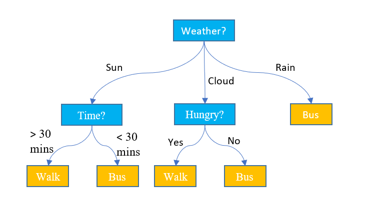

# 4. String Methods & Conditional Statements


Follow along with code examples [here](https://github.com/The-Marcy-Lab-School/1-3-strings-conditional-statements)!


**Table of Contents:**

* [Summary](3-strings-conditional-statements.md#summary)
* [Strings](3-strings-conditional-statements.md#strings)
  * [Escaping Characters](3-strings-conditional-statements.md#escaping-characters)
  * [String Interpolation](3-strings-conditional-statements.md#string-interpolation)
  * [String Indexes and Bracket Notation](3-strings-conditional-statements.md#string-indexes-and-bracket-notation)
  * [Strings are Immutable](3-strings-conditional-statements.md#strings-are-immutable)
  * [String Length](3-strings-conditional-statements.md#string-length)
  * [String Methods](3-strings-conditional-statements.md#string-methods)
* [Conditional Statements](3-strings-conditional-statements.md#conditional-statements)
  * [`if/else if/else` statements](3-strings-conditional-statements.md#ifelse-ifelse-statements)
  * [Order Matters](3-strings-conditional-statements.md#order-matters)
  * [Only `if` statements](3-strings-conditional-statements.md#only-if-statements)
  * [Guard Clauses](3-strings-conditional-statements.md#guard-clauses)
  * [Use Ternary Operators To Simplify Conditionals](3-strings-conditional-statements.md#use-ternary-operators-to-simplify-conditionals)


## Summary

* **Strings** are sequences of characters enclosed in quotes. You can access individual characters using bracket notation and check their length with `.length`. Strings are immutable, meaning their characters cannot be changed directly.
* **String methods** like `includes`, `startsWith`, `endsWith`, `indexOf`, `slice`, `toUpperCase`, and `replace` allow you to search, analyze, and manipulate string data.
* **Conditional statements** (`if`, `else if`, `else`) let you control the flow of your program based on data values. The order of conditions matters, and only the first true condition in a chain will execute.
* **Guard clauses** are single `if` statements that return early from a function, simplifying conditional logic.
* **Ternary operators** provide a concise way to choose between two values based on a condition.

## Strings

A string is a sequence of characters between single or double quotations.

```js
console.log("This is a string!");
console.log('!@#$%^&*()1234556'); // <-- also a string
```

### Escaping Characters

If you want to use quotation marks in your string, you have to "escape" them by putting a `\` in front.

```js
console.log("The robot said, \"beep boop bop\"");
// Output: The robot said "beep boop bop"
```

There are many other characters that you can use the escape character (`\`) such as the "tab" character (`\t`) and the "newline" character (`\n`):

```js
console.log("hello\tworld");
// Output: hello  world

console.log("First line\nSecond line");
// Output: First line
// Output: Second line
```

### String Interpolation

When used within backticks, an expression can be **interpolated** into a string for easy formatting:

```js
console.log(`The sum of 10 and 2 is ${10 + 2}`);
// Output: The sum of 10 and 2 is 12
```

### String Indexes and Bracket Notation

Each character in a string, including spaces, has an **index** — a numbered position starting at `0`.

We can get a single character from a string using **Bracket Notation** and the index: `string[index]`

```js
console.log("abc"[0]);    // Output: a
console.log("abc"[1]);    // Output: b
console.log("abc"[2]);    // Output: c
```

It works on variables too!

```js
const message = 'Hello there!';

console.log(message[0]);  // Output: H
console.log(message[4]);  // Output: o
console.log(message[5]);  // Output: ???
console.log(message[11]); // Output: ???
```

If you use bracket notation and there is no character at the given index, `undefined` will be returned:

```js
const message = 'Hello there!';

console.log(message[50]); // Output: undefined
```

### Strings are Immutable

* Strings are "immutable" (unable to be mutated). In other words, you cannot use bracket notation to change characters of a string.
* If you try, no error will be thrown, nothing will happen.

```js
const message = 'Hello there!';

// Nothing will happen if you attempt to mutate a string.
message[0] = "J";

console.log(message); // Output: "Hello there!"
```

### String Length

Every string also has a `length` property that is accessed using dot notation: `string.length`

It tells us the number of characters in a string (including spaces). When combined with bracket notation, it can be useful for counting indexes backwards from the end of a string.

```js
const message = 'Hello there!';

console.log(message.length);
// Output: 12

console.log(message[message.length - 1]);
// Output: ! 

console.log(message[message.length - 2]);
// Output: ???

console.log(message[message.length - 12]);
// Output: ???
```

### String Methods

A **method** is a function that is attached to a value. Often, methods are used to manipulate the value they are attached to.

* Methods are invoked using **dot notation**: `value.method()`

First, let's look at some "read only" string methods that return a boolean: `includes`, `startsWith`, `endsWith`,

```js
const fruits = 'apples, bananas, cherries';

console.log(fruits.includes('ana'))
// Output: true

console.log(fruits.includes('ANA'))
// Output: false

console.log(fruits.startsWith('apple'))
// Output: true

console.log(fruits.endsWith('s'))
// Output: true
```

The methods `indexOf`, `lastIndexOf` return a number representing the index of a particular character we're looking for:

```js
const fruits = 'apples, bananas, cherries';

console.log(fruits.indexOf('p'))
// Output: 1

console.log(fruits.lastIndexOf('p'))
// Output: 2

console.log(fruits.indexOf('z'))
// Output: -1 (not found)
```

When combined, these methods can be used in clever ways!

```js
const hasOnlyOne = (str, letter) => {
  return str.indexOf(letter) === str.lastIndexOf(letter);
}
console.log(hasOnlyOne('hello', 'h'))
// Output: true

console.log(hasOnlyOne('hello', 'l'))
// Output: false
```

The following methods return a copy of a string modified in some way: `slice`, `toUpperCase`, `toLowerCase`, `repeat`, `replace`, `replaceAll`

```js
const fruits = 'apples, bananas, cherries';

const apples = fruits.slice(0, 6);
console.log(apples);
// Output: apples

const loudFruits = fruits.toUpperCase()
console.log(loudFruits);
// Output: APPLES, BANANAS, CHERRIES

console.log(apples.repeat(3));
// Output: applesapplesapples

console.log(apples.replace('p', 'g'));
// Output: agples

console.log(apples.replaceAll('p', 'g'));
// Output: aggles
```

## Conditional Statements

Conditional statements allow us to change the behavior of our programs based on the current values of our data.



<details>

<summary><strong>Q: In the decision tree above, what are the variables that will impact the end result?</strong></summary>

The first variable is the `weather` and then, depending on the weather, the variable `time` or `hungry` is used to determine whether to walk or take the bus.

</details>

### `if/else if/else` statements

To define the possible decisions that our program can make, we use `if`, `else if`, and `else` statements:

```js
const isItHot = (temp) => {
  if (temp > 100) {
    console.log("So Hot!")
  } else if (temp > 90) {
    console.log("Yes!")
  } else if (temp > 75) {
    console.log("Eh")
  } else {
    console.log("Nah")
  }
}
isItHot(80);
// Output: Eh

isItHot(95);
// Output: Yes!

isItHot(105);
// Output: So Hot!

isItHot(60);
// Output: Nah
```

* `if` and `else if` statements require a boolean condition to evaluate to `true` in order to run
* There can be many `else if` statements, or none at all.
* `else` statements do not require a condition and will run only when none of the other options do.

### Order Matters

Only the first condition that is `true` will be executed. This means we have to be careful with the order in which we write our conditional statements.

**Q: What happens if we rearrange the conditional statements like so?**

```js
const isItHot = (temp) => {
  if (temp > 75) {
    console.log("Eh")
  } else if (temp > 90) {
    console.log("Yes!")
  } else if (temp > 100) {
    console.log("So Hot!")
  } else {
    console.log("Nah")
  }
}
isItHot(80);
// Output: ???

isItHot(95);
// Output: ???

isItHot(105);
// Output: ???

isItHot(60);
// Output: ???
```

### Only `if` statements

In an `if/else if/else` chain of conditional statements, only one statement will be executed. But what if we replace all of the `else if` and `else` statements with other `if` statements?

```js
const isItHot = (temp) => {
  if (temp > 75) {
    console.log("Eh")
  } 
  if (temp > 90) {
    console.log("Yes!")
  }
  if (temp > 100) {
    console.log("So Hot!")
  }
  if (temp <= 75) {
    console.log("Nah")
  }
}

isItHot(105);
// Output: ???
```

### Guard Clauses

When working with a function that changes the value returned based on a condition, we can avoid using conditional chains and only use `if` statements called "guard clauses".

A **guard clause** is an `if` statement that returns before subsequent return statements have a chance to be executed.

```javascript
const isItHot = (temp) => {
  if (temp > 75) {
    return "Eh";
  }
  if (temp > 90) {
    return "Yes!";
  }
  if (temp > 100) {
    return "So Hot!";
  }
  return "Nah";
}

console.log(isItHot(105));
// Output: ???
```

<details>

<summary><strong>Q: Why doesn't the last return statement need an <code>if</code> statement?</strong></summary>

If the program makes it to the last `return "Nah"` statement, we can assume that the temperature is less than or equal to 75 because none of the other conditions were `true`.

</details>

### Use Ternary Operators To Simplify Conditionals

* `if` and `else` statements let you choose between one of two code blocks to execute.
* The ternary operator `condition ? valA : valB` is used to choose between one of two values.

```js
// Okay - Use an If statement to choose which code block to execute
const isThisEven = (num) => {
  let message;
  if (num % 2 === 0) {
    message = 'it is even!';
  } else {
    message = 'it is odd!';
  }
  console.log(message);
}

// Better - Use a ternary to choose which value to assign to message
const isThisEven = (num) => {
  const message = num % 2 === 0 ? "it is even!" : "it is odd!";
  console.log(message);
}
```
