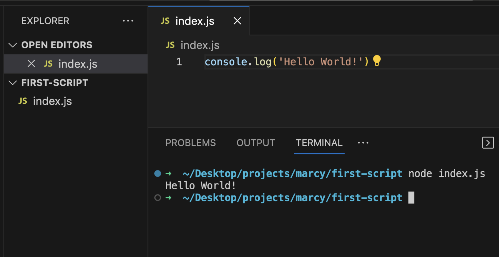
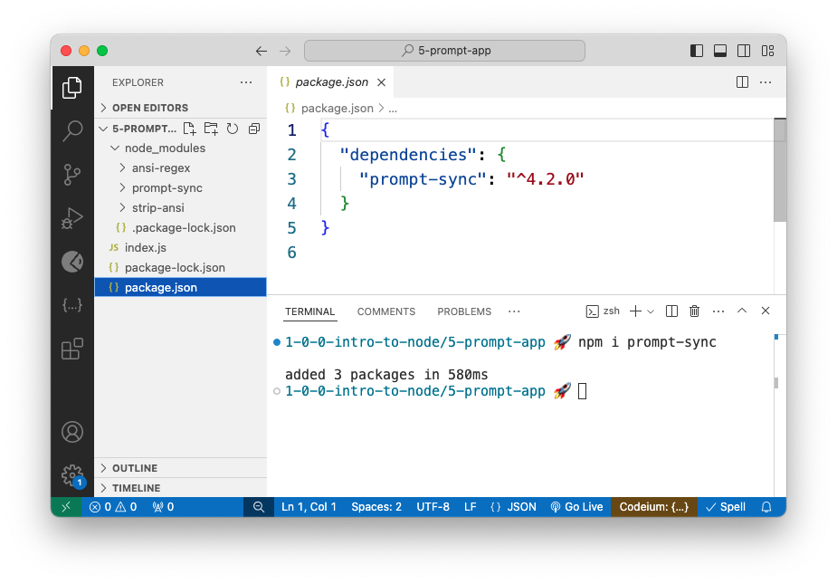

# Node & Node Modules

In this lesson we'll learn the history of Node and the fundamentals of using Node Modules to build JavaScript programs.


Follow along with code examples [here](https://github.com/The-Marcy-Lab-School/1-4-node-modules-testing)!


**Table of Contents:**

- [Key Notes](#key-notes)
- [What is Node?](#what-is-node)
- [Exporting and Importing Node Modules](#exporting-and-importing-node-modules)
  - [Exporting with `module.exports` (CommonJS)](#exporting-with-moduleexports-commonjs)
  - [Importing with `require()` (CommonJS)](#importing-with-require-commonjs)
    - [Destructuring](#destructuring)
- [Node Package Manager (NPM)](#node-package-manager-npm)
  - [Installing and Using Dependencies from NPM](#installing-and-using-dependencies-from-npm)
  - [Dependencies, `package.json`, and `node_modules`](#dependencies-packagejson-and-node_modules)
    - [Developer Dependencies](#developer-dependencies)
  - [`package.json` Scripts](#packagejson-scripts)
  - [`npm init -y`](#npm-init--y)
- [Jest and Testing](#jest-and-testing)
- [Madlib Challenge](#madlib-challenge)


## Key Notes

* **Node** is a "JavaScript runtime environment" which is just a fancy way to say it is a program for running JavaScript.
* A **module** is a file containing code, which can then be imported and utilized in other parts of a larger program or system.
  * In a Node project, a file exports a module by assigning a value to `module.exports`.
    * It can export one value/function (a single **"default export"**).
    * It can export many values/functions (a group of **"named exports"**).
  * A module can be imported with the `require(filename)` function.
* Third-party modules can be downloaded from the **Node Package Manager (NPM)** online registry.
  * When a module is downloaded, it is listed as a **dependency** in `package.json` and added to the `node_modules` folder.
  * `package.json` is a file with meta-data about a Node project including dependencies and configuration.
  * **Developer dependencies** are dependencies used by the developer(s) who created the package but aren't needed by the users of the package. They are not added to the `node_modules` folder.
* **JavaScript Object Notation (JSON)** is a file format for representing data in an JavaScript-Object-like notation with key:value pairs.
* **Jest** is an npm module that provides functions for creating automated tests.
* **Test-Driven Development** is a style of programming in which tests are created first and steer the functionality to be built.


## What is Node?

JavaScript started out as a language that could only be used to create programs that ran in the browser. Server-side code (the code running on the computer that sends the website to your browser) had to be written in another language, such as PHP or Java. 

In 2009, the **Node Runtime Environment** (or simply "Node") was invented to allow programmers to create server-side programs with JavaScript, thus opening the door for fullstack JavaScript development.

To run a JavaScript program using Node, we use the terminal command `node <file_name>`:



You can also use the `node` command on its own to open the Node read-evaluate-print-loop (REPL) which can be useful for testing expressions:


## Exporting and Importing Node Modules

Consider the simple JavaScript program below. It declares a few functions for calculating data about a circle with a given radius and then prints them out. Notice that the `main` function is where the functions are all being executed in a logical order:


```js
// functions for circle stuff
const LAZY_PI = 3.14;

const getArea = (radius) => {
  return LAZY_PI * radius * radius;
}

const getDiameter = (radius) => {
  return radius * 2;
}

const getCircumference = (radius) => {
  return LAZY_PI * radius * 2;
}

// Helper function for printing stuff. 
// It is a "wrapper" for the console.log function
const print = (input) => {
  console.log(input);
}

// The main function just runs all of the other functions
const main = () => {
  const radius = 5;
  const area = getArea(radius);
  print(`the area of a circle with radius ${radius} is ${area}`);

  const diameter = getDiameter(radius);
  print(`the diameter of a circle with radius ${radius} is ${diameter}`);

  const circumference = getCircumference(radius);
  print(`the circumference of a circle with radius ${radius} is ${circumference}`);
}

main();
```


As a project grows in scale and complexity, **separation of concerns** becomes increasingly important.


Separation of Concerns is a fundamental principle of software engineering. It emphasizes the importance of organizing our code into distinct functions and modules that each serve a singular and specific purpose. However, when put together, those individual pieces work in harmony.


To achieve separation of concerns, JavaScript projects are typically separated into multiple files called **modules** that share code with each other.

A **module** is a file containing code, which can then be **imported** and utilized in other parts of a larger program or system.

### Exporting with `module.exports` (CommonJS)

In a Node project, a module exports its code by assigning one or more values to the `exports` property of the `module` object, or `module.exports`.

When `module.exports` is assigned a single value/function, we call that a **default export**:


```javascript
const print = (input) => {
  console.log(input)
}

// This module exports a single value, a "default export"
module.exports = print; 
```


You will also commonly see `module.exports` assigned an object containing multiple values/functions. These are called **named exports**:


```javascript
const LAZY_PI = 3.14;

const getArea = (radius) => {
  return LAZY_PI * radius * radius;
}
const getDiameter = (radius) => {
  return radius * 2;
}
const getCircumference = (radius) => {
  return LAZY_PI * radius * 2;
}

module.exports = {
  "LAZY_PI": LAZY_PI,
  "getArea": getArea,
  "getDiameter": getDiameter,
  "getCircumference": getCircumference
};

// You can also use Object shorthand notation
module.exports = {
  LAZY_PI,
  getArea,
  getDiameter,
  getCircumference
}
```


**<details><summary>Q: Why do we use an Object to export many values instead of an Array?</summary>**

If the `module.exports` were an array...

```js
module.exports = [LAZY_PI, getArea, getDiameter, getCircumference];
```

...we would access the `getArea` function like so: `module.exports[1]`.

Objects allow us to access exported values by name (e.g. `module.exports.getArea`) which is easier to remember and easier to comprehend when reading the code.

</details>

### Importing with `require()` (CommonJS)

To import a module's values, use the `require(filepath)` function. The `filepath` should point to the module you want to import.


```javascript
// The variable name here is up to you since only the value is exported, not the variable.
const print = require('./print.js');
  
// circleHelpers is what we'll call the object that is exported
const circleHelpers = require('./circle-helpers.js');

const main = () => {
  const radius = 5;
  
  // the getArea method is INSIDE of the circleHelpers object so we use dot notation
  const area = circleHelpers.getArea(radius);

  // print was the default export of print.js so we can just invoke it.
  print(`the area of a circle with radius ${radius} is ${area}`);

  //... the rest of the code ...
}

main();
```


**<details><summary>Q: How does this file structure demonstrate separation of concerns? What is the concern of each file?</summary>**

Each file is concerned with only one aspect of the functionality of the entire program.

* `print.js` is concerned with logging logic.
* `circle-helpers.js` is concerned with logic related to circle calculations.
* `main.js` is concerned with combining the functions and executing them in a logical manner.

</details>

#### Destructuring

If the module exports an object...

```js
module.exports = { 
  LAZY_PI, 
  getArea, 
  getDiameter, 
  getCircumference 
};
```

...we typically will **destructure** the object immediately upon importing it:


```javascript
// With destructuring, a variable is created for each named export.
const { getArea, getDiameter, getCircumference } = require('./circle-helpers.js');
```


## Node Package Manager (NPM)

Suppose you wanted to add functionality that allows you to get command-line input from user of your program via the terminal. Do you have the tools to implement that feature on your own?

While you could figure this out, there is no need to reinvent the wheel! Instead, just download an existing module from the **Node Package Manager (NPM)** online registry.

Visit https://www.npmjs.com/ to explore available packages. Start by searching up the "prompt-sync" package.


### Installing and Using Dependencies from NPM

To install any module from npmjs, use the `npm install` (or `npm i`) command in your Terminal:

```sh
npm i prompt-sync # installs the prompt-sync package
```

Now, you should see a `node_modules/` folder with a `prompt-sync/` folder inside. Open up the `prompt-sync/index.js` file to see the module that is exported!

To use the package in our own program, use `require()` again, this time with just the name of the module.



```javascript
// with modules in node_modules, we only need to provide the name:
const prompt = require('prompt-sync')();

// we don't need to provide the full relative path (although we can)
const prompt = require('./node_modules/prompt-sync')();
```



For `prompt-sync`, the exported module is not the `prompt` function itself, but instead a `create` function which lets the programmer configure how they want `prompt` to work (see `node_modules/prompt-sync/index.js`)

This is a common pattern for modules.


### Dependencies, `package.json`, and `node_modules`

When you download a package from NPM, it is called a **dependency**.

Every dependency of a project, and its version number, will be listed in the file `package.json` (if the file doesn't exist, the `npm i` command will create it). The existence of this file turns our project into a **package**.


 **JavaScript Object Notation (JSON)** is a file format for representing data in an JavaScript-Object-like notation with key:value pairs.




The downloaded module will be placed in a `node_modules/` folder along with any **sub-dependencies** that the module itself may require.

You can see the sub-dependencies of a module by opening its own `package.json` file. All modules listed under `"dependencies"` will also be installed in `node_modules/`.
* In `prompt-sync/package.json`, we can see it has `strip-ansi` as a dependency.
* In `strip-ansi/package.json`, we can see it has `ansi-regex` as a dependency.


#### Developer Dependencies

In the `prompt-sync/package.json` file, you will notice that `prompt-sync-history` is listed under `"devDependencies"`.
* **Developer dependencies** are dependencies used by the developer(s) who created the package but aren't needed by the users of the package. They are not added to the `node_modules` folder of the user.

One developer dependency that we will commonly use is the `nodemon` module. Install it using `npm` and the `-D` flag to mark it as a developer dependency:

```sh
npm i -D nodemon
```

You should see `nodemon` added to the `"devDependencies"` section of your `package.json` (version numbers may vary):

```json
{
  "dependencies": {
    "prompt-sync": "^4.2.0"
  },
  "devDependencies": {
    "nodemon": "^3.1.7"
  }
}
```

The `nodemon` module provides a new terminal command `nodemon` that can be used to run a JavaScript file in "hot reload" mode. This means that any time you save a file in the project, it will re-run the file.

```sh
# runs index.js once
node index.js 

# re-runs index.js each time the file changes
nodemon index.js
```

<details>

<summary><strong>Q: Why is <code>nodemon</code> installed as a developer dependency and not a required dependency of the project?</strong></summary>

`nodemon` makes it easier to test your code, but the functionality of the program is not changed by it. It is just a convenience for developers.

</details>

### `package.json` Scripts

You can add a `"scripts"` section to the `package.json` file to make it easier to run commonly used Terminal commands.
* Two common script commands to add are `"start"` which runs `node index.js` and `"dev"` which runs `nodemon index.js`

```json
{
  "scripts": {
    "start": "node index.js",
    "dev": "nodemon index.js"
  },
  "dependencies": {
    "prompt-sync": "^4.2.0"
  },
  "devDependencies": {
    "nodemon": "^3.1.7"
  }
}
```

* To use these commands, we can type `npm run script_name`. For example, `npm run start` or `npm run dev`

### `npm init -y`

* When working on a new Node project, it is common to set up the `package.json` file prior to installing any dependencies.
* This can be done using the command `npm init` which will ask you some questions to generate a `package.json` file.

```json
{
  "name": "project-name",
  "version": "0.0.1",
  "description": "Project Description",
  "main": "index.js",
  "scripts": {
    "test": "echo \"Error: no test specified\" && exit 1"
  },
  "repository": {
    "type": "git",
    "url": "the repositories url"
  },
  "author": "your name",
  "license": "N/A"
}
```

* You can also run `npm init -y` to skip the questions and build a `package.json` file using default values.

## Jest and Testing

Tests are an essential part of professional software development. Without testing our code, we run the risk of deploying code with unexpected bugs. With testing, we are forced to think critically about how we expect our program to behave and then write our code to satisfy those tests. 

The process of first writing tests and then writing code to satisfy those tests is called **Test-Driven Development (TDD)**.

At Marcy, we use the Node module [Jest](https://jestjs.io/) to write automated tests for coding assignments. 

```sh
npm i -D jest
```

Automated tests are JavaScript files that:

1. Import functions from source code
2. Run those functions with various inputs
3. Compare the returned values against the expected values.

A Jest test is written in a file ending in `.spec.js` or `.test.js` and looks like this:


```javascript
// Import the functions to be tested
const {
  getArea,
  getDiameter,
  getCircumference
} = require('./circle-helpers')

// Create a "Test Suite" for these functions
describe('Circle Helper Tests', () => {
  // Test the getArea function with a series of expectations
  test('getArea returns the Area of a circle', () => {
    // Translation: We expect getArea(2) to return Math.PI * 2 * 2
    expect(getArea(2)).toBe(Math.PI * 2 * 2);
    expect(getArea(3)).toBe(Math.PI * 3 * 3);

    // It is useful to think about what should be returned for "bad" inputs. 
    expect(getArea()).toBe(NaN);
    expect(getArea('hello')).toBe(NaN);
  });

  // Test the getDiameter function with a series of expectations
  test('getDiameter returns the Diameter of a circle', () => {
    // ...tests for getDiameter
  });

  // ...more tests
})
```


To run these automated tests, use the command:

```sh
npm test # run the tests once
# or
npm run test:w # run the tests each time the file changes ("watch mode")

# what command is watch mode similar to?
```

When tests fail, you will see the following output:


The test output provides some really useful information.

* We can see which tests failed
* For each failing test, we can see which `expect()` statement failed
* We can see what the expected value is (`12.566...`) and what our function actually returned (`undefined`).

Armed with this information, we can more confidently build our functions knowing that we have a specific set of targets to aim for. Automated tests allow us to repeatedly run our code against the same set of tests until all expectations are met.

**Challenge:** Write tests for the `getDiameter` and `getCircumference` functions. Consider how you might test certain edge cases such as "bad" or missing inputs.

## Madlib Challenge

A program is considered **hard-coded** if the program code must be modified in order to produce a new result.

The `prompt-sync` function is really useful for creating programs that will produce new results depending on the user's input.


```javascript
const prompt = require('prompt-sync')();

const name = prompt(`Hello there! What's your name? `);
console.log(`hi ${name}. My name is HAL`);
```


In the `7-madlib-challenge/index.js` file you will find the following hard-coded program:


```javascript
const madlib = (name, verb, quantity, item, newItem, isHappy) => {
  console.log(`There once was a man named ${name}.`);
  console.log(`Every day he would ${verb} with his ${quantity} ${item}s`);

  if (isHappy) {
    console.log(`But then, he found a ${newItem} and everything changed!`);
  } else {
    console.log(`But then, a ${newItem} took over his life and he couldn't ${verb} again!`);
  }

  console.log("The end.")
}

const main = () => {
  const name = 'Ben';
  const verb = 'run';
  const quantity = 50;
  const item = 'dog';
  const newItem = 'new car';
  const isHappy = false;

  madlib(name, verb, quantity, item, newItem, isHappy);
}
```


Your goal is to do the following in the `6-madlib-challenge` folder:

1. Download the `prompt-sync` module using `npm i prompt-sync`
2. Import and configure the `prompt` function in `index.js`
3. Replace the hard-coded variables defined in the `main` function with values retrieved from the user via the `prompt` function.
4. Re-organize the code such that the `madlib` function is in its own file called `madlib.js` that exports `madlib` as the default export.

If you get stuck, you can view the solution below:

<details>

<summary><strong>Q: Solution</strong></summary>


```javascript
const madlib = require('./madlib.js');
const prompt = require('prompt-sync')();

const main = () => {
  const name = prompt('Choose a name: ')
  const verb = prompt('Choose a verb: ')
  const quantity = prompt('Choose a quantity: ')
  const item = prompt('Choose a item: ')
  const newItem = prompt('Choose a newItem: ')
  const isHappyResponse = prompt('Choose whether the story is happy. Y or N: ')
  const isHappy = isHappyResponse.toUpperCase() === "Y"

  madlib(name, verb, quantity, item, newItem, isHappy);
}

main();
```



```javascript
const madlib = (name, verb, quantity, item, newItem, isHappy) => {
  console.log(`There once was a man named ${name}.`);
  console.log(`Every day he would ${verb} with his ${quantity} ${item}s`);

  if (isHappy) {
    console.log(`But then, he found a ${newItem} and everything changed!`);
  } else {
    console.log(`But then, a ${newItem} took over his life and he couldn't ${verb} again!`);
  }

  console.log("The end.")
}

module.exports = madlib;
```


</details>
