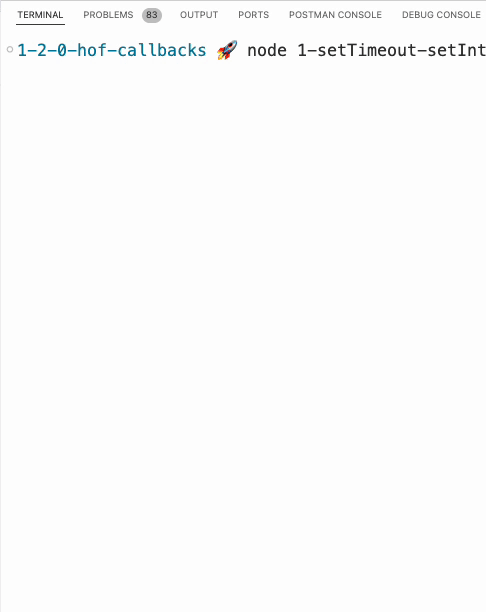

# Higher-Order Functions and Callbacks


Follow along with code examples [here](https://github.com/The-Marcy-Lab-School/1-2-0-hof-callbacks)!


**Table of Contents**:

- [First, Animation!](#first-animation)
- [What is a Higher-Order Function?](#what-is-a-higher-order-function)
- [A Basic higher-order Function and Callback Example](#a-basic-higher-order-function-and-callback-example)
  - [Do Not Invoke The Callback](#do-not-invoke-the-callback)
  - [Using Inline Callback Functions](#using-inline-callback-functions)
- [Some Fun Examples: `setTimeout` and `setInterval`](#some-fun-examples-settimeout-and-setinterval)
- [Array Iterators](#array-iterators)
  - [forEach](#foreach)

## First, Animation!

Check out this script below which continuously prints out a character 👾 moving back and forth across the terminal. How can something "animated" like this be created?



An animation is nothing more than a series of changing images shown in rapid succession. To simulate that experience, we can write a program that executes an `animateAlien` function every 0.05 seconds which changes the position of the 👾 character on each execution.

The only way this is possible is with **higher-order functions** and **callbacks**.

## What is a Higher-Order Function?

In the past, we have compared functions to recipes. In both, they are a series of instructions to execute. There may also be opportunities to customize the ingredients (parameters) that determine how the dish (the returned value) comes out.

Now, imagine that you have a personal chef. They can cook anything you want, all you had to do is give them a recipe and they will add their "special sauce". If a recipe is a function, then the chef that can make any recipe is a "higher-order" function.

> A **higher-order function (HOF)** is a function that accepts another function as input and/or returns a function
>
> A **callback function** is the function that is provided to a higher-order function as an argument. It is invoked by the higher-order function.

## A Basic higher-order Function and Callback Example

The simplest possible higher-order function that can exist looks like this:


```js
// This higher-order function takes in callback and executes it.
const executeCallback = (callback) => {
  callback();
}
```


While this function doesn't really provide any usefulness to us, it helps demonstrate how callbacks work.

Any function can be a callback function if it is passed to a higher-order function:

```js
// Any simple function can be a callback.
const sayHello = () => console.log("hello world");

// We pass in the callback to the higher-order function
executeCallback(sayHello);
// hello world
```

The callback must be compatible with how the higher-order function will invoke the callback. In the definition of `executeCallback`, the `callback` input will be invoked without arguments. Therefore, our provided callback `sayHello` shouldn't have parameters.

**Challenge**: Create your own callback function that prints something to the console. Consider whether or not your callback can include parameters. Then, use `executeCallback` to execute your callback. 

### Do Not Invoke The Callback

When passing in a callback to a higher-order function, avoid invoking the callback. 

In this example, since `executeCallback` is the higher-order function, it will invoke the callback on our behalf. Invoking the callback will produce an error:

```js
executeCallback(sayHello);
// hello world

executeCallback(sayHello());
// TypeError: callback is not a function
```

<details>
<summary>Q: Why does an error get thrown? Why is it saying callback is not a function</summary>

When you invoke `executeCallback(sayHello())`, the `sayHello()` function call gets resolved first. Since `sayHello()` returns `undefined`, that is what `executeCallback` gets as its callback:

```js
sayHello() // this gets resolved first and returns undefined
executeCallback(undefined) // undefined is not a function
```

</details>

### Using Inline Callback Functions

When using higher-order functions, we will often provide the callback as an anonymous arrow function for a more streamlined appearance:

```js
// Assuming we don't need to reuse this callback, we can provide it inline.
executeCallback(() => { 
  const roll = Math.ceil(Math.random() * 6);
  console.log(`Dice Roll: ${roll}`)
});
```

**Challenge**: Refactor your code so that it uses an inline callback.

## Some Fun Examples: `setTimeout` and `setInterval`

Let's look at some higher-order functions that you would actually use!

Two classic examples of higher-order functions that are built into Node are `setTimeout(callback, delay)` and `setInterval(callback, delay)`. 

These globally available functions each take in a `callback` and a `delay` input and invoke the `callback` after `delay` milliseconds have passed.

`setTimeout` will invoke the `callback` only once. In the example below, the `sayHi` callback is invoked after 2000 milliseconds (2 seconds):


```javascript
const sayHi = () => {
  console.log('hi');
};

setTimeout(sayHi, 2000);
// after 2 seconds... "hi"
```


`setInterval` will repeatedly invoke the `callback` function with the given `delay` in between. In the example below, the `loopThroughChars` callback function will be executed every 250 milliseconds.


```javascript
const chars = ["\\", "|", "/", "-"];
let i = 0;

// empty the console each time and print the next character in the sequence
const loopThroughChars = () => {
  console.clear()
  console.log(chars[i]);
  i++;
  if (i >= 4) i = 0;
};

setInterval(loopThroughChars, 250);
```



## Array Iterators

The most commonly used higher-order functions are these "iterator" array methods:

| Method            | Description  (For every value in the source array...)                       | Example(s)                                                             |
| ----------------- | --------------------------------------------------------------------------- | ---------------------------------------------------------------------- |
| `array.forEach`   | Perform a task that produces a side effect using the value                  | Mutate each value in the array or print each value to the console      |
| `array.filter`    | Test the value and add it to a new array if it passes the test              | Keep only the even numbers in the source array                         |
| `array.map`       | Transform the value and add it to a new array                               | Double every number in the source array                                |
| `array.find`      | Test the value and return the first value that passes the test              | Find the first number in an array that is greater than 10              |
| `array.findIndex` | Test the value and return the index of the first value that passes the test | Find the index of the first number in an array that is greater than 10 |
| `array.reduce`    | Determine how it can be combined with the other values in the array         | Calculate the sum of all numbers in an array                           |
| `array.sort`      | Compare it with another value to determine which should go first            | Sort an array of numbers in descending order                           |

In the next lesson, we'll learn more about these but for now, let's focus on `forEach`

### forEach

`arr.forEach(callback)` iterates over the source array and invokes the given `callback` with each `value`, that value's `index`, and the source array `arr` as inputs.

Use `forEach` to execute callbacks that produce side-effects (like printing to the console or mutating values).

In this example, we want to print a message about each value and its location in the `fruits` array:


```javascript
const fruits = ['apples', 'bananas', 'cherries'];

// print every fruit and its position in the array!
fruits.forEach((input, i, arr) => {
  console.log(`${input}!!! at index ${i} in array [${arr}]`);
});

// Here we only use the value parameter
fruits.forEach((value) => {
  console.log(`${input}!!!`);
});
```


Remember, `array.forEach` is used for callbacks that result in a side effect. For example, mutating the contents of an array is considered a side effect. In this example, we use `user.forEach` to change the `isAdmin` property of every object in the `users` array:


```js
// revoke isAdmin status from all users
const users = [
  { id: 1, username: 'ben', isAdmin: false },
  { id: 2, username: 'maya', isAdmin: true },
  { id: 3, username: 'reuben', isAdmin: true },
  { id: 4, username: 'gonzalo', isAdmin: false },
];
users.forEach((user) => user.isAdmin = false)
```


**Challenge 1:**

Use `users.forEach` to update the `username` property for each object in the `users` array such that the first letter is capitalized.

**<details><summary>Solution</summary>**

```js
users.forEach((user) => user[0].toUppercase() + user.slice(1));
```
</details>


**Challenge 2:**

Implement your own `forEach` function that takes an `array` and a `callback`:

It should iterate through the input `array` and do the following:
* Invoke the `callback` with the following arguments:
  * The value at the current index
  * The current index
  * The source array itself
* Return nothing (or manually return `undefined`)

**Usage Example**
```js
const forEach = (array, callback) => {
  // ??? 
};

forEach(['a','b','c'], console.log);
/* 
a 0 [ 'a', 'b', 'c' ]
b 1 [ 'a', 'b', 'c' ]
c 2 [ 'a', 'b', 'c' ]
*/
```

**<details><summary>Solution</summary>**

```js
const forEach = (array, callback) => {
  // Iterate through the input array
  for (let i = 0; i < array.length; i++) {
    callback(array[i], i, array);
  }
}
```
</details>