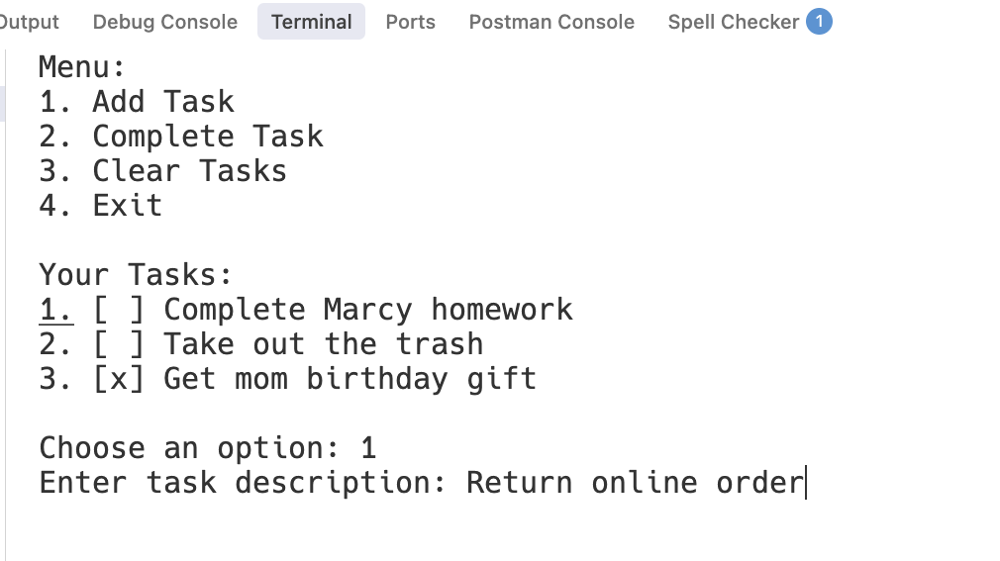

# Case Study: CLI Task Manager


Follow along with code examples [here](https://github.com/The-Marcy-Lab-School/swe-casestudy-1-cli-task-manager)!


**Table of Contents:**
- [Key Features and Usage Example](#key-features-and-usage-example)
- [Key Technologies and Packages](#key-technologies-and-packages)
- [Setup](#setup)
- [Investigation Questions](#investigation-questions)
  - [User Interface Design](#user-interface-design)
  - [Data Types](#data-types)
  - [Variables and Scope](#variables-and-scope)
  - [Functions](#functions)
  - [Conditional Logic](#conditional-logic)
  - [Modules](#modules)
  - [Looping and Iteration](#looping-and-iteration)
  - [Arrays and Objects](#arrays-and-objects)
  - [Array Higher-Order Methods / Iterator Functions](#array-higher-order-methods--iterator-functions)
  - [Error Handling and Debugging](#error-handling-and-debugging)
  - [Code Style](#code-style)
- [Extension Opportunities](#extension-opportunities)
  - [Tips](#tips)

This project is a simple command-line task manager where users can add, view, and complete tasks. The application stores tasks in an array of objects, gives users options through prompts, and uses array iteration and array methods to handle interactions with tasks.

## Key Features and Usage Example
After running the application, the user is presented with a menu of options. They can:
1. Add a new task to their list of tasks
2. Mark a task as completed
3. Delete all tasks from the list
4. Exit the application.

In the screenshot below, you can see a user selecting the "Add Task" option and entering a task description "Return online order".



## Key Technologies and Packages

* Node
* `prompt-sync`

## Setup

Follow these steps to get started:

```sh
# Clone the repo
git clone [repo_url]
cd [repo_name]

# Install dependencies
npm install

# Run the src/index.js file
node src/index.js

# Or, you can use the start command shortcut
npm start

# Or, run in developer mode using nodemon
npm run dev
```
## Investigation Questions

By answering these questions, you will be required to think critically about how the application is designed and understand WHY it is designed in this way. Your aim should be to:
* learn as much as you can from this application so that you can build an application of your own that leverages these same skills
* communicate clearly about the concepts you are using and the decisions you make for how you implement them.

### User Interface Design

The user interface is how humans interact with our programs. Even in a simple command-line application, thoughtful design choices can make the difference between a frustrating or confusing experience and one that feels intuitive and pleasant to use.

**Question 1**

Look at the menu display in `showMenu()`. The menu shows numbered options (1, 2, 3, 4) and asks the user to "Choose an option (1-4)". Why do you think the menu uses numbers for the options? What are the potential downsides of having the user type out in words what they would like to do? For example: "Choose an option: add an item, view tasks, complete a task, exit".

**Question 2**
In the `viewTasks()` function, tasks are displayed with checkboxes: `[x]` for completed tasks and `[ ]` for incomplete tasks. Do you think this visual representation is easy to understand? What alternative ways of displaying this information can you think of?

**Question 3**
Look at the `console.clear()` call at the end of the `while` loop in `showMenu()`. It occurs after a final `prompt()` for the user to press Enter. How would the user experience change if we didn't clear the console? How would it change if we removed the `prompt()` that comes right before it?

**Question 4**
When a user completes a task, the program shows a message like `Task "walk the dog" marked as completed!`. Why is it important that the user sees these messages? How would the user experience change without these messages?

### Data Types

Whether you are designing a new application or learning about an existing one, we always start by asking: _how is the data represented_? Once we know how to represent the data, we are better able to design how the application uses and manipulates it.

**Question 1**

Go to the `tasks.js` file and look at the `tasks` variable. It is an array of objects. Each object represents a task in the list. Each task has a `description` string and an `isComplete` boolean. For the `isComplete` value, We could also have represented it with the numbers: `isComplete: 0` (incomplete) and `isComplete: 1` (complete); or as strings `isComplete: "complete"` and `isComplete: "incomplete"`. If it were up to you, which would you choose to represent `isComplete` and why?

**Question 2**

In `tasks.js` in the `addTask` function, there is this conditional statement: `if (!description)`. What data type does the expression `!description` evaluate to? and what is the purpose of this conditional statement?

**Question 3**

In `menu.js`, the user's chosen task number `taskChoice` is converted to a number using the `Number` casting function. Why is this code necessary? What happens if this type conversion is removed?

### Variables and Scope

Understanding where variables are declared (their **scope**) and therefore where they can be reached is crucial for building well-structured applications. In this CLI Task Manager, we can see variables declared in different locations that serve different purposes.

**Question 1**

In the `showMenu()` function in `menu.js`, the variable `isRunning` is declared with `let`. In fact it is the only variable declared with `let`. Why does it need to be declared using the `let` keyword and what would happen if you used `const` instead?

**Question 2**

In the `showMenu()` function in `menu.js`, take a look at the `taskChoice` and `taskIndex` variables. Consider that we could have also written the code without any variables and it would still work properly:

    ```js
    completeTask(Number(prompt('Enter task number to complete: ')) - 1);
    ```
  
What are the tradeoffs of these approaches?

**Question 3**

Look at the `tasks` array in `tasks.js`. What is the scope of the `tasks` variable? What would happen if we moved the `tasks` array declaration inside one of the functions? Why would this break the application?

### Functions

Functions are the building blocks of reusable code. They allow us to break down complex problems into smaller, manageable pieces and avoid repeating the same code multiple times. Good function design and modular organization make code easier to understand, test, and maintain.

**Question 1**

In `menu.js`, take a look at how the `prompt()` function is being invoked. Based on what you're seeing, how many parameters does the function seem to have? If you were the designer of that function what name would you give to its parameters?

**Question 2**

What if the programmer had written all the task logic directly in `menu.js` instead of creating separate functions? For example, look at the code inside `clearTasks()` — imagine copying all of that code and pasting it directly where `clearTasks()` is called. 
    
    ```js
    else if (menuChoice === '3') {
      tasks.length = 0;
      console.log('All tasks cleared!');
    }
    ```

Would this code even work? Assuming you could get it to work, what are the downsides of doing this for potentially all of the tasks-related functions?

**Question 3**

What if we combined all the task-related functions (`addTask`, `completeTask`, `viewTasks`, `clearTasks`) into one giant function called `handleTaskOperations()`? What parameters would you need to include in order for it to work with all task-related operations?

### Conditional Logic

Conditional Statements enable programs to behave differently depending on the state of the program. Without them, a program would run the exact same way every time!

**Question 1**

In `menu.js`, the `showMenu()` function uses `if/else if` statements to handle different menu choices. What would happen if we used separate `if` statements instead of `else if`? Try to think through what would happen if a user entered "1" as their menu choice.

**Question 2**

Look at the `addTask()` function in `tasks.js`. The first few lines check `if (!description)` and return early if no description is provided. This is called a "guard clause." What would happen if we removed this guard clause and a user tried to add a task with no description?

**Question 3**

Look at the `viewTasks()` function. It checks `if (tasks.length === 0)` before displaying tasks. What would happen if we removed this check and tried to display an empty task list?

### Modules

A module is a file containing code, which can then be imported and utilized in other parts of a larger program or system. Rather than writing all of our code in one file, this project splits the code into three modules: `index.js`, `tasks.js`, and `main.js`. As a result, we achieve "separation of concerns".

**Question 1**

Look at the top of `menu.js`. You'll see `addTask` is imported. What would happen if we tried to call `addTask()` in `menu.js` without this import statement? Why do we need to explicitly import these functions?

**Question 2**

In `tasks.js`, look at the bottom of the file: `module.exports = { addTask, viewTasks, completeTask, clearTasks };`. This exports the functions so they can be used in other files. Notice that the `tasks` array itself isn't exported which means that the `menu.js` file can't access it directly. Why do you think the programmer chose to leave out `tasks` from the export list?

**Question 3**

If we wanted to add a new feature to the application, giving the user the option to mark all items as complete, how would you split up the code amongst the modules to implement this feature?

### Looping and Iteration

Loops take repetitive tasks and boil them down to a process that can be repeated without having to type the same code multiple times. Choosing the right type of loop and ensuring it terminates properly are crucial skills for any programmer.

**Question 1**

Look at the `showMenu()` function in `menu.js`. There's a `while (isRunning)` loop that keeps the menu running until the user chooses to exit. What would happen if we forgot to set `isRunning = false` when the user chooses option 4 (Exit)? What would happen if we forgot to include that line of code?

**Question 2**

Why is a `while` loop the appropriate type of loop to use to display the menu as opposed to a `for` loop?

**Question 3**

The `while` loop in `showMenu()` has a condition `while (isRunning)`. This means the loop will continue as long as `isRunning` is `true`. What would happen if we changed the condition to `while (true)` and removed the `isRunning` variable entirely? How else could we break out of the loop?

### Arrays and Objects

Arrays and objects are the two most common options we have for creating collections of data. Arrays are a great choice for grouping together lists of similar values while objects are a great way to represent a single thing that has many data points related to it.

**Question 1**

The entire collection of `tasks` is represented as an Array of task objects. Each task object is represented with properties `.description` and `.isComplete`. Suppose we instead represented the tasks as an array of strings, such as `['walk the dog', 'take out the trash']`. What are the tradeoffs between an array of objects and an array of strings?

**Question 2**

What ideas do you have for differentiating incomplete tasks and complete tasks?

### Array Higher-Order Methods / Iterator Functions

Array higher-order methods abstract away the logic for looping through an array and doing something with its values. While the programmer loses some fine-tuned control over how the loop is executed, the improved readability of the code is often worth the tradeoff.

**Question 1**

In the `viewTasks()` function in `tasks.js`, there's a `forEach` loop: `tasks.forEach((task, index) => { ... })`. This is a different type of loop than the `while` loop. What are the tradeoffs of using `forEach` when compared to using a `for` loop or `while` loop?

**Question 2**

Look at the `forEach` loop in `viewTasks()`. The loop variable is called `task` and it represents each individual task object. What would happen if we changed the variable name from `task` to `item` or `t`? Would the code still work the same way?

### Error Handling and Debugging

Real-world applications must handle unexpected situations gracefully. Understanding how to anticipate, catch, and respond to errors is essential for building robust software. Debugging skills help us identify and fix issues when things don't work as expected.

**Question 1**

What happens when the user enters invalid input (like letters when numbers are expected)?

**Question 2**

How does the application handle edge cases like trying to complete a task that doesn't exist?

**Question 3**

What debugging techniques could you use to understand what's happening when the program doesn't work as expected?

### Code Style

Code style encompasses the conventions and formatting choices that make code readable and maintainable. While the computer doesn't care about indentation, spacing, or naming conventions, these elements are crucial for human developers who need to read, understand, and modify the code. Consistent code style makes collaboration easier and reduces the cognitive load when working with code.

**Question 1**

Look at the indentation in `tasks.js`. Notice how the code inside functions is indented with 2 spaces, and code inside `if` statements is indented even further. How does this indentation impact your ability to understand the code?

**Question 2**

Find the variables, functions, parameters, and object property names in the application (search for `const` and `let` keywords). Do they clearly describe the content they hold / the functionality they perform? What patterns do you see in naming? Why is this important?

**Question 3**

How are imports, exports, functions and code blocks organized? Is there a logical and consistent flow that makes the code easy to follow?

**Question 4**

What do you think the reason is that some files are in the `src` sub-folder while other files are in the root of the project. What is the purpose or benefit of this separation?

## Extension Opportunities

Now that the core Task Manager app is complete, it’s time to add new features! Pick at least one feature to implement. If you finish quickly, try more than one!

* **Toggle Complete**: Right now, you can only mark a task as complete. Refactor the "Complete Task" menu option such that the user can toggle a task between complete and incomplete.

* **Delete Task**: Add a menu option to remove a single task from the list.

* **Show Completed Tasks**: Add a menu option to display only tasks that are completed.

* **Show Incomplete Tasks**: Add a menu option to display only tasks that are not completed.

* **Mark All as Completed**: Add a menu option that marks every task as completed.

* **Show Task Stats**: Add a message to the the `viewTasks` function that shows the user how many tasks are complete vs. incomplete.
  
* **Data Persistence**: Look into the `JSON.stringify` and `JSON.parse()` functions as well as the `fs.writeFileSync()` function to figure out how to store the tasks in a `.json` file whenever the user exits and then retrieve those tasks when they start up again.

### Tips

- Add a new menu option for each feature you implement.
- Don’t delete old functionality — just extend your app.
- Test your feature with at least 3–4 tasks to make sure it works.
