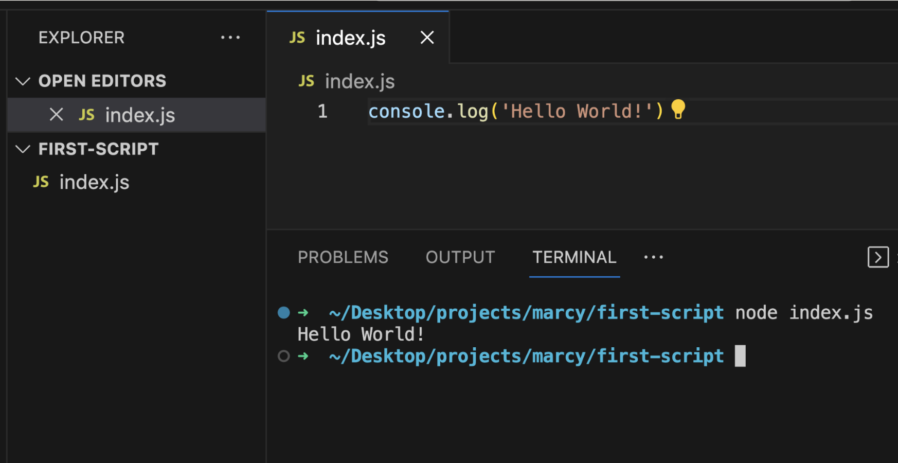
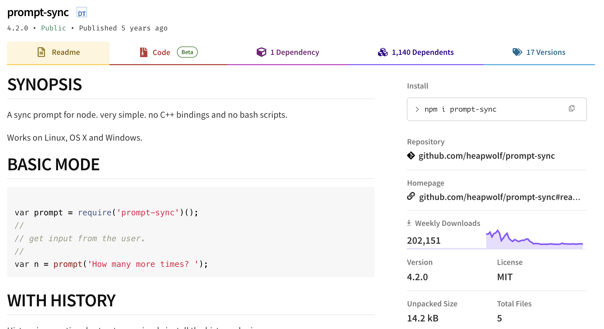
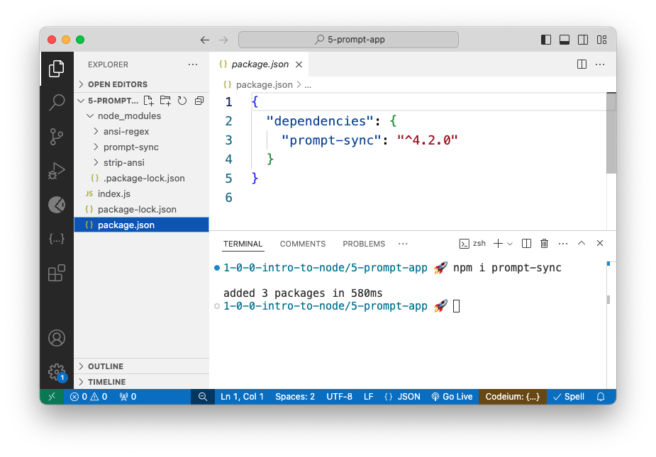
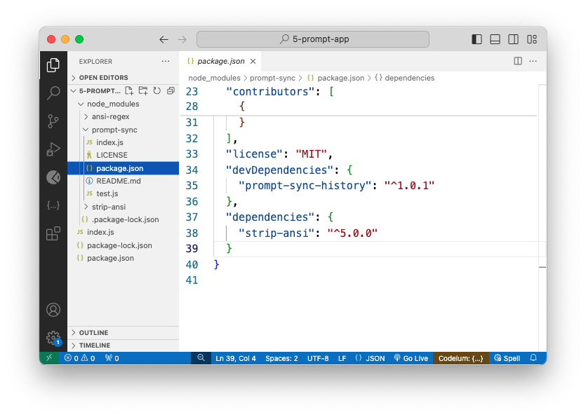

# Node & Node Modules


Follow along with code examples [here](https://github.com/The-Marcy-Lab-School/1-0-0-intro-to-node)!


**Table of Contents:**

* [Slides](2-node-and-modules.md#slides)
* [Overview](2-node-and-modules.md#overview)
  * [Key Terms](2-node-and-modules.md#key-terms)
* [What is Node?](2-node-and-modules.md#what-is-node)
* [Exporting and Importing Node Modules](2-node-and-modules.md#exporting-and-importing-node-modules)
  * [Exporting with `module.exports` (CommonJS)](2-node-and-modules.md#exporting-with-moduleexports-commonjs)
  * [Importing with `require()` (CommonJS)](2-node-and-modules.md#importing-with-require-commonjs)
  * [Destructuring](2-node-and-modules.md#destructuring)
* [Node Package Manager (NPM)](2-node-and-modules.md#node-package-manager-npm)
  * [Installing and Using Dependencies from NPM](2-node-and-modules.md#installing-and-using-dependencies-from-npm)
  * [`package.json` and `node_modules`](2-node-and-modules.md#packagejson-and-node_modules)
  * [Developer Dependencies](2-node-and-modules.md#developer-dependencies)
  * [`package.json` Scripts and `nodemon`](2-node-and-modules.md#packagejson-scripts-and-nodemon)
  * [`npm init -y`](2-node-and-modules.md#npm-init--y)
* [Madlib Challenge](2-node-and-modules.md#madlib-challenge)

## Overview

In this lesson we'll learn the history of Node and the fundamentals of using Node Modules to build JavaScript scripts.

### Key Terms

* **Node** is a "JavaScript runtime environment" which is just a fancy way to say it is a program for running JavaScript.
* A **module** is an exported chunk of code (typically a function or a set of functions) that can be used across our project.
* In a Node project, a file exports a module by assigning a value to `module.exports`
* A file can export a module in two ways:
  * It can export one value/function (a single **"default export"**)
  * It can export many values/functions (a group of **"named exports"**)
* A module can be imported with the `require(filename)` function.
* Modules can be downloaded from the **Node Package Manager (NPM)** online registry
* When a module is downloaded, it is called a **dependency**
* `package.json` is a file with meta-data about a Node project including dependencies and configuration.
* **JavaScript Object Notation (JSON)** is a file format for representing data in an JavaScript-Object-like notation with key:value pairs.
* **Developer dependencies** are dependencies used by the developer(s) who created the package but aren't needed by the users of the package. They are not added to the `node_modules` folder of the user.

## What is Node?

* JavaScript started out as a language that could only be executed by a browser.
* In 2009, Node was invented to allow programmers to run JavaScript on their own computers without a browser, opening the door for fullstack JavaScript development.
* **Node** is a "JavaScript runtime environment" which is just a fancy way to say it is a program for running JavaScript.
* To run a JavaScript program, we use the command `node <file_name>`



* If you use the `node` command on its own, you will open the Node Read Evaluate Print Loop (REPL) program.


## Exporting and Importing Node Modules

Consider the simple JavaScript program below. It declares a few functions for calculating data about a circle with a given radius and then prints them out.


```js
// functions for circle stuff
const LAZY_PI = 3.14;

const getArea = (radius) => {
  return LAZY_PI * radius * radius;
}

const getDiameter = (radius) => {
  return radius * 2;
}

const getCircumference = (radius) => {
  return LAZY_PI * radius * 2;
}

// function for printing stuff. It is a "wrapper" for the console.log function
const print = (input) => {
  console.log(input);
}

// The main function just runs all of the other functions
const main = () => {
  const radius = 5;
  const area = getArea(radius);
  print(`the area of a circle with radius ${radius} is ${area}`);

  const diameter = getDiameter(radius);
  print(`the diameter of a circle with radius ${radius} is ${diameter}`);

  const circumference = getCircumference(radius);
  print(`the circumference of a circle with radius ${radius} is ${circumference}`);
}

main();
```


* Notice that the `main` function just uses the other functions.
* JavaScript projects are rarely built entirely in one file like this. Instead, code is separated into multiple files that share code with each other.
* These shared pieces of code are called **modules**. A **module** is an exported chunk of code (typically a function or a set of functions) that can be used across our project.
  * For example, a file can create a function and then **export** it.
  * Meanwhile, another file can **import** that function and use it.
* Modules help with organization and **separation of concerns** but require more files!


Separation of Concerns is a fundamental principle of software engineering. It emphasizes the importance of organizing our code into distinct functions and modules that each serve a singular and specific purpose. However, when put together, those individual pieces work in harmony.


### Exporting with `module.exports` (CommonJS)

* In a Node project, a file exports a module by assigning a value/function to `module.exports`.


```javascript
const print = (input) => {
  console.log(input)
}
module.exports = print;
```


* When `module.exports` is assigned a single value/function, we call that a **default export**.
* You will also commonly see `module.exports` be assigned to an object containing multiple values/functions. These are called **named exports**:


```javascript
const LAZY_PI = 3.14;

const getArea = (radius) => {
  return LAZY_PI * radius * radius;
}
const getDiameter = (radius) => {
  return radius * 2;
}
const getCircumference = (radius) => {
  return LAZY_PI * radius * 2;
}

module.exports = {
  LAZY_PI,
  getArea,
  getDiameter,
  getCircumference
};
```


### Importing with `require()` (CommonJS)

* To import a value/function exported from another file, use the `require(filepath)` function and provide a `filepath` argument.


```javascript
// The variable name here is up to you since only the value is exported, not the variable.
const print = require('./print.js');
  
// circleHelpers is what we'll call the object that is exported
const circleHelpers = require('./circle-helpers.js');

const main = () => {
  const radius = 5;
  
  // the getArea method is INSIDE of the circleHelpers object so we use dot notation
  const area = circleHelpers.getArea(radius);

  // print was the default export of print.js so we can just invoke it.
  print(`the area of a circle with radius ${radius} is ${area}`);

  //... the rest of the code ...
}

main();
```


### Destructuring

* If the exported value is an object, we typically will **destructure** the object immediately upon importing it:


```javascript
// With destructuring, we create a variable for each named export.
const { getArea, getDiameter, getCircumference } = require('./circle-helpers.js');

const main = () => {
  const radius = 5;
  
  // We can just invoke getArea now without digging through an object.
  const area = getArea(radius);
  print(`the area of a circle with radius ${radius} is ${area}`);

  //... the rest of the code ...
}

main();
```


## Node Package Manager (NPM)

* Modules can be downloaded from the **Node Package Manager (NPM)** online registry.
* When you download a package, it is called a **dependency**.
* Visit https://www.npmjs.com/ to explore available packages. Start by searching up the "prompt-sync" package.



### Installing and Using Dependencies from NPM

* To install any module from npmjs, use the `npm install` (or `npm i`) command in your Terminal:

```sh
npm i prompt-sync # installs the prompt-sync package
```

* Now, you should see a `node_modules/` folder with a `prompt-sync/` folder inside. Open up the `prompt-sync/index.js` file to see the module that is exported!
* To use the package in our own program, use `require()` again, this time with just the name of the module.


```javascript
// with modules in node_modules, we only need to provide the name:
const prompt = require('prompt-sync')();

// we don't need to provide the full relative path (although we can)
const prompt = require('./node_modules/prompt-sync')();
```



For `prompt-sync`, the exported module is not the `prompt` function itself, but instead a `create` function which lets the programmer configure how they want `prompt` to work (see `node_modules/prompt-sync/index.js`)

This is a common pattern for modules.


### `package.json` and `node_modules`

* Every dependency of a project, and its version number, will be listed in the file `package.json` (if the file doesn't exist, the `npm i` command will create it). The existence of this file turns our project into a **package**.
* **JavaScript Object Notation (JSON)** is a file format for representing data in an JavaScript-Object-like notation with key:value pairs.



* The downloaded module will be placed in a folder called `node_modules/` along with any **sub-dependencies** that the module itself may require.
* You can see the sub-dependencies of a module by opening its own `package.json` file. All modules listed under `"dependencies"` will also be installed in `node_modules/`.
  * In `prompt-sync/package.json`, we can see it has `strip-ansi` as a dependency.
  * In `strip-ansi/package.json`, we can see it has `ansi-regex` as a dependency.



### Developer Dependencies

* In the `prompt-sync/package.json` file, you will notice that `prompt-sync-history` is listed under `"devDependencies"`.
* **Developer dependencies** are dependencies used by the developer(s) who created the package but aren't needed by the users of the package. They are not added to the `node_modules` folder of the user.
* Try installing the `nodemon` module as a developer dependency using the `npm i -D` command:

```sh
npm i -D nodemon
```

* You should see `nodemon` added to the `"devDependencies"` section of `package.json` (version numbers may vary):

```json
{
  "dependencies": {
    "prompt-sync": "^4.2.0"
  },
  "devDependencies": {
    "nodemon": "^3.1.7"
  }
}
```

* The `nodemon` module installs a new command `nodemon` that can be used to run a JavaScript file in "hot reload" mode. This means that any time you save a file in the project, it will re-run the file.

```sh
# runs index.js once
node index.js 

# re-runs index.js each time the file changes
nodemon index.js
```

<details>

<summary><strong>Q: Why is <code>nodemon</code> installed as a developer dependency and not a required dependency of the project?</strong></summary>

`nodemon` makes it easier to test your code but the users of the package do not strictly need its functionality. It is just a convenience.

</details>

### `package.json` Scripts and `nodemon`

* You can add a `"scripts"` section to the `package.json` file to make it easier to run commonly used Terminal commands.
* Two common script commands to add are `"start"` which runs `node index.js` and `"dev"` which runs `nodemon index.js`

```json
{
  "scripts": {
    "start": "node index.js",
    "dev": "nodemon index.js"
  },
  "dependencies": {
    "prompt-sync": "^4.2.0"
  },
  "devDependencies": {
    "nodemon": "^3.1.7"
  }
}
```

* To use these commands, we can type `npm run script_name`. For example, `npm run start` or `npm run dev`

### `npm init -y`

* When working on a new Node project, it is common to set up the `package.json` file prior to installing any dependencies.
* This can be done using the command `npm init` which will ask you some questions to generate a `package.json` file.

```json
{
  "name": "project-name",
  "version": "0.0.1",
  "description": "Project Description",
  "main": "index.js",
  "scripts": {
    "test": "echo \"Error: no test specified\" && exit 1"
  },
  "repository": {
    "type": "git",
    "url": "the repositories url"
  },
  "author": "your name",
  "license": "N/A"
}
```

* You can also run `npm init -y` to skip the questions and build a `package.json` file using default values.

## Madlib Challenge

A program is considered **hard-coded** if the program code must be modified in order to produce a new result.

The `prompt-sync` function is really useful for creating programs that will produce new results depending on the user's input.


```javascript
const prompt = require('prompt-sync')();

const name = prompt(`Hello there! What's your name? `);
console.log(`hi ${name}. My name is HAL`);
```


In the `6-madlib-challenge/index.js` file you will find the following hard-coded program:


```javascript
const madlib = (name, verb, quantity, item, newItem, isHappy) => {
  console.log(`There once was a man named ${name}.`);
  console.log(`Every day he would ${verb} with his ${quantity} ${item}s`);

  if (isHappy) {
    console.log(`But then, he found a ${newItem} and everything changed!`);
  } else {
    console.log(`But then, a ${newItem} took over his life and he couldn't ${verb} again!`);
  }

  console.log("The end.")
}

const main = () => {
  const name = 'Ben';
  const verb = 'run';
  const quantity = 50;
  const item = 'dog';
  const newItem = 'new car';
  const isHappy = false;

  madlib(name, verb, quantity, item, newItem, isHappy);
}
```


Your goal is to do the following in the `6-madlib-challenge` folder:

1. Download the `prompt-sync` module using `npm i prompt-sync`
2. Import and configure the `prompt` function in `index.js`
3. Replace the hard-coded variables defined in the `main` function with values retrieved from the user via the `prompt` function.
4. Re-organize the code such that the `madlib` function is in its own file called `madlib.js` that exports `madlib` as the default export.

If you get stuck, you can view the solution below:

<details>

<summary><strong>Q: Solution</strong></summary>


```javascript
const madlib = require('./madlib.js');
const prompt = require('prompt-sync')();

const main = () => {
  const name = prompt('Choose a name: ')
  const verb = prompt('Choose a verb: ')
  const quantity = prompt('Choose a quantity: ')
  const item = prompt('Choose a item: ')
  const newItem = prompt('Choose a newItem: ')
  const isHappyResponse = prompt('Choose whether the story is happy. Y or N: ')
  const isHappy = isHappyResponse.toUpperCase() === "Y"

  madlib(name, verb, quantity, item, newItem, isHappy);
}

main();
```



```javascript
const madlib = (name, verb, quantity, item, newItem, isHappy) => {
  console.log(`There once was a man named ${name}.`);
  console.log(`Every day he would ${verb} with his ${quantity} ${item}s`);

  if (isHappy) {
    console.log(`But then, he found a ${newItem} and everything changed!`);
  } else {
    console.log(`But then, a ${newItem} took over his life and he couldn't ${verb} again!`);
  }

  console.log("The end.")
}

module.exports = madlib;
```


</details>
