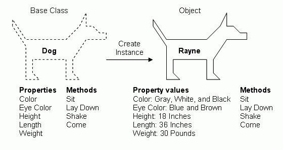

# Classes


Follow along with code examples [here](https://github.com/The-Marcy-Lab-School/2-2-classes)!


**Table of Contents:**
- [Key Concepts](#key-concepts)
- [Intro: Reviewing OOP, Encapsulation, Factory Functions, and Interfaces](#intro-reviewing-oop-encapsulation-factory-functions-and-interfaces)
  - [Factory Functions Waste Memory](#factory-functions-waste-memory)
- [Classes](#classes-1)
  - [Class Definition and `new`](#class-definition-and-new)
  - [Instanceof](#instanceof)
  - [Setting Properties With A Constructor](#setting-properties-with-a-constructor)
  - [Optional Constructor Parameters \& Overwriting Public Class Fields](#optional-constructor-parameters--overwriting-public-class-fields)
  - [Defining Instance Methods](#defining-instance-methods)
  - ["Own Properties" and Prototypes](#own-properties-and-prototypes)
- [Quiz!](#quiz)
- [Challenge](#challenge)
- [Summary](#summary)


## Key Concepts

* The methods of objects created by factory functions are recreated for each instance, wasting memory.
* **Classes** provide a blueprint for creating objects with a shared interface.
* The **`instanceof` operator** can be used to check if a given object is derived from a given class.
* The **`constructor()` method** is invoked when the `new Class()` syntax is used.
  * Inside the `constructor()`, the value of `this` is the new instance object.
* **Own properties** are properties defined directly on an object.
* The **Prototype Chain** is the mechanism through which 

## Intro: Reviewing OOP, Encapsulation, Factory Functions, and Interfaces

In the last lecture, we learned about **encapsulation** - bundling data and methods that act on that data into an object. We learned how to use **closures** to hide internal data and restrict access to them.

With encapsulation, we can re-use **factory functions** like `makeFriendsManager` to create multiple objects that look alike: each friends manager **instance** has a `username` and `getFriends()` and `addFriends()` methods.

```js
const makeFriendsManager = (username) => {
  const friends = [];

  const friendsManager = {
    username, // we can leave username "public" if we don't care about how it is used or reassigned.
    addFriend(newFriend) {
      if (typeof newFriend !== 'string') {
        console.log('new friends must be strings');
        return;
      }
      friends.push(newFriend);
    },
    printFriends() {
      this.friends.forEach((friend) => {
        console.log(`${this.username} is friends with ${friend}`);
      });
    },
    // add a getter method to get a copy of the friends array
  }
  return friendsManager;
}

// instances of the factory function have their own friends
const reuben = makeFriendsManager('reuben');
reuben.addFriend('carmen')
reuben.addFriend('ann')
reuben.addFriend('motun')
reuben.printFriends();
// reuben is friends with carmen
// reuben is friends with ann
// reuben is friends with motun

const maya = makeFriendsManager('maya');
maya.addFriend('ben')
maya.addFriend('gonzalo')
reuben.printFriends();
// maya is friends with ben
// maya is friends with gonzalo
```

We often refer to encapsulated objects as **"interfaces"** for the data that they manage.


An **interface** is a "shared boundary" where two or more components of a system can interact and exchange information. For example, your keyboard, mouse/trackpad, and screen together are the interface that you use to interact with your computer. Similarly, the methods of an encapsulated object are the interface that the caller of those methods can use to interact with the object's data.

Interfaces do not expose the inner details of the tool/machine/program that the user is operating — they instead provide well-defined and controlled access points for the user to operate it.


In summary, separation of concerns is achieved in OOP by identifying the *features* of an application and **encapsulating** the data and methods for those features in objects to create **interfaces** for each feature.

### Factory Functions Waste Memory

The instances `reuben` and `maya` definitely have the same behavior. But do they _share_ that behavior? That is, **are the methods `reuben.addFriend` and `maya.addFriend` really the same function in memory?**

Printing out the objects themselves shows us two identical-*seeming* objects:
```js
console.log(reuben);
// {
//   getFriends: [Function: getFriends],
//   addFriend: [Function: addFriend]
// }

console.log(maya);
// {
//   getFriends: [Function: getFriends],
//   addFriend: [Function: addFriend]
// }
```

But looking at the methods themselves, we can see that they are not referencing the same function in memory.

```js
console.log(reuben.addFriend === maya.addFriend);
```

Each time the factory function is invoked, a brand new object is made and the methods are recreated as well. This is a waste of memory!

To address this memory issue, in 2016 classes were introduced to JavaScript. Let's see how they work.

## Classes



A **class** is similar to a factory function in that it can be used to create objects that all have the same interface (the same set of properties and methods).

<details>

<summary><strong>Q: Suppose we wanted to create a class to represent users. What would the default properties be? What methods would be shared by each instance?</strong></summary>

* The `User` class would have a **constructor function** for making a `User` instance with properties like `username`, `email`, and `password`
* The `User` class might have methods like `changeUsername` or `setPassword`

</details>

### Class Definition and `new`

In JavaScript, it starts with the `class` keyword, an uppercase name, and curly braces. Like this:

```js
// class definitions
class Person {

}

// creating class instances with the `new` keyword
const ben = new Person();
const carmen = new Person();

// Instances are objects derived from a particular class
console.log(ben);     // User {}
console.log(carmen);  // User {}
```

With a `class` definition, we can create new **instances** of that class `ben` and `carmen` using the `new` keyword.


**Note:** Even though `Person` is treated like a function (we invoke it), you must use the `new` keyword when making an instance (you'll get an error if you don't)

```js
// User is a function, but you can't just call it
console.log(typeof Person); // function

const ben = Person(); // error: you must use the new keyword to invoke a constructor function
```



### Instanceof

We can use the `instanceof` operator (kind of like the `typeof` operator) to see if an object is derived from the given class.

```js
console.log(ben instanceof Person); // true
console.log(ben instanceof Array); // false

console.log([] instanceof Person); // false
console.log([] instanceof Array); // true
```

### Setting Properties With A Constructor

We can add properties to the objects created by a class in two ways:
1. Define public class fields within the class body.
2. Define a `constructor()` that accepts values when the instance is initialized.

```js
class Person {
  // Public class fields are defined here. All instances will start with this property.
  friends = [];

  // The constructor is invoked whenever a new instance is created.
  // This constructor accepts two parameters: name and age
  constructor(name, age) {
    // The `this` keyword references the new instance object being created
    this.name = name;  
    this.age = age;
  }
}

const ben = new Person('ben', 30);
const gonzalo = new Person('gonzalo', 36);

console.log(ben); // Person { name: 'ben', age: 30, friends: [] }
console.log(gonzalo); // Person { name: 'gonzalo', age: 36, friends: [] }
```

As you can see, each instance of `Person` has the properties `friends`, `name`, and `age`. However, only `name` and `age` were set by the constructor while the `friends` property was hardcoded to `[]`. Here's how it works:

* `constructor` is a "reserved" method name. When the `new Class()` syntax is used, JavaScript will look to see if the class has a `constructor()` and will automatically execute it.
  * Inside of a `constructor()`, the `this` keyword references the new instance object being created.
* Public class fields are added to every instance of a class. `this` is not needed to define a public class field.


All of the properties in this example are "public" and the objects are mutable.

```js
ben.age++;
ben.friends.push(gonzalo.name);
console.log(ben); // Person { name: 'ben', age: 31, friends: [ 'gonzalo' ] }
```

### Optional Constructor Parameters & Overwriting Public Class Fields

Let's say we want to have the option to add some initial friends when initializing a new `Person`. There are many ways to do this but the common pattern is to simply create a public field with a hardcoded default value and then overwrite it in the constructor if a value is provided.

```js
class Person {
  friends = []; // the default value

  constructor(name, age, friends) {
    this.name = name;  
    this.age = age;
    if (friends) this.friends = friends;
  }
}

const ben = new Person('ben', 30);
console.log(ben); // Person { name: 'ben', age: 30, friends: [] }

const gonzalo = new Person('gonzalo', 36, ['ben', 'carmen']);
console.log(gonzalo); // Person { name: 'gonzalo', age: 36, friends: ['ben', 'carmen'] }
```

### Defining Instance Methods

Here's where classes start to shine. We can add methods that all instances share by defining them inside the class body *without* commas between them. Inside a method, the `this` keyword will refer to whichever instance is invoking the method.

```js
class Person {
  friends = [];

  constructor(name, age) {
    this.name = name;
    this.age = age;
  }
  
  addFriend(newFriend) {
    // When used in a method, this references the object invoking the method
    this.friends.push(newFriend);
  }

  greet() {
    console.log(`Hi, I'm ${this.name}. I am ${this.age} years old and I have ${this.friends.length} friends.`);
  }
}
const alan = new Person('Alan Turing', 30);
alan.greet(); // Hi, I'm alan. I am 30 years old and I have 0 friends.

const ada = new Person('Ada Lovelace', 36)
ada.addFriend('Alan');
ada.addFriend('Nikola');

ada.greet(); // Hi, I'm Ada Lovelace. I am 36 years old and I have 2 friends.
```

### "Own Properties" and Prototypes

In JavaScript, a property of an object is considered **"own properties"** if that property is defined directly on the object. For instances of a given class, only the public class fields and properties set in the constructor are "own properties". For the `Person` class, these would be `friends`, `name`, and `age`.

You can see which properties are **"own properties"** held by an object using the `Object.getOwnPropertyNames()` method:

```js
console.log(Object.getOwnPropertyNames(ada)); // [ 'friends', 'name', 'age' ]
```

So, where are the methods `addFriend` and `greet` stored if not in the instances? And how can those instances still invoke those methods?

In JavaScript when we create a class, the methods of the class are stored as own properties of the `Class.prototype` object. For example, we can see the methods owned by the `Person.prototype`:

```js
// Person.prototype holds the methods available to all Person instances
console.log(Object.getOwnPropertyNames(Person.prototype)); // [ 'constructor', 'addFriend', 'greet' ]
```

Instances created from a class are linked that class's prototype and have access to its methods. We can see the prototype of an instance using the `Object.getPrototypeOf()` method:

```js
console.log(Object.getOwnPropertyNames(Object.getPrototypeOf(ada))); // [ 'constructor', 'addFriend', 'greet' ]
```

We can see the same thing is true for arrays:

```js
console.log(Object.getOwnPropertyNames(['a', 'b', 'c'])); // ['0', '1', '2', 'length']
console.log(Object.getOwnPropertyNames(Array.prototype)); // same as [].__proto__
/* 
[
  'length',        'constructor',    'at',
  'concat',        'copyWithin',     'fill',
  'find',          'findIndex',      'findLast',
  'findLastIndex', 'lastIndexOf',    'pop',
  'push',          'reverse',        'shift',
  'unshift',       'slice',          'sort',
  'splice',        'includes',       'indexOf',
  'join',          'keys',           'entries',
  'values',        'forEach',        'filter',
  'flat',          'flatMap',        'map',
  'every',         'some',           'reduce',
  'reduceRight',   'toLocaleString', 'toString',
  'toReversed',    'toSorted',       'toSpliced',
  'with'
]
*/
```

All of this shows us the main benefit of classes compared to factory functions: the **methods are truly shared between instances.**

```js
console.log(ada.addFriend === alan.addFriend); // true
```

## Quiz!

Can you spot the mistake(s) with the code below?

```js
const Animal = {
  this.owners = [];

  constructor: (species, sound) => {
    this.species = species;
    this.sound = sound;
  },
  makeSound() {
    console.log(sound)
  }
}

const dog = Animal('canine', 'woof');
```

<details>

<summary><strong>Q: Answer</strong></summary>

The following mistakes are made:

* `const` is used instead of `class` to define the `Animal` class
* We don't need the `=` to create the class
* The `owners` property with the default value doesn't need `this`
* The `constructor` function should be written like this: `constructor () {}` without the `:` and `=>`
* We don't need a comma to separate the methods
* `makeSound` should use `this.sound`
* When creating an instance of `Animal`, the `new` keyword should be used.

```js
class Animal {
  owners = [];

  constructor (species, sound) {
    this.species = species;
    this.sound = sound;
  }
  makeSound() {
    console.log(this.sound)
  }
}

const dog = new Animal('canine', 'woof');
```

</details>


## Challenge

Create a class called `FoodItem`. Every instance of `FoodItem` should have the following properties and methods

* `name` — the name of the item
* `price` - the price of the item in US dollars
* `weight` - the weight of the item
* `getPricePerPound()` - returns the price / pound of the item

For example, I should be able to use this `FoodItem` class like so

```js
const apple = new FoodItem('apple', 1, 0.5);
console.log(apple); 
// FoodItem { name: 'apple', price: 1, weight: 0.5 }

console.log(apple.getPricePerPound());
// 2
```

<details>

<summary><strong>Q: Solution</strong></summary>

```js
class FoodItem {
  constructor(name, price, weight) {
    this.name = name;
    this.price = price;
    this.weight = weight;
  }
  getPricePerPound() {
    return this.price/this.weight;
  }
}
```

</details>


Now, create a second class called `ShoppingCart`. Every instance of `ShoppingCart` should have the following properties and methods:

* `items` — an array that starts empty. It should hold `FoodItem` instances.
* `addItem(FoodItem)` — takes in a `FoodItem` instance and adds it to the `items` array.
* `getTotalPrice()` - calculates the total price of all `FoodItems` in the `items` array

For example, I should be able to use this `ShoppingCart` class like so

```js
const myCart = new ShoppingCart();
console.log(myCart); // ShoppingCart { items: [] }

myCart.addItem(new FoodItem('apple', 1, 0.5)) // name, price, weight
myCart.addItem(new FoodItem('bread', 5, 1))
myCart.addItem(new FoodItem('cheese', 7, 2))
console.log(myCart); // ShoppingCart { items: Array(3) }

console.log(myCart.getTotalPrice()); // 13
```

<details>

<summary><strong>Q: Solution</strong></summary>

```js
class ShoppingCart {
  constructor() {
    this.items = [];
  }
  addItem(item) {
    // we can get fancy and ensure that the incoming item is a FoodItem with instanceof
    if (!(item instanceof FoodItem)) return;

    this.items.push(item);
  }
  getTotalPrice() {
    return this.items.reduce((total, item) => total + item.price, 0)
  }
}
```

</details>


## Summary

* A **class** defines a type of object with shared methods and properties
  * It has a **constructor function** for defining the default properties that every **instance** of that class (objects of that type) will have.
  * All instances of that class inherit the class' methods.
* Classes are defined using the `class` keyword
* Instances of a class are created using the `new` keyword and the class constructor.
* When used in a constructor function, `this` points to the newly created object
  * When used in a method, `this` points to the object invoking the method

```js
class Animal {
  owners = [];
  constructor (species, sound) {
    this.species = species;
    this.sound = sound;
  }
  makeSound() {
    console.log(this.sound)
  }
}

const dog = new Animal('canine', 'woof');
dog.makeSound(); // 'woof'

const cat = new Animal('feline', 'meow');
cat.makeSound(); // 'meow'
```
