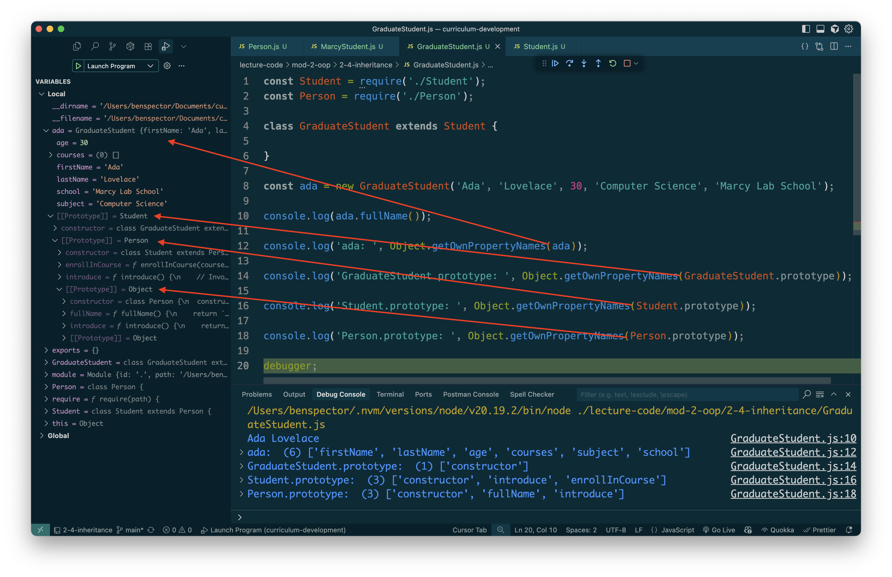

# Inheritance


Follow along with code examples [here](https://github.com/The-Marcy-Lab-School/2-4-inheritance)!


**Table of Contents:**
- [Key Concepts](#key-concepts)
- [Inheritance](#inheritance-1)
  - [A Person and a Student](#a-person-and-a-student)
  - [`extends`](#extends)
  - [`super`](#super)
- [Prototype Chain: Subclasses of Subclasses](#prototype-chain-subclasses-of-subclasses)
  - [Array is a Subclass of Object](#array-is-a-subclass-of-object)
- [Practice \& Review](#practice--review)
  - [Coding Challenge](#coding-challenge)
  - [Study Questions](#study-questions)

## Key Concepts

* **Inheritance** describes a relationship between two classes: a **subclass** that inherits methods from a **superclass**. Instances of the subclass can reuse and add to the methods defined in a superclass. 
* The **`Subclass extends Superclass`** syntax defines an inheritance relationship between two classes
* **The `super` keyword references the superclass of a given subclass:**
  1. We can invoke `super()` in the subclass constructor to invoke the superclass's `constructor()`.
  2. We can invoke `super.method()` in an **overridden method** to invoke the superclass's version of the method on the subclass instance.
* The **prototype chain** describes the linked structure where each object inherits methods from a prototype, which may inherit methods from another prototype, forming a chain.
  * When you access a property or method, JavaScript walks up this chain until it finds what you're looking for (or reaches the end).

## Inheritance

### A Person and a Student

Consider this `Person` class. 

```js
class Person {
  constructor(first, last, age) {
    this.firstName = first;
    this.lastName = last;
    this.age = age;
  }
  fullName() {
    return `${this.firstName} ${this.lastName}`;
  }
  introduce() {
    return `Hi, I'm ${this.firstName} and I'm ${this.age} years old.`;
  }
}

const ada = new Person('Ada', 'Lovelace', 30);
console.log(ada.fullName()); // Ada Lovelace
console.log(ada.introduce()); // Hi, I'm Ada and I'm 30 years old.
```

I want to make another class called `Student` that can do everything a `Person` can. In addition, `Student`  will have some additional properties and methods.

```js
class Student {
  courses = [];

  constructor(first, last, age, subject, school) {
    this.firstName = first;
    this.lastName = last;
    this.age = age;
    this.subject = subject;
    this.school = school;
  }
  fullName() {
    return `${this.firstName} ${this.lastName}`;
  }
  introduce() {
    return `Hi, I'm ${this.firstName} and I'm ${this.age} years old. I am studying ${this.subject} at ${this.school}.`;
  }
  enrollInCourse(courseName) {
    this.courses.push(courseName);
  }
}

const alan = new Student('Alan', 'Turing', 24, 'Computer Science', 'Marcy Lab School');
console.log(alan.fullName()); // Alan Turing
console.log(alan.introduce()); // Hi, I'm Alan and I'm 24 years old. I am studying Computer Science at Marcy Lab School.

ada.enrollInCourse('Leadership & Development');
ada.enrollInCourse('Technical Interview Prep');
console.log(ada.courses); // [ 'Leadership & Development', 'Technical Interview Prep' ]
```

**<details><summary>Question: What similarities and differences do you see between these two classes? What coding style rule is this breaking?</summary>**

A `Student` has every property and method that a `Person` has but it also has the public field `courses` as well as the properties `subject` and `sschool`. The `introduce()` method is implemented slightly differently and the `enrollInCourse` method is new.

This code breaks the DRY principle (Don't Repeat Yourself). In the `Student` class we duplicate the code for the `fullname` method and most of the code in the `constructor` and `introduce` methods stays the same.

</details> 

### `extends`

A `Student` is essentially a specific kind of `Person`. In computer science, we would say that **"a Student *is a* Person"** to describe this relationship. 

In JavaScript, we formalize this relationship using the `Subclass extends Superclass` syntax:

```js
const Person = require('./Person');

// Student is the "Subclass", Person is the "Superclass"
class Student extends Person {

}

const ada = new Student('Ada', 'Lovelace', 30);
console.log(ada.fullName()); // Ada Lovelace
console.log(ada.introduce()); // Hi, I'm Ada and I'm 30 years old.
```

With just this `extends` keyword, **every instance of `Student` "inherits" the properties and methods from the `Person` class.**

Furthermore, instances of `Student` are *also* instances of `Person`.

```js
console.log(ada instanceof Student);  // true
console.log(ada instanceof Person);   // true
```

### `super`

We don't want our `Student` class to just be a carbon-copy of the `Person` class. When we want to add new functionality to a subclass and still leverage the functionality of the superclass, we use the `super` keyword.

**The `super` keyword references the superclass of a given subclass:**



 

```js
const Person = require('./Person');

class Student extends Person {
  // A field unique to Students
  courses = [];

  constructor(first, last, age, subject, school) {
    // Invoke the superclass constructor
    super(first, last, age); 

    // Assign instance properties unique to Students
    this.subject = subject;
    this.school = school;
  }
  
  // fullName is inherited from Person

  // Overriding the introduce method
  introduce() {
    // Invoke the Person's version of the introduce method
    return `${super.introduce()}. I am studying ${this.subject} at ${this.school}.`
  }
  
  // A method unique to Student
  enrollInCourse(courseName) {
    this.courses.push(courseName);
  }
}

const ada = new Student('Ada', 'Lovelace', 30, 'Computer Science', 'Marcy Lab School');
console.log(ada.fullName()); // Ada Lovelace
console.log(ada.introduce()); // Hi, I'm Ada and I'm 30 years old. I am studying Computer Science at Marcy Lab School.

ada.enrollInCourse('Leadership & Development');
ada.enrollInCourse('Technical Interview Prep');
console.log(ada.courses); // [ 'Leadership & Development', 'Technical Interview Prep' ]
```



 

```js
class Person {
  constructor(first, last, age) {
    this.firstName = first;
    this.lastName = last;
    this.age = age;
  }
  fullName() {
    return `${this.firstName} ${this.lastName}`;
  }
  introduce() {
    return `Hi, I'm ${this.firstName} and I'm ${this.age} years old.`;
  }
}

module.exports = Person;
```



 

This example shows the two common usages of the `super` keyword:

1. `super()` — invokes the superclass constructor
     - In the `Student` constructor, `super()` invokes the `Person`'s constructor which assigns the properties `firstName`, `lastName`, and `age` to the new `Student` instance.
2. `super.method()` — invokes a method defined in the superclass. Often used to **override** the behavior of that method while still using some of the behavior from the superclass.
    - The `introduce()` method is overridden in the `Student` class but uses `super.introduce()` to invoke the `introduce` method defined in the `Person` class.

Notice that the `fullName` method is inherited from the `Person` class and is NOT overridden. It will behave the same way for student instances and person instances.

## Prototype Chain: Subclasses of Subclasses

Suppose that a `GraduateStudent` class simply extends `Student` without overriding any methods.

```js
class GraduateStudent extends Student {
  // inherits all methods from Student
}
const ada = new GraduateStudent('Ada', 'Lovelace', 30, 'Computer Science', 'Marcy Lab School');

console.log(ada.fullName()); // where is this method defined?
console.log(ada.toString()); // where is this method defined?
```

Remember that an instance like `ada` inherits methods from its prototype `GraduateStudent.prototype`:
* As a subclass, `GraduateStudent.prototype` also inherits methods from `Student.prototype`.
* Therefore, `ada` *also* inherits methods from `Student.prototype` (i.e. its prototype's prototype).

We describe this series of connected prototypes as a **prototype chain**. It is the linked structure that JavaScript follows when looking up properties and methods:

`ada` → `GraduateStudent.prototype` → `Student.prototype` → `Person.prototype` → `Object.prototype` → `null`

When you call `ada.someMethod()`, JavaScript searches up this chain until it finds `someMethod` or reaches the end (`null`).

```js
console.log(ada.fullName()); // Found on Person.prototype  
console.log(ada.toString()); // Found on Object.prototype
```

We can see this if we look at the "own properties" of each class's prototype in the chain.

```js
Object.getOwnPropertyNames(ada);
// [ 'firstName', 'lastName', 'age', 'courses', 'subject', 'school' ]
Object.getOwnPropertyNames(GraduateStudent.prototype);
// [ 'constructor' ]
Object.getOwnPropertyNames(Student.prototype);
// [ 'constructor', 'introduce', 'enrollInCourse' ]
Object.getOwnPropertyNames(Person.prototype);
// [ 'constructor', 'fullName', 'introduce' ]
```

**<details><summary>Q: So, where the <code>ada.introduce()</code> method will be found in the prototype chain?</summary>**

Remember how we overrode the `introduce` method in `Student`? That is why it shows up in both `Student.prototype` and `Person.prototype`. 

Even though `Person` also has an implementation of this method, we use the `Student` implementation since `Student` is "closer" to `ada` in the chain.

</details>

This is somewhat easier to see when we use the Node Debugger:



### Array is a Subclass of Object

This is all precisely why `typeof []` gives us `"object"` — every array is an instance of the the `Array` class which is a subclass of the `Object` class!

Every Array instance gets methods from the `Array.prototype` which inherits methods from the `Object.prototype`. Therefore, all arrays can use `Object.prototype` methods like `toString()`.

Try running the following code:

```js
debugger;
const arr = [1,2,3];

console.log(arr.toString());
console.log(arr); // expand the prototype chain to find the .toString() method

console.log(typeof arr); // "object"
console.log(arr instanceof Array);  // True
console.log(arr instanceof Object); // True
```

## Practice & Review 

### Coding Challenge

Create a class called `Professor` that is a subclass of `Person` with the following behavior:

```js
const reuben = new Professor('Reuben', 'Ogbonna', 36, 'Software Engineering', 'Marcy Lab School');

console.log(reuben.fullName()); // Reuben Ogbonna
console.log(reuben.introduce()); // Hi, I'm Reuben and I'm 36 years old. I teach Software Engineering at Marcy Lab School.
console.log(reuben.teach('object-oriented programming')); // Hello class, today we will be learning about object-oriented programming.
```

Then, create class called `MarcyStudent` that is a subclass of `Student`.
* All instances of `MarcyStudent` should have `subject` be set to `"Software Engineering"` and `school` be set to `"Marcy Lab School"`. 
* It should have a static `validCourses` array: `['Leadership & Development', 'Technical Interview Prep', 'Technical Lecture']`
* `enrollInCourse` should be overridden to first check if the provided course is in the `validCourses` array before adding the course to the `courses` array.

**<details><summary>Solution</summary>**

**Professor**

```js
class Professor extends Person {
  constructor(first, last, age, subject, school) {
    super(first, last, age);
    this.subject = subject;
    this.school = school;
  }
  introduce() {
    return `${super.introduce()}. I teach ${this.subject} at ${this.school}.`;
  }
  teach(topic) {
    return `Hello class, today we will be learning about ${topic}.`;
  }
}
```

**MarcyStudent**

```js
class MarcyStudent extends Student {
  static validCourses = ['Leadership & Development', 'Technical Interview Prep', 'Technical Lecture'];
  constructor(first, last, age) {
    super(first, last, age, "Software Engineering", "Marcy Lab School");
  }
  enrollInCourse(course) {
    if (validCourses.includes(course)) {
      super.enrollInCourse();
    }
  }
}
```
</details>

### Study Questions

Then, with a partner, discuss these questions:

**<details><summary>Question 1: What does `extends` do?</summary>**

`extends` makes the `WebDeveloper` inherit methods from `Programmer`. It sets `Programmer.prototype` as the prototype for `WebDeveloper`

</details>

**<details><summary>Question 2: What does `super` do?</summary>**

`super()` invokes the `Programmer` constructor function using its own value of `this`. Any properties that the `Programmer` constructor sets on `this` will be set on `WebDeveloper`.

</details>

**<details><summary>Question 3: What do we know about the relationship between a `Programmer` and a `Person`?</summary>**

* `WebDeveloper` is said to be a **subclass** of `Programmer`. 
* `Programmer` is said to be a **superclass** of `WebDeveloper`.
* `WebDeveloper` will inherit properties and methods from `Programmer` and `Person`.
* Instances of `WebDeveloper` are also instances of `Programmer` and of `Person`, but not all instances of `Person` or `Programmer` are instances of `WebDeveloper`.

</details>

**<details><summary>Question 4: How does the `code` method work?</summary>**

`code` invokes the `doActivity` method inherited from `Person.prototype`

</details>
