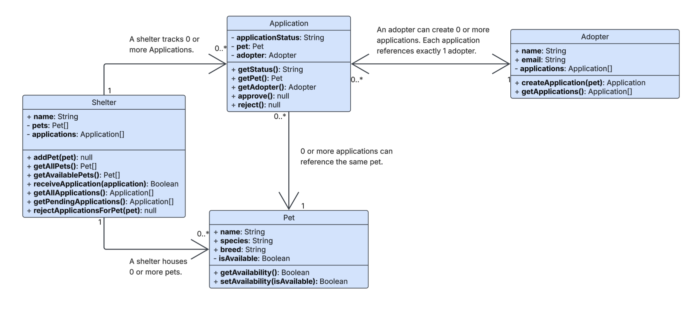
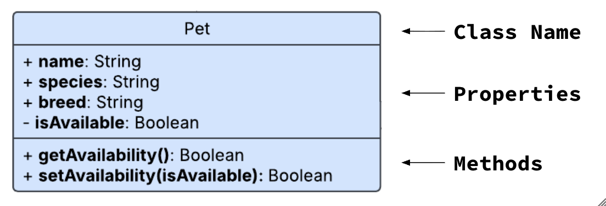

# Introduction to System Design

You've been writing classes for weeks. Today we're zooming out. Systems-level thinking means seeing how multiple classes work together to solve a real problem. This isn't just academic—when you interview, you'll be asked to design systems.

By the end of this lesson, you'll be able to answer this question: **Consider an application for making a pet adoption system: What classes exist, what are their responsibilities, and what are the interactions between them? Illustrate this system with a UML diagram.**

**Table of Contents:**
- [Key Concepts](#key-concepts)
- [OOP Review / Practice](#oop-review--practice)
- [Case Study: Pet Adoption Center](#case-study-pet-adoption-center)
- [System Design](#system-design)
  - [UML Diagrams \& Iterative Design](#uml-diagrams--iterative-design)
  - [UML Syntax: Class Responsibilities](#uml-syntax-class-responsibilities)
  - [UML Syntax: Relationships](#uml-syntax-relationships)
    - [Arrows: Uni-Directional vs. Bi-Directional](#arrows-uni-directional-vs-bi-directional)
    - [Multiplicity](#multiplicity)
    - [Label](#label)
    - [Practice](#practice)
- [Flow Charts](#flow-charts)

## Key Concepts
- **System design** is the process of understanding (1) the *components* of a system, (2) the *responsibilities* of those components, and (3) their *relationships to/interactions with* each other.
- An **"entity"** is a single component of a system, such as a class in a class-based system.
- **Unified Modeling Language (UML)** is an industry-standard format for representing the components of a system, their responsibilities, and their relationships.
- A **multiplicity** labels how many of one class relates to another (e.g. "one-to-many" → "*One* doctor *has many* appointments").
- **Flow Charts** are used to clearly define how entities are used within the processes of a system.

## OOP Review / Practice

Create a `Book` class:
* Properties:
  * `title`: String, public, set by the constructor
  * `author`: String, public, set by the constructor
  * `genre`: String, public, set by the constructor
* Methods: None

Then, create a `Library` class:
* Properties:
  * `name`: String, public, set by the constructor
  * `books`: Book[], private, starting value of `[]`
* Methods:
  * `getBooks()`: Returns a copy of the private books array
  * `addBook(book)`: Adds the given book to the private books array. Bonus if you can add a guard clause that ensures that all books added to the library come from the `Book` class.

Example Usage:

```js
const myBook = new Book("Beloved", "Toni Morrison", "Historical Fiction");
console.log(myBook); // Book { title: "Beloved", author: "Toni Morrison", genre: "Historical Fiction"}

const myLibrary = new Library("Brooklyn Central");
console.log(myLibrary); // Library { name: "Brooklyn Central"}

// Adding a book
myLibrary.addBook(myBook);
console.log(myLibrary.getBooks()); // [ Book { title: "Beloved", author: "Toni Morrison", genre: "Historical Fiction"} ]

// Only allow Book instances to be added. These shouldn't be added!
myLibrary.addBook("not a book");
myLibrary.addBook({ description: "I'm a book!" });
console.log(myLibrary.getBooks()); // [ Book { title: "Beloved", author: "Toni Morrison", genre: "Historical Fiction"} ]
```

**<details><summary>Solution</summary>**
```js
class Book {
  constructor(title, author, genre) {
    this.title = title;
    this.author = author;
    this.genre = genre;
  }
}

class Library {
  #books = [];
  constructor(name) {
    this.name = name;
  }
  addBook(book) {
    if (!(book instanceof Book)) {
      console.log("book must be a valid Book instance")
      return;
    }
    this.#books.push(book);
  }
  getBooks() {
    return [...this.#books]
  }
}
```
</details>

## Case Study: Pet Adoption Center


> Imagine that a nation-wide Pet Adoption Center approaches you to build an application for them. The application needs to handle the following:
> - Each shelter location needs a way to accept new Pets to be put up for adoption and keep track of them.
> - Adopters need some way to apply for pet adoption.
> - The shelter needs a way to review applications and approve or reject them.

**Pause and Think: How would you go about building an application to handle these requirements? Where would you start?**

## System Design

**System design** is the process of understanding (1) the *components* of a system, (2) the *responsibilities* of those components, and (3) their *relationships to/interactions with* each other.

System design is a very broad term but in the context of Object-Oriented Programming (OOP), we can narrow its definition down a bit:
* **Components**: The *classes* in your application (the "things").
  * Example: a Library and Book
* **Responsibilities**: The *properties* and *methods* that each class "owns"
  * Example: A Library has `#books` and methods `addBook`, `getBooks`
* **Relationships**: Inheritance or references between classes
  * Example: a Library references Books, or perhaps a Biography extends a Book

**<details><summary>Discussion Question: What are the components, responsibilities (properties/methods), and relationships for the Pet Adoption Center application?</summary>**

Components could include shelters, owners, pets, adopters/applicants, applications, release forms, etc...

Responsibilities for an applicant could include properties like their name, contact information, a list of their applications that they've submitted, a list of any pets that they own. Methods could be submitting an application or getting their pets or getting their pending applications.

Relationships for an adopter could include references to the pets they own and applications they've submitted.

This is just scratching the surface — there is certainly a lot more that goes into this system!

</details>

### UML Diagrams & Iterative Design

Designing a system well can be really hard. Often times, many iterations of "wrong" solutions must be thrown away before the "right" solution emerges. To provide structure to this iterative design process, engineers turn to **UML Diagrams**.

**Unified Modeling Language (UML)** and **UML Diagrams** are the industry-standard format for visualizing: 
1. the components/classes of a system (a.k.a. **"entities"**)
2. the responsibilities of each entity (properties and methods)
3. the relationships between entities

A UML diagram for the Pet Shelter might look like this:



**Take a few minutes to scan over the diagram.**

**<details><summary>Q: Without looking too closely, what are the visual components that show the entities in the system? What <i>responsibilities</i> and <i>relationships</i> do you see?</summary>**

* Boxes represent classes with properties and methods inside
* Arrows show relationships with labels and numbers

</details>

This system looks pretty complex, and it is! But it didn't get created in an hour — it took many iterations to get to this somewhat final form.

UML Diagrams provide engineers a way to *iterate* on and *communicate* about a system's design without committing any time or resources to implementing it in code.


UML Diagrams are like a draft of a system before it is implemented in code.



**<details><summary>Q: Why is it useful to create a UML diagram as a "first draft" of a system before implementing the system in code?</summary>**

UML diagrams allow engineers to think through the design and iterate on it until they are absolutely certain about what they are building. It would be a massive waste of time and resources to build a system only to have to rebuild it due to a poor design.

In a team setting, a UML diagram helps engineers align on the system. Each engineer can focus on one component knowing precisely how their component will interact with others.

With generative AI, a well-designed system document can be handed off and built in minutes!

</details>

### UML Syntax: Class Responsibilities

In a UML diagram, each box represents a single entity (class) with its name, properties, and methods inside:



* A `+` indicates a public property (e.g. `+ name: String`)
* A `-` indicates a private property (e.g. `- isAvailable: Boolean`)
* Each property is listed with their data type. 
* Methods include parameter names and the returned type.

**Practice:** On your whiteboard or in your journal, draw a UML diagram for the `Book` class and the `Libary` class:

```js
class Book {
  constructor(title, author, genre) {
    this.title = title;
    this.author = author;
    this.genre = genre;
  }
}

class Library {
  #books = [];
  constructor(name) {
    this.name = name;
  }
  addBook(book) {
    if (!(book instanceof Book)) {
      console.log("book must be a valid Book instance")
      return;
    }
    this.#books.push(book);
  }
  getBooks() {
    return [...this.#books]
  }
}
```

**<details><summary>Solution</summary>**

Here is a text-based UML Diagram for Book and Library

```
┌───────────────────┐
│       Book        │
├───────────────────┤
│ + title: string   │
│ + author: string  │
│ + genre: number   │
├───────────────────┤
│                   │
└───────────────────┘

┌───────────────────────┐
│        Library        │
├───────────────────────┤
│ + name: string        │
│ - books: Book[]       │
├───────────────────────┤
| + addBook(book): void |
| + getBooks(): Book[]  |
└───────────────────────┘
```
</details>


### UML Syntax: Relationships

To illustrate relationships between classes in a system, we use a combination of arrows, labels, and **multiplicity** notation:


#### Arrows: Uni-Directional vs. Bi-Directional

- Arrows indicate that one class reference another. References can either be **uni-directional** (one-way) or **bi-directional** (two-way)

**<details><summary>Q: For each relationship, identify which are uni-directional and which are bi-directional</summary>**

* Shelter --> Pet (one-way)
* Shelter --> Application (one-way)
* Application --> Pet (one-way)
* Application <--> Adopter (two-way)

</details>

#### Multiplicity

The numbers at each end of the arrow is called **multiplicity notation**. It indicates how many instances of one class can be associated with instances of another class:

For example, each shelter holds references to 0 or more pets which can be notated like: `Shelter 1 --> 0..* Pet` 

More examples of multiplicity notation include:
 * Exactly one: `1`
 * Zero or more: `0..*`
 * One or more: `1..*`

**<details><summary>Q: Can an Adopter submit zero applications?</summary>**
Yes
</details>

**<details><summary>Q: Can an Application exist without an Adopter?</summary>**
No
</details>

**<details><summary>Q: Can one Pet have multiple applications?</summary>**
Yes
</details>

**<details><summary>Q: Can an Application be for multiple pets?</summary>**
No
</details>

#### Label

The labels are a nice touch to include in your UML diagram.

#### Practice

**Practice:** Add an arrow to your UML diagram to indicate the relationship between your `Library` and `Book` class. Include a label and multiplicity notation.

## Flow Charts

Once we have a UML diagram, there is one essential step remaining: we need to clearly describe how each requested feature can be implemented using the classes defined in the UML diagram.

For example, for the requirement *"The shelter needs a way to accept new Pets to be put up for adoption"*, a flowchart might like this:


Notice that this flowchart clearly answers these questions:
* Are any new class instances created? If so, with what properties?
* Which properties are used from each class to make the feature work?
* Which methods are invoked, and in what order, to make the feature work?

Creating a flowchart is also an *iterative* process. You may sketch out a flowchart for a process and then realize that your UML diagram is missing a crucial piece to make the process work, leading you to update your UML diagram and then redraw the flowchart.

Let's design a flow chart for the remaining processes for the Pet Adoption Center. Remember, the Pet Adoption Center requested that the system include the following:

> - The shelter needs a way to accept new Pets to be put up for adoption.
> - Adopters need some way to apply for pet adoption.
> - The shelter needs a way to review applications and approve or reject them.

Analyze the UML diagram for the pet adoption system and, for each feature, design a flow chart that identifies:
* Are any new class instances created? If so, with what properties?
* Which properties are used from each class to make the feature work?
* Which methods are invoked, and in what order, to make the feature work?

**<details><summary>Answer</summary>**

**Adopters need some way to apply for pet adoption**:

- An adopter registers for an account, creating a new `adopter` instance with `name` and `email`. The `#applications` property is set to an empty array by default.
- The adopter invokes `shelter.getAvailablePets()` to see which pets are available for adoption.
- The adopter creates a new `application` instance with `adopter.createApplication(pet)`. The `#applicationStatus` property is set to `"pending"` by default.
- When the adopter is ready to submit the application, they send it to the shelter via `shelter.receiveApplication(application)` which can validate if the pet in the application (`application.getPet()`) is held by that shelter.

**The shelter needs a way to review applications and approve or reject them**:

- Shelter staff can invoke `shelter.getPendingApplications()` to see all applications with a `"pending"` status (`application.getStatus()`).
- For each application, invoke either:
  - `application.approve()`: 
    - Sets its status to `"approved"`
    - The shelter sets the pet's availability to `false` via `application.getPet().setAvailability(false)`
    - Automatically rejects other applications for the pet via `shelter.rejectApplicationsForPet(this.pet)`
  - `application.reject()`:
    - Sets its status to `"rejected"`
    - The pet remains available.

</details>